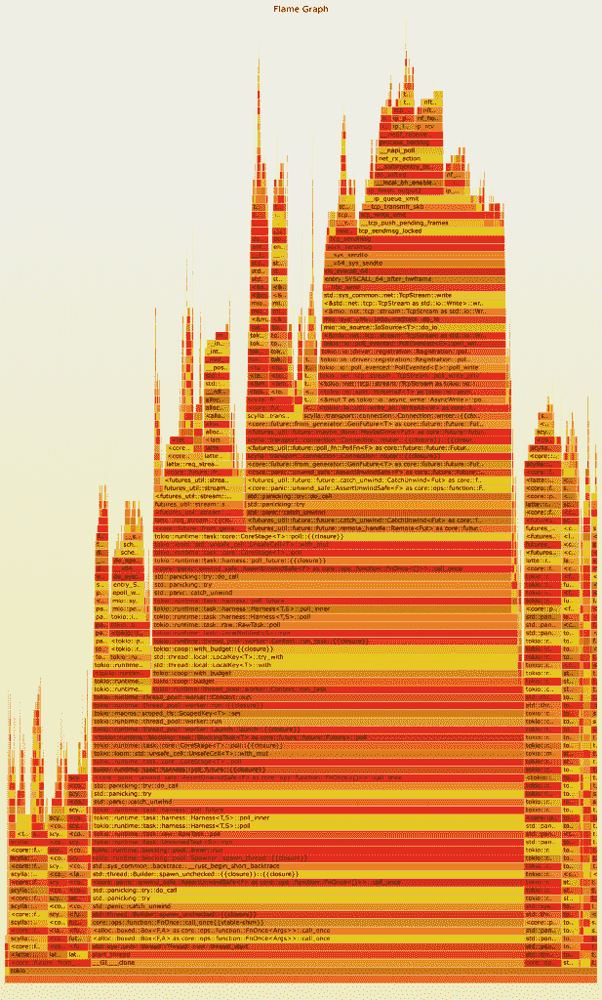

# 实践中的异步信任:性能、缺陷、剖析

> 原文：<https://thenewstack.io/async-rust-in-practice-performance-pitfalls-profiling/>

在 ScyllaDB 的内部开发者黑客马拉松中，高性能低延迟 NoSQL 数据库 ScyllaDB 的基于 Tokio 的 Rust 驱动程序诞生已经有一段时间了。从那以后，它的开发和采用加速了很多。我们增加了许多新功能，并在 [crates.io](https://crates.io/crates/scylla) 上发布了几个版本。在这个过程中，我们还偶然发现了一些有趣的性能瓶颈，需要研究和克服。本文解释了我们如何诊断和解决 Rust 驱动程序中的性能问题。

## 第一个问题出现了

一个有趣的[问题](https://github.com/scylladb/scylla-rust-driver/issues/338)最近出现在我们的 GitHub tracker 上。据报道，尽管我们小心翼翼地设计了高效的驱动程序，但它被证明比竞争对手之一 cassandra-cpp 慢得令人不快，Cassandra-CPP 是一个 C++ CQL 驱动程序的生锈包装器。(注意:ScyllaDB 与 Apache Cassandra 是 API 兼容的)。Cassandra 和 ScyllaDB 的延迟测试者 [latte](https://github.com/pkolaczk/latte) 的作者指出，将后端从 cassandra-cpp 切换到 scylla-rust-driver 会导致不可接受的性能退化。该调查了！

## 重现问题

 [彼得·萨尔纳

Piotr 是一名非常热衷于开源项目和 C++的软件工程师。他之前开发了一个开源分布式文件系统(LizardFS ),并在三星电子实习期间对 Linux 内核进行了短暂的探索。Piotr 毕业于华沙大学，获得计算机科学硕士学位。](https://pl.linkedin.com/in/piotr-sarna-548a76a3) 

起初，我们无法重现该问题。所有的实验似乎都证明，scylla-rust-driver 至少和其他驱动程序一样快，并且通常比所有测试过的替代驱动程序提供更好的吞吐量和延迟。

当我们比较测试环境时，出现了一个突破，这应该是我们从一开始的第一步。

我们的驱动程序确实遭受了性能下降，但这只是在一个完全本地的测试中观察到的，其中驱动程序和数据库节点驻留在同一台机器上。

我们希望我们的测试尽可能接近生产环境，因此它们总是在分布式环境中运行。

尽管如此，使用本地设置也被证明是有优势的，因为它是对极速网络的一个很好的模拟。毕竟，loopback 具有非常令人印象深刻的延迟特性！

## 压型

在我们能够可靠地重现结果之后，是时候查看分析结果了，包括最初版本中提供的结果和我们的测试生成的结果。

布伦丹·格雷格的[火焰图](https://www.brendangregg.com/flamegraphs.html)对于性能研究是不可或缺的。更好的是，Rust 生态系统已经在构建系统中集成了对生成火焰图的奇妙支持: [cargo-flamegraph](https://github.com/flamegraph-rs/flamegraph) 。

使用货物火焰图就像运行二进制程序
一样简单

```
```

cargo flamegraph your-app your-params

```

```

它生成一个交互式的`flamegraph.svg`文件，然后可以浏览这个文件来寻找潜在的瓶颈。解释火焰图在上面的链接中有详细的解释，但是一个经验法则是寻找占据图形总宽度大部分的操作。(宽度表示执行特定操作花费的时间。)

一个测试运行生成的火焰图显示，我们的驱动程序在发送和接收数据包上确实花费了令人不安的总 CPU 时间，其中相当一部分时间用于处理系统调用。



[**http://scyllabook.sarna.dev/perf/fg-before.svg**](https://scyllabook.sarna.dev/perf/fg-before.svg)

本期作者还好心地提供了两次测试运行的系统调用统计数据:由 cassandra-cpp 支持的测试和由我们的驱动程序支持的测试。从统计数据中得出的结论很清楚。scylla-rust-driver 对每个查询至少发出一个 syscall，这可能是延迟增加的原因。对于超高速网络，回环是一个典型的例子，这也意味着吞吐量受到影响。1 毫秒的延迟意味着我们每秒不能发送超过 1，000 个请求。

最后， [latte](https://github.com/pkolaczk/latte) 记录 CPU 时间作为其输出的一部分。与基于 cassandra-cpp 的原始后端相比，scylla-rust-driver 往往会导致两倍的 CPU 占用率。这完全符合系统调用数量的增加，这需要 CPU 来处理。

### 暗示

Rust 生态系统非常擅长测试项目依赖关系中引入的各种小变化。这在比较适用于"锡拉-铁锈-驱动程序"的各种修复时是非常宝贵的，而不必在板条箱上发布任何东西。如果您想在发布之前测试对您的一个依赖项所做的特定更改(或者甚至在您自己的 fork 上，您自己应用了一些实验性的更改！)，可以简单的在 Cargo.toml:
中提供一个 git 回购路径

```
```

scylla  =  {  git  =  "https://github.com/scylladb/scylla-rust-driver",  branch  =  "some_custom_branch"  }

```

```

## 1 号根本原因

最终，最初问题的根本原因是我们缺乏读写缓冲。

我们的驱动程序通过将请求排队到每个连接的路由器来管理内部请求，路由器负责从队列中获取请求，并将它们发送到目标节点，并异步读取它们的响应。在最初的实现中，发送请求和接收响应都不使用任何类型的缓冲，所以每个请求一从队列中弹出就被发送/接收。这相当于对每个请求和响应发出一个系统调用。虽然它是一些 CPU 开销的来源，但在分布式环境中没有发现这是一个问题，因为网络延迟隐藏了每个请求需要花费更多时间来处理的事实。然而，一个本地设置很快证实了这个开销是不可忽略的。

从概念上讲，解决这个问题非常简单。我们选择的运行时 Tokio T1 提供了现成的包装器来缓冲输入和输出流: [BufReader](https://docs.rs/tokio/latest/tokio/io/struct.BufReader.html) 和 [BufWriter](https://docs.rs/tokio/latest/tokio/io/struct.BufWriter.html) 。包装器非常方便，可以提供兼容的 API 和底层缓冲区，所以它们基本上是嵌入式的替代品。(鉴于我们自己的产品 ScyllaDB 是与 Apache Cassandra API 兼容的，我们 ScyllaDB 特别欣赏这样的属性！)

在[修复](https://github.com/scylladb/scylla-rust-driver/pull/339/)被应用后，它的积极效果在火焰图输出中立即可见。请随意比较下图和上面的原始火焰图。


[**http://scyllabook.sarna.dev/perf/fg-after.svg**](https://scyllabook.sarna.dev/perf/fg-after.svg)

很明显，scylla-rust-driver 花在系统调用上的时间要少得多。事实上，代表 sendmsg 的条现在太窄了，无法用肉眼定位。

## 第二个根本原因:异步 Rust 的一个缺陷

但这根本不是故事的结尾！事实上，最有趣的部分是在应用第一个补丁之后发现的。

当另一个[性能问题](https://github.com/scylladb/scylla-rust-driver/issues/362)被发布时，我们甚至还没有庆祝我们战胜系统调用的胜利，同样是由我们足智多谋的性能侦探,[拿铁](https://github.com/pkolaczk/latte)的作者。这一次，提高工具中的并发性会导致性能下降，这似乎只有在使用我们的驱动程序作为后端时才能观察到。

## 二次行为？

是的，我们的一名工程师进行的一项[实验](https://github.com/scylladb/scylla-rust-driver/issues/362#issuecomment-982515090)暗示，与不使用组合子、直接使用 Tokio 的 [spawn](https://docs.rs/tokio/latest/tokio/fn.spawn.html) 实用程序表达的类似问题相比，使用 Rust futures 的组合子[futures ordered](https://docs.rs/futures/latest/futures/stream/futures_unordered/struct.FuturesUnordered.html)，似乎会导致执行时间的二次增长。

FuturesUnordered 是一个简洁的工具，允许用户在一个地方收集许多未来，并等待它们的完成。由于 FuturesUnordered 也被用于 latte，所以它成为了导致这种回归的候选词。在尝试了一种不依赖于 FuturesUnordered 的改良版拿铁后，这种怀疑得到了证实。

## 陷阱

为了完全理解这个问题，您需要理解 Rust 异步运行时是如何工作的。Tokio 关于这个主题的文章很值得一读，但是我也将在这里总结一下它的内容。

在异步信任中，如果一个任务在一个循环中不断轮询未来，而这些未来由于足够的负载而总是恰好准备好，那么就有一个潜在的问题，即饥饿其他任务。当这种情况发生时，循环总是继续处理未来，而不会将控制权交还给运行时。在 Tokio 和其他运行时中，可以通过调用 [yield_now](https://docs.rs/tokio/0.2/tokio/task/fn.yield_now.html) 显式发出交还控制权的行为，但是运行时本身不能强制 await 成为一个让步点。

为了避免饿死其他任务，Tokio 采用了一个巧妙的技巧:每个任务都分配了一个预算，一旦预算用完，Tokio 控制的所有资源都开始返回“待定”状态(即使它们可能已经准备好了)，以迫使无预算的任务让步。

这听起来很完美，但是这个解决方案有一个价格。Rust 为期货提供了许多方便的实用程序和组合器，其中一些维护着自己的调度策略，这些策略可能会干扰上面描述的语义。特别是，FuturesUnordered 也是这样一个调度程序。它维护自己的就绪未来列表，并在轮询时对其进行迭代。

Tokio 的抢占式调度技巧和 FuturesUnordered 的实现相结合，才是问题的核心。FuturesUnordered 有一个准备好进行轮询的期货列表，它假定一旦轮询，期货就不需要再次轮询。由于这种期货不会被查询超过一次，当被放入“就绪”列表时，为它们服务所需的摊销时间是恒定的。然而，一旦预算被花掉，Tokio 可能会迫使这种“就绪”的期货返回“待定”状态！摊销已经过去了，现在完全有可能，而且可以观察到，FuturesUnordered 将在每次调查时迭代其整个基础期货列表。这实际上导致了执行时间与存储在 FuturesUnordered 中的期货数量成平方关系。

## 解决方案

由于 FuturesUnordered 是 Rust 的期货箱的一部分，这个问题直接在那里报告:【https://github.com/rust-lang/futures-rs/issues/2526。它很快被一个投稿人识别并分类。响应时间确实令人印象深刻！

建议的解决方法之一是将任务包装在 [tokio::unconstrained](https://docs.rs/tokio/latest/tokio/task/fn.unconstrained.html) 标记中。这有效地关闭了 Tokio 中的协作调度，从而消除了回归出现的一个必要条件。然而，合作调度最终是一件好事，因为我们肯定希望避免饥饿的任务，并且我们希望保持项目的低延迟。

结果，一个正确的[修复](https://github.com/rust-lang/futures-rs/pull/2527)在同一天被发布，并且已经是``futures`板条箱- 0.3.19` 正式发布的一部分。该修复是对未来有序代码的简单而有效的修正。在一次轮询中可以迭代的期货数量现在被限制为一个常数:32。完全关闭协作调度和分别生成每个任务而不是将它们组合成 FuturesUnordered，这是一个非常好的共识。合作调度能够通过使某些资源人为地返回“未决”状态来适当地对抗饥饿，而 FuturesUnordered 不再假设所有被列为“就绪”的未来都将确实就绪。在经历了 32 个之后，控制权被交还。

## 摘要

Rust 中的异步编程世界还很年轻，但是发展非常活跃。调查并消除瓶颈和陷阱是一项非常有用的技能，所以不要犹豫加入这项工作，例如，在 https://github.com/scylladb/scylla-rust-driver[成为 ScyllaDB 本地 Rust 驱动程序的贡献者。这是一个用纯 Rust 编写的 ScyllaDB 的客户端驱动程序，使用 Tokio 的完全异步 API。虽然针对 ScyllaDB 进行了优化，但该驱动程序也与 Apache Cassandra 兼容。](https://github.com/scylladb/scylla-rust-driver)

<svg xmlns:xlink="http://www.w3.org/1999/xlink" viewBox="0 0 68 31" version="1.1"><title>Group</title> <desc>Created with Sketch.</desc></svg>