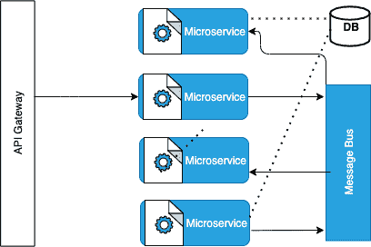

# AsyncAPI 2.0:实现事件驱动的世界

> 原文：<https://thenewstack.io/asyncapi-2-0-enabling-the-event-driven-world/>

[shek har baner JEE](https://www.linkedin.com/in/aravindkannan/)

[shek har 是易贝开发者生态系统架构团队的首席架构师，也是易贝公共 API 治理和跨职能架构团队的成员。他是 OpenAPI 的倡导者，为多个 API 版本和开源 SDK 做出了贡献。](https://www.linkedin.com/in/aravindkannan/)

尽管 RESTful APIs 仍然是可编程世界的主流，但反应式事件驱动架构正在迅速被采用，并且与传统的基于轮询的遗留集成有着明显的不同。基于事件的方法的考虑不仅限于显而易见的候选方案，例如设计一个实时响应变化的系统，还包括在弹性、高度解耦的微服务架构中增加采用。

当谈到异步世界时，设计一个抽象(从而统一)多种协议并支持不同格式、代理、通道和发布-订阅视角的规范是一项艰巨的任务，而 [AsyncAPI Specification 2.0](https://www.asyncapi.com/docs/specifications/2.0.0) 很好地满足了这一要求。

在本文中，我们将讨论 AsyncAPI 规范 2.0 及其在易贝开发人员生态系统中的采用，为什么易贝选择基于 AsyncAPI 规范的合同来支持其最新的通知平台，以及 AsyncAPI 规范如何标准化和简化高度去耦和弹性微服务拓扑的表示。

## 什么是 AsyncAPI？

> 凭借其成熟和优雅的抽象，AsyncAPI 规范已经成为定义异步、事件驱动 API 的行业标准。

[AsyncAPI](https://www.asyncapi.com/) 解决了对统一的、开源的、与协议无关的异步规范的需求，该规范既可读又可机读，同时还受到多样化和丰富的工具生态系统的支持。凭借其成熟和优雅的抽象，AsyncAPI 规范已经成为定义异步、事件驱动 API 的行业标准。

AsyncAPI 最初是从 [OpenAPI 规范](http://spec.openapis.org/oas/v3.0.3)派生出来的，并保持着与它的兼容性。因此，如果不承认 [OpenAPI 规范](https://github.com/OAI/OpenAPI-Specification/blob/main/versions/3.1.0.md)对整个行业，尤其是易贝的贡献，关于 AsyncAPI 规范的讨论将是不完整的。(在之前的文章中，了解更多关于为什么易贝在 2017 年为其 RESTful APIs 采用 OpenAPI 规范，以及易贝随后的旅程[。)](https://tech.ebayinc.com/engineering/openapi-an-ebay-perspective/)

以下是我们发现特别有用的 AsyncAPI 规范的一些关键特性:

*   清洁[通道](https://www.asyncapi.com/docs/specifications/2.0.0#definitionsChannel)、[操作](https://www.asyncapi.com/docs/specifications/2.0.0#operationObject)和[服务器](https://www.asyncapi.com/docs/specifications/2.0.0#serverObject)之间的分离。这允许事件驱动拓扑的完整表示([生产者](https://www.asyncapi.com/docs/specifications/2.0.0#definitionsProducer)、[消费者](https://www.asyncapi.com/docs/specifications/2.0.0#definitionsConsumer)和[消息](https://www.asyncapi.com/docs/specifications/2.0.0#definitionsMessage)视角)，导致消息驱动生态系统的标准化和精确表示。
*   支持在[操作](https://www.asyncapi.com/docs/specifications/2.0.0#operationBindingsObject)、[代理](https://www.asyncapi.com/docs/specifications/2.0.0#serverBindingsObject)、[通道](https://www.asyncapi.com/docs/specifications/2.0.0#channelBindingsObject)和[消息](https://www.asyncapi.com/docs/specifications/2.0.0#messageBindingsObject)级别定义绑定。
*   支持特征和外部引用。这促进了可重用性。
*   使用动态运行时表达式支持相关 id。
*   规范的可扩展性，满足一次性定制需求。
*   支持多种异步协议，满足大多数行业需求。
*   与 [OpenAPI 规范](https://github.com/OAI/OpenAPI-Specification/blob/main/versions/3.1.0.md)的兼容性。这使得可以重用现有模型的模式定义，从而缩短已经标准化了 OpenAPI 规范的组织的采用周期。

## 为易贝的异步 API 契约采用 AsyncAPI

去年年底，易贝开始着手开发一个新的事件通知平台，旨在满足当前和未来对 API 合作伙伴异步通信的需求。

除了规模、交付保证、监控、回放和恢复等常见考虑因素之外，新平台还设计用于数据安全、基于椭圆曲线加密的消息完整性验证，以及对多种协议和有效载荷模式版本的支持。一些高级特性还包括多租户，在该系统的不同“租户”之间提供隔离保证，以及在内部将特定于用例的关注点与核心平台关注点分开。

当涉及到将这个新平台的事件流作为合同公开给易贝的外部开发人员社区时，Async API 2.0 规范是一致的选择。

2021 年 3 月，易贝为新的[业务事件通知功能](https://developer.ebay.com/marketplace-account-deletion)推出了首批基于 AsyncAPI 的合同。基于 HTTP 的易贝初始市场账户删除用例的 AsyncAPI 契约在这里是。该合同解决了以下集成问题:

*   可供订阅的主题
*   支持的协议
*   有效负载的模式定义
*   邮件标题

我们发现 AsyncAPI 非常有用，因为它的易用性来自于对通道、协议和绑定的描述；发布和订阅之间关注点的分离；以及协议特定和应用特定报头的分离。

## 微服务发展的适用性

大多数软件系统开始时是一个整体，随着时间的推移演变成基于分布式微服务的方法。这种转变的第一阶段是将整体分解为粒度分布式服务，用一个实体服务层来表示持久性。此阶段的典型结果通常是业务流程层以同步方式编排对单个或多个底层服务层的调用。

然而，由于这种方法固有的同步特性，编排存在规模问题。例如，任何依赖性的意外恶化都会导致功能的严重退化，而没有足够的保护措施。当特定组件或依赖关系发生变化时，组件之间的高度耦合还会带来大量的维护开销。

这一演变的下一阶段是向事件驱动范式的过渡。事件驱动系统需要一组对特定事件或状态变化做出反应的自治组件。在高层次上，这个系统可以被认为是一组通过消息总线交互的事件发射器和监听器。解耦的结果是，发射器没有负担它们产生的事件的收听者；侦听器也不需要知道事件生成器。每个都可以独立扩展。解决了基于编排的方法的一些主要缺陷。要了解更多信息，这里有一篇 Martin Fowler 关于[事件协作](https://www.martinfowler.com/eaaDev/EventCollaboration.html)的精彩文章。

下面是去耦微服务的简单说明:

图 1:作为一组事件发射器和监听器的典型解耦微服务布局。

上图显示了一组与消息代理交互的发射器和监听器。

然而，表示这种自治组件的复杂系统可能令人望而生畏。这个反应式系统核心的事件流或通道需要与信息交换机制的细节一起表示，例如，有效负载模式定义、协议和相关的头。消息代理需要与适用的 URIs、协议、安全配置和绑定一起呈现。操作需要明确无误。

AsyncAPI 规范充分涵盖了上一段中的所有关键元素，简化了这个复杂拓扑的表示。事件流被表示为一个[通道](https://www.asyncapi.com/docs/specifications/2.0.0#definitionsChannel)。[消息](https://www.asyncapi.com/docs/specifications/2.0.0#messageObject)定义允许有效载荷模式和报头信息。消息总线(或代理)在 AsyncAPI 契约中被表示为[服务器](https://www.asyncapi.com/docs/specifications/2.0.0#serversObject)。服务器可以有相关的[安全要求](https://www.asyncapi.com/docs/specifications/2.0.0#securityRequirementObject)。事件发送者的集合被定义为[生产者](https://www.asyncapi.com/docs/specifications/2.0.0#definitionsProducer)和[消费者](https://www.asyncapi.com/docs/specifications/2.0.0#definitionsConsumer)。

然而，对于行业采用来说，重要的不仅仅是规范的丰富性，还有随之而来的工具。与 [OpenAPI](https://www.openapis.org/) 、 [AsyncAPI](https://www.asyncapi.com/) 工具一样，它整合了强大的可视化工具，允许架构师和工程师在设计上进行协作。复杂的布局可以简化。通过标准化的分类法和 [AsyncAPI 可视化工具](https://playground.asyncapi.io/)，设计协作得以简化。

因为 AsyncAPI 提供了一个机器可读的契约，这意味着它可以为提供者和消费者提供代码生成。以下是一些参考资料:

*   Java-spring-cloud-stream-template 是一个很棒的 codegen 工具，可以从 AsyncAPI 契约中弹出微服务。它还装载了相当多有用的定制选项。
*   [Microcks](https://microcks.io/) 是一个开源的 Kubernetes 模拟和测试框架，支持 AsyncAPI。
*   [Solace](https://solace.com/) 产品包括 AsyncAPI 支持。
*   [Postman](https://www.postman.com/) 早就启用了 API 世界，最近与 AsyncAPI 合作。

这里有更多的工装参考。

## 结论

我们希望易贝决定标准化并发布基于 AsyncAPI 规范 2.0 的事件通知合同，这将使易贝外部开发者社区的集成变得简单。

从我们迄今为止使用 AsyncAPI 的经验来看，我们绝对推荐使用它。

有兴趣在易贝发展事业吗？我们在招人！要查看我们当前的职位空缺，请访问:[【http://ebay.to/Careers ](http://ebay.to/Careers)

<svg xmlns:xlink="http://www.w3.org/1999/xlink" viewBox="0 0 68 31" version="1.1"><title>Group</title> <desc>Created with Sketch.</desc></svg>