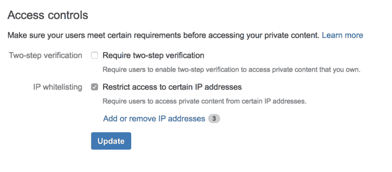

# Atlassian 通过所需的双因素身份认证、IP 白名单来增强位桶云，从而

> 原文：<https://thenewstack.io/atlassian-adds-two-factor-authentication-ip-whitelisting-bitbucket-cloud/>

开发者工具和服务供应商 [Atlassian](https://www.atlassian.com/) 对安全性越来越重视，在其 [BitBucket](https://thenewstack.io/atlassian-announces-bitbucket-rebranding-new-features/) 云产品中增加了双因素认证和 IP 白名单。

[BitBucket Cloud](https://bitbucket.org/) 是针对职业团队的 [Git](https://thenewstack.io/the-new-stack-analysts-show-27-the-git-vulnerability-and-its-aftermath/) 解决方案。这是一个分布式版本控制系统，促进了开发团队之间的协作。

Atlassian 的 BitBucket 产品营销负责人 Raj Sarkar 表示，该公司的 BitBucket 目标是释放团队的生产力——无论是软件开发、业务还是 IT 运营团队。该技术被广泛使用，因为 Sarkar 指出，有超过 600 万开发人员使用 BitBucket，超过 100 万个团队使用该产品，该产品具有 300 多个集成，以支持最佳工具。

然而，BitBucket 的产品负责人 Rahul Chhabria 说，安全性已经成为 BitBucket 客户越来越关心的问题，也是一个不断演变的问题。

根据 Chhabria 的说法，许多开发团队面临的挑战是，领导者可以告诉他们的开发人员保护他们的帐户，并改为双因素身份验证，但许多人会认为这是一种麻烦，不会这样做。

Atlassian 的产品经理 Alastair Wilkes 在[的一篇博客文章](https://blog.bitbucket.org/2017/02/28/big-strides-cloud-security-ip-whitelisting-required-2-step-verification-bitbucket/)中说:“无论对数据安全有多重视，最终用户都是最薄弱的环节，容易受到密码黑客的攻击。“为了避免这种情况，比以往任何时候都更重要的是，你不仅要用密码来保护你的账户，还要采取措施，如[两步验证](https://blog.bitbucket.org/2015/09/10/two-step-verification-is-here/)来保持你在 BitBucket 上的私人内容，嗯……隐私。”

威尔克斯说，两步验证或双因素认证(T7)，也称为 2FA，可以确保即使别人获得了你的密码，你的数据也会继续受到保护

通过此功能，团队管理员可以实施双因素身份验证。他们可以做到这一点，任何想要写入其存储库的人都必须启用双因素身份验证，不仅要使用密码登录，还要使用每 30 秒到期的六位唯一代码，这就是 Atlassian 现在通过 BitBucket Cloud 提供的功能。

“这很好，因为现在我可以有一个大型的分布式团队，通过检查单个框来减少管理开销，并且知道我的内容一直受到保护，直到维基是私有的，我们用来跟踪我们进展的问题也是私有的，”Chhabria 说。

然而，2FA 功能要求用户使用智能手机来接收六位数的代码，没有多少开发人员将智能手机用于工作，甚至没有公司电话，许多人可能只是想保持他们的个人生活有点隐私。因此，Atlassian 为拥有分散劳动力的客户引入了 IP 白名单，这些客户需要一个只允许预先筛选的 IP 地址访问存储库的解决方案。

启用 IP 白名单后，用户将只能进行交互(查看、推送、克隆等)。)与你的帐户的私人内容，如果他们正在从一个 IP 地址访问 BitBucket，你已经选择，并知道是安全的，”威尔克斯说。如果用户试图从未列入白名单的 IP 访问您团队的任何存储库、问题跟踪器、wikis、片段或团队设置，他们将会收到错误消息

新的安全功能将使管理员能够确保在用户能够通过网络访问私人内容之前，在用户的设备上实施安全控制。它还使公司能够锁定他们的 VPN 服务器，以便远程员工通过身份验证从他们的设备访问私人内容。对于有严格禁止在家工作政策的组织，只将办公室 IP 地址列入白名单会限制用户从家中访问存储库。

“我们已经从几个团队那里听说，将 IP 白名单与 BitBucket 结合使用将允许他们脱离本地版本控制系统，并享受在云中托管代码的节省和便利，”Wilkes 说。

## 保护您的知识产权

总部位于澳大利亚悉尼的专业软件开发商店 [Limpid Logic](http://www.limpidlogic.com/) 就是这样一个客户。[清晰逻辑公司创始人兼董事总经理 Bachir El Khoury](https://www.linkedin.com/in/bachirelkhoury/) 表示，BitBucket 的 IP 白名单出现的时机再好不过了。

该公司专注于构建定制软件，他们的大多数项目都是研发，因为它与许多领先的技术合作，如许多物联网设备、可穿戴设备以及微软 HoloLens 和其他虚拟现实系统。

许多大公司客户雇佣 Limpid Logic 作为开发车间，为他们构建原型或专门的系统。对于一些公司，尤其是医疗保健、银行和金融领域的公司，limb Logic 经常处理专有知识产权和敏感数据。

“因此，我们必须建立我们的系统来解决这种敏感性，”El Khoury 告诉新堆栈。“例如，在某些情况下，将 IP 列入白名单是一项法律要求。他们需要控制谁在哪里访问什么。”

在一份声明中，El Khoury 指出，“我们的工作经常涉及敏感的知识产权，需要从少数特定知识产权获得有限的地理位置。”

在 BitBucket 中新增 IP 白名单功能之前，Limpid Logic 必须为拥有敏感数据和需求的客户设置定制或托管的 Git 服务器。但他说，这变得太复杂了。

“我们建立了多个远程存储库，但我们承担了很多复杂性——特别是现在每个公司都是软件公司，”El Khoury 说。“因此，在此之前，我们管理着许多小型的自托管存储库，这非常难以维护，因为我们无法轻松访问他们的服务器。有许多产生摩擦的障碍，仅仅是获得批准让他们的 it 人员做一些事情就变得非常繁琐和昂贵。”

现在，有了 BitBucket 中的 IP 白名单，El Khoury 表示，他预计许多摩擦将会减少，如果不是完全消失的话。他的公司将能够直接向客户提供对其内部存储库的访问，而无需部署或推送至客户的服务器。

“在我们内部，我们将能够为客户提供能力和透明度，向他们展示我们首先使用 BitBucket，这已经得到了尊重，”他说。“它不像某处某人卧室中的自托管的可疑服务器。第二，我们将能够向他们展示谁登录了，以及他们可以从哪里访问内容。他们可以控制和知道他们知识产权是在一个安全的地方。”

2FA 功能和 IP 白名单都可以在 BitBucket 的高级计划中使用，该计划还包括合并检查、智能镜像、每月 1，000 分钟的 BitBucket 管道构建时间和每月 10 GB 的 Git 大文件存储(LFS)。

“该计划旨在改善拥有大量用户和回购、复杂业务需求(由于行业标准等原因)的团队管理员的体验。)或者两者兼而有之，我们发现随着团队的成长，这种情况越来越普遍。

该计划中的所有功能都是免费试用的，直到价格变化生效，届时该计划将为每个用户每月 5 美元。

通过 Pixabay 的特征图像。

<svg xmlns:xlink="http://www.w3.org/1999/xlink" viewBox="0 0 68 31" version="1.1"><title>Group</title> <desc>Created with Sketch.</desc></svg>