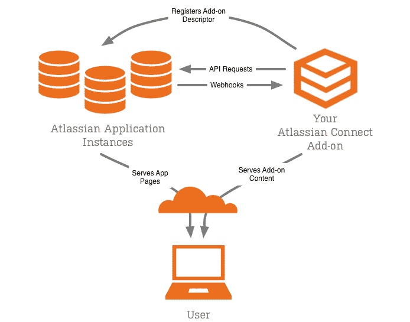
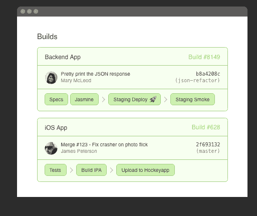

# Atlassian 在 Bitbucket 上戳了一个洞来连接其他服务

> 原文：<https://thenewstack.io/atlassian-announces-bitbucket-integration-across-cloud/>

Atlassian Bitbucket 正在跳出框框思考。或者在桶外，如果你愿意的话。

基于 web 的项目托管服务现在将提供在 CI(持续集成)和 CD(持续部署)过程中直接从 Bitbucket 检查和测试构建的能力。开发人员还可以将他们的代码直接从 Bitbucket 部署到一系列云服务中，包括亚马逊网络服务、微软 Azure 和数字海洋。

Atlassian 最近开发了一个构建 API，允许开发人员在整个 CI(持续集成)和 CD(持续部署)过程中测试他们的构建。Bitbucket 构建 API 现在将与 Bamboo Cloud 集成，开发人员现在可以在 Bitbucket 存储库中查看他们的 Bamboo 构建。

对 Bamboo server 的支持将于本月晚些时候上线。这些集成使开发人员能够跨各种平台进行协作，提供灵活性以及性能升级，以满足大规模生产软件的需求。

随着公司继续创建基于 web 的解决方案并采用新技术来简化其工作流程，更快地交付应用程序至关重要。无论是协作编写代码、编译版本，还是将版本投入生产，无论企业规模大小，都必须能够在最短的停机时间内协作并编译应用程序的所有方面。为了提供帮助，Atlassian 开发了各种技术，为开发人员提供了使用各种工具编译、测试和协作项目的能力，如 [Bitbucket](https://bitbucket.org/) 、 [JIRA](https://www.atlassian.com/software/jira) 套件等等。

## 跨平台的位桶

Bitbucket 是一个基于 web 的托管服务，允许开发人员在他们选择的存储库中托管项目(比如 Git 或 Mercurial)。Bitbucket 允许免费用户添加无限量的存储库，并可以选择添加用户以便在应用程序上进行协作。

随着基于 web 的托管的发展，GitHub、GitLab 和 Bitbucket 等平台已经出现，为开发人员提供托管代码的服务器。这不是基于网络的主机服务的唯一好处，它还可以提供系统管理和版本控制。由于公司不必通过选择这一选项来管理他们的服务器，因此它被证明是较小的初创公司或刚刚起步的开源项目的一个划算的选择。

如果一个团队将 Wercker 用于其 CI 平台，用户可以通过安装插件[清障车 YAML 查看器](https://marketplace.atlassian.com/plugins/Wercker-YAML-viewer/cloud/overview)在 Bitbucket 中可视化他们的工作流管道并检查构建状态。持续集成对于每天推进多个构建的 DevOps 团队来说至关重要，因为这允许构建被编译、测试并投入生产，而无需在每个通过测试的构建完成后重新编码和重新配置。

Bitbucket [构建状态 API](https://confluence.atlassian.com/bitbucket/buildstatus-resource-779295267.html) 也可以与其他 CI 工具一起工作，例如 Buildkite，这是一个开源软件工具，允许开发人员在任何平台上用任何语言运行 CI 和 CD 测试。对于那些在容器中工作的人， [Buildkite](https://buildkite.com) 也支持 Docker 环境。用户可以配置构建步骤，通过 web 手动触发管道，并就构建进行协作。

图为:Bitbucket Connect 架构

除了 Bitbucket 的构建 API，Bitbucket 还宣布 Bitbucket Connect 现在将与包括 DigitalOcean、AWS 和 Microsoft Azure 在内的各种云平台集成。Bitbucket Connect 使开发人员能够在不离开 Bitbucket 的情况下配置开发环境。DigitalOcean、Azure 和 AWS 已与 Atlassian 合作开发附加组件，使应用程序构建流程成为大大小小团队的简化体验。在大规模工作时，自动化工作流程至关重要，因为这消除了开发人员在测试的不同阶段重新编译代码的需要。

## 自动化工作流程，共创美好未来

对于大规模工作的团队来说，在本地运行应用程序和测试可能是一种危险。即使在较小的团队中，“嗯，它为我跑了”也是司空见惯的。无论依赖关系是否能够跨平台运行，环境问题都会影响软件开发，如果不能快速识别问题，开发进度可能会停止。进入工作流自动化。

图为:Buildkite 工作流自动化示例

自动化开发工作流的核心目标是消除开发中的人为错误因素。因此，随着越来越多的公司采用工作流自动化工具，“嗯，它在我的设置上工作正常”很快成为过去。使用容器是开发人员开始自动化工作流的一种方式，另一种方式是使用 CI 和 CD 平台等工具，以及将遗留应用程序分解为微服务。

Lighthouse 或 [Sysdig Cloud](https://sysdig.com/) 等依赖性监控工具的存在是为了提醒开发人员，如果他们的容器化环境有需要更新的依赖性，这意味着团队不会遇到需要更新依赖性的问题，或者可能无法在一个技术堆栈的不同迭代中工作。

Bitbucket 等工具允许开发人员在一个集中的位置从开始到结束自动化他们的工作流，从而消除了在开始编译代码之前额外需要 10 个步骤的需要。

节省时间不仅对开发人员有价值，对他们的公司和依赖他们开发的应用程序的用户也有价值。随着技术的不断进步，Atlassian 与 AWS CodeDeploy、Bamboo、DigitalOcean 和 Microsoft Azure 的合作标志着一个世界，在这个世界中，与云无关的开发已经成为新的现实，开发人员可以在这个基础上开始编码。

数字海洋是新堆栈的赞助商。

通过 Pixabay 的特征图像。

<svg xmlns:xlink="http://www.w3.org/1999/xlink" viewBox="0 0 68 31" version="1.1"><title>Group</title> <desc>Created with Sketch.</desc></svg>