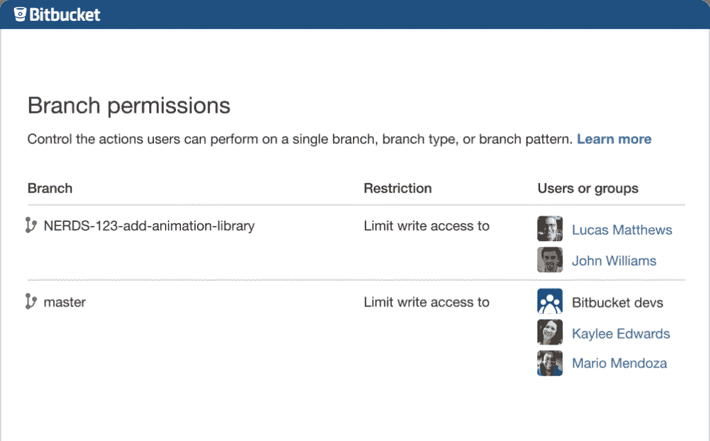
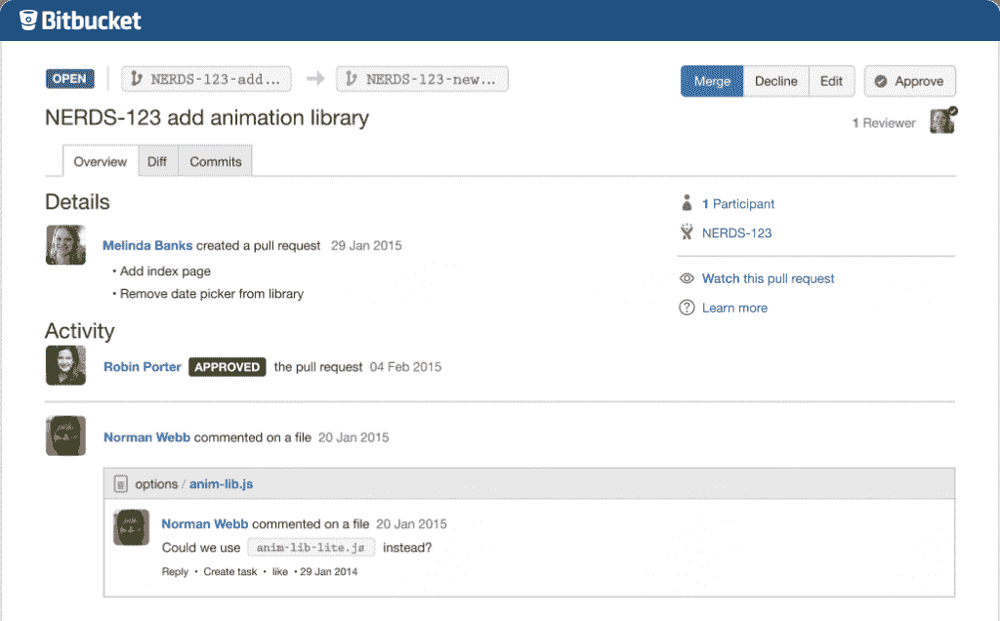

# 新的 Bitbucket 特性显示了 Git 在企业中的崛起

> 原文：<https://thenewstack.io/atlassian-announces-bitbucket-rebranding-new-features/>

[Atlassian](https://www.atlassian.com/) 正在将其代码管理软件产品统一在一个[品牌下，专注于整个软件开发生态圈，包括那些从事开发者关系和 DevOps 类型角色的人。](https://bitbucket.org/)

## Bitbucket 如何改变企业发展

随着时间的推移，Git 的使用方式发生了变化。Git 在 OSS 社区中工作得很好，最近已经转向企业级软件开发应用程序。Atlassian 工程和开发工具主管 Eric Wittman 表示，

> “随着人们从旧的软件开发方式转向新技术，软件开发正在经历一场时代变革。”

公司每天都在制造汽车、银行系统或处理庞大的零售后端。此外，不断变化的 web 开发格局意味着越来越多的媒体公司正在构建自己的软件，编写复杂的网站，推出品牌应用程序，管理大型 Git 存储库，并在容器中工作。管理 Git 存储库、bug 请求和源代码已经发展成为一个独立的有机体，开发团队需要新的技术来满足不断变化的需求。

位存储桶分支权限

## Bitbucket 的新企业级特性

### 1.Git 镜像

Bitbucket 现在具有 Git 镜像功能，旨在提高远程团队的性能。这是 Git 的一个整体问题，因为在 Git 中远程克隆分支通常会影响性能。Git 镜像是为遍布世界各地的团队设计的。对于许多数据中心，代码保存在一个中央代码存储位置。然后，远程团队成员将克隆主分支，以便开始工作。

如果服务器位于东海岸，但是团队位于欧洲或印度的海上，这些远程团队将体验到缓慢的性能，因为他们需要大量的时间来访问源代码并在本地克隆存储库。Git 镜像允许人们在他们特定的区域创建本地镜像，与主存储库保持同步。当 Bitbucket 中发生提交时，它们会返回到主分支。这一特性减少了远程团队经常遇到的难题。

### 2.比特桶云

Bitbucket 不仅支持内部部署，还允许用户在自己的服务器上创建本地镜像，而多租户服务存储在云中。Bitbucket Cloud 允许公司简单地管理他们产品的开销基础设施。

### 3.Git 大文件支持

Bitbucket 还将为客户提供 Git 大文件支持(LFS)，这是一个[最近的功能](https://github.com/blog/1986-announcing-git-large-file-storage-lfs)很快也将被添加到 GitHub，供那些有大型存储库的人管理。Git LFS 对于在媒体、广告或游戏领域工作的软件开发团队来说尤其有价值——因为他们通常有大图片，比如存储在存储库中的促销资产。Git LFS 试图将大文件与回购本身分开，抽象出文件位于不同位置的事实。Bitbucket 的服务器产品也在向 Bitbucket cloud 迁移。这一改变将允许开发团队更好地组织复杂的存储库设置。

比特桶拉取请求

### 4.侧重于工作流定制的 API 和扩展

对于许多软件开发人员来说，能够拥有丰富的 API 是一个重要的工作流特性。Bitbucket 拥有一个庞大的第三方软件生态系统，可以进一步增强软件团队使用的工具，从而进一步提高效率。因此，随着期望的改变，人们可以改变他们的工作流程以适应他们项目的日常需求。

当从事软件开发时，大多数团队使用 JIRA。Bitbucket 围绕项目管理的整个范围与 JIRA 集成，使其有别于主要关注管理源代码的竞争对手。当一个开发人员去 JIRA 时，他们想买一张票然后开始工作，而不必在处理一个问题的过程中多次返回 JIRA。当开发人员完成提交/提取并运行构建时，该信息通过 Bitbucket 更新回 JIRA。当他们提交代码或完成一个任务单时，特定的任务在 JIRA 被更新，这样整个软件开发团队都知道问题的状态。

在 Git 中工作时，开发团队经常使用特性分支工作流。当使用 Travis CI 创建特性分支时，团队不希望在测试或 QA 工作时不得不重做构建计划。Bitbucket 与 Bamboo 有很强的集成性，当开发者从 master 创建一个分支时，它还会预先设置 CI 脚本。竹的替代品包括特拉维斯 CI，詹金斯，或哈德森时，工作与 CI 和 CD。持续集成和持续交付对软件开发团队提出了不同的挑战，因为 CD 中的软件必须在其整个生命周期中可用。

惠特曼指出，

> “这不是大事情，而是专注于小事情以保持开发富有成效。”

如果一个存储库需要很长时间才能完成克隆，或者节点过载并出现故障，这会让软件开发人员感到沮丧。拥有持续的集成工作流有助于解决这些问题。Bitbucket 数据中心内置了主动集群，GitLab 计划在未来通过 [Gitlab RE](https://about.gitlab.com/solutions/reference-architectures/) 引入。目前， [GitHub Enterprise](https://help.github.com/enterprise/2.0/admin-guide/high-availability-cluster-configuration/) 也为开发者提供高可用性集群配置支持。高可用性集群处理高负载流量，这意味着如果一个节点出现故障，它将故障转移到另一个节点。

### 5.统一的品牌形象

Atlassian 向其客户提供了许多 Git 产品，这往往会在客户中引起一些混淆。因此，该公司已经更名，将其由以前独立的服务组成的 Git 产品统一到 Bitbucket 品牌下，这些服务包括 Bitbucket Cloud、 [Stash](https://www.atlassian.com/software/bitbucket/server) 和 Stash Data Center。

这一变化影响了以前使用 Stash 和 Stash 数据中心的公司。这些产品现在可以在 Bitbucket 保护伞下获得，减少了客户对 Stash 是否与 Atlassian 的其他基于 Git 的产品分开的困惑。Stash 现在被称为 Bitbucket Server，而 Stash 数据中心已经更名为 Bitbucket Data Center。

Bitbucket 的竞争对手也采用了企业级品牌，GitHub 在 GitHub Enterprise 保护伞下提供专业服务。

Bitbucket 中呈现的新特性代表了当前开发环境中的一个显著转变。Git 已经迅速成为应用程序开发的关键组件，成为使用 Git 工具和 CI 引擎的开发人员的首选工具之一。Bitbucket 的新特性改进了 Git 开发人员可用的许多工作流工具，增加了当前可用的各种选项。

随着当今软件开发需求的不断变化，团队必须能够在世界各地一起工作和协作。Git 存储库管理工具提供了许多方法来提高这个过程的效率。

专题图片: [eGuidry](https://www.flickr.com/photos/eguidry/) 的: [Macbook Pro 背光键盘](https://www.flickr.com/photos/eguidry/4010965162)。由 2.0 在 [CC 下许可。](https://creativecommons.org/licenses/by/2.0/)

<svg xmlns:xlink="http://www.w3.org/1999/xlink" viewBox="0 0 68 31" version="1.1"><title>Group</title> <desc>Created with Sketch.</desc></svg>