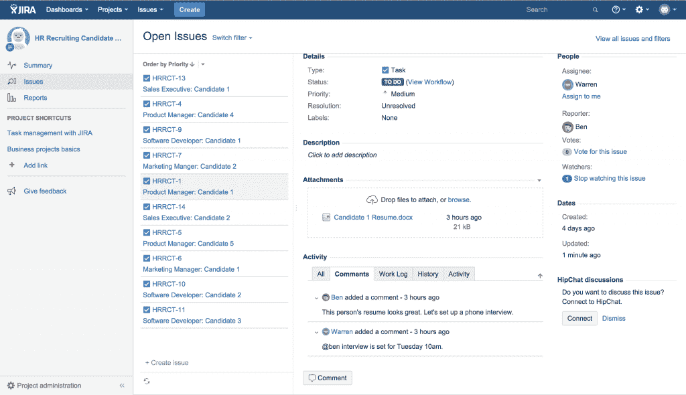
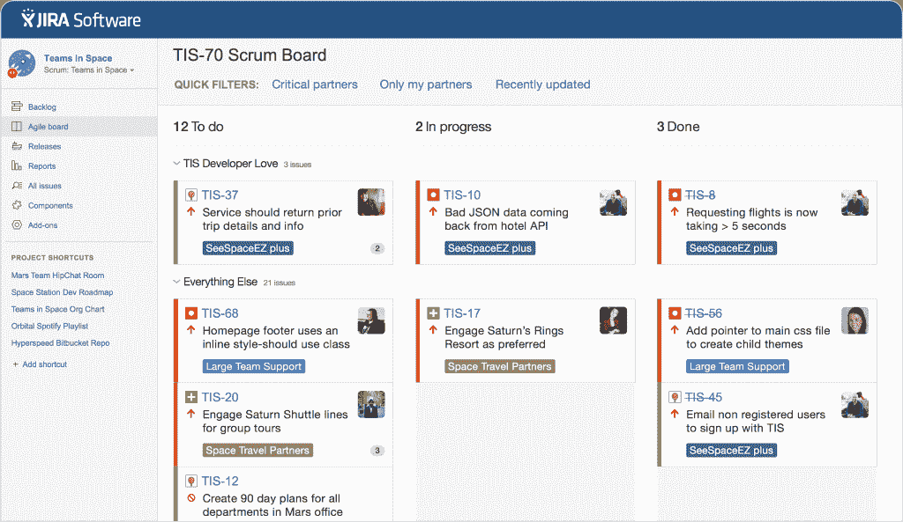
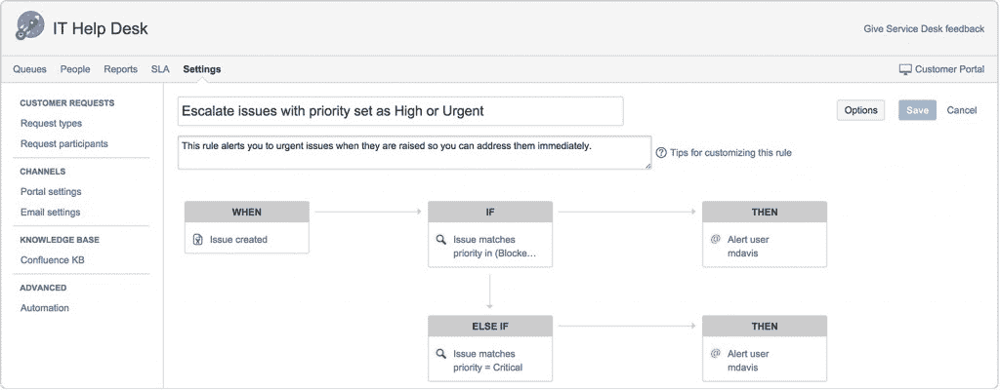

# JIRA 得到了一个全面的软件开发团队

> 原文：<https://thenewstack.io/atlassian-announces-jira-overhaul-three-new-offerings/>

Atlassian 最近宣布了对 JIRA 的大规模改革，标志着在服务整个软件开发团队方面的一个转变，甚至包括那些不从事编程的团队。宣布的三个新产品是 JIRA 核心、JIRA 软件和 JIRA 服务台。总之，这些产品为团队提供了新的工具来添加到他们的工作流管道中，以便不仅满足程序员的需求，而且满足开发人员关系、营销和 IT 方面的需求。

## 1.JIRA 核心

在营销和开发者关系部门工作时，追踪活动、见解、印象和即时定制信息以更好地接触特定受众至关重要。JIRA 核心区别于其他产品，如 [Odoo](https://www.odoo.com/) 。

JIRA 核心为任何业务团队提供计划、跟踪和报告任何类型项目的能力。每个团队的工作方式都不同，在产品发布或活动维护的整个过程中，都需要调整优势和劣势。JIRA 核心不是要求团队成员改变他们的工作流程来学习一个困难的新工具，而是适应性的，能够理解你的团队如何最好地合作。

营销和开发团队可以使用 JIRA 核心来跟踪特定公关活动的所有方面，从开始到结束。整个团队将能够查看项目的整个发布渠道，并跟踪要完成的里程碑或关键项目。这些事件包括应该何时安排简报、是否已经收到所有资产，或者团队是否仍在等待屏幕截图或访谈文件。团队还可以使用 JIRA 核心进行协作，例如与市场部协作，以确保客户的产品报价是正确的，并在收到需要他们注意的消息时通知团队成员。

图为:人力资源团队的 JIRA 核心设置。

JIRA 核心还为那些在金融或人力资源领域工作的人提供福利，为会计和 Odoo 等招聘工具提供竞争。随着许多其他多服务产品可供软件开发团队在创业和企业层面使用，JIRA 核心使自己与这些产品展开了激烈的竞争。

Atlassian 的 JIRA 项目经理 Anu Bharadwaj 指出，

> “例如，当财务团队每月结算账目时，他们需要遵循 GAAP 规则来进行适当的计算，但他们的方法可能会有所不同 their 核心跟踪所有这些任务。”

例如，一个财务团队可能要求高级经理和主管在批准前审核文档，而在其他情况下，只需要高级经理审核即可完成文档。

JIRA 核心的另一个重要方面是，它为 JIRA 产品家族、JIRA 软件和 JIRA 服务台提供了与 Atlassian 其他新产品一致的体验。

## 2.JIRA 软件公司

JIRA 软件是一个为软件团队规划、跟踪和交付软件而专门构建的体验，结合了 JIRA 的工作流引擎和灵活的 scrum 和看板等敏捷开发工具。

所有对该团队至关重要的能力现在都集中在 JIRA。通常，开发团队需要多种工具来辨别项目在构建、QA 测试和产品发布过程中的状态。新的 JIRA 软件项目体验包括一个侧边栏，团队可以在那里添加到 HipChat rooms、Confluence 和代码库的链接。Bharadwaj 还强调了 JIRA 软件的一些其他功能:

*   一个规划部分，项目经理可以轻松地对任务进行优先排序，将工作分配给项目经理，分发票证并创建 sprints。
*   一个发布部分，给你一个你的代码的真实状态的视图，并回答软件团队的关键问题，比如“你有仍然打开的拉请求(未审查的代码)并且你即将发布吗？”
*   项目经理可以使用燃尽图管理范围蔓延。
*   开发经理可以使用速度图表跟踪他们团队的速度。
*   通过创建和解决图表，QA 可以看到他们修复新错误的速度。
*   将所有问题、部署和提交的实时状态纳入单个控制面板。
*   允许团队成员在不离开 JIRA 的情况下向服务器发布产品就绪代码。
*   提供项目状态的端到端可追溯性，从 Confluence 中的构思到竹子中的部署。

JIRA 软件还集成了许多开发团队已经使用的工作流工具，如 Bitbucket、HipChat、Bamboo、GitHub 和 Jenkins。

图为:JIRA 软件-敏捷董事会

JIRA 软件是以对软件团队的每个成员都有用的方式构建的，包括非工程师，如技术作家、设计师、开发人员、公关和营销团队成员。在当今的敏捷开发世界中，分布式团队正变得越来越普遍，需要从全球各地访问存储库、代码和信息。JIRA 软件提供准确和最新的信息，无论开发人员的位置或一天中的时间提出拉请求。

此外，JIRA 软件集成了一个人的软件开发团队可能已经在使用的项目管理工具。这为团队成员提供了将关于项目状态的信息收集在一起的能力，以便为风险承担者提供项目在开发管道中的当前位置的实时视图。

## 3.JIRA 服务台

JIRA 服务台以注重连通性的方式与自动化系统合作。借助 JIRA 服务台，用户可以利用现成的预建自动化规则来处理重复性任务，或者根据相关产品需求定义的特定事件和条件创建自定义规则。JIRA 服务台还通过 REST 调用与外部系统集成，扩展了其自动化功能。

图为–设置 JIRA 服务台问题优先级

JIRA 服务台旨在满足所有现代 IT 服务管理需求，而不是作为过渡产品提供给在传统 IT 环境中工作的人员。JIRA 服务台对那些在 ITSM 原则范围内工作的人特别有用。JIRA 服务台专为 IT 和服务团队设计，提供灵活的服务台体验，简化客户请求。

Bharadwaj 还指出，

> “JIRA 服务台提供直观的界面、革命性的服务级别协议、可定制的团队队列、实时报告，以及您的团队开箱即用的事件、变更和问题管理所需的一切。”

JIRA 服务台将 JIRA 平台的生产力和功能与直观的用户体验相结合，IT 服务团队可以利用这种体验成功提高生产力，同时提高客户满意度。

Atlassian 的这三个新产品为熟悉 JIRA 的软件开发团队提供支持，以提高他们的效率，并向跨整个产品开发管道工作的团队的需求转移。随着技术作者、开发人员关系和市场营销越来越多地参与到产品的整个发布过程中，团队需要很好地合作是至关重要的。随着 JIRA 软件、JIRA 核心和 JIRA 服务台的发展，JIRA 为更加统一的项目管道奠定了基础。

特征图片: [Frederico Cintra](https://www.flickr.com/photos/fredcintra/ "Go to Frederico Cintra's photostream") 的“[控制是一个选项](https://www.flickr.com/photos/fredcintra/2671822805)”在 [CC BY-SA 2.0](https://creativecommons.org/licenses/by/2.0/) 下获得许可。

<svg xmlns:xlink="http://www.w3.org/1999/xlink" viewBox="0 0 68 31" version="1.1"><title>Group</title> <desc>Created with Sketch.</desc></svg>