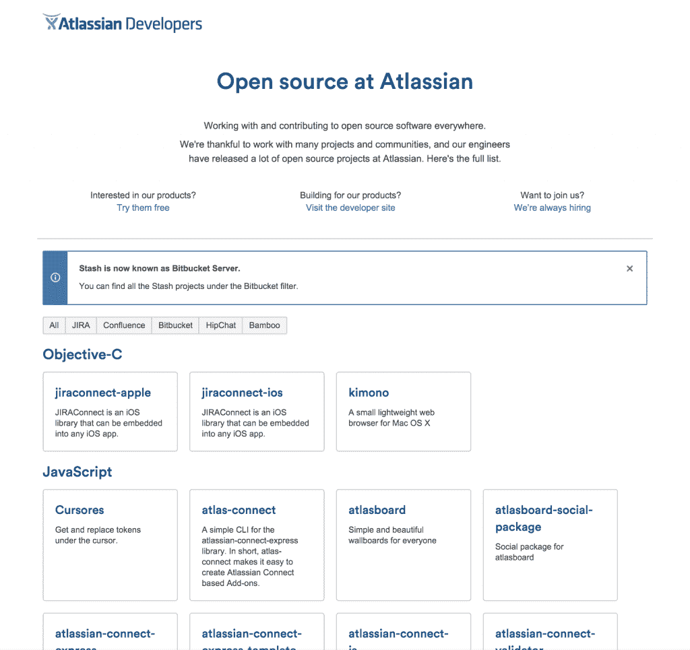
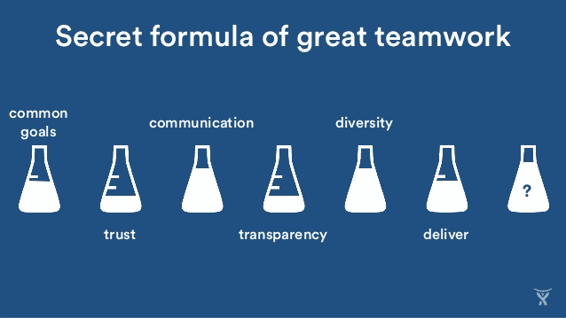

# Atlassian 如何支持开源开发

> 原文：<https://thenewstack.io/atlassian-supports-open-source-development/>

随着开源软件不断革新开发者创建、发布、协作和生产软件的方式，越来越多的公司开始转向在开源许可下提供自己的软件。其他人在开放源码下开发他们自己的软件，允许整个社区为激励他们的项目做出贡献。对于许多较小的公司和初创公司来说，开源项目和应用程序允许获得技术或服务，而这可能曾经需要大量的初始投资。

## 亚特兰蒂斯和 OSS

初创软件开发公司可能会发现自己面临着预算紧张的局面，由于成本、设置困难或缺乏可用的托管选项，企业版软件难以实现。

如果一家初创公司或企业有一个正在开发的[开源项目](https://developer.atlassian.com/opensource/)，Atlassian 为开发者提供了免费申请 contributor 访问其产品套件的机会。该公司使用 [Apache v. 2.0 开源许可证](http://www.apache.org/licenses/LICENSE-2.0)用于其自己的开源产品，其他许可证根据具体情况应用。JIRA、Confluence、Bamboo、BitBucket 和 HipChat APIs 和扩展是[在开源生态圈](https://developer.atlassian.com/opensource/)中提供的几个例子。HipChat 的工程主管乔·洛佩兹(Joe Lopez)说:“如果你对自己的代码和如何处理他人的数据不透明，你就不可能真正成为一个开源项目。

图为:Atlassian 的开源

在整个 oss 开发领域，没有优先于其他语言的“核心语言”,任何数量的项目都是同时开发的。因为开源是许多初级开发人员和那些刚刚开始学习编程的人在社区中摸爬滚打的一种方式，同时也有助于他们感兴趣的项目。因此，在 Atlassian Summit 2015 之后，它看到了一个持续发展的领域，以支持开源社区，因为开发人员继续为其产品做出贡献。

## 克服开放源码软件发展面临的障碍

众所周知，开源社区面临着关于贡献者行为的问题。这些包括需要广泛审查的拉式请求，精英主义，以及来自不同程序员的许多其他问题，这些程序员发现自己回避 OSS 的贡献。多样性仍然是开源中的一个问题，Atlassian 希望为其 OSS 贡献者培养和拥抱一个包容性的环境。

“在任何社会中，多元化都很重要，因为它有助于培养思想和对不同观点的考虑。这可能是文化、种族、性别认同、技术、教育等的多样性，但重要的是有一系列不同的声音来帮助促进增长和挑战现状，”洛佩兹说。

开放源码软件社区的多样性通常不被视为一种资产，而是那些抵制变革的人的障碍。OSS 最初是建立在与过去截然不同的理念上的，在过去付费软件被认为是标准。Lopez 评论说，就此而言，OSS 社区应该回顾这些根源，支持不同的声音，努力为每个人创造一个受欢迎的 OSS 社区。

Atlassian 的[行为准则](https://developer.atlassian.com/opensource/codeofconduct.html)也指导行为，确保那些为 Atlassian 项目做出贡献的人遵守一套准则，不仅是准则，也是相互交往的准则。

图为:亚特拉斯团队价值观。

Lopez 指出，开源面临的另一个问题是大型组织对 OSS 项目的参与。“在今年的 [OSCON](http://conferences.oreilly.com/oscon/open-source-us) 大会上，我听到了大组织参与 OSS 的潜流。就像个体多样性一样，从单个个体到大型组织的广泛参与对生态系统的整体健康非常重要。”

随着越来越多的企业开始注意到 OSS，在整个社区和开源之外的人之间存在着一条细微的界限。随着技术的不断进步，越来越多的公司发现与开源项目和对开源感兴趣的开发者合作是有好处的。随着这种发展，不仅需要记住开源软件开发的根源，还需要通过支持社区的多样性和创造性来改进它们。

专题照片 [via](https://pixabay.com/en/code-coding-web-development-944499/) Pixabay。

<svg xmlns:xlink="http://www.w3.org/1999/xlink" viewBox="0 0 68 31" version="1.1"><title>Group</title> <desc>Created with Sketch.</desc></svg>