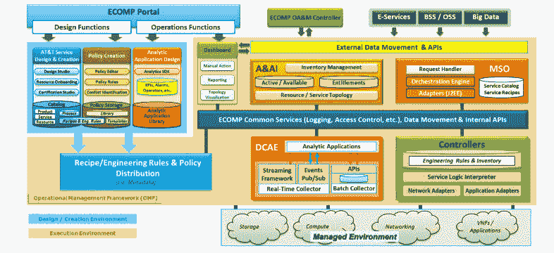
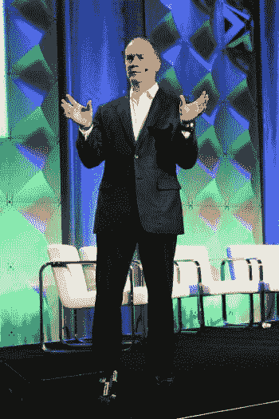

# 美国电话电报公司拥抱网络功能虚拟化，并可能开源其 NFV 平台

> 原文：<https://thenewstack.io/att-moves-nfv-platform/>

美国电话电报公司周二发布了一个新的基于云的网络功能虚拟化(NFV)平台的详细信息，该平台将使公司从旧的物理基础设施转向虚拟化的基于 IP 的网络。

这家电信巨头也在考虑将其正在开发的 NFV 软件 ECOMP(增强控制、协调、管理和政策)作为开源软件发布。

“我们从这里走向哪里取决于我们从云和开发者社区获得的反馈，”美国电话电报公司首席战略官约翰·多诺万在由 Linux 基金会赞助的开源会议 2016 年开放网络峰会上说。“在过去，在& T 会向你们宣布我们的计划和我们前进的道路。今天，我们想知道您对我们的愿景和方向有何看法。我们需要知道您是否愿意与我们合作，为这项计划贡献您的时间、精力和代码。”

## 缺乏保证

美国电话电报公司想要一个基于云的平台来协调运行高速数据和语音网络所需的大容量流程。为此，[在周二发布的公司白皮书中](http://about.att.com/content/dam/snrdocs/ecomp.pdf)阐述了其未来网络的目标:

*“ECOMP 通过其元数据驱动的服务设计和创建平台以及实时运营管理框架(一种提供实时、策略驱动的管理功能自动化的框架),支持快速部署客户所需的新服务(由 AT & T 或第三方创建)并降低运营支出和资本支出(运营支出和资本支出)。元数据驱动的服务设计和创建功能支持以最少的 IT 开发来定义服务，从而有助于降低资本支出。实时 OMF[运营管理框架]实现了网络管理功能的显著自动化，能够以自动化的方式检测和纠正问题，有助于降低运营支出。”*

任何电信公司都将受益于像 Docker 支持的数据中心那样可配置、可适应和可扩展的网络。但是实时电信工作负载[不能像大多数应用程序工作负载那样](https://thenewstack.io/web-scale-isnt-enough-containers-telecommunications-space/)扩展。电信公司不仅要扩展工作负载和流量，还要扩展虚拟组件。等待数据中心虚拟化市场设计解决方案似乎不是 AT & T 的选择，据 Donovan 称，该公司去年虚拟化了约 5.7%的网络组件，但计划在今年年底前将这一比例提高到 30%。

ECOMP 平台组件。

“我们正在努力扩大我们的供应商库，不仅仅局限于大型传统企业，”CSO 告诉与会者，“以减少供应商锁定。现在，我们不反对与这些人合作。但我们希望给这个领域带来更多竞争，以便加快创新、降低成本，而且非常重要的是，我们缩短了周期时间。”

多诺万认为 OpenStack、 [OPNFV](https://thenewstack.io/opnfv-operationalizes-network-functions-virtualization/) 、OpenDaylight、网络虚拟化平台 OpenContrail、开放网络实验室、开放容器计划、云计算原生计算基金会和脸书的开放计算项目在他的公司的基础设施转型中发挥了关键作用。

但他也明确表示，过去标准流程和开源流程的工作方式，已经不足以满足 AT&T 的需求。

## 水印

我问多诺万，美国电话电报公司是否有某种高标准，例如，描述进入开源 NFV 领域的新竞争者的数量，或者 ECOMP 反馈过程的新贡献者的数量，这将决定该公司是否准备好向开源社区发布 ECOMP。

“我们想的是，每个空间都需要有创新和颠覆性的人，”他说。“每个空间都必须有一个有经验和规模的人。然后，我们试图做的是确保我们不会混淆研究密集型活动和非研究密集型活动，并最终回到过去。”

多诺万说，对于“一种小型且移动迅速的创新型破坏装置，将它们置于研究密集型环境是解决生产问题的一剂良方”。

美国电话电报公司使用记分牌来帮助量化其需求。多诺万说，评估客户需求的每个实例都有一个风险评估过程，并确定传统功能的虚拟化或新功能的替代是否能满足该评估。他拒绝具体说明用例，但承诺他可能会在今年晚些时候提供更多关于开发者对 ECOMP 看法的定量分析。

“我无法告诉你我们的头发着火了。所以我们知道问题，我们正在解决它，然后最终当我们聚在一起说，我们如何在一个多供应商的环境中解决它，我们会实现它，”他说。“但我们不会坐在一起，现在就无休止地争论，一年后再解决一个理论问题。我们需要一个切实可行的解决方案。”

多诺万说，美国电话电报公司正在建立一个集成的云环境，让开发人员在一个“非常先进的沙箱”中进行他们自己的集成测试。集成测试对于权衡多种选择的优势是必要的。

“标准有时是一个肮脏、混乱的过程。开源只是一个标准过程的不同版本。因此，这是一个重要的夏天，看看这些东西是如何发挥作用的，”多诺万说。

## 智囊团

那天晚些时候，我问美国电话电报公司实验室的传奇建筑师 Margaret Chiosi——op nfv T1 的总裁，也是电信领域开源的长期倡导者——通过将 ECOMP 这样重要的东西发布到开源软件中，T 是否已经权衡了实际上成为威瑞森、Orange、BT 和 Telefonica 的研究部门的风险。

“如果我可以这么说的话，我们正在开放和服，以获得反馈，看看业界是否认为它有价值，”奇奥西回应道。“如果有价值，我们会鼓励更广泛的生态系统。如果生态系统认为它对行业来说不够有价值，那么，我们就继续做我们正在做的事情。”

> “标准有时是一个肮脏、混乱的过程。开源只是一个标准过程的不同版本。所以这是一个重要的夏天，看看这些东西是如何发挥作用的。”——约翰·多诺万

但是如果它是有价值的，那么开源应该把技术推向美国电话电报公司的边界之外，不是吗？

“开源的整个价值主张是，当你开源某个东西时，你希望有一个更广泛的社区来创新它，”她回答说。“然后整个行业，以及整个美国电话电报公司，都从中获得了价值。

“我们没有整个行业的智囊团。从某种意义上说，我们知道我们正在创新的东西是基于我们的筒仓。“因此，通过更广泛的参与，如果行业认为值得，那么你就有希望拥有更广泛的智囊团，可以提出我们可能没有想到的东西，最终我们都可以实施。”

Docker 是新堆栈的赞助商。

美国电话电报公司的约翰·多诺万的照片。

<svg viewBox="0 0 68 31" version="1.1" xmlns:xlink="http://www.w3.org/1999/xlink"><title>Group</title> <desc>Created with Sketch.</desc></svg>