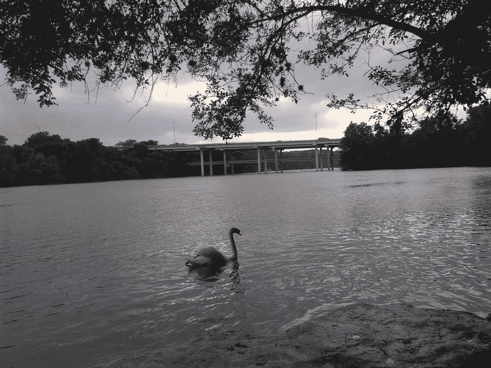

# 奥斯汀如何在没有优步和 Lyft 的情况下幸存下来

> 原文：<https://thenewstack.io/austin-survived-first-sxsw-without-uber-lyft/>

奥斯汀是一个没有优步和 Lyft 的城市——今年正在进行的 SXSW 活动标志着它的第一次重大考验。该市的经验表明，当一个社区决定推出自己的本土替代方案时会发生什么。

它也给游客一些有趣的故事来讲述…

去年，众所周知，奥斯汀投票要求拼车司机提供指纹——这促使两个最大的拼车公司[优步](https://www.uber.com/)和 [Lyft](https://www.lyft.com/) 愤然退出该市。优步和 Lyft 曾希望自我监管，但当他们向奥斯汀选民提出时，“该提议以超过 11 个百分点的差距失败”，[麻省理工技术评论指出](https://www.technologyreview.com/s/603792/hailing-a-different-ride-in-austin/)，“并发誓如果没有它，他们在奥斯汀的存在将是不可持续的，优步和 Lyft 都在 36 小时内关闭了运营。”

这些公司花费了 800 多万美元试图引导公众舆论，但“媒体闪电战没有在竞选中营造一种不可避免的感觉，而是迎合了当地人的担忧，即奥斯汀受到了外地人的欺负，他们认为这座城市的规则不适用于他们。"

但是他们离开城镇后发生了什么？

起初，30，000 名奥斯汀人加入了一个拼车团体，通过脸书主页组织起来。但仅仅 10 个月后，美国有线电视新闻网[报道称](http://money.cnn.com/2017/03/08/technology/austin-uber-lyft-sxsw/index.html)“一批蓬勃发展的、主要是本土的拼车应用填补了这一空白”，证明如果大型拼车公司反对当地法规，城市*确实可以选择。*

一名拼车顾问告诉他们，在奥斯汀有无与伦比的选择，这里已经成为一个实验友好的城市，“在这里，我们可以按下优步和 Lyft 的暂停按钮，然后说——还有什么可能？还可能发生什么？”

毕竟，这座城市的非官方座右铭是“保持奥斯汀的怪异”

波士顿的一家服务公司 Fasten 迅速扩张到奥斯汀，填补了这一空白。声称它的票价结构“把更多的票价放进了最应该得到它的人的口袋里:司机。”另外两项服务——Fare 和 T2——正专注于服务机场周围的交通。“我们从未想过我们会有这么大的机会，”Fare 的首席执行官去年在给司机的一封电子邮件中写道，“我们不会把它或你视为理所当然的。”

但最受欢迎的选择之一是 [Ride Austin](http://www.rideaustin.com/#the-first-ride-is-coming-soon) ，它将自己的座右铭描述为“自豪的非营利”和“由奥斯汀为奥斯汀建造”。他们的应用程序的一个功能是让你自动将你的车费凑整，并向你选择的当地慈善机构捐款，据 CNN 报道，到 2 月份，它已经筹集了超过 10 万美元。作为一个非营利组织，Ride Austin 的网站声称，“司机赚得更多，乘客付得更少。”

CNN 还报道称，一些拼车司机实际上从休斯顿通勤到奥斯汀——165 英里的车程——只是因为他们比优步或 Lyft 赚得更多。“感谢上帝，奥斯汀和法斯特加入了，”一名骑手上周告诉他们。“如果是优步，我会失去我的房子。”她与奥斯汀的其他三名拼车司机合租一套公寓。

Ride Austin 吹捧他们愿意分享他们的乘车数据，并滔滔不绝地说“道路是开放的，我们也是。”一家当地新闻网站报道称，拼车非营利组织 Ride Austin 刚刚完成了第 100 万次拼车，并正在为 SXSW 做准备，每天增加 40 到 50 名新司机。“他们都将被采集指纹，他们的个人车辆都将接受检查，并与团队成员进行面谈，”该公司的客户参与总监说——当然，该公司还升级了服务器。

他扩展到 CNN，解释说“没有秘方。这项技术变得越来越容易复制。”当谈到开始一项服务时，“这真的与文化有关。车手和车手喜欢你做的事情吗？他们觉得自己是其中的一部分吗？”

他告诉《技术评论》说，非营利模式“实际上是一种橄榄枝，可以说，‘看，技术界看到了一些开放的伤口，我们将做些事情来试图治愈这些伤口。’“据《麻省理工技术评论》报道，大约有 700 万美元被捐赠给了这个非营利组织——“大部分来自奥斯汀的技术社区成员。"

美国有线电视新闻网(CNN)将莱德·奥斯汀的总部描述为“一家古色古香的灯具店对面的一间锈迹斑斑的平房”，有“摇摇欲坠的天花板和一间浴室。”但是到上周，它已经聚集了 4300 名活跃司机，每周提供 65000 次乘车，据 CNN 报道，并且正在创造新的记录。市政府官员告诉 CNN，现在有超过 12000 名司机完成了指纹检查，几乎是去年通过优步和 Lyft 提供拼车服务的 2 万名司机的三分之二。

但从上周开始，名副其实的 SXSW 与会者对该市的拼车应用进行了测试。

这座城市试图通过指定[乘客上车区](http://www.austintexas.gov/sites/default/files/files/CityStage/Transportation/SXSW2017_MAP_PassengerZones_03032017.pdf)，延长公共交通时间，以及关闭一些街道来容纳人群。

事情开始还不错。但是当重要的周六周末到来时——开始下雨——需求激增。“恰在此时，这些应用失败了，”TechCrunch 在一篇题为“奥斯汀没有优步和 Lyft 也很好……直到它不在了”的文章中写道他们承认，周日事情“似乎运转良好”，但补充说，奥斯汀“肯定错过了证明城市已经准备好在没有优步或 Lyft 的情况下运转的机会。”据 Recode 报道，[的 Ride Austin 最终离线了近五个小时，而 Fasten“在晚上最繁忙的时段之一，有一个小时没有为它的许多用户工作。”](http://www.recode.net/2017/3/12/14900568/sxsw-uber-lyft-ride-austin-outage)

但值得称赞的是，莱德奥斯汀[与世界分享了它的整个故事](https://www.facebook.com/werideaustin/posts/228900194180723)。该组织的管理员尝试重新启动他们的云托管数据库。(“是的，即使在亚马逊，有时重启也是正确的答案……”)他们立即道歉，承认他们让这座城市、他们的司机和客户失望了，而且“在这种情况下，我们能做的最好的事情就是与社区沟通，像往常一样开放。”

但是 Ride Austin 指出，它在周六仍然提供了 15，000 次乘坐，这是自 SXSW 开始以来提供的 45，000 次乘坐的大规模浪潮的一部分。它承认，由于“以前未发现的数据库问题”，周六晚上的服务变得“零星”，但《脸书邮报》周六表示，现在的服务比以往任何时候都好，他们相信这个问题已经“完全解决，不会再发生”该公司认为，这一意外飙升是由另一款拼车应用的故障造成的。Recode 证实，Fasten 在周六晚上“停机不到一个小时”，而 Fare“对一些人有效，但对其他人无效。”

Barron 的 Next 报道称，票价基本上经受住了这场雨:“最终，高流量时期的服务故障应该是可以解决的。”我们离开奥斯汀时，印象深刻的是，优步和 Lyft 仍有合适的替代方案。"

客观地看，即使在本周末之前，当地人就警告奥斯汀的天气如何不可避免地导致交通拥堵——即使你只是想拦辆出租车。“如果下雨，出租车真的要花几个小时，”SXSW 的一位常客[在本周早些时候警告过*Ad Age*T5。](http://adage.com/article/special-report-sxsw/sxsw-survival-guide/308164/)

本周四, *Barron 的 Next* 总结说，优步和 Lyft 在奥斯丁的访问中“并没有真正被错过”。“我们在那里的骑行体验比在纽约的优步和 Lyft 要好。”

繁荣的三轮车业也起到了帮助作用，它处理了大量的市区交通。

“一些我最喜欢的 SXSW 记忆发生在三轮车上，”Twitter 的营销总监告诉 *Ad Age* 。“两年前，我骑着一辆由一个穿着粉色紧身衣的滑稽家伙驾驶的自行车，接下来的一周，我看着他在吉米·基梅尔现场演唱会的舞台上滚动。”

具有讽刺意味的是，该市甚至可能很快废除指纹要求——但莱德·奥斯汀认为，由于忠诚的司机和忠诚的顾客，他们现在可以在竞争中生存下来。奥斯丁交通机构的一名官员告诉 CNN，在优步和 Lyft 离开城镇后，其他企业准备介入。

“我们发现有一种渴望。他们真的很想成功。”虽然市长希望这些公司回来，但它们也证明了没有它们也能生存。“当垄断或双头垄断离开城市，创造一个开放的市场时，奥斯汀发生的事情是你可以预料到的。你有竞争和创新。”

SXSW 的项目总监向 *Marketplace* 解释了他的观点。“如果优步和 Lyft 回到镇上，这对我们的活动有好处吗？是的… [但是奥斯汀就是奥斯汀](https://www.marketplace.org/2017/03/15/world/why-ride-sharing-companies-are-absent-sxsw)。我们用许多不同的方式做事。这是这座城市魅力的一部分，是它的奇特魅力，所以我们将拭目以待。”

大卫·卡塞尔的照片。

<svg xmlns:xlink="http://www.w3.org/1999/xlink" viewBox="0 0 68 31" version="1.1"><title>Group</title> <desc>Created with Sketch.</desc></svg>