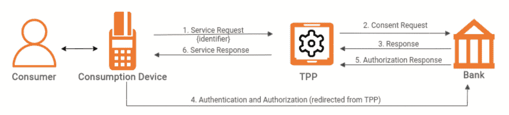
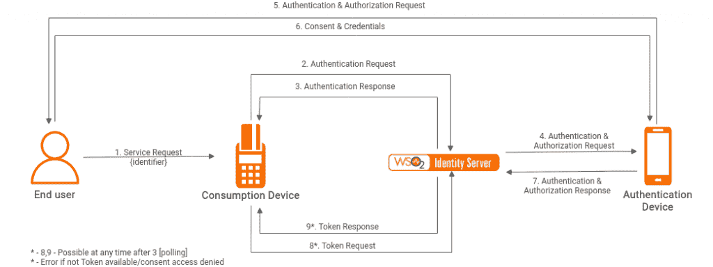

# 身份认证规范增强了开放式银行体验

> 原文：<https://thenewstack.io/authentication-specification-enhances-open-banking-experience/>

开放的银行业加速了传统金融服务向数字世界的转变。消费者现在有很大的财务自由，可以通过第三方提供商访问他们存储在银行的财务数据。

 [蒂利尼·拉纳加拉赫

Thilini 是一名高级软件工程师，负责支持 WSO2 的银行、金融服务和保险(BFSI)业务部门。她专注于开放式银行和开放式金融的软件开发。她在主要地区规范以及身份和访问管理、API 管理、实时分析、API 安全、应用安全、自动化测试和自动化部署方面拥有丰富的技术经验。](https://twitter.com/thiliniranagala) 

在这种背景下，提供安全、无缝且“永不停机”的增强型数字体验变得至关重要。Qualtrics 最近的一项调查表明，89%以客户体验为导向的公司比他们的竞争对手表现得更好。

消费者数据的所有权不再是决定性因素。然而，至关重要的是，金融科技公司为消费者提供顺畅的用户流，专注于便利性、可用性和安全性。最近，OpenID Connect 引入了一种称为客户端发起的反向信道认证(CIBA)的新技术规范来克服这一挑战。请参考规格[此处](https://openid.net/specs/openid-client-initiated-backchannel-authentication-core-1_0.html)。

技术团队需要考虑一种开箱即用的解决方案来支持 CIBA，以增强身份验证和授权期间的最终用户体验。

为了解释和提供例子，我们将使用 [WSO2 开放银行 3.0](https://wso2.com/solutions/financial/open-banking/) 作为实现技术。

## 关键术语

**消费设备(光盘)**

帮助消费者与第三方提供商(TPP)的开放式银行服务进行交互的设备。这可以是由开放银行生态系统中的支付或账户服务提供商提供的基于浏览器的 web 应用。

**认证设备(AD)**

一种帮助消费者与银行授权服务器(AS)进行交互以验证和授权其身份的设备。

## 为什么是 CIBA？

OpenID Connect 是构建开放银行的主要规范之一。开放式银行允许第三方提供商的应用程序代表消费者启动授权流程。消费者被重定向到银行的授权服务器，然后进行身份验证、授权(同意)，最后连同可验证的断言一起被重定向回 TPP 应用程序，以便流程继续进行。

图 1:开放银行业务流程图

图 1 显示了一个基于 OpenID Connect 的开放银行业务流程示例。消费者必须与消费设备进行交互，以便向银行的授权服务器认证自己并提供同意。此外，消费者与 TPP 和授权服务器之间的交互是通过 HTTP 重定向来处理的。然而，浏览器重定向非常容易受到攻击。如果通过不同的设备(AD)处理消费者与 CD 的认证和授权交互，则不需要 HTTP 重定向。这就是 CIBA 的用武之地。

## CIBA 的主要特色

### **解耦认证**

通常，用户必须使用相同的设备来认证和消费服务。但是，使用 CIBA，身份验证过程是分离的。运行第三方提供商应用程序的消费设备发起身份验证和授权的反向信道请求，而实际的身份验证和授权在单独的身份验证设备上执行，该身份验证设备可以是任何智能设备，如手机、智能手表和销售点系统。

### **令牌请求模式**

在消费者同意授权之后，CIBA 为 TPP 应用定义了三种令牌请求模式。

*   **轮询模式:**一旦收到对 CIBA 认证请求的响应，TPP 应用程序必须在限速条件下持续轮询银行的令牌端点。
*   **Ping 模式:**一旦消费者通过他们的设备提供了身份验证，就会从银行的授权服务器向 TPP 应用程序(消费设备)发送通知。只有这样，TPP 应用程序才会发送令牌请求。
*   **推送模式:**一旦消费者从认证设备提供了他们的认证，就从银行的授权服务器向 TPP 应用发送带有令牌本身的通知。由于这带来了高安全性风险，因此由[金融级 API(FAPI)–客户端发起的反向通道认证配置文件](https://openid.net/specs/openid-financial-api-ciba-ID1.html#authorization-server)限制其在金融领域的 CIBA 实施中使用。

*请注意，WSO2 开放银行目前仅支持轮询模式。由于*[*【FAPI】*](https://openid.net/specs/openid-financial-api-ciba-ID1.html#authorization-server)*并未强制要求支持 ping 模式，因此将考虑在未来的版本中提供支持。*

## CIBA 流解释道

图 2 显示了使用 WSO2 Open Banking 3.0 的 CIBA 流程的序列图。已经实现了一些与 CIBA 相关的新功能来处理步骤 2、3、8 和 9，而步骤 4、5、6 和 7 则由一个新的分离认证器(也称为联合认证器)来处理。

图 2: CIBA 序列流程图

让我们通过一个用例来讨论 CIBA 流。假设消费者想要进行在线零售购物，并选择通过银行支付。交易将遵循以下步骤:

1.  为在线商店提供支付服务的 TPP 应用程序向银行的 CIBA 认证端点发起反向通道认证请求。
2.  CIBA 规范定义了 CIBA 认证的端点，引入了新的授权类型和响应类型。此时，消费者的浏览器(CD)不会被重定向到银行的授权端点，而是继续停留在在线商店的网页上。
3.  在接收到以 auth_req_id 作为参考的成功响应之后，如果模式是轮询，则 TPP 应用开始轮询令牌端点。
4.  消费者应该会在他们的手机(AD)上收到一个通知，告知他们银行的网上银行应用程序安装在哪里。
5.  该通知由银行的授权服务器在响应来自 TPP 的反向信道认证请求后异步生成，并发送给消费者的预注册设备。该警告被包括在所请求的同意信息中，以显示在移动应用程序上。
6.  消费者打开他们的应用程序并验证购买细节。然后，他们通过提供他们的生物认证(如指纹)来拒绝或同意。
7.  基于从认证设备接收的响应，银行的授权服务器更新同意的授权状态。此外，如果同意，它还会为 TPP 应用程序发送的下一个令牌轮询响应一个令牌。
8.  一旦这个反向通道认证过程完成，消费者就可以在在线商店的网站上看到支付状态。

## CIBA 合规在开放银行业务中的优势

1.  消费者通过带外流提供同意的能力，减少了传统网站重定向。
2.  以安全的方式共享关键身份信息的灵活性。
3.  智能设备的使用允许生物识别技术的集成。这有助于平衡安全性、便利性和速度。
4.  银行的未来取决于使用新技术来提供创新和无摩擦的银行体验。在瞬息万变、以客户为中心的银行业生态系统中，实现 CIBA 合规性对此大有裨益。
5.  在 CIBA 的帮助下，令人满意的客户体验将让银行赢得客户的忠诚、信任和大力推荐。

我们希望这篇文章能帮助读者更多地了解 CIBA，以及该规范如何帮助银行和金融公司开发以客户为中心的解决方案。要了解更多信息，请访问我们的[解决方案页面](https://wso2.com/solutions/financial/open-banking/)或前往我们的[博客](https://wso2.com/blog/)。

<svg xmlns:xlink="http://www.w3.org/1999/xlink" viewBox="0 0 68 31" version="1.1"><title>Group</title> <desc>Created with Sketch.</desc></svg>