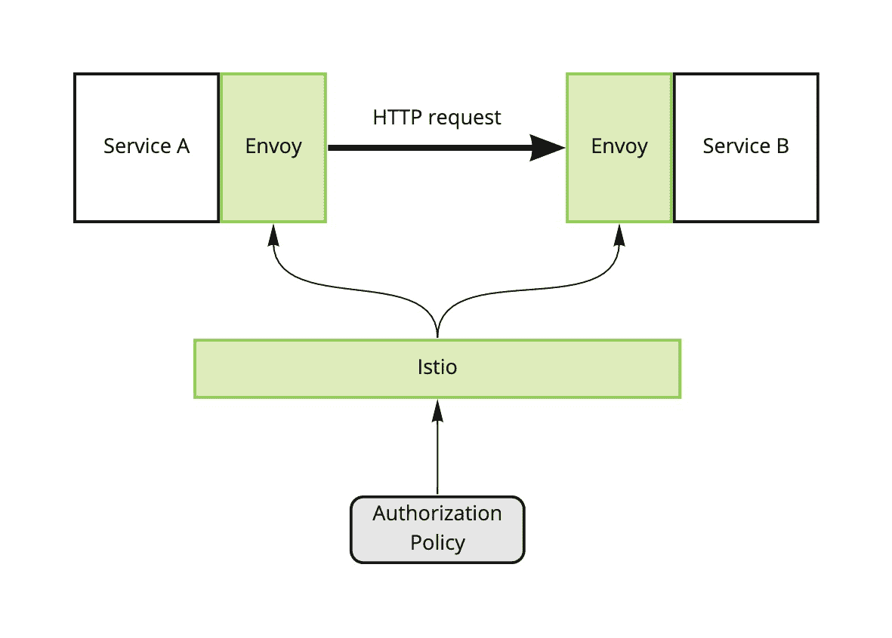
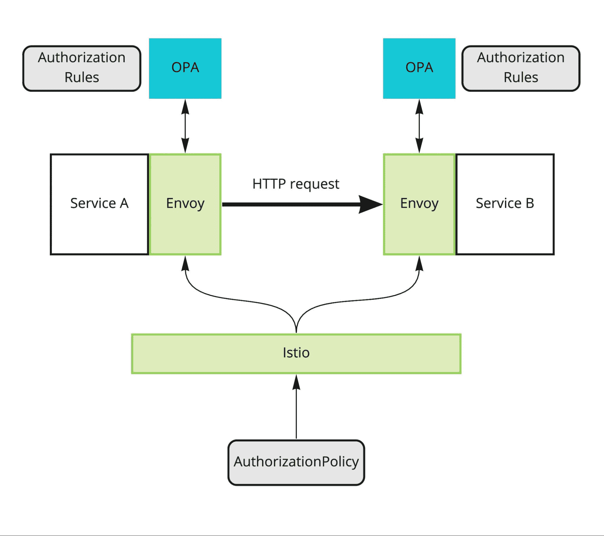
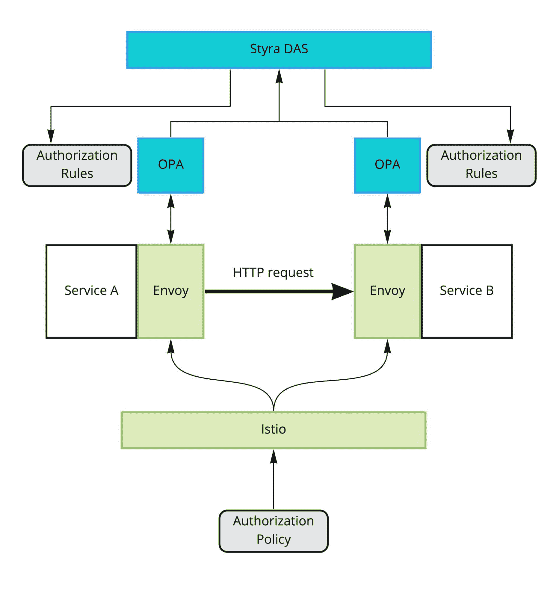

# 授权更好:Istio 交通政策与 OPA，Styra DAS

> 原文：<https://thenewstack.io/authorize-better-istio-traffic-policies-with-opa-styra-das/>

[Adam Sandor](https://www.linkedin.com/in/adamsandor/)

[Adam 是 Styra 的解决方案架构师，帮助公司采用 OPA 和 Styra DAS。在过去的六年里，他一直在云原生空间工作，专注于 Kubernetes 的采用和软件交付。在业余时间，Adam 是一名专注的 DCS World 飞行员，也是一名在荷兰自行车道上漫游的快乐自行车手。](https://www.linkedin.com/in/adamsandor/)

用于授权的云原生工具是一种新兴趋势，它将彻底改变我们处理应用程序中这一经常被忽视的部分的方式。[开放策略代理(OPA)](https://www.openpolicyagent.org/) 是将策略应用于许多不同系统的事实标准的主要竞争者，从 Kubernetes 上运行的工作负载到通过 Istio 的请求。在本文中，我将更仔细地研究后一种用例，并尝试回答 OPA 及其商业管理工具 [Styra DAS](https://www.styra.com/) 提供了什么的问题。

当使用 Istio 服务网格连接服务时，所有运行 Envoy 的 sidecar 代理都是进行授权决策的好地方。所有 HTTP 请求都流经它们，其中包含关于源和目标服务的元数据。特使的功能由 Istio 以 [AuthorizationPolicy](https://istio.io/latest/docs/reference/config/security/authorization-policy) 对象的形式公开。无论您在授权策略中表达什么，Istio 都会很好地执行。

图 1: Istio 根据授权策略配置特使边车

可以使用授权策略实现的一些策略示例:

*   服务 A 只能通过 HTTP path /getobjects 在端口 80 上与服务 B 对话。
*   服务 B 只能接收来自名称空间 x 的请求。
*   所有对服务 B 的请求都必须包含一个有效的 JSON Web 令牌(JWT)。

但是，授权政策能让我们走多远？它可以检查 HTTP 头和路径，并验证 jwt。它还可以使用元数据来判断请求来自哪个 Kubernetes 服务以及它的目的地。

虽然 Istio 为我们提供了相当多的选择，但它也有几个方面的局限性。它不能使用 JWT 中的所有字段，该字段通常是 Auth0 等身份验证系统放置用户元数据的地方。它也不能使用请求有效负载进行决策。最后，除了上面提到的几个片段之外，它没有任何上下文信息。

## 通过 OPA 获得更多授权

Istio 使用的 Envoy 代理能够将授权决策委托给外部系统。它将以 JSON 格式发送关于传入请求的所有信息，并期望得到基本上是“是”或“否”的响应。这正是 OPA 的操作模型——接收 JSON 数据，评估策略，返回是或否。我们可以将 OPA 作为外部授权者添加到 Istio 的 Envoy sidecars，覆盖整个服务网络:

图 2: OPA 作为 Istio 特使边车的外部授权人

OPA 代理将作为一个单独的进程运行，最好是作为微服务旁边的另一个 sidecar 容器，并将为 Envoy 做出所有授权决定。您可以在 [OPA 文档](https://www.openpolicyagent.org/docs/latest/envoy-introduction/)中了解更多关于 OPA-Envoy 集成的技术细节。

OPA 的策略是用声明性策略语言减压阀编写的。这种语言不仅比 AuthorizationPolicy 更灵活，而且可以处理请求中 Istio 不允许我们访问的部分。它还可以利用关于请求上下文的附加数据；我们可以将任何数据加载到 OPA 中，并在策略评估期间使用它。

为了展示 OPA 给我们带来的可能性，我们需要一个更具体的例子。让我们假设工资服务的用户正在设置一个新的雇员，这将导致从工资服务到雇员管理器服务的调用。两种服务都存在于各自的名称空间中，并被分配了各自的 ServiceAccounts。工资服务将在请求中包括登录用户的 JWT，这将包括用户所属的组和角色。最后，请求主体将包含新创建的雇员的数据。

让我们想出一些无法用纯 Istio 表达的策略:

1.  只有在 JWT 令牌中标识为“经理”的用户才能创建新员工。
2.  经理只能在自己的组中创建员工。
3.  用户必须是员工-经理列表的一部分，才能创建员工。

现在让我们看一些代码，看看我们将如何实现这些策略。注意，这将取决于 Envoy 传递给 OPA 的 JSON 的结构。这是 JSON，为了清楚起见，去掉了所有不重要的数据:

让我们实现第一条规则:只有在 JWT 令牌中被标识为“经理”的用户才能创建新员工。

这假设我们已经将承载令牌解析为 JWT。

我们来看第二个:管理者只能在自己的组内创建员工。

这是前一个规则的扩展，增加了一个附加条件。

现在让我们再添加一个来验证请求用户是否在允许创建雇员的特殊用户列表中。为了简单起见，列表是 OPA 规则的一部分，但是我们也可以从外部源加载数据，比如 Git 或 HTTP API。

这些规则并不复杂，但是它们不能用 Istio 的授权策略来实现。我们为额外的灵活性付出的代价是性能。虽然 Istio 的策略由 Envoy 直接评估，但在 OPA 案例中，Envoy 必须向 OPA sidecar 发出 HTTP 请求。OPA 将其规则存储在已经预编译的内存中，因此计算时间以毫秒为单位，但是当然，即使是对 localhost 的 HTTP 调用也总是比进程本身内部的操作慢。我们的经验是，性能只会成为每秒处理数十万个请求的服务的问题。

下表总结了不同类型的策略，以及我们需要在哪里实施 OPA:

## 管理一批 opa

通过将我们的政策规则移入 OPA，我们引入了管理挑战。所有这些特使代理都由 Istio 控制平面管理，但没有人管理所有的 opa。首先，我们必须确保一个 OPA 边车容器被注入每一个豆荚。我们可以使用一个变异的 webhook 很容易地做到这一点。

更困难的挑战是管理每个 OPA 容器执行的规则。这就是 OPA 的创造者 Styra 创建了 [Styra 声明式授权服务(DAS)](https://www.styra.com/) 的原因。Styra DAS 是一项 SaaS 服务，它充当 OPA 的控制平面，就像 Istio 充当 Envoy 的控制平面一样。Styra DAS 将存储所有规则和相关数据(例如，包含 employee_managers 列表的数据源),每个 OPA 代理将定期轮询 Styra DAS 以获取最新的规则包。

图 3: Styra DAS 管理 OPA 流程

此外，OPA 代理会将决策日志推回到 Styra DAS，以便可以出于审计目的对其进行记录和分析。

集中的策略管理和策略决策日志的收集是一个强大的组合，有助于公司满足审计和法规遵从性要求。此外，OPA 并不局限于授权 HTTP 请求通过 Envoy，而是可以与 Kubernetes、Terraform 以及基本上任何其他可以与其简单的、基于 JSON 的 API 交互的系统集成。这样，Styra DAS 可以成为组织中所有政策决策的单一仪表板。

OPA 是一个开源项目，而 Styra DAS 是一个商业产品。这就产生了一个问题，如果你不想使用 Styra DAS，如何分发你的保单。连接 OPA 和 Styra DAS 的协议是开源项目的一部分，这意味着您可以使用一个云桶来存储您的策略包和上传决策日志。您还可以使用自己开发的 HTTP 服务来提供策略包和接收决策日志。您可以在 [OPA 文档](https://www.openpolicyagent.org/docs/latest/management-introduction/)中找到这些 API 的文档。

## 结论

Istio 的内置授权策略机制是一个很好的工具，但是一旦遇到它的局限性，OPA 就是下一步的方向。更重要的是，OPA 带给你的不仅仅是更好的 Istio 授权；它帮助您跨不同的域和系统类型建立集中授权。

<svg xmlns:xlink="http://www.w3.org/1999/xlink" viewBox="0 0 68 31" version="1.1"><title>Group</title> <desc>Created with Sketch.</desc></svg>