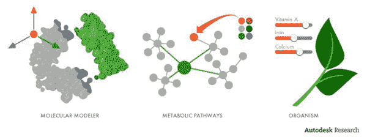

# Autodesk 的 Project Cyborg:一个生物打印工程人体组织和器官的平台

> 原文：<https://thenewstack.io/autodesks-project-cyborg-is-a-cloud-based-platform-for-programming-matter-bio-engineering/>

云计算改变了我们存储、分享和获取信息的方式，也不可避免地改变了商业运作的方式。现在，云也正在改变我们在设计领域开发工具和合作的方式——从大规模的摩天大楼，到纳米级的建筑和编程。在合成生物学、纳米技术和 [4D 印刷](https://thenewstack.io/shapeshifted-things-4d-printed-materials-programmed-for-self-transformation/)这些新兴领域中，物质被字面上“编程”以在特定条件下执行特定功能，一个跨不同规模和学科工作的直观设计工具的统一平台——它们共同利用云的力量——对于解决这些努力的内在设计和协作复杂性可能至关重要。

总部位于加州圣拉斐尔的软件公司 [Autodesk](http://www.autodesk.com/) ，可以说以其计算机辅助设计软件 [AutoCAD](https://en.wikipedia.org/wiki/AutoCAD) 而闻名，是一家目前正在探索这种“新工业革命”需要什么样的设计工具的公司

在欧特克[生物/纳米/可编程物质](http://www.autodeskresearch.com/groups/nano)研究小组的支持下，名为 [Project Cyborg](http://www.autodeskresearch.com/projects/cyborg) 的项目于去年启动，其目标是开发一个基于云的工具平台，用于建模、模拟、可视化和优化，可用于不同学科和规模。Project Cyborg 背后的想法是开发工具和设计空间，让不熟悉 3D 建模的人也能使用。正如《连线》英国版的汤姆·范德比尔特所说，这场新的革命将“使生物学家和化学家……能够利用算法设计的力量。”

## 为学者和“公民科学家”设计工具

这些工具的影响将是巨大的，将各个领域的专家从传统上与复杂建模软件相关的陡峭的学习曲线中解放出来。Cyborg 元平台项目的潜在应用包括工程人类组织和器官的 3D 生物打印。在不断发展的合成生物学领域，这些定制工具将有助于创造出可以通过订阅模式销售的基因定制药物。其他正在开发的工具旨在创建 [4D 印刷材料](https://thenewstack.io/shapeshifted-things-4d-printed-materials-programmed-for-self-transformation/)，它们被“编程”为以某种方式发挥作用和进行转换。当然，让我们来看看[抗癌机器人](http://labs.blogs.com/its_alive_in_the_lab/2013/04/autodesk-research-project-cyborg.html)。从本质上来说，Project Cyborg 旨在减少劳动密集型任务，充当设计和开发的“中坚力量”，为学者和“公民科学家”实现设计民主化。”

我们请 Autodesk 生物/纳米/可编程物质研究小组的负责人卡洛斯·奥尔京给我们介绍一下 Project Cyborg 背后的一些细节，以及它目前正在进行的工作。

Kimberley Mok:Project Cyborg 背后的技术是什么？

**奥尔京:** Cyborg 是一个商业的、[云原生的](https://thenewstack.io/reactive-frameworks-microservices-docker-and-other-necessities-for-scalable-cloud-native-applications/)、开放的、模块化的平台，用于跨规模和跨领域的编程。它提供了一个现代化的 CAD 外壳和一组核心服务，以及用于模拟和设计优化等任务的相关用户界面。应用程序编程接口补充了 CAD 外壳和核心服务，并支持特定设计空间的专门化。基于 Project Cyborg 的应用包括合成生物学、3D 生物打印、4D 打印和 DNA 纳米技术。

**开发的怎么样了？**

**奥尔京:**我们的团队([Autodesk]生物/纳米/可编程物质小组)与行业和学术界的世界级研究人员合作，共同设想和共同实施跨领域和规模的物质编程所需的设计范例和工具。每一次新的合作都为平台增加了一种新的模式或特性，旨在加速新兴设计空间的发展。合作对象包括麻省理工学院(Skylar Tibbits)、UCSF (Shawn Douglas)和爱丁堡大学(Patrick Cai)的研究人员；以及空中客车公司等行业合作伙伴。

我们的底线是，如果没有正确的设计工具来帮助抽象和去技能化高度复杂的设计空间，将会有更少的人去解决影响人类的基本问题。更好的设计工具帮助我们更好地理解特定的领域。这种理解的提高使得更复杂的工具和应用程序得以出现。随着科学知识和设计工具之间的这种递归循环继续下去，在某个时候，围绕这些相对较新的知识领域建立的新经济将会蓬勃发展，并从根本上帮助改善我们的生活。

作为一个反例，想象一下如果开发者没有复杂和直观的编程语言和 ide，而是只能用机器语言编码，移动应用市场的规模会有多大。在许多方面，这个场景仍然是一个遥远的近似值，它意味着今天在紧急设计空间(如生活本身)中的设计和编程。首先，我们甚至一点也不完全理解生命的“机器语言”。最后，创建有助于设计的工具(例如，癌症治愈疗法)与 iPhone 上 SnapChat 的下一版本的影响是根本不同的，然而，如果没有生物/纳米/可编程物质的大众化设计软件，开发工作就会集中到第二组应用程序上。在更多人的帮助下，我们将改变这种状况。

**你的团队使用什么编程语言？**

**奥尔京:**原生支持 Python 和 Javascript。其他语言也以不同的方式集成。

电子人项目与其他技术发展有什么联系，或者有什么不同？

奥尔京: Cyborg 是传统桌面设计和分析工具的根本性转变。其基于 web、计算弹性、集成的多工具用户体验和 API 支持为任何给定的设计空间创作专门的工作流。

**团队目前正在解决哪些困难或障碍？**

**奥尔京**:为这样一个与领域无关的平台建立一种专注感并不是一项直观的任务。这就是为什么我们在整个空间播种今天仍然有点脱节的应用程序(例如 synbio 和 bioprinting)，但明天将会融合，部分原因是因为我们的工作。

**Project Cyborg 接下来在做什么？**

奥尔京:电子人计划目前正在受限的测试版中。我们将很快开放测试版。此外，我们还希望在 12 月的 Autodesk 用户大会上宣布我们正在开发的关键应用之一。这是一个惊喜。

## 雄心勃勃的未来

我们渴望看到 Project Cyborg 会带来什么——Autodesk 已经建立了一些合作伙伴关系，为物质编程和生物工程与设计的未来描绘了一幅诱人的画面。该公司[与生物打印机公司 Organovo](http://www.wired.com/2012/12/autodesk-organovo-background/) 合作，努力简化打印人体器官的过程；与大学研究人员合作开发 Clotho，这是一个用于合成生物学的[应用环境](http://synbiobeta.com/autodesks-project-cyborg-will-revolutionize-synthetic-biology/)。Autodesk 的 io/Nano/可编程物质小组甚至在最近 [3D 打印了自己的病毒](http://recode.net/2014/05/05/autodesk-builds-its-own-virus-as-the-software-giant-develops-design-tools-for-life-itself/)，今年早些时候的价格是不起眼的 1000 美元。随着 4D 自行组装的印刷产品的问世，制造业即将发生革命性的变化。建筑也不会一样:从事以生物为特征的生物驱动设计的建筑师，如纽约市的 [The Living](http://www.thelivingnewyork.com/) ，正在与 Autodesk Research 结盟，以实现融合技术、生物、文化和设计的挑衅性项目。最终，Autodesk 在这些新兴行业中不断扩大的工具范围正在雄心勃勃地重新定义设计本身的范围，创造出意想不到的设计空间，这无疑将改变生活的构建方式。

<svg xmlns:xlink="http://www.w3.org/1999/xlink" viewBox="0 0 68 31" version="1.1"><title>Group</title> <desc>Created with Sketch.</desc></svg>