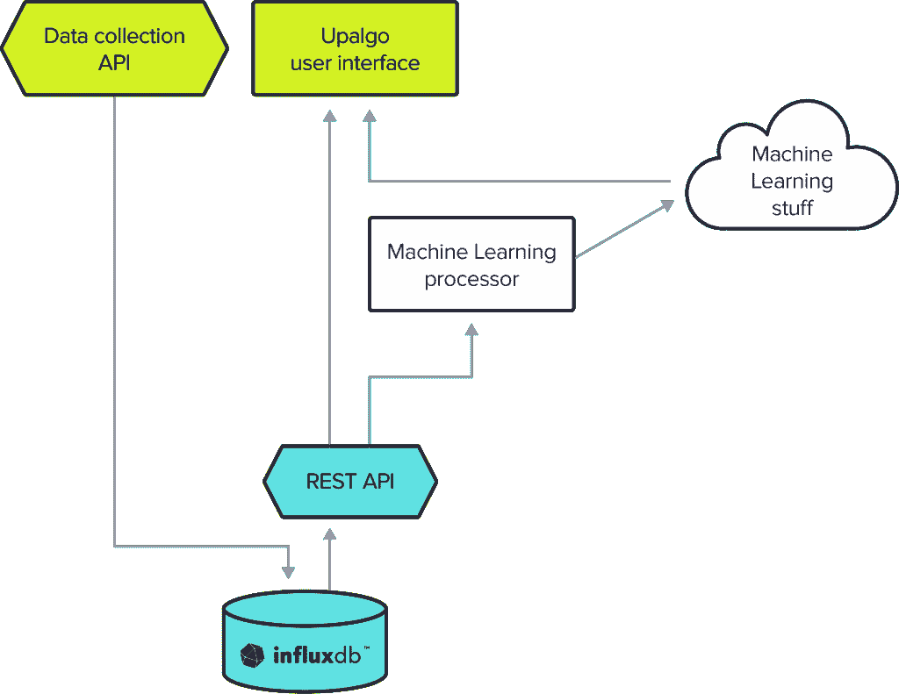
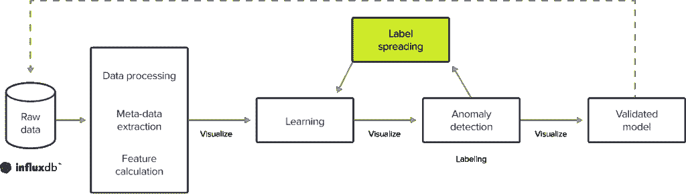

# 时间序列数据自动异常检测

> 原文：<https://thenewstack.io/automate-anomaly-detection-for-time-series-data/>

数千亿个传感器每天都会产生大量的时间序列数据。

 [杰森·迈尔斯

Jason 是 InfluxData 的技术营销作家。他获得了芝加哥罗耀拉大学的爱尔兰现代史博士学位。从那以后，他利用自己的写作技巧为一系列初创公司和科技公司创作内容。](https://www.linkedin.com/in/jrmyers) 

公司收集的大量数据使得分析和收集见解变得非常困难。机器学习大大加快了时间序列数据分析的速度，因此公司可以了解他们的时间序列数据并采取行动，以推动重大创新和改进。

目前的估计预测，到 2025 年将有超过 1 万亿个传感器产生时间序列数据。为了帮助公司处理所有这些数据， [Ezako](https://ezako.com/) ，一家专注于人工智能(AI)和时间序列数据的法国技术公司，创建了 Upalgo 平台。Upalgo 是一个 SaaS 平台，它将机器学习应用于时间序列数据，通过自动化异常检测和标记的过程，然后迭代这些过程以改进数据模型，使其更加有用和高效。

该公司主要面向航空航天、汽车和电信行业，但也可以服务于任何处理大量传感器、遥测和物联网(IoT)数据的垂直行业。

## 体系结构

Upalgo 平台依赖 [InfluxDB](https://www.influxdata.com/?utm_source=vendor&utm_medium=referral&utm_campaign=2022-08_spnsr-ctn_cs-ezako_tns) 作为其数据存储。该公司在发现 InfluxDB 之前尝试了几种选择，包括关系数据库、NoSQL 数据库以及 Hadoop 和 OpenTSDB 的组合，这两种数据库本质上是一种 NoSQL 数据库，对时间序列数据进行了一些调整。

这些解决方案都没有提供 Upalgo 所需的处理时间序列数据的速度和能力。关键的决策因素包括 InfluxDB 的窗口特性及其活跃的开发者社区。Ezako 团队认为这是一个重要的资源，可以从在相同领域工作的人那里获得时间序列特定问题的帮助。使用 InfluxDB 使 Ezako 的数据科学家能够专注于数据科学和机器学习，而不是时间序列存储。

作为一个高层次的概述，Upalgo 平台从一个数据收集 API 开始，它将数据发送到 InfluxDB。因为 Upalgo 需要与许多不同的系统交互，Ezako 团队构建了一个 REST API，作为一个公共层，可以轻松连接到其他技术堆栈。通过 API 层，Upalgo UI 可以从 InfluxDB 中查询数据以进行可视化。机器学习处理层可以访问相同的数据进行分析，并将处理后的数据写入 InfluxDB 桶，进行更深入的分析和微调数据模型。

## 机器学习挑战

即使 InfluxDB 作为 Upalgo 平台的核心，在将机器学习应用于时间序列数据时，仍然存在一些固有的挑战。

一个是连续数据摄取。系统昼夜不停地收集数据，从最基本的层面来说，这会消耗一定数量的处理资源。ML 从业者需要意识到这种资源消耗，并将其考虑到将同时运行的其他流程中，以便他们可以优化连续和非连续工作负载，从而提供预期的用户体验。

与第一个挑战相关的是阅读密集型学习过程。构建数据模型需要大量数据，这意味着非常大的读取操作。最重要的是，学习过程需要快速，同时与其他过程共享资源。这就是 REST API 发挥作用的地方，因为它将任何读取问题整合到一个技术层中，而不管其上运行的是什么进程或系统。

## 异常检测

Upalgo 平台的关键特性之一是异常检测。该平台为建模和异常检测提供了许多不同的算法，因此用户可以根据其数据和业务目标选择最佳选项。

然而，无论算法如何，机器学习都需要大量的数据。例如，要开始使用一类 SVM 或隔离森林算法构建异常检测模型，您至少需要一百万个数据点。在 60 点窗口上计算特征，这是秒或小时的标准，产生 15，000 个窗口供算法学习。实际上，这并不多，而且这只是一个系列的因素。

包含多个系列的模型需要为每个额外的系列增加一百万个数据点。因此，一个包含三个系列的模型需要 300 万个数据点来生成一个基本模型。有些算法甚至需要更多的数据。长短期记忆(LSTM)算法需要学习原始数据的特征，这意味着在学习阶段需要 500 万到 1000 万个数据点。

异常检测的一个重大挑战是缺乏数据的基线真实性。因此，可能会出现假阳性和假阴性。为了减轻这些异常，机器学习算法需要更多关于数据的信息。这就是标签的由来。

## 用机器学习标注数据

标签是数据集的额外信息。标签有助于算法了解更多的数据，从而使用户能够更好地利用这些数据。标签可以帮助机器学习的一种方式是从数据集中移除异常。这有助于为数据建立更真实的基线。

标注大型数据集是一项巨大的时间承诺。这也是训练机器学习算法的一个至关重要的方面，所以数据科学家花了很多时间来标记数据。Upalgo 自动识别异常，使数据科学家更快更容易地找到他们需要标记的东西。

该平台的标注功能还允许用户手动识别数据集中的多个标签。然后，它使用人工智能来检查该系列的其余部分，并找到类似的模式。这将生成更多的标签，从而产生更多的序列信息和更准确的数据模型。

## 让时间序列数据有价值

在整个异常检测和标记过程中，Upalgo 为使用 InfluxQL 从 InfluxDB 查询数据的用户生成数据可视化，因为它可以快速返回大型数据集。

Ezako 致力于改善时间序列数据的机器学习，这大大加快了 ML 数据科学家面临的关键流程。InfluxDB 提供后端功能，使 Ezako 团队能够专注于数据科学，而不是基础架构，并提供客户想要的最终用户体验。

<svg xmlns:xlink="http://www.w3.org/1999/xlink" viewBox="0 0 68 31" version="1.1"><title>Group</title> <desc>Created with Sketch.</desc></svg>