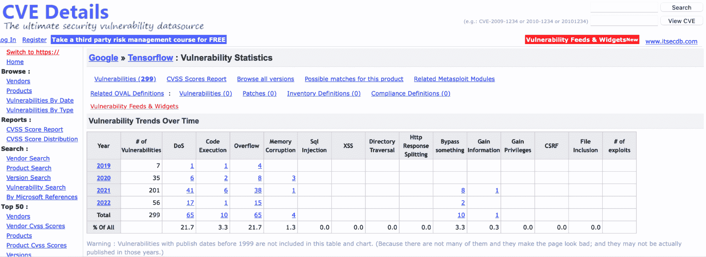

# 自动对 Python 库依赖项进行质量和安全检查

> 原文：<https://thenewstack.io/automate-quality-security-checks-for-python-library-dependencies/>

 [弗里多林·波科尔

弗里多林是一位热情的巨蟒主义者。他在 Red Hat 的 CTO 办公室从事可扩展平台和机器学习应用方面的工作。自然爱好者。](https://www.linkedin.com/in/fridex/) 

开源背后的力量允许社区在世界范围内创建和共享复杂的软件库和软件包。随着这种强大的能力而来的是确保包保持健康状态的巨大责任，这通常需要领域知识和专业技能。

在本文中，我们将着眼于集中积累这样的知识，并在程序构建期间应用它。这种方法最好的代表是开源 Python 云解析器 Thoth ，合著者 Fridolín 是这个项目的开发者和提交者。Thoth 的解析引擎利用了 Python 生态系统中的多种资源，并指导开源 Python 软件的消费者构建具有安全、高性能和兼容依赖性的应用程序。

一个经典的 xkcd 漫画， [#2347](https://xkcd.com/2347/) ，揭示了每个应用程序依赖是多么重要。不幸的是，开源软件的历史提供了大量由不充分的测试和审查导致的危险的例子，包括 JavaScript 的**NPM**和[最近的 Log4j 问题](https://lwn.net/Articles/878570/)中的[错误。为了保护开源开发者和用户，计算机公司正在讨论收集关于开源软件和生产这种软件的社区的知识。](https://lwn.net/Articles/880869/)

在本文中，我们将逐步介绍典型的 Python 构建，并了解工具如何自动化检查依赖项的健壮版本的过程。

## Python 打包

 [安迪·奥兰姆

Andy Oram 撰写和编辑关于计算的许多方面的作品，从博客帖子到长篇书籍。多年来，安迪在奥莱利联合公司做编辑。他在那里的主题涵盖了广泛的计算机技术。](https://www.linkedin.com/in/andyo) 

大多数 Python 开发者都熟悉 [Python 包索引](https://pypi.org/) (PyPI)。PyPI 是获得开源 Python 包的主要地方。安装 Python 依赖项最常用的工具是 [pip](https://pypi.org/project/pip) ，它解析应用程序的依赖项，并将它们安装在所需的环境中。让我们来看看这个解决过程。

resolution 中的第一个任务是列出应用程序导入的包，并确定它们有哪些依赖项。包是以级联的方式被发现的，因为每个包可能需要被称为**传递**依赖的其他包。

接下来，解析器必须确定要安装每个包的哪个版本。许多 Python 开发人员满足于让 pip 安装每个包的最新稳定版本，这是默认行为。但是有许多理由来推翻这个最新版本的选择。开发人员可能会指定一个特定的版本或一系列可接受的版本，因为最新版本的某些内容与应用程序不兼容。

Pip 还足够智能，可以确定某些包需要特定版本的依赖关系才能保持稳定。有时 pip 甚至在检查完一个依赖项后返回，并切换依赖它的包的版本。虽然这种复杂的解析过程可以帮助开发人员自动找出哪些依赖项一起工作，但有时也会导致不希望的下载。

其他开源工具，如 [Pipenv](https://pypi.org/project/pipenv/) 、[poem](https://pypi.org/project/poetry)和 [pip-tools](https://pypi.org/project/pip-tools/) ，也可以管理一个**锁文件**，该文件存储了一个应用程序所需的所有依赖项的版本列表。通过创建锁文件，开发人员可以确保可重现的安装，这对于防止在 DevOps 环境中频繁重建应用程序时出现不愉快的意外非常有价值。

我们提到的所有工具都在客户机上执行解析过程，随后在客户机上安装应用程序依赖项。到目前为止，Python 打包没有公开 PyPI 上的依赖信息，这意味着工具必须在安装过程中实际下载工件并获得依赖信息。

硬件和其他要求也会影响分辨率。Thoth 项目开始主要是为了满足机器学习程序的特殊要求，这些程序可能需要 GPU。解析 [PyTorch](https://pytorch.org/) 和 [TensorFlow](https://www.tensorflow.org/) 这类热门库时，解析器要考虑可用的 CUDA、cuDNN 或 CPU 指令集。

如果目标环境不是隔离的，开发人员还应该考虑依赖项的安全性。在撰写本文时，[开源 TensorFlow 在 PyPI 托管的版本中有 299 个报告的漏洞](https://www.cvedetails.com/product/53738/Google-Tensorflow.html?vendor_id%3D1224)(见图 1)。当将 TensorFlow 安装为应用程序的直接依赖项时，如果任何依赖项(直接的或可传递的)的质量都很弱，应用程序就可能易受攻击或行为不当。在最坏的情况下，一个依赖项可能会从公开可用的资源中完全消失。

图 1:流行的 TensorFlow 库上的 CVE 数据库。

## 汇总关于依赖关系的信息

为了避免不必要的下载，可以从单独的包中提取依赖信息，并直接在 PyPI 上公开。[最近在仓库的 API 端点](https://github.com/pypa/warehouse/pull/9972)上公开静态轮元数据的努力支持这一特性。

另一个可能的解决方案是监控新的包发布，并且[从轮子或者甚至源发布中提取依赖信息](https://developers.redhat.com/articles/2022/01/14/extracting-dependencies-python-packages)。如果提取的信息以期望环境的可查询形式存储，解析器可以使用预先聚集的依赖性数据来[解析目标环境的应用需求](https://dev.to/fridex/why-pypi-doesnt-know-your-projects-dependencies-but-thoth-does-4eji)。如果客户端发送关于所使用的运行时环境的信息，则该解析器不需要在客户端机器上运行。

在解析过程中节省的时间可以用来寻找满足期望质量标准的一组已解析的软件包。在这种情况下，解析过程可以得出依赖关系，这些依赖关系不是基于依赖关系图的最新可能版本(如在 pip 的情况下)，而是不易受已知漏洞影响的版本，在目标环境中运行良好，并且由[经过良好测试的稳定库组合](https://developers.redhat.com/articles/2021/09/17/resolve-python-dependencies-thoth-dependency-monkey)组成。

[advisory-db](https://github.com/pypa/advisory-database) ，由 Python Packaging Authority 维护，提供有关开源软件中漏洞的信息。这些信息以 YAML 文件的形式提供，很容易被机器使用。利用这个数据库的工具的一个例子是 [pip-audit](https://pypi.org/project/pip-audit) ，它审计环境中存在的包。

## 在解析过程中使用依赖关系信息

advisory-db 也是一个有价值的安全信息源，可以直接插入到解决过程中。在这种情况下，解析器可以立即解析不容易出现已知漏洞的应用程序依赖性。

与 pip 中实现的解析器使用回溯算法来解析应用依赖不同，[透思在云解析器中的解析过程是一个马尔可夫决策过程(MDP)](https://thoth-station.ninja/docs/developers/adviser/introduction.html) 。解决过程满足基本的马尔可夫性质:解决过程的任何未来状态只取决于当前状态和未来采取的行动，而不取决于前面行动的序列。Thoth 的解析器的生产部署使用[时间差异学习来解析应用依赖](https://developers.redhat.com/articles/2021/11/17/customize-python-dependency-resolution-machine-learning)。

解析过程中的状态由三个主要属性定义:基于到目前为止在依赖图中完成的遍历的已解析的依赖集、待解析的依赖集以及定义给定状态质量的分数。在最终状态中没有任何未解决的依赖关系的状态(基于 MDP)可用于产生锁文件。

解析器在内部保存在应用程序依赖图的遍历期间生成的多个状态。它们是基于依赖关系图(搜索空间)中可以完成的动作生成的，从而解决了未解决的依赖关系。

考虑到被解决的依赖关系的质量，这些动作被正面或负面地评分。如果依赖性不满足期望的标准(例如，依赖性具有弱点，但是所解析的依赖性集合必须没有弱点)，则解析过程中的给定动作可被标记为无效，使得解析器找到将满足期望质量的另一个解析路径。

为了创建解决过程的可插入接口，基于解决管道对动作进行评分。该管道由多个单元组成，这些单元对要采取的行动进行评分，并可以额外调整解决流程。这些调整可以包括修复基础或过度完善的问题，在这些问题上，开发人员对特定版本的要求过于宽松或过于严格。

进一步的调整包括向依赖关系图中插入依赖关系，从依赖关系图中移除依赖关系，以及替换依赖关系图中的一些节点(例如，为启用 gpu 的环境解析 [tensorflow-gpu](https://pypi.org/project/tensorflow-gpu/) ，而不是 [tensorflow-cpu](https://pypi.org/project/tensorflow-cpu/) )。

为了创建解析过程的高级接口，解析器允许开发人员在名为**处方**的 YAML 文件中声明管道单元。[规定为解决过程](https://developers.redhat.com/articles/2021/09/22/thoth-prescriptions-resolving-python-dependencies)提供了一个声明性的接口，并指导解决者。Project Thoth 在其[处方](https://github.com/thoth-station/prescriptions)库中提供了开源 Python 项目的处方。这个存储库充当关于开源 Python 包的知识库，并在解析过程中直接使用。任何人都可以通过打开被审查的拉请求来为这个共享数据库做贡献。

下面是一个处方的例子，可以让你对这个开放数据库中的知识种类有所了解:

[浏览](https://github.com/thoth-station/prescriptions/blob/d1bb4fb2616d578482d3c8932457740407d815a6/prescriptions/sc_/scikit-spark/gh_updated.yaml)[处方库](https://github.com/thoth-station/prescriptions)可以找到更多的处方。

## 针对目标环境的建议

从上一节的例子中可以看出，一些规定还包括 Python 打包标准之外的信息。例如，Python 打包标准目前不包括关于 CUDA 或 cuDNN 版本的信息，而这些信息应该存在于环境中以解析某个包。该信息位于车轮中使用的[标签之外。](https://peps.python.org/pep-0425/)

为了允许这样的解析，Thoth 的解析器接受关于应用程序运行时环境的信息。例如，Thoth 的解析器可以[选择托管在](https://github.com/thoth-station/prescriptions/blob/d1bb4fb2616d578482d3c8932457740407d815a6/prescriptions/_indexes/pytorch_cu111.yaml) [PyTorch 索引上的 PyTorch](https://download.pytorch.org/whl/cu111/) 的特定 CUDA 11.1 版本，用于 CUDA 11.1 可用的环境。运行应用程序所需的其他依赖项可以从另一个索引中获得，比如 PyPI。

开发人员还可以提供关于用作给定应用程序运行时环境的基本容器映像的信息。在这种情况下，解析器可以考虑对容器映像的[分析(在 Thoth 的后台完成)，并解析应用程序将在其中执行的容器化环境的需求。](https://developers.redhat.com/articles/2021/11/25/build-and-extend-containerized-applications-project-thoth)

Thoth 可以额外考虑对本地依赖的需求(比如运行时环境中存在的特定 RPM)，环境中已经存在的 Python 包或者某个 ABI 的可用性。在分析容器化环境的内容时，解析器还可以发现 Python 生态系统之外的容器化环境中可能存在的问题或漏洞(例如，由于 [Quay Clair](https://www.redhat.com/en/topics/containers/what-is-clair) 而报告的 RPM 包中的漏洞)。

关于基本容器图像的信息是可选的。如果没有提供基本容器映像，解析程序将只考虑客户端配置文件提供的关于运行时环境的信息。该解决方案类似于 pip、Pipenv 或 poem，但它也指导用户解决应用程序依赖关系的质量。

## 没有依赖性混淆的安全交叉索引解析

为了正确地组合不同来源的 Python 包索引，Thoth 的解析过程将每个包索引视为一个单独的包来源。Python 打包工具，如 pip，将多个包索引视为镜像，不允许开发人员在包级别指定源代码。为了避免这种限制，开发人员可以使用工件的散列来指定包的需求，但是这种解决方案不直观并且容易出错。将多个 Python 包索引视为镜像可能会导致[依赖性混乱](https://developers.redhat.com/articles/2021/12/21/prevent-python-dependency-confusion-attacks-thoth)，这可能会在供应链安全中产生[严重问题。](https://medium.com/@alex.birsan/dependency-confusion-4a5d60fec610)

如果 Python 索引托管了许多 Linux [标准](https://github.com/pypa/manylinux)之外的不同构建(比如前面提到的 PyTorch 的 CUDA 11.1 构建)，解析过程会确保基于所需的软件包方面使用所需的源代码，而不仅仅是基于可用构建的版本号。

## 使用和贡献 Python 云解析器

Thoth Python cloud resolver 是一个由 Red Hat 赞助的社区项目。该解析器对社区可用，因此任何人都可以使用它。

与 Thoth 解析器交互的主要集成点是 [Thamos 命令行接口](https://pypi.org/project/thamos/) (CLI)和[jupyterlab-requirements](https://pypi.org/project/jupyterlab-requirements/)。CLI 管理开发人员的环境，并从终端联系 Thoth 的解析器。另一方面，jupyterlab-requirements 是对 Jupyter Notebook 的扩展，有助于直接管理笔记本中的依赖关系。

查看关于如何设置您的环境和使用 Thoth cloud resolver 的教程[。本教程介绍了一些安全方面的内容。](https://redhat-scholars.github.io/managing-vulnerabilities-with-thoth/managing-vulnerabilities-with-thoth/index.html)[扩展视频教程](https://www.youtube.com/watch?v=2CFkHlSewKY)通过演示带您了解旋变器的一些关键特性。

如果您想为我们的社区做出贡献，请随意添加可以提高 Python 开源质量的新方法。Python 云解析器的实现是[开源的，Thoth 团队接受社区贡献](https://github.com/thoth-station/)。我们希望各地的 Python 程序员都会发现 Thoth 的解析器很有价值。

<svg xmlns:xlink="http://www.w3.org/1999/xlink" viewBox="0 0 68 31" version="1.1"><title>Group</title> <desc>Created with Sketch.</desc></svg>