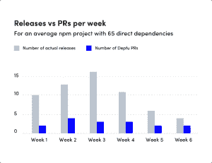

# 使用 Depfu 进行自动化依赖管理

> 原文：<https://thenewstack.io/automated-dependency-management-with-depfu/>

如果有一位同事定期向您发送拉取请求，以帮助您掌握依赖关系更新，那会怎么样？这些拉取请求包含了轻松进行更新所需的所有信息吗？

这就是 Depfu T1 背后的理念，它是一个自动化的依赖管理服务，从 Ruby on Rails 生态系统发展而来，但也发展到包括 JavaScript 和 Elixer 项目。

它最初向您发送三个简单的“拉”请求—首先发送安全更新。然后，当您合并或关闭一个时，它会发送另一个，但每次不会超过七个。

“拖延这一进程并说‘好吧，我们没有时间这样做’是非常容易的。我们有更重要的事情要做。联合创始人[简·克鲁蒂斯奇](https://github.com/halfbyte)说:“所以我们想做的是把它变成一个可以一直运行的东西，并集成到你的开发人员工作流程中。

哥本哈根的合作伙伴 [Florian Munz](https://github.com/theflow) 和德国汉堡的 [Krutisch](https://github.com/halfbyte) 于 2016 年开始在 Depfu 上工作。他们在柏林有朋友，他们开发了一个 JavaScript 的自动化依赖管理工具 [Greenkeeper](https://greenkeeper.io/) ，凭借 Depfu 二人组在 Ruby on Rails 方面的长期经验，他们认为为 Ruby 生态系统做一些类似的事情会很酷。

“拖延这一过程并说‘好吧，我们没有时间了’是非常容易的。我们有更重要的事情要做。所以我们想做的是把它变成一个可以一直运行的东西，并集成到你的开发者工作流程中，”Krutisch 说。

您只需将 Github 或 Gitlab repo 连接到 Depfu，它就会在后台运行，检查您的依赖项。你选择你给予德富访问的回购协议；您不必添加任何文件或更改任何设置。与回购协议的所有交互都通过 API 进行。通过 Gitlab，它为回购协议安装了一个机器人用户和一个提供相关变更信息的 webhook。

“以前，我总是在早上第一件事就是运行[bundle outside](https://bundler.io/man/bundle-outdated.1.html)，但实际上是由我来记忆。独立开发者罗宾·梅纳说:“有了德普福，我意识到我可以马上采取行动。

## Ruby 的悠久历史

自 2006 年以来，Munz 和 Krutisch 一直致力于 Ruby on Rails 应用程序的开发。

“我们真的很喜欢这个生态系统。我们知道这不是最新的热点，但在这一点上，我认为这是相当成熟的技术，”Krutisch 说。

“大部分工作由运行整个前端的单片 Rails 应用程序完成，但也在后端运行一些工作程序，如调度或更新，从不同的包存储库中获取所有信息以获得所有更新信息等。”

然后，它使用受支持语言中的特定小代码——例如，对于 Node.js，对于 npm 包，它运行一点 JavaScript 来更新依赖文件。

“因为我们想确保我们没有做与原始应用程序不同的事情，你知道，原始包管理器会做的事情。因此，这将是一点 JavaScript，一点灵丹妙药，以及未来将出现的任何语言，”他说。

“应用程序运行在一些非常简单的服务器上，出于安全原因，我们有几个小服务试图封装一些流程，因为我们有时需要执行来自客户存储库的代码。这可能是一个安全风险，因为我们无法真正控制在那里执行什么样的代码。例如，这就是包管理器、elixir 和 Ruby 工作方式的缺点，因为依赖关系实际上是在 Ruby 或 Elixir 本身的文件中定义的。因此，为了正确地更新它，我们需要在某种隔离的环境中运行它。本质上就是这样。"

## 寻找合适的位置

随着竞争对手被收购以及他们的服务被免费提供，德富正在一个快速发展的空间中竞争。它最明显的竞争对手是 GitHub 本身，GitHub 去年收购了[dependent bot](https://dependabot.com/)，并让[提供了覆盖用 Ruby、Python、Java 编写的依赖关系的](https://duo.com/decipher/github-brings-automated-fixes-with-dependabot)。NET 和 JavaScript。

其第二大竞争对手[renewal](https://renovatebot.com/)被 WhiteSource 收购。与此同时，他们在柏林的朋友创造了《绿色守护者》,并将火炬传递给了 Snyk。这三个系统显然都被整合进了更大的、以安全为中心的系统中。

这让德普富试图找到自己的定位。

“我们现在基本上是在与许多公司竞争，我认为除了 Dependabot 之外，这些公司可能没有巨大的动力在这些产品上投入额外的精力，”Krutisch 说。

“我们仍然有动力让我们的产品变得更好，因为我们知道，我们可能会抓住一些人，他们拥有其他替代品所不具备的特性。”

它已经决定专注于企业内部版本，并正在与一些较大的客户合作。

他说，这些客户要求的一件事是，不仅能够更新依赖关系，而且能够通过拉请求更新运行时本身。

“这非常复杂，因为依赖关系并不仅仅是在一个文件中定义的。…对于这些运行时或引擎更新，可以在很多地方定义它。所以你有一个 Docker 容器需要运行正确的版本。您有需要被配置来运行正确版本的 CI，然后您可能有一个为您的开发环境定义运行时版本的文件。因此，这都是非常具体的客户，所以我们正试图想出一种方法，灵活而快速地更新所有这些文件一次。所以你可以得到一个拉取请求，它包含了让你进入一个新版本的所有东西，并使推出这些新版本的速度快得多，”他说。

这很难测试，因为与较小的库相比，一些语言的运行时更新通常一年只有几次，“所以我们没有太多的机会来测试，”他说。

它还想支持更多的语言，比如 PHP 和 Go。

“但我们并不完全清楚 Java 上的依赖性管理的当前黄金标准到底是什么，所以我们肯定会关注这些事情，”他说。

Snyk 是新堆栈的赞助商。

图片由 Pixabay 的 Bill Kasman 提供

<svg xmlns:xlink="http://www.w3.org/1999/xlink" viewBox="0 0 68 31" version="1.1"><title>Group</title> <desc>Created with Sketch.</desc></svg>