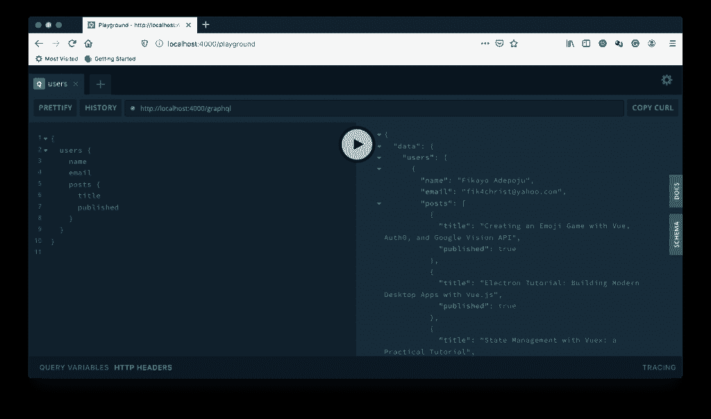
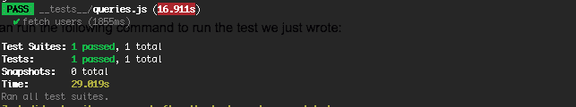
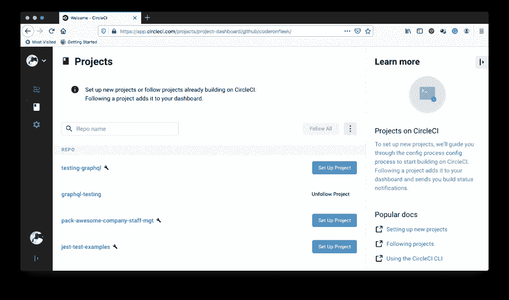
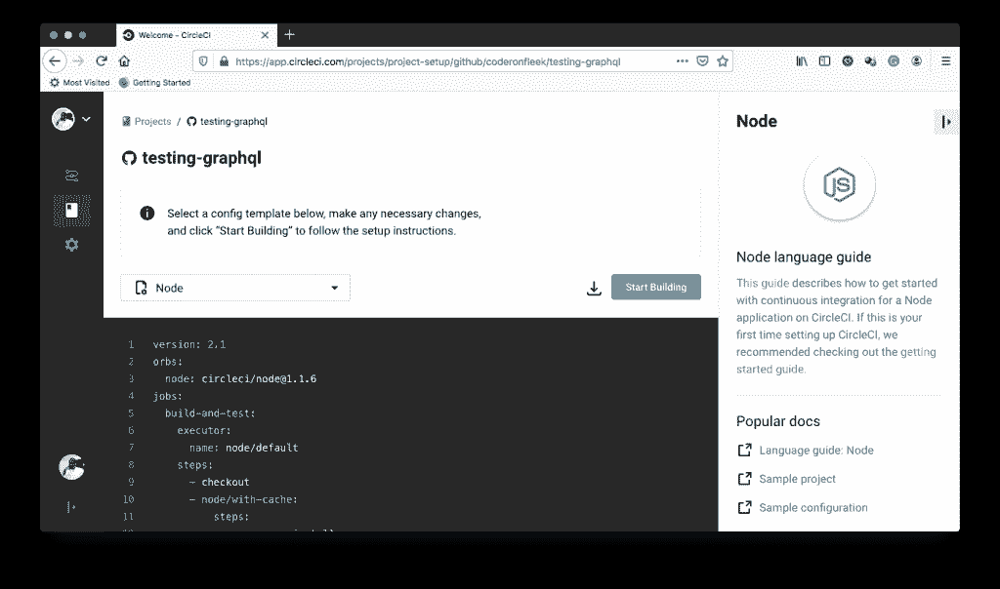
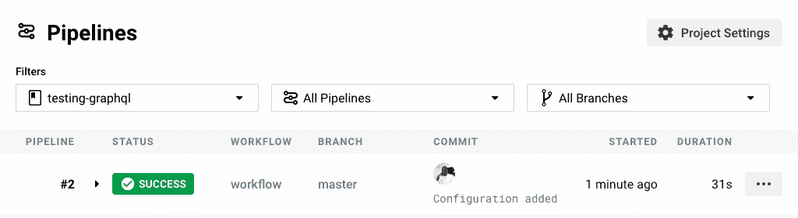
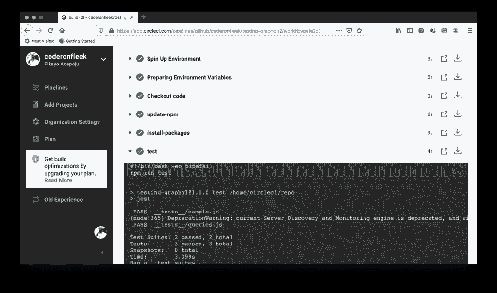

# GraphQL APIs 的自动测试

> 原文：<https://thenewstack.io/automatic-testing-for-graphql-apis/>

[](https://www.linkedin.com/in/fikayoadepoju/)

[Fikayo Adepoju](https://www.linkedin.com/in/fikayoadepoju/)

[Fikayo 是一名全栈开发者和作者，拥有十多年开发 web 和移动解决方案的经验。他目前是 Tech Specialist Consulting 的软件主管，为 Packt 和 Udemy 开发课程。他对教学有着强烈的热情，并希望成为一名全职作家。](https://www.linkedin.com/in/fikayoadepoju/)

[](https://www.linkedin.com/in/fikayoadepoju/)[](https://www.linkedin.com/in/fikayoadepoju/)

GraphQL 正迅速成为开发人员使用多年的传统 REST 架构 API 的首选替代品。它使前端开发人员能够通过单个端点只查询他们需要的内容。由于它的众多好处，后端开发人员正在采用行业标准策略，以确保他们在 GraphQL 中构建流畅和可伸缩的 API。

其中一个标准是拥有一个经过良好测试的 GraphQL API。在这篇文章中，我们将看看如何测试 GraphQL APIs，并使用 CircleCI 自动化测试过程。

要跟进这篇文章，您需要设置以下内容:

*   GraphQL 的基础知识(见我们最近的帖子，[graph QL 介绍](https://thenewstack.io/introduction-to-graphql/))
*   [系统上安装的 Node.js](https://nodejs.org/) (您可以通过在终端上运行 node -v 命令来打印出安装的 Node.js 的版本，从而确认这一点)
*   安装在您的系统上的 git(您可以通过在您的终端上运行 Git 命令来确认这一点；这应该会打印出可用的 git 命令)
*   GitHub 的一个账户
*   一个循环账户

## 创建 GraphQL 服务器

我们的第一个任务是使用 Node.js 建立一个简单的 GraphQL 服务器

现在通过运行下面的代码进入项目根目录:

然后运行下面的命令快速设置你的 package.json 文件:

这将快速搭建一个基本的 package.json 文件。

要设置我们的 GraphQL 服务器，我们需要以下软件包:

* express:创建我们的 ExpressJS 节点应用程序
* graphql:用于 Node.js 的 GraphQL npm 包
* express-graphql:用于 graphql 的 ExpressJS 中间件

运行以下命令来安装这些软件包:

```
npm install  --save express graphql express-graphql

```

完美！

一旦安装了这些包，我们就可以开始构建应用程序了。

我们将构建一个 API，类似于发布多个用户帖子的博客所使用的 API。

## 定义 GraphQL 模式

让我们通过首先定义我们的 GraphQL 模式来开始组装应用程序。

在项目的根目录下，创建一个名为 src 的文件夹；这是我们所有应用程序逻辑的位置。

在 src 文件夹中，创建一个名为 schema.js 的文件，并将以下代码放入其中:

```
/* src/schema.js */

const  {  buildSchema  }  =  require("graphql");

const schema  =  buildSchema(`
    type  Query  {
        users:  [User!]!,
        user(id:  Int!):  User!
    }

    type  User  {
        id:  ID!
        name:  String!
        email:  String
        posts:  [Post!]
    }

    type  Post  {
        id:  ID!
        title:  String!
        published:  Boolean!
        link:  String
        author:  User!
    }
`);

module.exports  =  schema;

```

在上面的文件中，我们定义了两个自定义类型:User 和 Post。它们分别代表博客用户和他们的帖子。

我们还将查询类型定义为有两个查询。用户查询返回用户数组，用户查询返回 id 与参数匹配的单个用户。

最后，我们在最后一行导出模式。

## 模拟数据

因为这不是一个生产应用程序，所以我们不会使用真实的数据库来存储数据。相反，我们将使用 mongodb-memory-server 创建一个对 [MongoDB](https://www.mongodb.com/) 数据库的模拟。这将允许我们创建和使用 MongoDB 的内存实例。在生产中，你可能希望[建立一个实际的 MongoDB 实例](https://www.codeproject.com/Articles/1231623/How-to-Configure-Node-js-and-MongoDB-for-Productio)或者使用一个 MongoDB 服务，比如 [Mlab](https://mlab.com/) 。

让我们通过运行下面的命令来安装所需要的包:

```
npm install  --save mongodb mongodb-memory-server

```

一旦软件包安装完成，下一步是创建一个文件来保存我们的模拟数据。

在 src 文件夹中，创建一个名为 data.js 的文件，并将以下代码放入其中。

```
/* src/data.js */

const Users  =  [
  {
    id:  1,
    name:  "Fikayo Adepoju",
    email:  "fik4christ@yahoo.com",
    posts:  [
      {
        id:  1,
        title:  "Creating an Emoji Game with Vue, Auth0, and Google Vision API",
        published:  true,
        link:
          "https://auth0.com/blog/creating-an-emoji-game-with-vue-auth0-and-google-vision-api/",
        author:  1
      },
      {
        id:  2,
        title:  "Electron Tutorial: Building Modern Desktop Apps with Vue.js",
        published:  true,
        link:
          "https://auth0.com/blog/electron-tutorial-building-modern-desktop-apps-with-vue-js/",
        author:  1
      },
      {
        id:  3,
        title:  "State Management with Vuex: a Practical Tutorial",
        published:  true,
        link:
          "https://auth0.com/blog/state-management-with-vuex-a-practical-tutorial/",
        author:  1
      }
    ]
  },
  {
    id:  2,
    name:  "John Doe",
    email:  "john@company.com",
    posts:  [
      {
        id:  4,
        title:  "Build a CI powered RESTful API with Laravel",
        published:  true,
        link:
          "https://circleci.com/blog/build-a-ci-powered-restful-api-with-laravel/",
        author:  2
      },
      {
        id:  5,
        title:  "Automate your Nuxt.js app deployment",
        published:  true,
        link:  "https://circleci.com/blog/automate-your-nuxt-js-app-deployment/",
        author:  2
      }
    ]
  },
  {
    id:  3,
    name:  "Jane Paul",
    email:  "jane@company.com",
    posts:  []
  }
];

module.exports  =  {
  Users
};

```

上面的文件导出了一个对象，其中包含一组用户数据。每个用户对象还包含该用户帖子的数组。这是我们将用来引导内存中 MongoDB 实例的数据。

模拟数据的下一步是使用 mongodb-memory-server 包设置数据库实例。在 src 文件夹中创建一个名为 database.js 的文件，并将以下代码放入其中。

```
/* src/database.js */

const  {  MongoMemoryServer  }  =  require("mongodb-memory-server");
const  {  MongoClient  }  =  require("mongodb");
const data  =  require("./data");

let database  =  null;

const mongo  =  new MongoMemoryServer();

async function startDatabase()  {
  const mongoDBURL  =  await mongo.getConnectionString();
  const connection  =  await MongoClient.connect(mongoDBURL,  {
    useNewUrlParser:  true,
  });

  //Seed Database
  if  (!database)  {
    database  =  connection.db();
    await database.collection("users").insertMany(data.Users);
  }

  return database;
}

async function stopDatabase()  {
  await mongo.stop();
}

module.exports  =  {
  startDatabase,
  stopDatabase,
};

```

在上面的文件中，我们导出了一个 startDatabase 函数来设置内存中的 MongoDB 数据库。

它检查数据库的实例是否已经存在。如果没有，它用一个 users 集合引导它，并用我们前面在 data.js 文件中定义的 Users 数组作为集合的种子。

厉害！

## 定义我们的解决方案

接下来的任务是定义查询的解析器。还记得我们定义了两个查询 users 和 user，分别返回用户数组和单个用户。

在 src 文件夹中，创建一个名为 resolvers.js 的文件，并放入以下代码。

```
/* src/resolvers.js */

const resolvers  =  {
  users:  async  (_,  context)  =&gt;  {
    const  {  db  }  =  await context();
    return db
      .collection("users")
      .find()
      .toArray();
  },
  user:  async  ({  id  },  context)  =&gt;  {
    const  {  db  }  =  await context();
    return db.collection("users").findOne({  id  });
  }

};

module.exports  =  resolvers;

```

在上面的文件中，我们导出了一个包含两个解析器的对象——每个查询一个解析器。我们还使用了上下文对象，我们将在后面设置它。

## 为测试准备应用程序

此时您可能会问，“我们甚至还没有连接好 GraphQL 服务器来启动和接收请求，为什么还要设置测试？”

答案如下。

大多数开发人员在同一个文件中设置服务器应用程序并监听连接；这个文件是应用程序的入口点，如下所示。

|  | //设置服务器constexpress=要求(“express”)；constapp=express()/*更多服务器逻辑*///监听一个端口 const 端口 = 进程 。 env 。 端口&#124;&#124;【4000】； app 。 听 ( 口)；控制台控制台。 日志(`的🚀  服务器 就绪athttp://localhost:$ { port }/graph QL `)； |

但是，为了测试我们的 GraphQL 端点，服务器设置逻辑和我们监听端口的部分需要在不同的文件中。一个文件保存我们的服务器逻辑并导出服务器应用程序，另一个文件启动我们的应用程序。

这样，我们可以将我们的服务器导入到我们的测试文件中，并在其上运行适当的测试。

在我们创建这些文件之前，继续安装 graphql-playground-middleware-express 模块，它帮助我们建立一个测试 graph QL 端点的一流平台:

```
npm install graphql-playground-middleware-express

```

现在，让我们为 GraphQL 服务器创建这些文件。在 src 文件夹中，创建一个名为 server.js 的文件，并将以下代码放入其中。

```
/* src/server.js */

const express  =  require("express");
const graphqlHTTP  =  require("express-graphql");
const schema  =  require("./schema");
const resolvers  =  require("./resolvers");
const  {  startDatabase  }  =  require("./database");
const expressPlayground  =  require("graphql-playground-middleware-express")
  .default;

// Create a context for holding contextual data (db info in this case)
const context  =  async  ()  =&gt;  {
  const db  =  await startDatabase();

  return  {  db  };
};

const app  =  express();

app.use(
  "/graphql",
  graphqlHTTP({
    schema,
    rootValue:  resolvers,
    context,
  })
);

//Graphql Playground route
app.get("/playground",  expressPlayground({  endpoint:  "/graphql"  }));

module.exports  =  app;

```

在上面的文件中，我们设置了 Node.js 应用程序、包含内存数据库实例的 GraphQL 上下文、服务器 GraphQL 端点和 GraphQL playground 端点。然后我们像预期的那样导出我们的应用程序。

下一步是创建启动服务器的文件。创建一个名为 index.js 的文件，并将以下代码放入其中。

|  | /* src/index . js */constapp=需求 ( )。/server ")；常量 端口 = 流程 。env。 端口&#124;&#124;【4000】； app 。 听 ( 口)；控制台控制台。 日志(`日志🚀  服务器 就绪athttp://localhost:$ { port }/graph QL `)； |

在上面的文件中，我们通过导入我们的服务器并监听一个端口来设置启动脚本。

我们的应用程序现在可以运行了。让我们向 package.json 添加一个启动脚本来运行应用程序。

```
/* package.json */
…..
“scripts”  :  {
    “start”  :  “node src/index.js”
}

```

太好了！

现在让我们通过运行下面的命令来运行这个应用程序:

运行此命令后，您将看到控制台上记录的成功消息。要测试服务器是否正在运行，请导航到 http://localhost:4000/playground 打开 playground。在操场的查询窗口中，运行以下查询:

```
{
    users  {
        name
 email
        posts  {
              title
              published
        }
 }
}

```

这应该会给出如下所示的输出:



太好了！

现在，我们已经从视觉和功能上确认了我们的 GraphQL 服务器工作正常。

我们在这里不是因为我们想通过操场手动测试我们的端点。不，不，不。我们在这里是为了自动化测试，这是我们将在下一部分启用的。在此之前，请确保将此项目推至 GitHub 回购。在将代码推送到 repo 之前，设置一个. gitignore 文件来忽略 node_modules 文件夹。

## 设置测试脚本

我们希望向我们的应用程序添加测试，并包含一个测试脚本，每当我们将代码推送到 repo 时，该脚本都会运行我们的所有测试。很漂亮，对吧？让我们继续设置它。

首先，我们需要一个测试框架。我们将在这篇文章中使用的框架是 [Jest](https://jestjs.io/) 。

为什么开玩笑？因为它很容易设置(几乎不需要任何设置)，并且有一个流畅、易于理解的 API。

我们还需要一个测试 HTTP 端点的库，为此我们将使用 [Supertest](https://www.npmjs.com/package/supertest) NPM 库。Supertest 是一个易于使用的 HTTP 测试库，可以与任何测试框架无缝协作。

我们将结合 Jest 测试框架和 supertest HTTP 测试库来测试我们的 GraphQL 服务器。

让我们安装这两个库作为开发依赖项来开始:

```
npm install  --save-dev jest supertest

```

太好了！

一旦这些库安装完成，我们就可以开始编写测试了。

Jest 测试可以分组到一个名为 __tests__(两边都有双下划线)的特殊文件夹中，所以在项目的根目录下创建这个文件夹。

通过创建一个名为 sample.js 的文件，在该文件夹中创建一个示例测试，并向其中添加以下测试。

```
/* __tests__/sample.js */
test("A sample test",  ()  =&gt;  {
  expect(2).toBe(2);
});

```

接下来，通过运行以下命令全局安装 Jest:

```
npm install jest  --global

```

现在在项目的根目录下运行 jest 命令。这将运行测试，并在控制台上输出成功消息。

太好了！

现在我们已经确认 Jest 运行良好。

我们将创建另一个测试套件来测试我们的查询。这将测试用户查询，并检查它是否返回适当的状态代码、数据类型和用户数量。

在 __tests__ 文件夹中创建一个名为 queries.js 的文件，并放入以下代码:

```
/* __tests__/queries.js */
const app  =  require("../src/server");
const supertest  =  require("supertest");
const  {  stopDatabase  }  =  require("../src/database");

const request  =  supertest(app);

afterAll(async  ()  =&gt;  {
  await stopDatabase();
});

test("fetch users",  async  (done)  =&gt;  {

  request
    .post("/graphql")
    .send({
      query:  "{ users{ id, name} }",
    })
    .set("Accept",  "application/json")
    .expect("Content-Type",  /json/)
    .expect(200)
    .end(function  (err,  res)  {
      if  (err)  return done(err);
      expect(res.body).toBeInstanceOf(Object);
      expect(res.body.data.users.length).toEqual(3);
      done();
    });
});

```

在上面的文件中，我们导入了我们的服务器，并用它来建立一个带有 supertest 的请求对象。这允许 supertest 在内部将服务器绑定到一个端口。

然后，我们通过向/graphql 端点发送 POST 请求，用一些查询数据来查询它。
一旦我们得到响应，我们使用 Jest 来检查是否返回了适当的状态代码、数据的数据类型(预期是一个用户数组)以及我们在数据库中播种的用户的确切数量。

厉害！

现在，让我们设置测试脚本来运行我们的测试。就在 package.json 中的启动脚本下面，创建另一个名为 test 的脚本来运行 jest 命令，如下所示:

```
…..
“scripts”:  {
    “start”:  “node src/index.js”
    “test”:  “jest”
}

```

如果您已经有一个通过运行 NPM install–save-dev jest supertest 定义的测试脚本，请将其编辑为上面的内容。

现在您可以运行下面的命令来运行我们刚刚添加的测试:

您应该会在控制台中看到类似下图的屏幕。



太好了！

现在让我们自动化这个测试过程。

## 用 CircleCI 自动化我们的测试

为了开始我们的测试自动化，我们需要构建一个 CircleCI 将运行的[持续集成](https://circleci.com/continuous-integration/)管道。

管道将执行以下操作:

*   查看我们的知识库
*   安装所需的依赖项
*   运行我们所有的测试

为此，我们需要为 CircleCI 编写管道脚本，以获取、构建和运行管道。

创建名为的文件夹。circleci 并在其中创建一个名为 config.yml 的文件。

现在将下面的代码粘贴到里面。

```
version:  2.1
jobs:
  build:
    working_directory:  ~/repo
    docker:
      -  image:  circleci/node:10.16.3
    steps:
      -  checkout
      -  run:
          name:  update-npm
          command:  "sudo npm install -g npm@5"
      -  run:
          name:  install-packages
          command:  npm install
      -  run:
          name:  test
          command:  npm run test

```

上面的脚本导入一个适用于 Node.js 应用程序的 Docker 映像，从 repo 中签出我们的代码，安装所需的包，并运行我们的测试脚本。

现在提交您的代码并将其推送到您的 repo。

接下来，前往您的 [CircleCI 仪表盘](https://circleci.com/dashboard)，在**添加项目**部分添加项目。



在您的项目旁边(在本例中是 testing-graphql)，点击**设置项目**。

这将把你带到一个类似下面的页面。



现在点击**开始构建**。

这将打开一个对话框，询问您是否想要创建项目的一个新分支，并让它包含所显示的建议管道配置，或者您是否想要手动添加它。

点击**手动添加**以便 CircleCI 获取您刚刚推送到存储库的 config.yml 文件。

然后会弹出另一个对话框，询问您是否已经添加了配置文件，或者您想要下载一个。点击**开始建造**以确认你可以开始了。这将触发 CircleCI 使用项目中的配置文件运行您的管道。

如果您的所有测试都成功运行，您将会看到类似下面的屏幕。



现在点击进入构建过程，查看管道是如何运行的，并确认测试成功通过。您将看到一个类似于下图的屏幕。



厉害！

使用下面的代码向 queries.js 文件添加另一个测试。该测试检查服务器上不存在的事件查询，以查看是否返回了适当的状态代码

```
test("query that does not exist",  async  ()  =&gt;  {
  const response  =  await request
    .post("/graphql")
    .send({
      query:  "{ events{ id, name} }",
    })
    .set("Accept",  "application/json");

expect(response.status).toBe(400);  });

```

保存文件，提交代码，并再次推送到 repo 以查看您的管道运行。

## 结论

GraphQL 使前端和后端开发人员的生活变得轻松，因为它提供了一个非常灵活的 API 来查询。确保这些 API 经过良好的测试可以保持质量的完整性，并让开发人员放心——因为他们知道任何被推送的代码在部署之前都经过了验证。

编码快乐！

<svg xmlns:xlink="http://www.w3.org/1999/xlink" viewBox="0 0 68 31" version="1.1"><title>Group</title> <desc>Created with Sketch.</desc></svg>