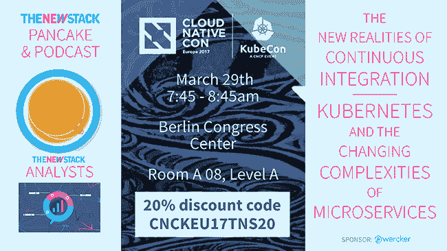

# 通过操作员实现 Kubernetes 集群操作的自动化

> 原文：<https://thenewstack.io/automating-kubernetes-cluster-operations-operators/>

 [提莫·德斯塔彭

提莫·德斯塔彭(Timo Derstappen)是 Giant Swarm 的首席技术官和联合创始人。他在构建可扩展的自动化云架构方面拥有多年的经验。](https://giantswarm.io/) 

在 [Giant Swarm](https://giantswarm.io/) ，我们全天候为客户管理 Kubernetes 集群，包括内部和云中。这意味着我们不仅仅是建立和移交一些东西，而是我们实际上要注意它的可操作性和随时更新。

目标是为最终用户提供一个无忧无虑的 Kubernetes 即服务(KaaS ),而不管底层基础设施如何。最重要的是，这意味着获得开箱即用的完整体验，在标准 Kubernetes 设置中任何可能的东西都应该可用，包括入口、网络策略 API、基于滚动的访问控制(RBAC)、alpha 特性，甚至特权访问(如果您的安全部门没有禁止的话)。

## 软多租户与硬多租户

对于大多数公司来说，这也意味着他们需要多租户，因为他们有不同的阶段、团队和项目，都应该获得 Kubernetes。

虽然我们鼓励使用名称空间、网络策略和 RBAC，并帮助整合，但我们知道“人们必须在自己的时间、以自己的方式、出于自己的原因来处理事情，否则他们永远不会真正来，”正如迪伊·霍克曾经写道的。

此外，Kubernetes 的许多软多租户功能仍在积极开发中，信任(特别是像[网络策略](https://kubernetes.io/docs/user-guide/networkpolicies/)这样的概念，对大多数企业安全性来说是新的)只会随着时间的推移而出现。

尤其是在企业环境中，软多租户通常是不够的。有不同的服务分类，每个分类都有自己的要求，最极端的是符合 [PCI 的](https://thenewstack.io/containers-pose-different-operational-security-challenges-pci-compliance/)和非 PCI 服务或隐私相关数据。环境需要分开，例如，生产集群不应与测试集群共享任何东西。

即使没有这些硬性要求，团队通常只是想在一个新的集群上尝试一些东西，或者在新的或即将推出的 Kubernetes 版本上测试运行他们的服务。

总而言之，大多数时候，我们在客户数据中心(以及他们的云帐户中)运行多个集群，就像我们在自己的数据中心一样。

## 介绍巨人网络

我们从一开始就知道，如果我们向其他人提供 Kubernetes，我们应该并且实际上也希望在我们的产品中使用相同的概念。

这意味着我们希望运行我们的一切，包括设置用户集群的基础设施组件、组成我们的 API 的[微服务](/category/microservices/)、外部监控，以及 Kubernetes 内部面向最终用户的 Kubernetes 集群。我们指的不仅仅是自托管，也就是说它们由一个 [kubelet](https://kubernetes.io/docs/admin/kubelet/) 管理，而是在一个成熟的 Kubernetes 集群内部。

为了减少讨论不同部分时的混淆，我们将外部的“主机”Kubernetes 称为“giant netes”(G8)，将面向最终用户的“来宾”集群称为 Kubernetes(k8)。

## 体系结构

在其基本形式中，G8s 是一个 Kubernetes 集群，运行在 Amazon Web Services 和裸机上。本概述的重点是裸机部署。

除了 G8s masters，控制平面还包含几组部署，包括基础设施服务( [Vault](https://www.vaultproject.io/) 、 [etcd](https://github.com/coreos/etcd) 、…)、监控和巨大的 Swarm API。后者由一组微服务组成，集群管理员可以通过这些微服务为他们的用户创建、管理和销毁 Kubernetes 集群。最后，控制平面还包含来宾 Kubernetes 集群的主节点。为了访问 Kubernetes 集群，每个 K8s API 在 G8 内部都有自己的入口规则。

这些 Kubernetes 集群的工作人员驻留在我们称为应用程序区域的节点上。如果需要将工作负载分散到不同的物理主机上，可以将应用程序分区划分为多个分区。例如，如果需要，可以将一个集群划分为三层(例如表示层、应用层、数据层)或多层架构。

## 库伯内特节点

为了隔离 Kubernetes 集群，我们在虚拟机中启动 K8s 主节点和它们的工作节点。在裸机上，我们在 Docker 容器中使用 [QEMU](http://www.qemu-project.org/) 来启动我们在 [KVM](https://www.linux-kvm.org/page/Main_Page) 中的 [CoreOS 容器 Linux](https://coreos.com/products/container-linux-subscription/) 。虚拟机通过[云配置](https://coreos.com/os/docs/latest/cloud-config.html)进行参数化，以创建主节点或工作节点，并配置 Kubernetes 服务以形成集群。

Etcd 目前在虚拟机内部运行，并将其数据存储在永久卷上，但我们正在努力将 etcd 外部化，并使用 etcd 操作符来管理 etcd 集群。

## 建立工作关系网

Giantnetes 使用 [Calico](https://www.projectcalico.org/) 在外层启用网络策略。最重要的是，由于我们希望 Kubernetes 虚拟机生活在自己的隔离网络中，我们使用 VXLAN 后端为每个 Kubernetes 集群提供了自己的虚拟网络接口(VNI)。为此，我们在每台主机上运行一个法兰绒服务器，在每台主机上运行一个法兰绒客户端。在各自的法兰绒网络中，我们再次运行 Calico 边界网关协议(BGP)，因此用户可以使用 NetworkPolicy API 来控制他们的网络流量。

## 证书和访问控制

一个合适的生产 Kubernetes 集群应该用 TLS 来保护，不仅是 API 服务器，还有构成 Kubernetes 的每个组件。为此，每个群集使用 Vault 中的 PKI 后端获得自己的根 CA。然后，集群的每个组件(例如 api-server、kubelet、etcd 等)获得自己的角色和由该角色颁发的证书。证书通过挂载传递给虚拟机。

为了安全地访问集群，我们从同一个 PKI 后端创建角色并颁发证书，供用户在他们的 Kubernetes 客户机中使用。由于每个证书属于一个特定的用户，Kubernetes 管理员可以将这些用户绑定到 RBAC 角色。

## 从部署到运营商

在我们几个月前[描述的第一次迭代中](http://blog.kubernetes.io/2017/01/how-we-run-kubernetes-in-kubernetes-kubeception.html)，我们使用基本的 Kubernetes 概念开始 Kubernetes 集群，比如部署、InitContainers、配置映射等。从那时起，我们开始编写基于第三方资源(TPR)管理这些资源的定制控制器，这是一种轻松扩展 Kubernetes API 的方法。

CoreOS 恰当地将这个概念称为 Operators，因为它们代表了关于您想要管理的特定服务的编码操作知识。

目前，我们有一个 KVM 运营商，它通过 KVM 在裸机上创建 K8s 集群，还有一个 [AWS 运营商](https://github.com/giantswarm/aws-operator)，它在 AWS 上创建类似的 K8s 集群。

两者都作用于集群第三方对象(TPO)，该对象定义了 Kubernetes 集群的特性。就像部署资源一样，集群 TPO 可以通过编写一个简单的 YAML 文件来声明性地告诉 Giantnetes 部署或更改 Kubernetes 集群。配置选项包括 Kubernetes 配置/版本；入口控制器配置/版本；法兰绒配置；证书属性；以及主配置和工作配置。

## 运营商的未来

在研究这些运算符时，我们意识到了两个已经开始着手解决的问题:

1.  运营商不要太大——我们需要微运营商！
2.  操作员有很多样板文件——我们需要一个操作员工具包！

操作员就像 Linux 工具一样，应该有单一的职责。就像微服务一样，操作人员应该保持简单和可维护。

Kubernetes 集群是一个相当复杂的资源。因此，它不应该由单个运营商来管理，而是由一组相互作用的微运营商来管理。Kubernetes 集群 TPR 上下文中的一些微操作符的例子是证书操作符和 etcd 操作符，因此集群操作符可以分割它获得的集群 TPO，并为其他微操作符创建 TPO 来完成工作。

## 操作员工具包

我们在内部基于 [microkit](https://github.com/giantswarm/microkit) 构建我们的微服务，这是一个自以为是的微服务框架，可以作为 golang 微服务中的一个库来加速开发。当我们体验构建我们的第一个操作符时，就像上面的微服务一样，涉及到许多样板文件。我们使用 Operatorkit 的目标是减少操作符中的样板文件，并将其收集到库中。

## 结论

我们认为 Kubernetes 非常适合管理像 Kubernetes 本身这样的复杂部署，不仅因为它提供了灵活的原语来部署和管理这些部署，还因为它的可扩展性。

第三方资源是用您希望在集群中自动化的资源来扩展 Kubernetes API 的好方法。

然后，定制控制器可以根据这些 TPR 来管理实际的资源，使用 Kubernetes 提供的底层原语，并在其中添加了操作知识。

我们很高兴地看到，运营商的概念正在 Kubernetes 社区中迅速发展。已经有很多(大部分是开源的)运营商的名单，而且他们增长很快。

通过开源我们的操作符并有望很快发布 Operatorkit，我们希望能够回馈社区，让更多的人能够编写操作符。

*欲了解更多 Kubernetes 网络及相关话题，请参加 3 月 29-30 日 在德国柏林举行的[CloudNativeCon+kube con Europe](http://cloudnativeconeu.org/)2017。*

<svg xmlns:xlink="http://www.w3.org/1999/xlink" viewBox="0 0 68 31" version="1.1"><title>Group</title> <desc>Created with Sketch.</desc></svg>