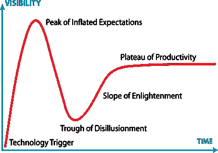

# 自动化证明了它的目的

> 原文：<https://thenewstack.io/automation-proves-its-purpose-in-it/>

 [多米尼克·威灵顿，Moogsoft

多米尼克·威灵顿是 Moogsoft 的全球 IT 宣传员。他从事 IT 运营已经超过 20 年，在 SecOps、云计算和数据中心自动化等多个领域工作。](https://www.moogsoft.com/) 

随着自动化技术应用于跨组织的业务流程，社会正处于一个新时代的黎明，就像我们在工业革命中看到的那样。但是，尽管还有更多的事情要发生，人们对它的喜爱和兴趣是否正在下降？人们可以很快看到自动化领域令人难以置信的激增。尽管如此，一些商业应用程序仍然被噪音所笼罩，就像第一天发生事故的自动驾驶货车，或者逃离处理程序的智能手提箱。

那么未来是什么样子的呢？这条道路可能会崎岖不平，但前方有一些美好的前景，特别是当我们将镜头转向促进人工智能创新的 IT 团队时。

### **自动化技术，如机器学习，正面临反弹**

对于从事新兴技术的公司来说，这并不是什么新鲜事。自动化正面临着所有创新产品都经历过的类似的期望和反弹的挑战。Gartner 著名的“炒作周期”最好地说明了这一点。

当技术首次进入场景时，它会在空间中制造噪音，这被描述为“触发器”这是它获得最初头条新闻和投资者注意的地方。虽然最初令人兴奋，但这种嗡嗡声和关注营造了一种过度乐观的氛围，这种氛围一直延续到 Gartner 的“过高期望的顶峰”

这个高峰是现实开始的地方，有些人可能会说自动化技术发现自己就在这个点上。这就是强烈反对和批评的地方，导致一些品牌实际上失败了。但是，如果这项技术已经设法克服了负面影响，它就进入了一个设定水平和更易于管理的期望的时代。

然而，像人工智能和人工智能这样的自动化技术面临着一种独特的情况。第二个失败选项出现了:通过自动化，结果被快速共享，并且很难确定为什么会产生特定的结果。当试图进行故障排除时，这可能是一个令人沮丧的点，并且当该技术离开实验室并被置于现实环境中时，这尤其成问题。

### **IT 部门在目标驱动的解决方案中发现了灵活性和创新**

在与大规模企业合作时，软件公司被置于混合环境和现有工作流的强大生态系统中。对一家公司来说，淘汰以前安装的系统要求很高，一般来说，实现一个更令人头疼的产品不会赢得客户。那么，AI 和 ML 值得这么麻烦吗？尽管障碍重重，自动化技术每天都在 IT 部门证明自己。它这样做的方式有助于企业当前的生态系统，并消除常见的棘手问题。其中一个原因是，为了取得成功，自动化系统需要数据。数量和质量都很重要，因为他们需要接受信息培训，以做出准确的评估。

IT 基础设施产生大量的数据，尽管数据格式多种多样，但数据已经是机器可读的。这一障碍为“AIOps”(算法 IT 操作)奠定了基础，这是 Gartner Research 在分析师[科林·弗莱彻](https://www.gartner.com/analyst/42808/Colin-Fletcher)最近的论文中提出的。此外， [Gartner 报告](https://www.moogsoft.com/blog/aiops/know-aiops/)称，到 2020 年，大约 50%的企业将积极使用 AIOps 平台来提供对业务执行和 IT 运营的洞察，比目前的不到 10%有所增加。

IT 的现状是这样的:被低估的人组成的团队在办公室的黑暗角落里，远离其他人，他们只是被期望保持正常工作并对每一个 IT 问题做出响应。自动化和机器学习的目标不是从劳动力中淘汰人，而是让他们有机会更具战略性，并为他们的同事和客户提供更好的客户体验。IT 专业人员可以专注于真正重要的事情，如提供业务价值，而不是花费无数时间试图理解无休止的服务票证。

通过 Pixabay 的特征图像。

<svg xmlns:xlink="http://www.w3.org/1999/xlink" viewBox="0 0 68 31" version="1.1"><title>Group</title> <desc>Created with Sketch.</desc></svg>