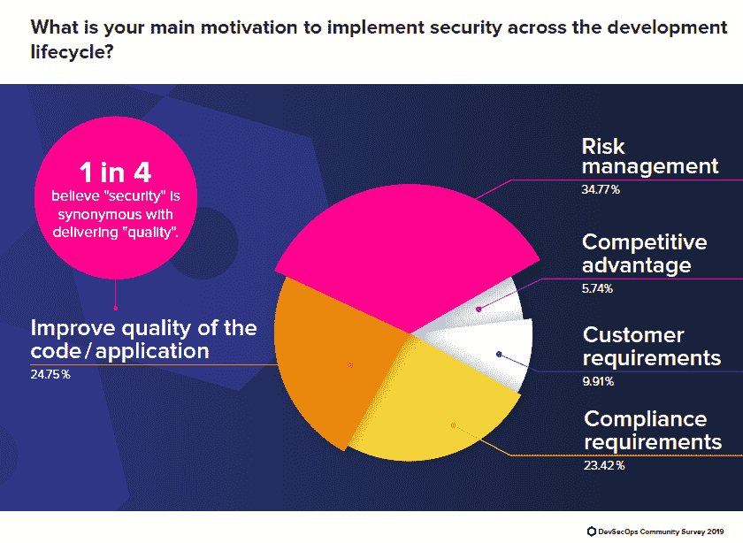
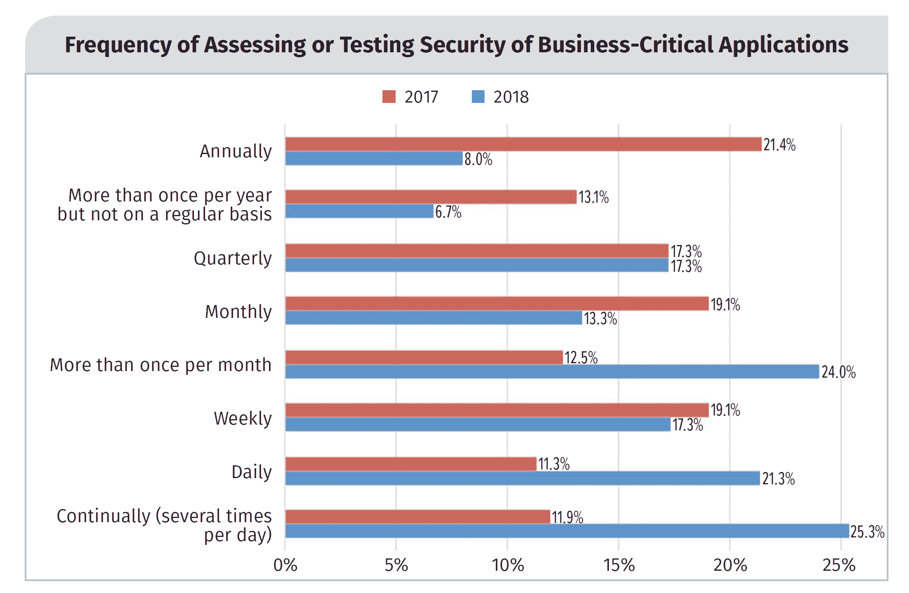

# 贯穿软件开发生命周期的安全集成是一个白日梦

> 原文：<https://thenewstack.io/automation-security-sdlc/>

风险和漏洞管理是在整个软件开发生命周期(SDLC)中实施安全性的首要原因，但第二个最常见的原因是提高代码质量，根据 [DevSecOps 社区调查 2019](https://www.sonatype.com/2019survey) ，该调查主要由开发、开发人员和架构师角色完成。然而，这似乎不足以激励将安全自动化集成到开发过程中。

在 DevSecOps 调查中，只有 11%的人表示他们的安全工具已完全集成并自动化到 DevOps 管道中，52%的人表示需要手动操作。当然，如果没有 DevOps 管道，很难集成到 DevOps 管道中，但对于那些拥有成熟 devo PS 实践的人(占该研究的 5，558 名受访者的 27%)来说，这一数字没有太大变化。在这组人中，54%的人说安全工具没有完全自动化。

DevOps 与自动化密切相关，但只是 SDLC 的一个特定部分——构建和部署应用程序。事实上，74%拥有成熟开发运维实践的公司在构建/CI(持续集成)阶段执行自动化应用安全分析。需要注意的是，调查发现，在 SDLC 的测试和质量保证(QA)阶段，自动化扫描确实有所下降。也许这表明 QA 的角色正在被削弱，或者至少“左移”

## **开发者速度和安全性测试**

我们[之前提到过](/add-it-up-c-suite-doesnt-have-a-clue-about-app-dev/)高管层并不了解应用发布的频率。处于开发、安全和 IT 运营交汇点的人，角度不同。10%的企业高管认为应用程序每月至少发布一次，而 83%的 DevSecOps 调查称他们每月不止一次将应用程序部署到生产环境中。数字上的巨大差异是因为大多数人仍然把开发看作是一个迭代过程，以大块的形式交付，称为发布。

SANS 研究所 2018 年对安全专业人士的调查提供了另一个视角。在该报告中，66%的受访者表示他们的组织至少每月一次对生产应用程序进行系统更改。17%的人每天至少部署一次生产变更，这与 DevSecOps 报告中的 21%的人每天至少部署一次类似。

SANS 协会的报告提醒我们，自动化可以快速添加到 SDLC 的特定部分。47%的受访安全专家表示，他们的组织至少每天测试业务关键型应用程序，这是 2017 年 23%的两倍。然而，就目前而言，那些至少每天对生产应用程序部署变更的人保持在 17%不变。

通过运行类似于漏洞扫描器的东西，自动化生产应用程序的安全测试是相对容易的。CD/CI 工具在开发过程的早期增加了类似的扫描功能。机器学习和人工智能正在提供帮助，但就目前而言，认为所有应用程序开发、部署和安全流程都将自动化到一个 DevOps 管道中是一个白日梦。

来源:“安全 DevOps:事实还是虚构？”SANS 研究所的调查。

通过 Pixabay 的特征图像。

<svg xmlns:xlink="http://www.w3.org/1999/xlink" viewBox="0 0 68 31" version="1.1"><title>Group</title> <desc>Created with Sketch.</desc></svg>