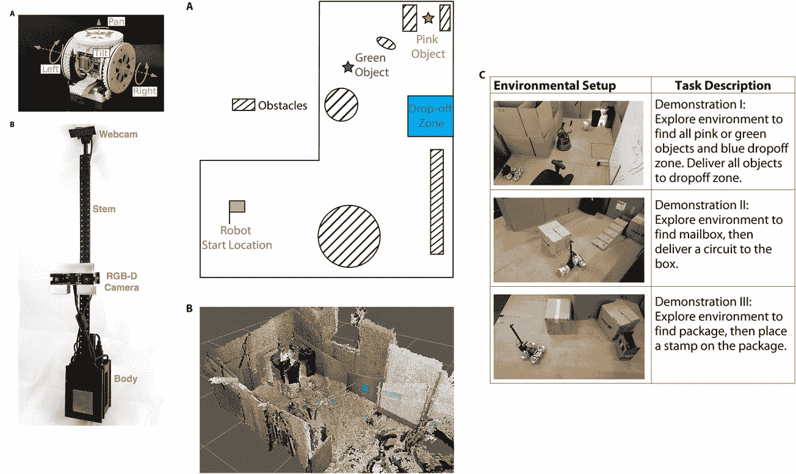
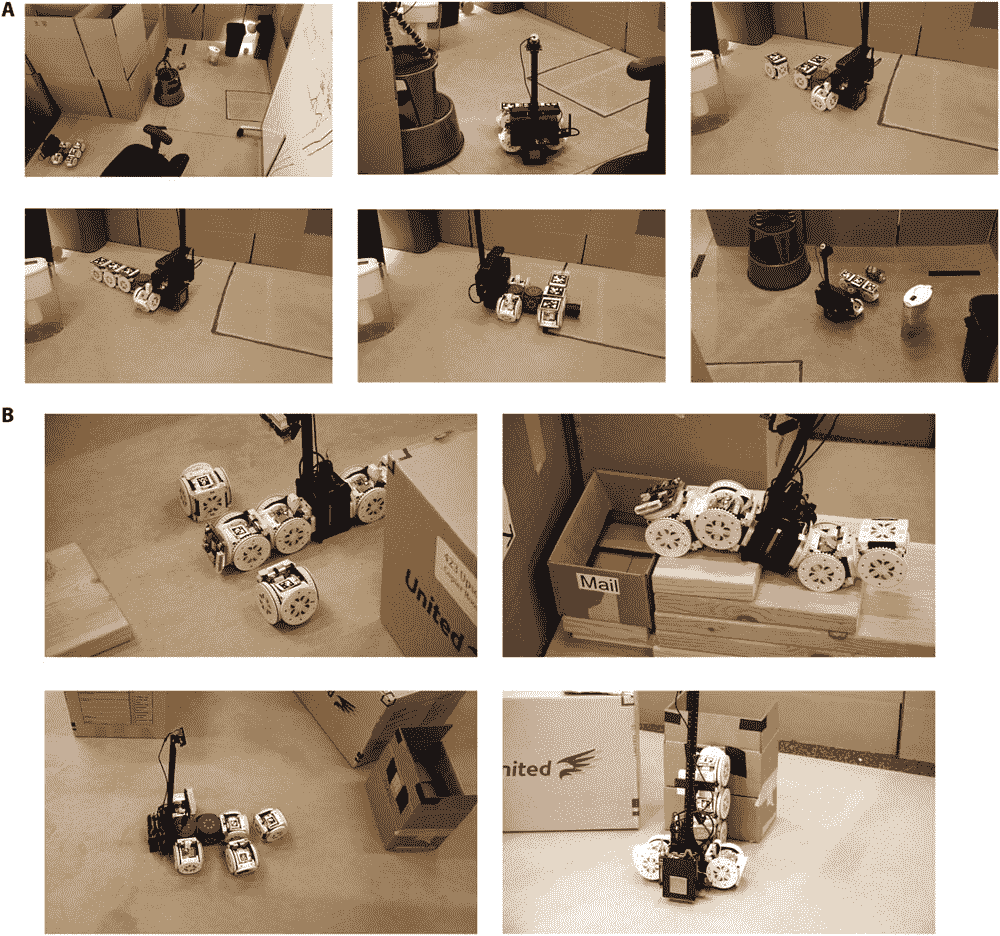

# 自主模块化机器人自我转换以绕过障碍物

> 原文：<https://thenewstack.io/autonomous-modular-robot-self-transforms-to-bypass-obstacles/>

无论它们是被设计来执行令人瞠目结舌的特技还是[精确手术](https://thenewstack.io/spider-like-microfluidic-soft-robot-is-built-for-precision-surgery/)，我们现在看到机器人可以有各种形状和大小——甚至可以改造自己以适应手边的情况。[模块化、自重构机器人](https://en.wikipedia.org/wiki/Self-reconfiguring_modular_robot) (MSRRs)的想法并不新鲜，但实际上已经存在了几十年。然而，让机器人在完全自主地适应未知环境的同时执行任务，对该领域的研究人员来说是一个巨大的挑战，大多数原型依赖于某种人类输入或其他措施来支持他们有限的自主性。

现在，来自康奈尔大学和宾夕法尼亚大学的工程师团队开发了一种他们称为“集中式”的感知、传感和控制系统，这种系统使他们的模块化机器人能够更自主地收集关于其环境的数据，解决问题，并通过按需反应性地重新配置自己来自主执行任务。在工作中观看:

[https://www.youtube.com/embed/eJsnG9DZjgM?feature=oembed](https://www.youtube.com/embed/eJsnG9DZjgM?feature=oembed)

视频

正如该团队在最近发表在 [*科学机器人*](http://robotics.sciencemag.org/content/3/23/eaat4983) 上的论文中解释的那样，他们的实验利用了宾夕法尼亚大学设计和制造的 [SMORES-EP](http://www.modlabupenn.org/2016/06/18/smores-ep/) 模块化机器人。这些电池供电的立方体模块有两个橡胶轮，有四个自由度(平移、倾斜、左转或右转)。模块上的每个面都配备有[电永磁(EP)磁体](https://en.wikipedia.org/wiki/Electropermanent_magnet)，允许它附着到其他模块，这些模块也可以打开或关闭。模块化机器人还配备了一个帮助机器人接收视觉反馈的摄像头和一个控制所有模块的中央处理器。

正如该团队所指出的，这项研究的一大进步是开发了一个集中式系统，允许机器人以灵活和自适应的方式规划和执行更高级别的决策和功能。

“MSRRs 本质上是机械分布的，因此，自然有助于分布式规划、传感和控制，”该团队写道。“大多数过去的系统都使用完全分布式的框架。我们的系统设计不同。它分布在低层(硬件)，但集中在高层(规划和感知)，利用了两种设计范式的优势。”

在该小组的实验中，机器人被分配了三项必须完成的不同任务。例如，机器人的任务之一是拿起一个物体，并把它放在某个地方。为了实现这一点，机器人必须在这个未探索的环境中探索、绘制地图和导航，以便发现物品的位置。然而，一旦机器人感觉到物体位于狭窄的空间，这就促使机器人的中央规划系统从软件库中选择适当的行为反应来解决问题——在这种情况下，就需要从原来的蝎子形状转变为具有更长手臂的形状，以伸入裂缝中，使用磁铁取回物体。一旦机器人抓住了物体，它就会四处导航，寻找指定的地点——用蓝色方块标记——在那里它可以卸下货物。在其他测试中，机器人的任务是爬上楼梯以实现其目标，或者在头顶上的位置放置邮票——所有这些都需要它收集数据，然后计划完成工作所需的步骤。

当然，像这样的集中方法还有一些问题需要解决，该研究的作者指出，为了实验的目的，测试环境和机器人的行为库必须保持相当有限，以便机器人成功完成任务。如果环境更加开放，行为更加开放，机器人可能会犯更多的错误。然而，这项工作提出了一种有趣的方法，整合了集中式和分布式架构的优势，有一天可能会帮助我们设计出不仅在解决问题方面真正自主，而且充分利用模块化优势的机器人。

“未来的系统可以通过将更多来自低层组件的反馈引入高层决策过程，并通过合并现有的高层故障恢复框架来变得更加健壮，”该团队建议道。"还可以探索分布式修复策略，在运行中用附近工作的模块替换故障模块."

图片:康奈尔大学和宾夕法尼亚大学

<svg xmlns:xlink="http://www.w3.org/1999/xlink" viewBox="0 0 68 31" version="1.1"><title>Group</title> <desc>Created with Sketch.</desc></svg>