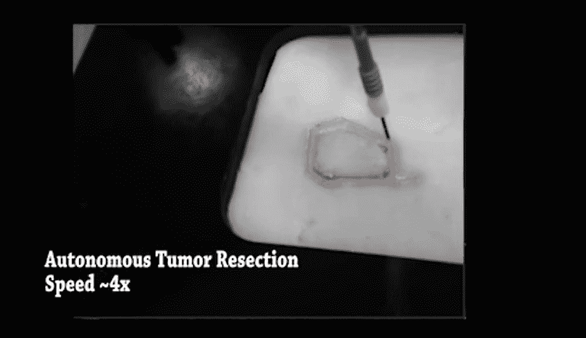

# 自主机器人比人类外科医生做得更好

> 原文：<https://thenewstack.io/autonomous-robot-surgical-cuts-better-human-surgeon/>

无论你从哪里看，自动化似乎正处于向各种行业蔓延的风口浪尖。我们已经熟悉了[工业机器人](https://thenewstack.io/robot-tamer-reprograms-industrial-robot-curious-living-creatures/)在工厂车间取代人类，或者[无人驾驶汽车](https://thenewstack.io/olli-electric-self-driving-3d-printed-shuttle-can-hail-smartphone/)在一些道路上谨慎地首次亮相。但我们对医学等领域的机器人不太熟悉，在这些领域，我们仍然倾向于相信人类医生的技能，而不是机器。

然而，这种偏见可能很快就会消失，因为越来越多的研究开始表明，机器往往能够匹配甚至超过人类医疗保健专业人员的技能水平，无论是在[疾病诊断](https://thenewstack.io/deep-learning-algorithm-diagnoses-skin-cancer-better-human-dermatologists/)方面，还是在执行外科手术过程中可能比人更准确。

正如智能组织自主机器人(STAR)的创造者在 2017 年 IEEE/RSJ 智能机器人和系统国际会议( [IROS 2017](https://www.iros2017.org/#) )上提交的最新[研究结果中指出的那样，他们的实验表明，他们的机器人系统实际上比执行相同任务的人类外科专家更精确。看一看:](https://ras.papercept.net/conferences/conferences/IROS17/program/IROS17_ContentListWeb_3.html#tubt12_04)

https://youtu.be/9ptlm-O39XA

这项研究使用了三种猪组织，即脂肪、肌肉和皮肤。使用其先进的 3D 成像系统和近红外(NIR)相机，STAR 能够证明它可以在所有三种类型的组织中进行精确的切口，使用研究人员在组织上放置的微型红外标记进行指导。这比看起来要难，因为这些组织的质地不一致，因此会导致电外科切割工具打滑和偏离轨道。

STAR 能够在所有三种组织上很好地完成任务，这要归功于它的仪器，这些仪器配备了传感器，可以精确地测量持续切割不同类型表面所需的力，并不断调整运动和纹理等变量。

然后，STAR 与人类外科医生展开了同样的切割任务，这次是在猪皮上。第一个练习是剪一条 5 厘米长的直线。一些外科医生使用不同的手术方法来达到相同的效果(即开腹手术或[腹腔镜手术](https://en.wikipedia.org/wiki/Laparoscopic_surgery)，但总的来说，机器人的切口更接近理想的长度，更少偏离理想的切割线，切口周围受损的肌肉也更少。

实验的下一部分涉及 STAR 从一片猪脂肪中取出一个用粘土制成的模拟肿瘤。该区域再次用机器人近红外摄像机可见的标记进行了描绘，但为了使这项任务更加困难，在顶部覆盖了一层薄薄的皮肤，试图混淆机器人的视觉跟踪系统。然而，机器人能够以令人印象深刻的精确度进行切割，正如研究人员所设定的那样，在肿瘤周围 4 毫米的范围内。

## 机器人外科医生

“我真的相信这是外科手术的未来，”该研究的合著者、马里兰大学机械工程助理教授 Axel Krieger 告诉 IEEE Spectrum*。“我相信这将首先发生在外科手术的小功能上，并变得越来越复杂，类似于自动驾驶汽车，制动辅助等小功能慢慢演变成越来越多的自主功能。我绝对会信任这样的机器人来做我的手术，一旦它得到充分开发和验证。”*

 *该团队目前正致力于训练 STAR 系统切除更复杂的肿瘤，例如那些具有更多三维复杂性的肿瘤。

STAR 的精确度将有利于改善手术后的结果，因为以更少的错误进行的更不容易出错的切割转化为患者更短的恢复时间，并且将防止癌性肿瘤重新形成。

即使机器人外科医生不能完全取代人类医生，机器人辅助手术对人类医生来说也是有好处的，因为它们有助于减轻长时间进行这些精细手术可能给人类外科医生带来的一些身体压力。这些问题包括眼睛疲劳、手、脖子、背部和腿部问题，以及腕管综合症——所有这些都可能导致外科医生犯错或提前退休。

当进行微创手术时，例如在腹腔镜手术中发现的微创手术时，这些身体劳损的问题甚至更加明显，在腹腔镜手术中，必须进行微小的切口，并且在插入患者体内的小型摄像机和器械的帮助下进行手术。由于他们经常看着视频屏幕进行这些操作，人类外科医生没有在手术过程中有用的直接“动手”经验。对于机器人来说，这不是一个问题，这意味着我们很可能会在未来的手术室里看到更多的自主机器。

图片:贾斯汀·奥普弗曼和瑞安·德克尔

<svg xmlns:xlink="http://www.w3.org/1999/xlink" viewBox="0 0 68 31" version="1.1"><title>Group</title> <desc>Created with Sketch.</desc></svg>*