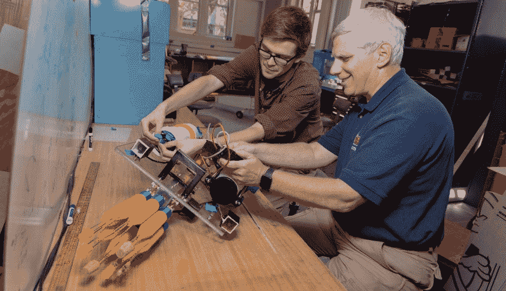
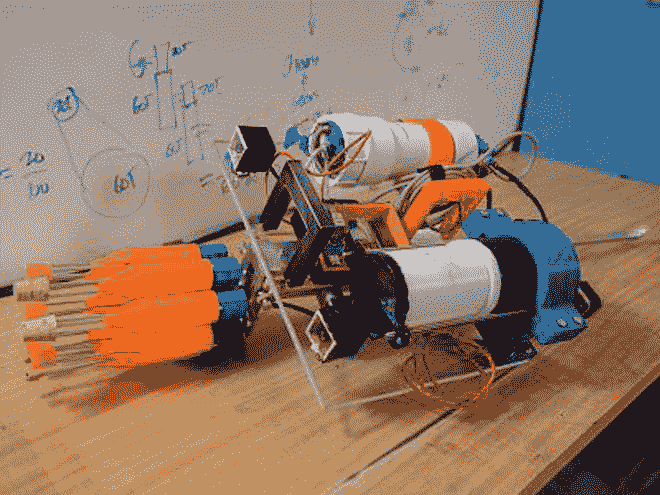
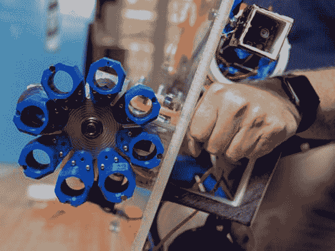

# 自主水下机器人猎杀入侵鱼类

> 原文：<https://thenewstack.io/autonomous-underwater-robot-hunts-invasive-fish-species/>

环境保护可能看起来像是一个相对动手的提议:种植一些树木，研究或标记一些濒危动物，或者在政治层面上努力改善法规。然而，新技术也在发挥越来越大的作用，正如我们在现实生活中看到的那样,[无人机像美化的口香糖机一样为濒危雪貂投掷疫苗球](https://thenewstack.io/glorified-gumball-machine-drones-airdrop-vaccine-pellets-endangered-ferrets/),或者[通过向虱子发射激光来保护鲑鱼](https://thenewstack.io/underwater-drone-protects-salmon-blasting-lice-lasers/),甚至与区块链科技一起将[塑料垃圾变成现金。](https://thenewstack.io/plastic-bank-using-blockchain-tech-to-monetize-plastic-waste/)

现在，伍斯特理工学院(WPI)的学生正在开发一种水下自主机器人，它使用机器学习来猎杀狮子鱼，这是一种入侵鱼类，原产于印度洋和太平洋的热带水域，现在正在加勒比海、巴哈马群岛以及美国东南海岸的部分地区大量繁殖。

根据美国国家海洋和大气管理局的说法，在这些没有天敌来控制它们的地方，可能有多达一百万条这样的鱼。具有讽刺意味的是，基因分析表明，这些庞大的种群可能只来自几十年前粗心的水族馆所有者放归大自然的少数鱼类。更大的问题是，一只狮子鱼每月可以产下 30，000 个卵，同时贪婪地吞食其他物种的年轻后代。然而，也有有趣的另一面；这些入侵的鱼也被认为是非常美味的，可以卖到每磅 20 美元，这对当地渔民来说是有利可图的。

团队成员之一布兰登·凯利说:“这样做有经济和环境效益，而且鱼很好吃。”。“我看到了这些鱼造成的巨大破坏，这真的让我想参与这个项目。我们觉得我们可以改变世界。”

到目前为止，入侵的狮子鱼种群一直通过诱捕或人类潜水员手动刺穿它们来刻意减少，但正如人们可能猜测的那样，这既费时又费力，而且这些方法并不能解决隐藏在珊瑚礁或海洋深处的种群。自动化的方法也已经被使用，但是这些方法需要被人类操作员束缚和控制。

面对这些因素，学生们开始建造一个不需要人类管理的机器人。WPI 的设计看起来相当危险:它有一个旋转的圆柱体，可以旋转并射出长矛。一旦展开，矛尖就会分离，帮助死亡的狮子鱼浮上水面进行收集。为了补偿相当于长矛的质量损失，机器人有一个水密的充气室，它会自动膨胀一点，以保持机器人处于相同的浮力水平。

在引擎盖下，机器人使用神经网络和机器学习，并集成了一个先进的计算机视觉系统，能够区分其他本地物种和狮子鱼。这是通过用成千上万不同颜色的狮子鱼图像训练系统实现的，这些图像是在不同角度和光照条件下拍摄的。使用这些训练数据，该系统能够在 95%的时间内准确识别狮子鱼。人类水肺潜水员的图像也被输入系统，以训练它不要向他们开枪。

在未来，学生团队将致力于创建一个依赖于三维搜索网格的导航系统，狮子鱼搜索机器人可以独立使用该系统来定位目标。

WPI 机器人工程项目副主任克雷格·普特南说:“我们的目标是能够将机器人扔到船的一侧，让它下到礁石上，规划出一条路线，并开始搜索。”“在寻找狮子鱼时，它需要建立一个搜索模式，沿着礁石飞行，而不是撞上礁石。这个想法是，机器人可以成为环境解决方案的一部分。”

图片:伍斯特理工学院的克里斯蒂安·梅尔弗勒( [CC BY 2.5](https://creativecommons.org/licenses/by/2.5) )

<svg xmlns:xlink="http://www.w3.org/1999/xlink" viewBox="0 0 68 31" version="1.1"><title>Group</title> <desc>Created with Sketch.</desc></svg>