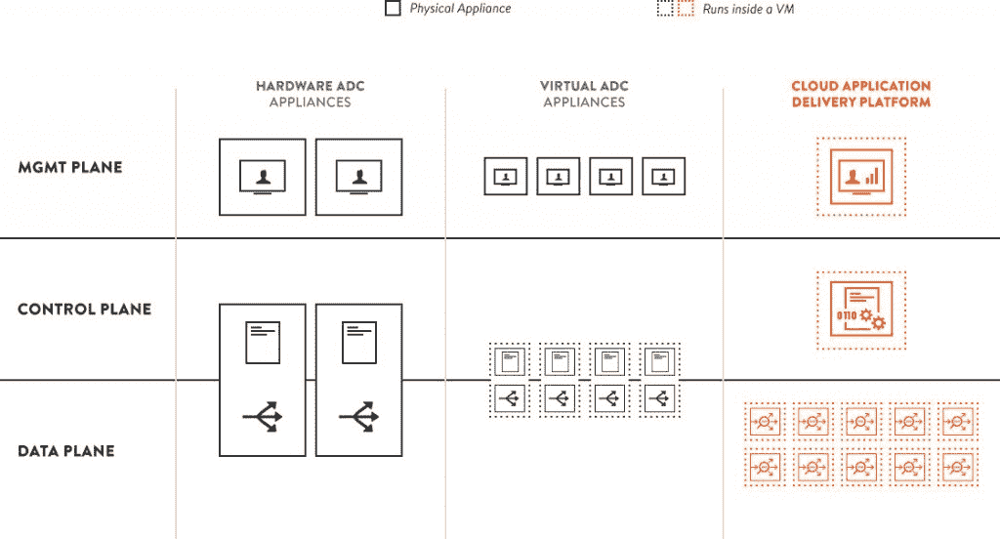

# Avi Networks:微服务不能用单片工具自动化

> 原文：<https://thenewstack.io/avi-networks-microservices-cant-automated-monolithic-tools/>

应用交付控制器是近年来发现自己已经虚拟化的网络设备类别之一，从一个设备或一组设备转换为软件。F5 Networks、Kemp Technologies 和 Barracuda Networks 等制造商为数据中心生产 ADC 设备。各种虚拟化 ADC 有望使数据中心更加灵活，并使网络更能适应它们所承载的工作负载。如果你是新堆栈的常客，你可能知道市场上增长最快的基于软件的 ADC，即使你不这么认为: [NGINX 加](https://thenewstack.io/nginx-plus-r8-fully-supports-http2-tests-oauth2/)。

一家名为 [Avi Networks](https://www.avinetworks.com/) 的基于软件的 ADC 生产商现在正在证明，专门为微服务环境调整的交付控制器不仅可以取代 NGINX 的崇高地位，还可以取代我们所熟知的配置管理系统。

正如 Avi 产品副总裁 Guru Chahal 在一次采访中向新堆栈解释的那样，他认为配置管理在微服务环境中不再有意义，如果它的主要目标是配置应用程序而不是微服务本身。

## 越狱

Chahal 说，开发者正在赢得支持微服务和[分解巨石](https://thenewstack.io/led-amazon-microservices-architecture/)的争论，因为这种新模式中的服务更易于管理，独立升级，并且更快上市。“然后，随着 it 运营部门投入生产，它遇到了工具链这堵墙，现在的工具是这些必须逐个配置的大盒子。你把应用程序扔过栅栏，当然，它出去配置这些盒子。

“真正需要的是，”他继续说道，“每个微服务在部署时，能够自动从底层基础设施请求并获得一组特定的服务。这些服务包括应用交付、实时监控、安全等，而微服务开发人员和底层 IT 运营团队之间没有任何互动。”

Chahal 举了一个例子，它涉及一个由大约 20 个服务组成的应用程序，这些服务实时地相互交换请求和响应。这些服务中的每一项都是在一个包括 Mesos 和 Marathon 在内的系统中编排和安排的。Chahal 认为，对于这些服务中的每一个，要在一个适当构建的安全系统中进行自我扩展，都需要负载平衡、防火墙和性能监控资源。(公平地说，NGINX 确实使用了一种叫做 Naxsi 的开源 Web 应用防火墙。)

“那是你的工具链墙，”他争辩道。“实际情况是，他们一部署，IT 人员就必须出去，登录到某个地方的一个机器中，为这 20 台服务器配置 20 个负载平衡器，配置 20 个安全参数，20 个监控系统，等等。自动化的缺乏，以及这种传统的、基于设备的模式，形成了这个巨大的鸿沟和那堵高墙。”

Chahal 说，开发人员更喜欢系统在部署时按需检测微服务需要什么资源，以及需要多少资源。“我为什么要从整体服务转向微服务的原则，是需要应用于底层基础设施的原则。因此，不存在“匆忙等待”的情况，即开发人员在微服务架构中开发应用，然后等待工具链跟上。”

> 我们所认为的 IT 自动化并没有真正实现微服务的自动化。在某种程度上，它抵制它们。

IT 驱动的 CI/CD 的支持者通过[将部署过程分解成可重复步骤的小组](https://thenewstack.io/the-year-behind-changing-perceptions-about-the-diffferences-between-faster-delivery-and-cicd/)来实现部署过程的自动化。他们说，这个过程标准化了组织向产品交付软件的方法，同时使集成过程更加严格，并执行标准和实践。

Guru Chahal 提出了一个非同寻常的反驳:他说，基于部署整体或部分整体的可重复过程不适用于工作负载不断变化和服务不断发展的微服务环境。因此，任何自动化微服务部署流程的严格尝试，无论是使用长脚本还是短管道，都无法在越来越短的时间内适应不断变化的工作负载。

如果你按照 Chahal 的论点得出结论，他实际上是在说，我们所认为的 IT 自动化实际上根本没有自动化微服务。在某种程度上，它抵制它们。

“这里的问题是，你可以有一套特定的步骤，重复配置相同的硬件设备，”Chahal 说。"但问题是，这些硬件设备是静态资产，不能按需运转."他指出，底层基础设施通常不是基于软件的，不是分布式的，也不是微服务架构的镜像。

“实际上将这些微服务投入日常运营变得非常具有挑战性，”他继续说道，“达到客户所期望的安全性和可用性水平。”

这是一个非常令人信服的案例——就像说，你不能在任何一天设定帆船的精确航向。但是它提出了一个必然结果，这与 CI/CD 的主要论点相冲突:敏捷性是通过标准化配置和增量迭代实现的。今天这两个极端都被如此激烈地争论的事实证明了这样一个事实，即在这种规模上部署服务是如此的新，以至于我们宣称我们从经验中知道我们在做什么，我们在欺骗自己。

## 动感双人组

为了让 Chahal 的论点在实践中发挥作用，Avi 的 ADC 需要对周围的环境保持敏感——检测它所处理的流量的性质和动态，然后为其他服务提供对这些数据的可见性。三个月前，在 Dynatrace Perform 上，NGINX 提出了一个非常相似的观点。

对于 ADC 在微服务架构中所处的位置，Avi 的 Chahal 表示:“我们在应用程序面前处于如此有利的位置，不需要应用程序中的任何代理，也不需要对访问应用程序的客户端进行任何更改，我们就可以检测到网络上的整体延迟、应用程序响应延迟、您使用的浏览器类型、浏览器中的页面加载时间等。 您在网页中加载对象的顺序，以及开发人员需要如何优化它们，以获得最佳的用户体验。”

Avi 等云应用交付平台可自动执行许多仍需通过硬件或虚拟 ADC 手动执行的任务，包括软件定义的网络、管理和增加容量(来源:Avi Networks)。

Chahal 告诉我们，Avi Networks 并不意味着取代 New Relic 和 Dynatrace 等应用性能管理器，而是对它们进行补充，首先是作为它们的传感器，其次是为它们的专用代理完成设计工作扫清道路。他建议我们将 APM(应用性能管理)和 ADC 视为提供性能洞察的两个维度，其中 ADC 与整个系统更加水平和相关，而 APM 专注于每个垂直应用。但他确实建议 APMs 进行改进，以便能够将性能数据深入到微服务级别。

Chahal 说:“我认为 APM 的前景正在发生变化…如果你将这种情况向前推进一两年，我毫不怀疑，有了 Avi 和全面的容器服务结构等技术，以及 APM 供应商正在做的事情，客户将能够进入一个单一的仪表板，评估和量化他们从微服务架构中获得的好处，包括三个主要方面:我将应用程序推向市场的速度有多快？我能多快对应用程序进行更改？我能够以多快的速度响应应用程序的整体容量和使用情况的变化？随着时间的推移，量化这三个方面的好处会变得容易得多。”

新遗迹是新堆栈的赞助商。

专题图片:[南非约翰内斯堡庞特大厦内部](https://www.flickr.com/photos/97472108@N06/9034863455)由 Spach Los 通过知识共享 2.0 授权。

<svg xmlns:xlink="http://www.w3.org/1999/xlink" viewBox="0 0 68 31" version="1.1"><title>Group</title> <desc>Created with Sketch.</desc></svg>