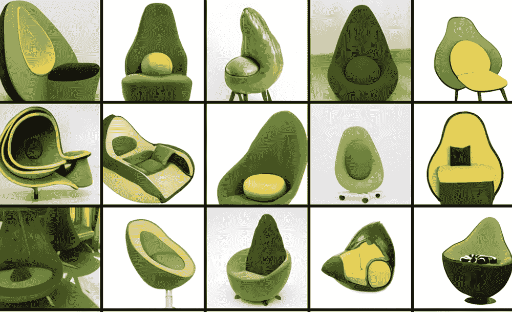
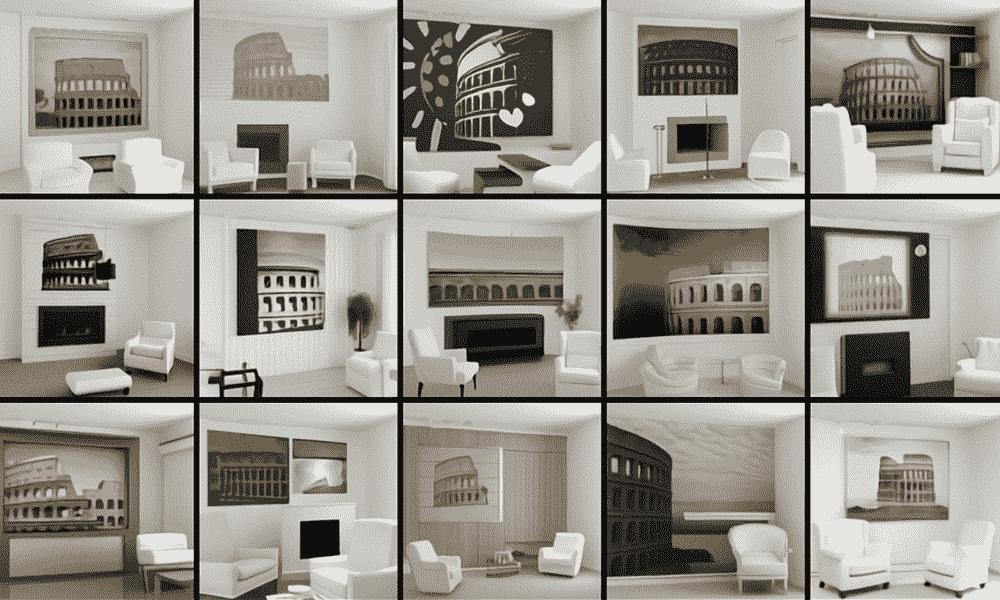
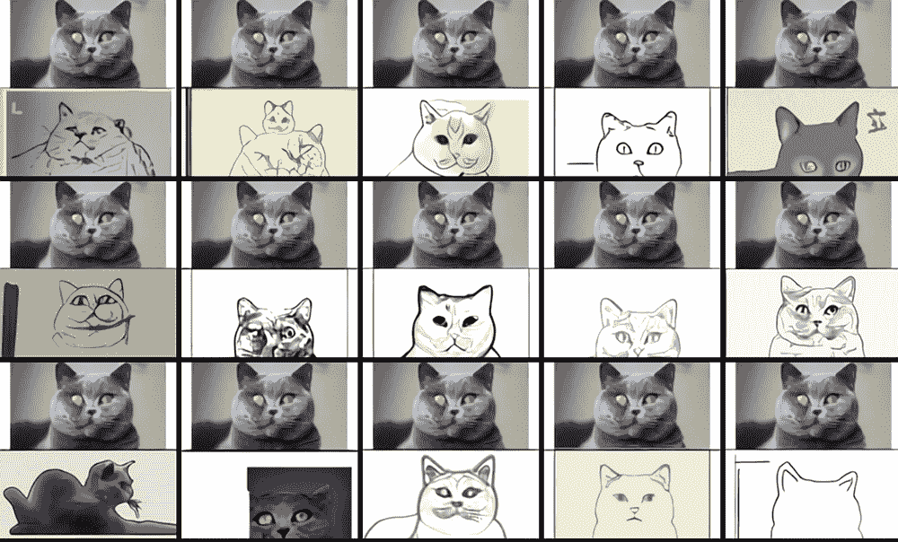
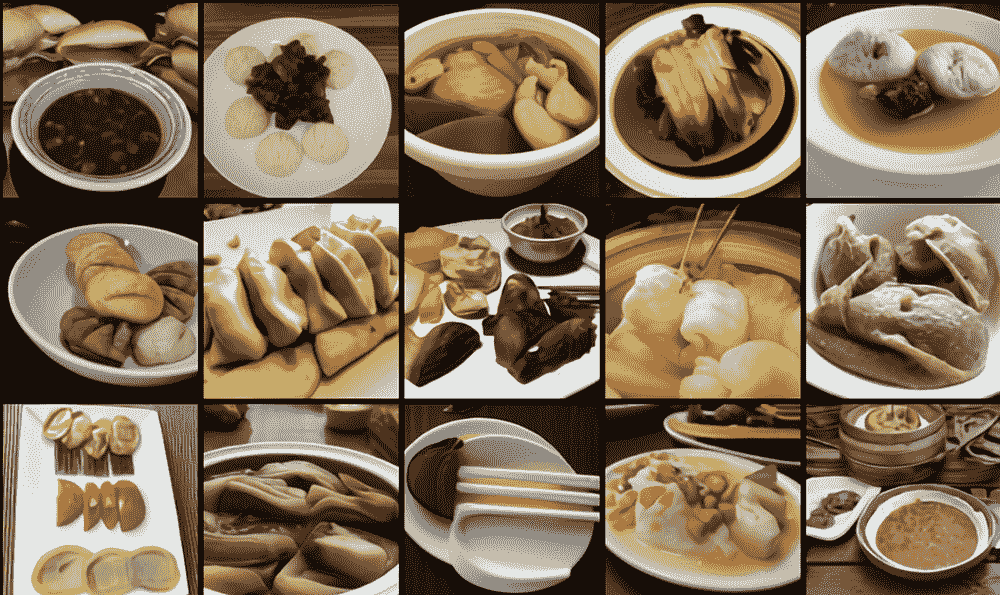
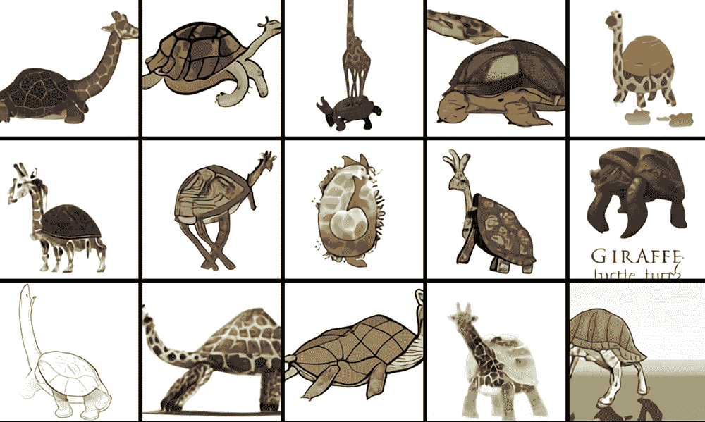

# 人类语言和神经网络交汇处的鳄梨椅

> 原文：<https://thenewstack.io/avocado-chairs-at-the-intersection-of-human-language-and-neural-networks/>

在过去的一年里，我们已经看到机器学习如何[突飞猛进](https://thenewstack.io/the-year-in-ai-whats-behind-in-2020-and-whats-ahead/)，特别是当它涉及自然语言处理(NLP)时，这是人工智能研究的一个分支，旨在探索机器如何阅读和解读人类语言的含义。

一个特别重要的突破是去年发布的 [GPT-3](https://github.com/openai/gpt-3) ，这是由人工智能实验室 [OpenAI](https://openai.com/) 创建的庞大的 1750 亿参数 NLP 模型。作为迄今为止最大的自然语言处理模型， [GPT-3 完成了各种令人印象深刻的壮举](https://thenewstack.io/openais-gpt-3-makes-big-leap-forward-for-natural-language-processing/)，从生成各种各样的文本，这些文本与人类制作的文本几乎没有区别。除了仅仅产生诗歌、短篇小说、技术手册之类的东西，GPT 3 号的多功能性还表现在它能够解决简单的数学问题，甚至可以产生编程代码。

现在，OpenAI 发布了 DALL E，这是 GPT 3 的缩小版，有 120 亿个参数，能够在给定文本描述时，使用文本图像对的数据集生成图像。

“我们发现它有一系列不同的功能，包括创建动物和物体的拟人化版本，以看似合理的方式组合不相关的概念，渲染文本，以及对现有图像进行转换，”OpenAI 团队在他们的博客[中解释道。](https://openai.com/blog/dall-e/)

## 牛油果椅

新的发现令人印象深刻。例如，当给定文本提示“鳄梨形状的扶手椅”时，DALL E 会提供以下内容：

这些样品非常了不起，从某种意义上来说，人类设计师可以想出它们。OpenAI 团队表示，在这种情况下，DALL E 能够从两个无关的想法中获得灵感，同时创造出考虑到最终对象的形式和实用性的东西。他们在他们的博客上解释道:“我们发现，用‘以……的形状’、‘以……的形式’和‘以……的风格’这样的短语来提示 DALL E，赋予了它这样做的能力。”。

像以前版本的 GPT 模型一样，DALL E 使用了一种称为变压器神经网络的架构，这种网络能够以非顺序的方式处理数据。这意味着当应用于语音识别、翻译和文本总结任务时，它们可以在解析句子的开头之前处理句子的结尾。这种能力比以前的 NLP 模型促进了更大的并行化，这也允许基于转换器的模型处理更大的数据集，同时减少了训练如此巨大的模型所需的时间。

根据该团队的说法，DALL E 背后的训练程序包括模型接收文本和图像，作为由多达 1280 个“令牌”组成的单个数据流。令牌是来自不同词汇表的任何符号；例如，英语字母表中的每个字母代表 26 个字母的字母表中的一个标记。在 DALL E 的例子中，它的词汇有来自文本和图像概念的记号。

该团队写道:“这种训练程序不仅允许 DALL E 从头生成图像，还可以以与文本提示一致的方式，重新生成现有图像中延伸到右下角的任何矩形区域。”

DALL E 还基于 OpenAI 的[图像 GPT](https://openai.com/blog/image-gpt/) ，该技术将类似 GPT 的变换应用于对象识别和对象检测任务，允许该模型使用像素序列而不是基于文本的序列来生成连贯的图像，并且不需要手动标记数据。

虽然 DALL E 背后的完整技术细节在 OpenAI 发表他们的完整论文之前不会显而易见，但很明显，这样的模型将非常强大，并具有广泛的应用。例如，当给出提示“一个有两把白色扶手椅的客厅和一幅圆形大剧场的画”时，看看模型想出了什么。这幅画挂在一个现代壁炉的上方:

【T2

可以想象，这样的工具会对建筑师和室内设计师有所帮助，或者对希望快速自动生成虚拟游戏环境的游戏设计师有所帮助。

令人惊讶的是，除了能够从文本标题中生成图像，DALL E 还能够进行零镜头推理，这意味着它能够完成一些它最初没有被训练过的事情。例如，研究小组给 DALL E 的任务是复制“顶部的猫和底部的草图完全相同”，而不是创建新的图像，它重复了这些图像:

根据文本提示措辞的清晰程度，DALL E 似乎也知道如何在同一场景中以不同的三维空间配置再现具有不同特征的多个对象，此外还可以可视化各种内部和外部结构，如对象的横截面或特写细节。DALL E 还擅长根据地理知识(“中国食物的照片”)和时间知识(“20 年代的手机照片”)生成图像:

值得注意的是，DALL E 还能够创建真实世界中不存在的不相关概念的令人信服的图像，正如当它被提示时显示的那样:“长颈鹿乌龟嵌合体的专业高质量插图。”

不用说，虽然该模型仍有一些需要改进的弱点，但 DALL E 似乎是一个相当通用的模型，具有大量的潜在用途，并可能在未来产生许多广泛的、不可预见的社会经济影响。该团队现在正致力于完善模型，并[确定它可能存在的任何潜在偏差](https://thenewstack.io/uncovering-biases-the-importance-of-data-diversity-in-speech-recognition/)。

*在 OpenAI 的[博客](https://openai.com/blog/dall-e/)中阅读更多内容。*

图片:OpenAI

<svg xmlns:xlink="http://www.w3.org/1999/xlink" viewBox="0 0 68 31" version="1.1"><title>Group</title> <desc>Created with Sketch.</desc></svg>