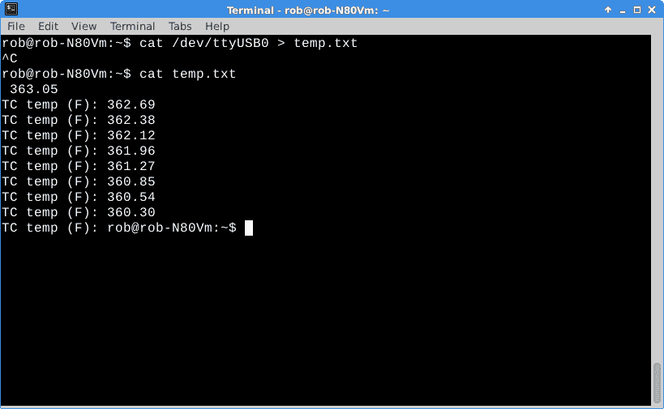
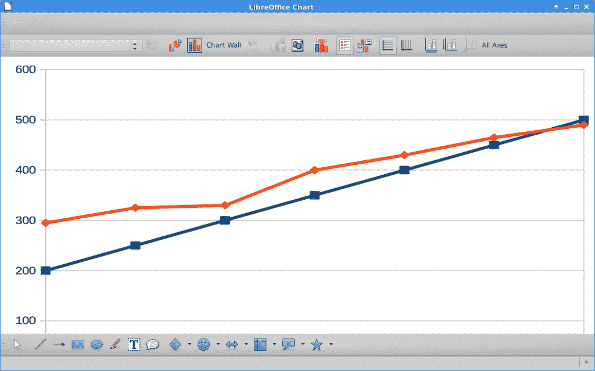

# 现成的黑客:避免用热电偶烧圣诞火鸡

> 原文：<https://thenewstack.io/avoid-burning-christmas-turkey-thermocouples/>

用微控制器读取华氏 500 度甚至更高的温度有多有趣？这是[热电偶传感器](http://www.thermocoupleinfo.com/)的工作。

热电偶、热电偶放大器和其他零件已于本周一抵达。很快，我发现厨房里那个 52 年前的烤箱差了一大截。我妻子总是说华氏 25 度偏高。

今天，我们将开始研究使用这些传感器来捕捉我们的 PancakeBot 上的实时 [PancakeBot](https://thenewstack.io/hack-pancake-stack-whats-inside-pancakebot/) 温度，这在上周的[现成黑客](https://thenewstack.io/hack-pancake-stack-whats-inside-pancakebot/)中有所涉及。我认为分析温度数据，就像 PancakeBot 打印出煎饼一样，可能会导致有趣的操作行为模式。一致的煎饼生产需要了解机器的物理特性。微控制器、传感器、软件和数据采集非常适合这类工作。

## 热电偶里有什么？

一个[热电偶](https://en.wikipedia.org/wiki/Thermocouple)由两根不同的金属线组成，在商业端熔合在一起。保险丝产生一个非常小的电压，该电压被放大，然后被处理成数字信号，然后被发送到你的计算堆栈。我使用 Arduino Duemilanove 控制器从放大器读取数字信号，然后通过 USB 电缆将数据转发到我的 Linux 笔记本电脑。

大约有半打不同种类的热电偶，K 型是最常见的。我使用了 Adafruit 的标准玻璃编织绝缘 [K 型热电偶。它记录的温度高达华氏 900 度。](https://www.adafruit.com/products/270)

热电偶产生的电压很小，需要一个放大器来读取读数。我为这个项目使用了一个 [MAX31856 通用热电偶放大器分线板](https://www.adafruit.com/products/3263)。这个特殊的放大器板可以读取所有不同类型热电偶的读数，并通过 SPI 总线输出数据。SPI 总线需要 4 条数据线、电源和接地连接。

本 [Adafruit 教程](https://learn.adafruit.com/adafruit-max31856-thermocouple-amplifier)完整介绍了如何连接热电偶和放大器。

放大器板和热电偶在第一次尝试中工作正常，尽管随着探针温度的升高，数据会下降。这是一个致命的泄露，热电偶引线是反的。松开两根导线并调换位置，然后将它们拧回端子板，这样数字就指向了正确的方向。

我的想法是在 PancakeBot 操作过程中使用热电偶来捕捉烤盘的温度。煎锅通过内置于烹饪表面的加热元件使用家用电流。这应该是一个简单的问题，即将热电偶探头连接到煎锅的底部，以直接测量加热元件的温度和变化，因为煎饼是熟的。

事实证明，正确安装热电偶是一件棘手的事情。这份[“了解使用热电偶测量表面温度的挑战”白皮书](http://www.flir.eu/science/blog/details/?ID=75018)非常详细地解释了这一点。基本上，它说永久安装的热电偶，相对于临时安装的热电偶(比如用电工胶带)，应该是相当准确和可靠的。我们当然希望对我们的 PancakeBot 温度做出可靠、准确和快速的响应。

我的计划是用某种支架将热电偶端机械连接到烤盘底部。随着传感器的工作，随着项目的进展，我会找出安装细节。

## 烤箱测试:“总是煮过头”

在厨房使用烤箱为热电偶提供了一个易于使用的测试设置。

数据从放大器流向 Arduino，然后流向 Linux 笔记本电脑。我编译并上传了 MAX31856 示例代码，它包含在 MAX31856 库中。试验板用于将放大器连接到 Arduino。

我把笔记本电脑、试验板、Arduino 和热电偶/放大器板放在厨房柜台上，靠近烤箱。

为了获取读数，我简单地展开热电偶丝，将尖端放入烘箱内，同时关门保持其位置。门内侧周围的柔性编织玻璃纤维密封为电线提供了一个柔和的通道，因此几乎没有损坏的风险。

一旦 Arduino 被接入，使用快速而肮脏的“Linux 命令行方法上的猫”很容易捕获数据:

```
rob%  cat  /dev/ttyUSB0  &gt;  temp.txt

```

在短暂的采集期后，检查终端窗口中的数据，烤箱刻度盘温度设置为 300 F。



“卡特彼勒”烤箱数据

我还从 200 到 500，每隔 50 次读取数据。在删除每一行开头的文本并进行汇总后，我将数据插入 LibreOffice Calc 电子表格并生成了以下图表。蓝线是刻度盘设置，红线是热电偶测得的温度。哇，温度在低端很高，在高端又略低。

谁知道呢？



烘箱温度图

这张图表清楚地解释了我在过去 20 年中遇到的一些厨房灾难。

## 下一步是什么

现在，您已经了解了热电偶及其相关放大器。我们还观察了来自传感器的真实数据。

在接下来的专栏中，我将介绍 MLX90614 Melexis 非接触式红外传感器。你认为热电偶和放大器很有趣？这个东西通过设备前面的一个小窗口读取温度，不需要与表面有任何物理接触。

我们将把所有这些传感器集成到我们的 PancakeBot 遥测和 R&D 工作中。

敬请期待，圣诞快乐。

<svg xmlns:xlink="http://www.w3.org/1999/xlink" viewBox="0 0 68 31" version="1.1"><title>Group</title> <desc>Created with Sketch.</desc></svg>