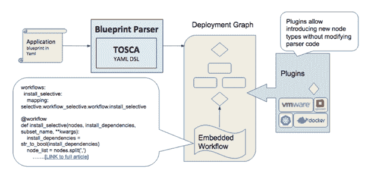

# ARIA 和云可移植性的“最小公分母”问题

> 原文：<https://thenewstack.io/avoiding-least-common-denominator-approach-hybrid-clouds/>

[混合云](http://getcloudify.org/2016/08/08/cloud-management-roundup-orchestration-paas-cmp.html)只有当应用程序被设计为可在 IT 产品组合中的所有基础架构选择上可预测地运行时，才能发挥作用。大多数组织通过“最小公分母”的设计方法来实现这一点，在这种方法中，API 抽象被彻底简化，只剩下最少的一组云服务。这种方法虽然很实用，但却剥夺了不同基础设施提供的几乎所有有用的高级功能。

一个新的 Apache [开源](http://getcloudify.org/2016/03/15/cloud-open-networking-summit-nfv-sdn-aria-tosca-application-orchestration-automation.html)项目， [ARIA](http://ariatosca.org/) (自动化的敏捷参考实现)想要解决这个妥协。

## 混合动力是真实的，也是热门的

RightScale 最近的一项调查报告称，云用户平均利用六种不同的云，使用 50-50 混合的公共云和私有云进行实验和应用部署。Veritas 的另一项调查表明，大约 74%的企业利用两家或更多的云基础架构供应商来支持其工作负载需求，23%的企业使用四家或更多的供应商。

正如这些调查所表明的，混合云(同时使用多个云，作为一个统一的基础架构)是一种生活方式，是 IT 的“新常态”。

然而，混合云没有“标准蓝图”,混合云的体系结构可以根据混合云的使用情形而变化。这使得 IT 部门肩负起一项新的重任:可移植性。[云可移植性](http://getcloudify.org/2016/07/21/building-your-application-for-cloud-portability-new-approach-hybrid-cloud.html)是在多个云基础设施上运行相同应用的能力，无论这些基础设施是公共的还是私有的，是专有的还是开源的。

## 为什么云可移植性如此重要

 [Nati Shalom

Nati Shalom 负责定义 GigaSpaces 产品的技术路线图和愿景，并负责与技术合作伙伴建立战略关系。Shalom 拥有多年的分布式计算经验，是大规模部署中所涉及的挑战和解决方案的行业专家。作为云计算领域的思想领袖，Shalom 是 cloud.org.il 联盟的创始人，经常在行业会议上发言，并积极参与宣传基于空间的架构、数据网格模式和大数据应用的实时分析。](http://www.gigaspaces.com/) 

如今，对跨不同云环境的应用程序可移植性的需求是至关重要的。仅考虑几个便携性至关重要的用例:

*   **面向未来** —为了让您的应用“面向未来”免受行业中断的影响，并让您的选择保持开放，以便在新的发展出现时从中受益，通过为云可移植性设计应用，将应用与底层基础架构分离是非常重要的。
*   **应用程序部署可移植性** —开发软件应用程序的公司需要允许应用程序可移植性，以便为他们的客户提供一种在他们选择的云上配置和部署软件产品的简单方法。在这种情况下，云可移植性可以类似于 Windows、Linux 和 Mac 之间的操作系统可移植性，甚至是 iOS 和 Android 之间的移动应用程序可移植性。云代表了一个市场，通过设计便携性，您可以最大限度地将您的产品推向这些市场。
*   **云爆发** —云爆发允许应用在其稳定状态期间在固定的资源池上运行，然后在峰值负载期间跨越到按需云资源。这是一种优化资源(即节省成本)并在需要时提供容量访问的方式。
*   **迁移** —一个常见的例子是组织从其 [VMware](http://getcloudify.org/vmware-hybrid-cloud.html) 环境迁移到 [OpenStack](http://getcloudify.org/2014/07/10/what-is-openstack-tutorial.html) 或从私有云迁移到公共云。可移植性允许组织有选择地在两个环境之间转换应用程序，同时将它们作为一个环境进行管理。
*   **相同云版本之间的可移植性** —最常见的云可移植性用例可能是相同基础设施版本之间的迁移。允许基础设施升级的一个常见策略是创建新版本的新实例(云站点)，然后逐渐将应用程序过渡到这个新版本。

## 可移植性的“最小公分母”方法

没有云的可移植性，你就无法真正实现混合云，也无法获得它的好处。不幸的是，许多现有的云可移植性解决方案并不适合上述所有不同的用例，因为它们采用了“最小公分母”的方法，固有地限制了底层云的能力。

这些解决方案依赖于跨所有云的通用 API 抽象层。常见的 API 抽象已经将其自身限制在计算、存储和网络上，即使在这一层，抽象也往往相当简单，往往不会公开底层基础架构的许多更高级的功能，也不允许访问云基础架构支持的丰富服务集，如数据库服务、分析服务、LBaaS 等。因此，依赖这种简单的 API 抽象层代价很高；最小公分母模型丧失了现代云提供的许多优势。

问题的症结在于:基于 API 抽象的云可移植性解决方案忽略了最重要的元素——应用程序。在混合云环境中运行应用程序需要管理整个应用程序堆栈，其中基础架构实际上只是一个组件。“整个堆栈”还包括配置管理、容器、监控、日志记录和策略，以及应用程序本身在整个生命周期中的维护。

## 实现 ARIA 项目

因此，与其使用最小公分母方法来实现云的可移植性，更好的方法是考虑整个堆栈，让应用程序开发人员在“更高公分母”的级别上推动集成工作。这正是《咏叹调》中所采用的方法。

ARIA 是一个工具，开发人员可以使用它在多个基础设施上部署和编排单个应用程序，同时保留对云提供的所有强大功能和丰富服务集的访问。

下图显示了它的工作原理:

ARIA 建立在管理应用的整个堆栈和生命周期所需的三大支柱之上，同时避免了对单一抽象层的需求:

1.  **一种与基础设施无关、易于扩展的模板语言(TOSCA):**(云应用的拓扑和编排规范)为抽象提供了比 API 抽象更大的灵活性[，因为它允许轻松扩展和定制](http://getcloudify.org/2015/07/21/what-is-TOSCA-cloud-application-orchestration-tutorial-cloudify.html)，而无需开发或更改底层实现代码。这是通过将底层云 API 映射到类型中，并允许用户定义通过脚本访问和使用这些类型的方式来实现的。
2.  **云插件:**用于各种云服务的内置插件为这些服务中最常见的服务提供了现成的集成点，但与最小公分母方法不同，它们可以轻松扩展以支持任何云服务。
3.  **工作流:**工作流支持与部署图的交互，并提供另一种方式来抽象常见的云操作任务，如升级、快照、扩展等。

有了这三个组件，ARIA 为应用程序开发人员提供了一套用于管理整个应用程序堆栈及其生命周期的构建模块。它还提供了更大程度的灵活性，允许用户为每个用例或应用程序定义自己的抽象程度。

通过这种方式，无需更改底层代码即可实现云的可移植性，从而实现真正的混合云及其所有优势。

<svg xmlns:xlink="http://www.w3.org/1999/xlink" viewBox="0 0 68 31" version="1.1"><title>Group</title> <desc>Created with Sketch.</desc></svg>