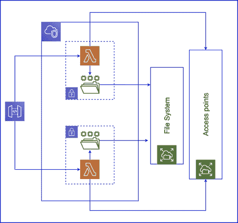

# 用可观察性避免无服务器反模式

> 原文：<https://thenewstack.io/avoiding-serverless-anti-patterns-with-observability/>

[桑德拉](https://www.thundra.io/)赞助了这篇文章。

 [萨尔吉尔·优素福

Sarjeel 是 Atlassian 的产品经理，负责引导 Atlassian 工具在其功能集中促进 DevOps 功能。](https://www.linkedin.com/in/syedsarj/) 

无服务器提供了改变我们对云构建方式的思考的机会。担心复杂而脆弱的云基础设施的日子很快就要结束了，您的整个业务逻辑都建立在这些基础设施上。所有这些职责现在越来越多地委托给云供应商，使您能够主要关注您的业务逻辑。

然而，当我们将更多的责任推给云供应商时，我们不仅放弃了控制权，还放弃了可观察性。这无意中导致了黑盒的情况，我们不知道我们的无服务器架构如何以及为什么运行。这使得检测反模式更加困难，加剧了这种情况。

无服务器的新采用者更容易受到反模式的影响，所以不知道或者不理解这些反模式的影响可能会令人沮丧。所以它是无服务器应用的障碍。

可观察性减轻了这种黑盒效应，并且理解可能的反模式允许我们监控正确的度量并采取正确的行动。因此，本文将介绍一些无服务器特有的主要反模式，并描述在可观察性方面的正确策略如何缓冲反模式对无服务器架构的影响。

## 使用类异步同步

无服务器应用程序在异步时工作得最好。这是一个由[埃里克·约翰逊](https://twitter.com/edjgeek?ref_src=twsrc%5Egoogle%7Ctwcamp%5Eserp%7Ctwgr%5Eauthor)在[无服务器日伊斯坦布尔](https://istanbul.serverlessdays.io/)的演讲中宣扬的概念，题为“[无服务器异步思维](https://twitter.com/slobodan_/status/1179718817649291265)后来，他去纳什维尔的无服务器日做了一个更长版本的演讲。

随着团队和公司开始采用无服务器，他们可能犯的最大的错误之一就是在设计他们的架构时仍然保持着一种单一的心态。这导致了他们以前架构的提升和转变。这意味着引入主要的控制器功能和错位的等待功能。

因此，处于空闲状态的功能也将被收费，因为它在技术上仍然是活动的。这违背了无服务器的[现收现付](https://medium.com/thundra/getting-it-right-between-ec2-fargate-and-lambda-bb42220b8c79)原则。

当将函数链接在一起时，这个问题变得更加严重。在这个过程中，一个函数对另一个函数进行异步调用，等待响应，而第二个函数对存储服务执行读/写操作。这增加了不可靠性的可能性，因为第一个函数可能会超时。当功能调用供应商生态系统之外的存储设备或本地存储服务时，情况会更糟。

### 你应该观察什么？

反模式的明显影响是潜在的更高成本和更高的超时概率。因此，第一步是关注函数的开销、持续时间和超时。

根据您的监控工具，可以通过设置这些指标的警报来提高流程的效率。例如，桑德拉允许你[在所有这些指标上设置警报](https://www.youtube.com/watch?v=tsk3iZTY5qY&ab_channel=Thundra)。它甚至为您提供了在期望的时间间隔内定义指标速率的灵活性。

为了进行深入的分析，调查应用程序的分布式跟踪可能会带来更有成效和更有根据的见解。这是因为随着向微服务的转变，系统本身变得分布式。因此，监测方式必须有助于采取更全面的方法，以跟踪的形式衡量每一笔交易。这允许监控彼此同步或异步交互的业务流。服务中的错误或延迟可能由上游或下游服务中的任何一个或两者引起。

## 分享的需要

有些情况下，库或业务逻辑，甚至只是基本代码**有**要在功能之间共享。然而，这导致了某种形式的依赖和耦合，与无服务器架构背道而驰。

由此产生的最突出的缺陷是它阻碍了可伸缩性。随着您的系统规模和功能不断相互依赖，出错、停机和延迟的风险也在增加。因此，这充当了无服务器可伸缩性属性的反模式。

这种问题出现的一个例子是机器学习，其中大型库必须在用于处理[测试、验证和训练数据集](https://medium.com/analytics-vidhya/testers-guide-for-testing-machine-learning-models-e7e5cea81264)的各种功能之间共享。AWS 提供了 [Lambda 层](https://aws.amazon.com/blogs/compute/using-lambda-layers-to-simplify-your-development-process/)，试图提供一些分辨率，但这可能并不总是理想的解决方案。

在大多数情况下，共享代码库和逻辑的需求不仅是一种反模式，也是对无服务器功能的技术限制。例如，AWS Lambda 函数在/tmp 存储上有一个 [512MB](https://blog.thundra.io/aws-lambda-limits-to-keep-in-mind-when-developing-a-serverless-application) 的硬限制。这意味着当开发人员构建他们的 AWS Lambda 函数代码时，必须时刻注意这个限制。

AWS 最近通过发布令人垂涎的[亚马逊 EFS 和 AWS Lambda 集成](https://medium.com/thundra/expanding-the-serverless-war-chest-with-aws-efs-df6dbf9fa89c)解决了这个问题。这种新的集成允许函数通过集成的亚马逊 EFS 实例访问共享库或数据。然而，这并不能证明各种职能相互依赖是合理的。考虑到上面提到的反模式带来的风险，仅仅因为某件事情现在可以实现并不意味着它是最有效的解决方案。

### 你应该观察什么？

如果打算共享信息和耦合无服务器功能，并且没有预防措施可以解决该问题。在这种情况下，测量这种架构设置的效果就变得势在必行。冷启动尤其是一个需要测量的指标，因为由于耦合，一个功能的运行可能依赖于另一个功能。如果其中一个功能因冷启动而出现延迟，可能会对所有其他耦合功能产生连锁反应。

总的来说，应该对整个架构进行映射。AWS 和桑德拉都可以概述您的云架构。了解云架构的构建方式是有效避免该问题的唯一方式。

## 粒度函数

基于将大型紧凑业务案例分解为较小的独立功能的概念，有可能达到最终证明有害的粒度级别。很明显，当将业务逻辑分解为单个功能的努力达到一定程度时，开销会抵消收益。在单个函数之间传递事件的需求导致了对 webhooks 和 API 的思考。因此，增加了工程工作量、安全风险和延迟。随着功能数量的增加，这些问题也会成倍增加。

### 你应该观察什么？

随着系统的增长，架构通常会变得非常复杂。因此，当您开始采用无服务器时，首先要明确的是您的分布式系统架构图。

过度细粒度架构的另一个标志是无服务器功能变得过于冗长。粒度架构的主要开销是通信，这是应该避免的。通信开销和对 AWS Lambda 函数的不必要调用意味着更多的工程复杂性和潜在的更高成本。因此，检查开销和总调用计数将是有益的。

还建议更深入地研究调用，并跟踪触发组件。如果注意到一个λ函数被相同的触发λ函数持续触发相当高的次数，那么可以考虑合并两个λ函数。

此外，如上所述，从整体服务到微服务以及最终的纯无服务器分布式架构的转变导致了对通信基础设施的需求。因此，有必要监控在这些通信信道之间发送的数据的有效载荷。

## 结论

总之，无服务器正在蓬勃发展——但它也有自己的缺陷。有各种各样的最佳实践来避免反模式，但是最终的解决方案是将这些最佳实践与可观察性的强烈倾向结合起来。那些采用该技术的人不仅需要知道可能的反模式，还需要知道如果他们找到了进入系统架构的方法，需要监视什么。

可观察性仍然是一个成熟的领域，云供应商现在正在关注这一呼声。然而，内置监控解决方案仍然不能满足整体需求，只能提供基本的可观察性。在根据“度量”、“跟踪”和“日志”这三个支柱实现真正的可观察性时，最好是寻求专门针对该工作的第三方监控工具。

亚马逊网络服务是新堆栈的赞助商。

通过 Pixabay 的特征图像。

<svg xmlns:xlink="http://www.w3.org/1999/xlink" viewBox="0 0 68 31" version="1.1"><title>Group</title> <desc>Created with Sketch.</desc></svg>