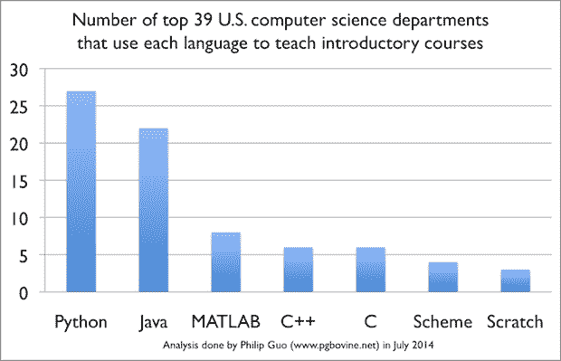

# 令人惊叹的 Python 框架、库和软件...外加玉米饼

> 原文：<https://thenewstack.io/awesome-python-frameworks-libraries-and-software-plus-tacos/>

GitHub 上本周有一个趋势列表，它被列为 Python 框架、库和软件的最终精选指南。这是 Python 越来越受欢迎的一个例子，尤其是在编程新手中。此外，这是 GitHub“令人敬畏的列表”的一个例子，这些列表可以在社交编码平台上获得，并且是远远超出编程的社区文化的典范。太棒了——python 在列表中有大约 70 个条目。列表项目涵盖环境管理、包装管理和配送等主题。音频、视频、地理标记、缓存、调试——列表只是向下滚动页面。列表中的每一项都链接到一个推荐的子列表。例如，它拥有用于开发 RESTful APIs 的 [11 库](https://github.com/vinta/awesome-python#restful-api)，以及用于全栈 Web 框架的 [11 库](https://github.com/vinta/awesome-python#web-frameworks)。它还列出了流行网站和 twitter 账户等资源。Python 的受欢迎程度当然在上升。根据一项研究，Python 最近超过 Java 成为向学生介绍编程和计算机科学的最受欢迎的程序。IEEE 将 Python 列为顶级编程语言的第四名。awesome-python 列表只是 GitHub 上数百个列表中的一个。有[非技术性列表](https://github.com/jnv/lists#non-technical)列出了旧金山[素食餐馆](https://github.com/mojombo/sf-vegetarian-restaurants)和[社区驱动、面向对象的 taco 食谱报告](https://github.com/sinker/tacofancy)。有开发者大会的技术列表和免费编程书籍(26960 星，5196 叉)。然后是 awesome-*列表，包括学习算法和任何数量的其他主题的 awesome 列表。然后列表得到所有元。这是名单列表。然后它带着列表列表、牛逼的立方等进入兔子洞。

快乐的星期五。

通过 Flickr Creative Commons 的特色图片。

<svg xmlns:xlink="http://www.w3.org/1999/xlink" viewBox="0 0 68 31" version="1.1"><title>Group</title> <desc>Created with Sketch.</desc></svg>