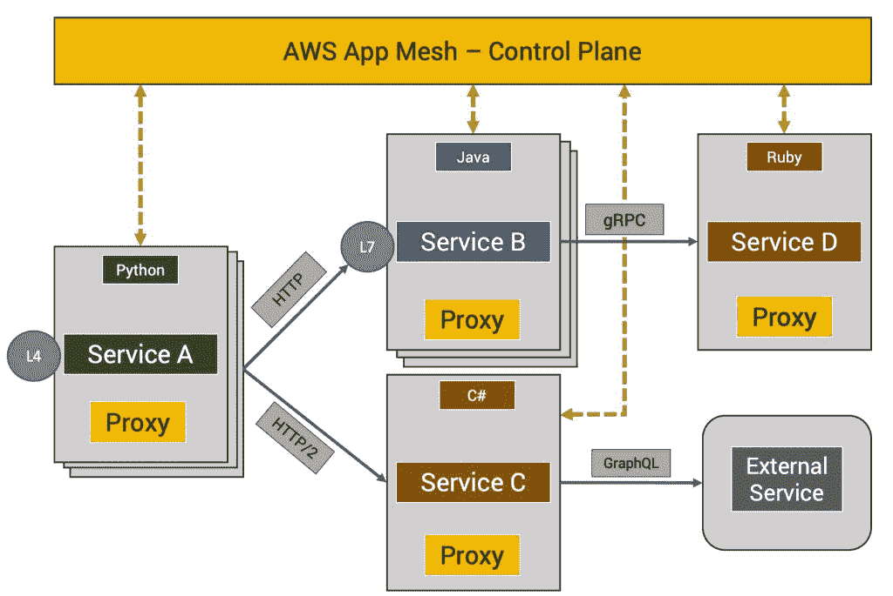
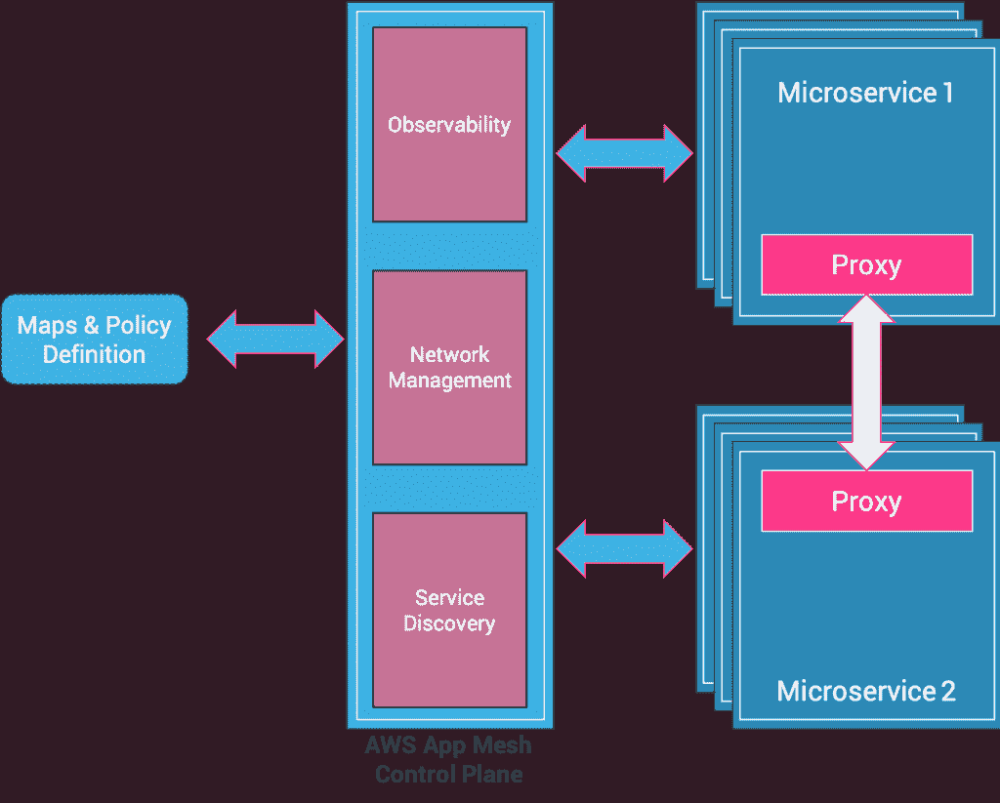
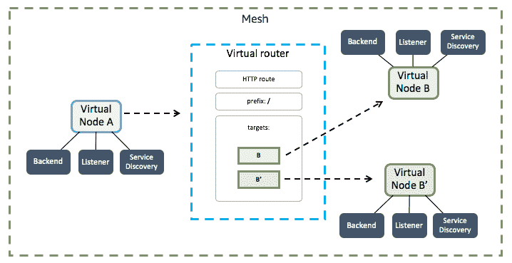
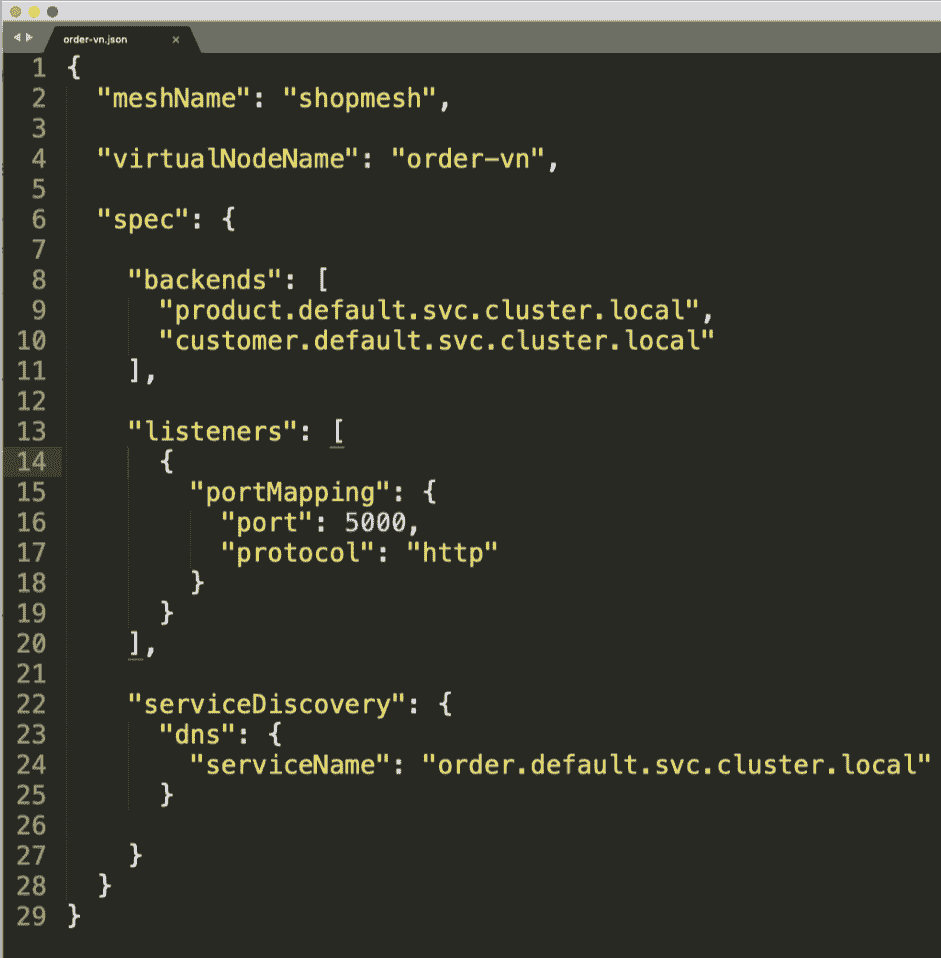
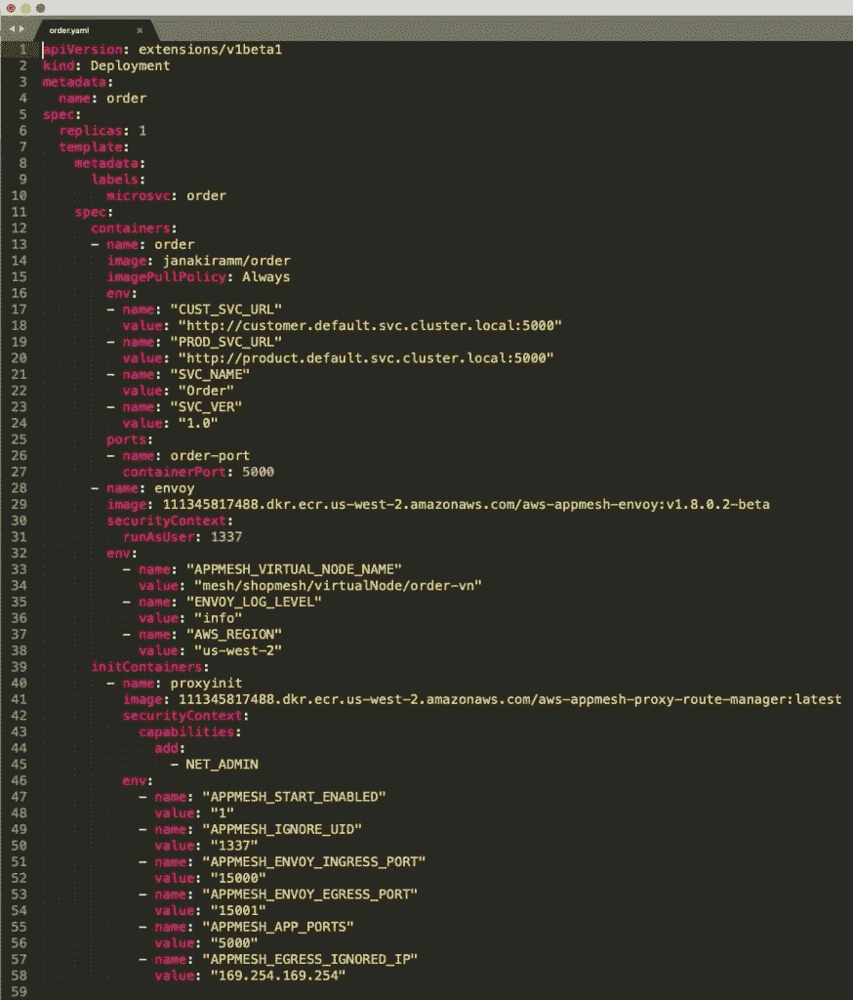
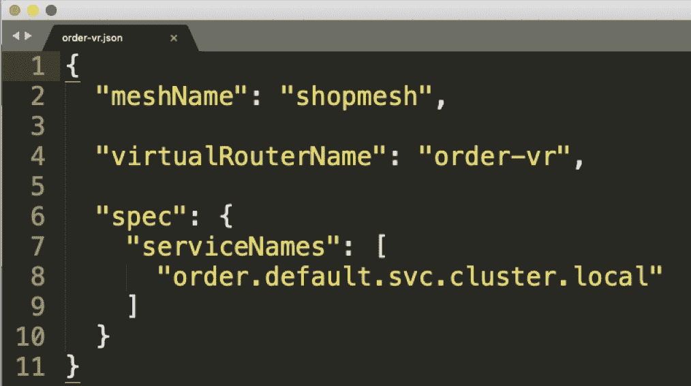
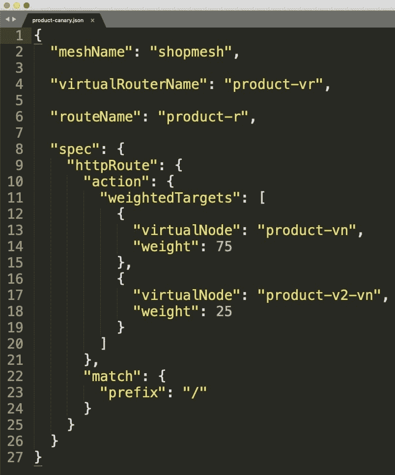

# AWS 应用网格:亚马逊自己的微服务服务网格

> 原文：<https://thenewstack.io/aws-app-mesh-amazons-own-service-mesh-for-microservices/>

服务网格技术已经成为微服务架构的关键组成部分。开源项目，如[特使](https://www.envoyproxy.io)、 [Istio](https://istio.io) 、 [Linkerd](https://linkerd.io) 和[consult](https://www.consul.io)，在最近的过去已经变得越来越重要。通过 Kubernetes 解决了容器编排问题后，云原生生态系统现在正在努力提高服务网格提供的微服务的效率和弹性。

继容器管理之后，服务网格已经成为微服务基础设施的核心构建模块。意识到其重要性，云提供商现在提供托管服务网格平台及其 CaaS 产品。谷歌是第一个向谷歌云平台客户提供 Istio 即服务的公司。在 2018 年 12 月的 [re:Invent 大会](/aws-reinvent-day-1-new-machine-learning-data-infrastructure-services/)上，亚马逊推出了 [AWS App Mesh](https://aws.amazon.com/about-aws/whats-new/2018/11/introducing-aws-app-mesh---service-mesh-for-microservices-on-aws/) ，这是一个面向 ECS、EKS 和 Fargate 的托管服务 Mesh 平台。

## 什么是 AWS App Mesh？

AWS App Mesh 可以轻松管理和监控微服务。在 AWS 服务(如 EC2、ECS、EKS 或 Fargate)中部署服务后，App Mesh 将允许您控制针对微服务的通信和网络流量。除此之外，App Mesh 还通过记录、跟踪和监控微服务来提供卓越的可观察性。

App Mesh 有两个核心组件——控制平面和数据平面。数据平面部署在应用程序中，而控制平面对用户隐藏，由 Amazon 管理。

为了将微服务与 App Mesh 集成，DevOps 团队需要在部署工件中包含额外的容器。该服务依赖于 Envoy 代理和特定于应用网格的路由代理，并通过 sidecar 模式与微服务一起打包和部署。这些额外的容器拦截流量，并根据应用网格控制平面应用的策略对其进行控制。

与任何其他 AWS 托管服务一样，App Mesh 控制平面通过 CLI、SDK 和基于 web 的控制台公开。发送到控制平面的流量和路由策略用于管理参与的微服务的进出。

 
例如，要将在 EKS 运行的 Kubernetes 应用程序与 App Mesh 集成，您必须遵循三个步骤:

1)在部署定义中包括 Envoy 和 App Mesh 路由器容器，
2)将每个部署映射到 App Mesh 节点，并为每个节点定义网络路由策略，
3)将映射和策略提交给 App Mesh 控制平面以改变通信流。

由于边车集装箱密切关注服务，它们可以将详细的遥测数据输入控制平面。这些遥测数据不仅可以用来分析交通流量，甚至可以用来分析每项服务的健康状况。这些信息成为评估应用程序整体性能的金矿。

AWS 应用网格服务目前处于公开预览阶段，可用性仅限于少数地区。在正式发布时，所有的功能和集成都将会推出。

## AWS 应用网格的关键概念

由于 App Mesh 可以与 AWS 的各种计算服务一起使用，因此它遵循自己的分类，这不同于 Kubernetes 或 ECS 术语。让我们仔细看看构建模块。

定义应用网格的第一步是创建一个网格实例，作为属于一个应用的所有微服务的逻辑边界。下一步是识别虚拟节点。

虚拟节点是一个指针，指向具有已知端点的部署单元。在 Kubernetes 中，虚拟节点映射到部署和服务对象的组合。即使部署规模扩大，路由流量的服务也保持不变。因此，具有多个 pod 副本的部署和关联的基于集群 IP 的服务无缝映射到虚拟节点。

由于没有关联服务的 pod 或部署在 Kubernetes 中是不可访问的，因此很容易将虚拟节点视为部署及其关联服务的逻辑表示。

虚拟节点定义包含后端声明(它可以调用的服务端点列表)以及用于服务发现的主机名和允许的入口端口。它本质上包含 DNS 名称、入口和出口定义，这将允许控制平面适当地过滤流量。

上面的 JSON 在名为 shopmesh 的网格中定义了一个名为 **order-vn** 的虚拟节点。它调用两个服务——**产品**和**客户**——它们被列为后端。虚拟节点通过端点**order . default . SVC . cluster . local**公开，这是 Kubernetes 中的一个 ClusterIP 服务。后端也是 Kubernetes ClusterIP 服务，公开部署**产品**和**客户**。

订单服务的 Kubernetes 部署定义被修改为包括 App Mesh 所需的边车容器。它还具有对相应网格( **shopmesh** )和虚拟节点( **order-vn** )的引用。

虚拟节点可以包含虚拟路由器来控制入站流量。网格中可用的每个服务端点都需要包装在虚拟路由器中。在大多数情况下，它与为虚拟节点注册的 DNS 名称相同。在某些情况下，这可能是内部负载平衡器将流量路由到 VPC 内的私有子网。

上面定义的虚拟路由器被绑定到订单服务。它与指向 **order-vn** 虚拟节点的 DNS 指针相同。

每个虚拟路由器将具有一个或多个相关联的路由，这些路由将特定的虚拟节点与虚拟路由器连接起来。该路由还可以具有用于匹配对虚拟路由器的请求的条件，并且相应地将流量分配给其相关联的虚拟节点。将路由器视为应用于虚拟路由器级别的规则引擎。它可以基于预定义的条件和规则有选择地将流量路由到一组虚拟节点。

当我们希望将 75%的流量路由到 V1，而仅将 25%的流量路由到 V2 时，我们定义如下所示的规则。需要注意的是 **product-v2-vn** 是一个指向 v2 服务端点的虚拟节点。

App Mesh 的实体(虚拟节点、虚拟路由器和路由器)在 JSON 中声明，并通过 CLI 提交给控制平面。

## AWS 应用网格的使用案例

应用网格解决了三个关键场景:

*   蓝/绿部署— App Mesh 使同一微服务的多个版本之间的切换成为可能，不会出现任何宕机。通过改变路由器的规则，流量几乎可以立即从蓝色部署转向绿色部署。
*   Canary 版本—当部署新版本时，流量可以有选择地路由到两个或更多虚拟节点。基于控制平面报告的可观察性度量，发送到新版本的流量可以逐渐增加。
*   可观察性——可以密切监视参与同一个网格的微服务的延迟、错误率、跟踪和调试信息。这种遥测数据可以传输到 CloudWatch 和 DataDog 等第三方监控服务。DevOps 可以获得关于当前部署状态的详细信息。

在接下来的文章中，我将带您通过 AWS App Mesh 逐步了解在 Kubernetes 上运行的微服务的金丝雀部署过程。敬请关注。

<svg xmlns:xlink="http://www.w3.org/1999/xlink" viewBox="0 0 68 31" version="1.1"><title>Group</title> <desc>Created with Sketch.</desc></svg>