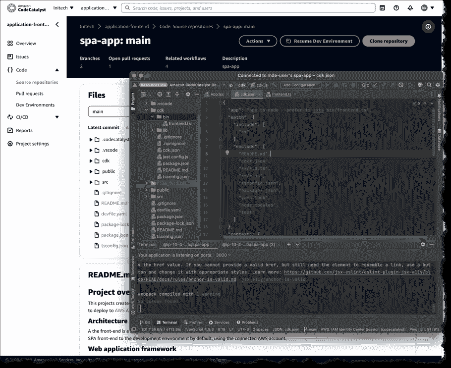

# AWS 代码催化剂:开发生命周期的“低代码”方法

> 原文：<https://thenewstack.io/aws-code-catalyst-a-low-code-approach-for-the-dev-lifecycle/>

AWS 的 CodeCatalyst 于本月在亚马逊网络服务[Re:Invent 用户大会](https://thenewstack.io/aws-reinvent-left-attendees-with-more-questions/)上发布，旨在以低代码的方式处理整个软件开发周期，即建立一个存储库，设置日志记录，CI/CD 管道。它的目的是减少“整个开发生命周期中的摩擦”，正如 AWS 开发者倡导者 [Steve Roberts](https://www.linkedin.com/in/steven-j-roberts/) 在[博客文章](https://aws.amazon.com/blogs/aws/announcing-amazon-codecatalyst-preview-a-unified-software-development-service/)中总结的那样。

“我们以开发人员、团队和协作为理念构建了这一平台。它真的可以帮助你在 AWS 的不同应用程序中进行规划、开发和协作，”AWS 首席技术官沃纳·威格尔在他的主题演讲中指出。

这个服务会引起那些曾经试图建立一个捆绑器的人的兴趣，他们不会捆绑或说出这样的话，“它在我的机器上工作，所以它应该在你的机器上工作，”当然，这种情况很少发生。

CodeCatalyst 包含的一些功能包括按需基于云的开发环境、问题管理、跟踪提交更改、拉式请求部署、自动化仪表板，以及通过电子邮件邀请其他人进行协作。所有这些都可以在称为蓝图的可选包中获得，蓝图由 AWS 提供，或者您可以创建自己的蓝图。

## **项目蓝图**

这些本质上是 AWS 预先设计的 CodeCatalyst“包选项”。这篇博文更正式地将它们称为“参数化的应用蓝图使您能够在几分钟内建立共享的项目资源来支持应用开发生命周期和团队协作。”

蓝图包括初始代码存储库(可以是 AWS 服务配置或 git 存储库)和问题跟踪器(接受内部或外部跟踪器)以及源代码和最佳实践(如果需要，这些都非常有用)。蓝图中还包括 CI/CD 管道和托管资源。编写一些业务逻辑，点击“部署”查看一些代码。

支持的语言有 [Typescript](https://thenewstack.io/what-is-typescript/) 、 [Python](https://thenewstack.io/an-introduction-to-python-for-non-programmers/) 、 [Java](https://thenewstack.io/java-usage-keeps-climbing-according-to-new-survey/) 、[。Net](https://thenewstack.io/net-7-simplifies-route-from-code-to-cloud-for-developers/) ，支持的框架包括 [React](https://thenewstack.io/learn-react-start-of-a-frontend-dev-journey/) 、 [Angular](https://thenewstack.io/google-engineer-outlines-whats-next-for-angular/) 和 [Vue](https://thenewstack.io/meet-vue-js-flexible-javascript-framework/) ，虽然没有提到未来的发布日期。

## **基于云的开发环境**

CodeCatalyst 没有让开发人员使用本地开发环境，而是使用 devfile(链接)来定义基于云的按需开发环境中的配置。编码、测试和调试项目所需的资源都在 devfile 中配置。

这个项目旨在解决的一个挑战是“环境漂移”。环境漂移的影响通常会在项目的后期显现。当团队中的某个人拥有的工具链或库的版本与项目相关的环境中的其他版本稍有不同时，就会发生这种情况。最终的结果是细微的错误被忽视了很长时间。开发环境消除了任何不必要的差异。

## **建造和部署管道**

沃格尔斯将其描述为“跨地区、跨客户和全球网络部署完整 AWS 服务，以及测试构建、端口、代码覆盖、单元测试和自动化的一种非常简单的方式……这是开发的重担，实际上并不能帮助我们更快地构建应用程序。”

蓝图创建的构建和发布管道可以在灵活或托管的基础设施上运行，可以使用按需计算或预配置的构建，包括选择机器大小和容器环境。内置或合作伙伴提供的动作是可接受的，GitHub 动作是可接受的，管道可以使用 YAML 或可视化编辑器进行配置。

您可以部署到流行的 AWS 服务，包括亚马逊弹性容器服务(ECS)、 [AWS Lambda](https://thenewstack.io/aws-lambda-is-a-step-towards-creating-a-new-normal/) 和亚马逊弹性计算云(Amazon EC2)。

CodeCatalyst 是一项托管服务，目前在 preview 中提供。

点击此处观看 Vogel 的全部主题演讲:

[https://www.youtube.com/embed/RfvL_423a-I?feature=oembed](https://www.youtube.com/embed/RfvL_423a-I?feature=oembed)

视频

<svg xmlns:xlink="http://www.w3.org/1999/xlink" viewBox="0 0 68 31" version="1.1"><title>Group</title> <desc>Created with Sketch.</desc></svg>