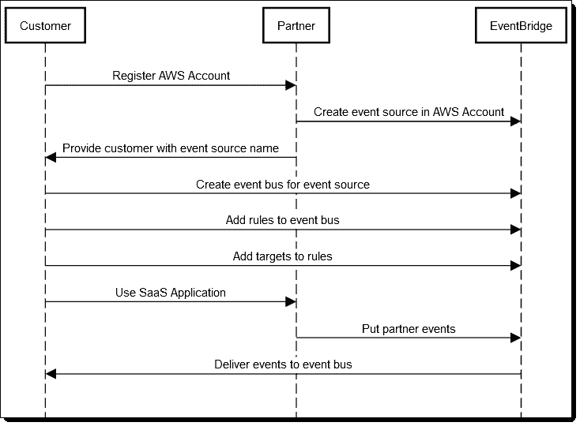
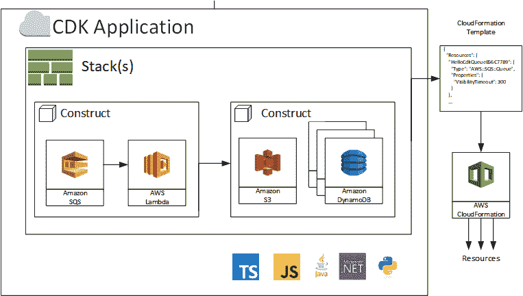

# AWS 首次推出事件总线，可编程基础设施支持

> 原文：<https://thenewstack.io/aws-debuts-an-event-bus-programmable-infrastructure-support/>

密切关注客户如何使用其云产品，[亚马逊网络服务](https://aws.amazon.com/)推出了两项新的著名服务，旨在自动将云原生应用部署到商业云服务上。

[EventBridge](https://aws.amazon.com/eventbridge) 是一个新的无服务器事件总线，用于跨不同的 SaaS 和 AWS 服务接收和处理数据。同样新的是，AWS [云开发套件](https://aws.amazon.com/cdk) (CDK)提供了直接从 IDE 中使用 Java、Typescript 或其他编程语言以编程方式定义 AWS 基础设施的能力。

周四，AWS 首席技术官沃纳·威格尔在 AWS 峰会上介绍了这两项技术。他强调，这些工具旨在帮助开发人员专注于云优先编码。

“容器环境感觉像是在云之前，因为突然之间你不得不再次管理基础设施，”他说，他指的是有多少 AWS 客户在将代码转移到 AWS 执行之前，将使用 Kubernetes 来帮助开发。“在云上运行的整个前提是，你可以专注于开发你的应用程序。”

“我坚信，未来的发展将是你只编写业务逻辑，而不是像现在这样管理任何计算机环境，”他补充道。

## 无服务器事件总线

EventBridge [使用事件总线模型，将 AWS 以其](https://aws.amazon.com/blogs/aws/amazon-eventbridge-event-driven-aws-integration-for-your-saas-applications/) [AWS Lambda](https://aws.amazon.com/lambda/) 开创的无服务器的概念扩展到应用程序到应用程序的消息传递。这个想法是提供“一个更简单的编程模型，你可以把你的代码、AWS 服务和来自第三方的服务缝合在一起。”该技术建立在 AWS CloudWatch 事件的基础上，但允许您添加第三方资源或自己的资源。

“基本上，你创建事件，事件进入事件总线。你订阅事件并处理它们，”沃格尔斯说。[根据解释该技术的博文](https://aws.amazon.com/blogs/aws/amazon-eventbridge-event-driven-aws-integration-for-your-saas-applications/):

异步的、基于事件的模型快速、简洁且易于使用。发布者(SaaS 应用程序)和消费者(运行在 AWS 上的代码)是完全分离的，不依赖于共享的通信协议、运行时环境或编程语言。您可以使用简单的 Lambda 函数来处理来自 SaaS 应用程序的事件，还可以将事件路由到各种各样的其他 AWS 目标。你可以在 Amazon Redshift 中存储事件或票证数据，在客户支持查询上训练机器学习模型，等等。

可以从 AWS 管理控制台、AWS 命令行界面或通过 AWS SDKs 访问 EventBridge。

使用 AWS EventBridge 创建事件总线。

AWS 还建立了一个合作伙伴计划，使第三方 SaaS 提供商更容易提供 EventBridge 的挂钩。最初，Datadog、Zendesk、PagerDuty、SignalFx、SugarCRM、Symantec 都已经注册。

## 可编程云

沃格尔斯说，现在 AWS CDK 已经普遍可用，它允许你描述你的执行环境应该是什么样子，以及你应该如何执行它。 [AWS CloudFormation](https://aws.amazon.com/cloudformation/getting-started/) 提供了这种能力，但是是以声明的形式。这种方法有一些缺点，正如另一篇 [AWS 博客文章指出的](https://aws.amazon.com/blogs/aws/aws-cloud-development-kit-cdk-typescript-and-python-are-now-generally-available/):

用于管理基础设施的配置文件传统上是以 YAML 或 JSON 文本文件的形式实现的，但这样一来，您就失去了现代编程语言的大部分优势。具体来说，使用 YAML，很难检测到文件在传输到另一个系统时被截断，或者在从一个模板复制粘贴到另一个模板时丢失了一行。

CDK 的目标是帮助程序员专门旋转基础设施，允许他们使用他们熟悉的语言和 ide 描述他们需要的资源，如 Java、Python、JavaScript 和 TypeScript。用于编写应用程序的语言可以与用于定义应用程序将在其上运行的基础结构的语言相同。“这是理想的目的地基础设施即代码，因为它确实是你正在编写的代码，”沃格尔斯说。

在一次演示中，AWS 布道者 [Martin Beeby](https://twitter.com/thebeebs) 展示了如何使用 CDK 来构建虚拟私有云(VPC)，然后使用带有 TypeScript 的 CDK 构建弹性容器服务(ECS)集群。CDK 提供了一组可以在本地机器上运行的命令。还提供了针对特定 AWS 服务的模块。使用他们喜欢的语言，程序员创建定义 VPC 或其他设置的“结构”。具有代码完成功能的 IDE 将能够向开发人员显示特定函数或调用的所有选项，并且可以轻松地调用文档。

一旦程序员完成，CDK 就创建转换脚本来部署所请求的资源。任何未指定的内容都被设置为“合理的默认值”在 VPC 的例子中，它在没有具体说明的情况下设置子网、路由和 NAT 网关。同样，创建一个类似的“构造”来设置集群，然后可以使用一个命令来部署集群。Beeby 还导入了一个 ECS 模式库来在集群上部署一个 [AWS Fargate](https://aws.amazon.com/fargate/) 服务。

一份 CDK 申请。

## 在云端更便宜？

沃格尔斯在演讲中分享了许多其他新产品。在人工智能领域，他吹捧说，现在超过 85%的谷歌 [TensorFlow](https://www.tensorflow.org/) 机器学习库用户实际上正在亚马逊网络服务上部署这项服务。他将这一成功率归功于 AWS 提供更高计算核心利用率的能力——根据 AWS 的测试，一个股票 Tensorflow 分布在 256 个 CPU 上只能实现 65%的效率，而 AWS 优化版本可以实现 90%。据沃格尔斯称，AWS 承诺进一步削减机器学习成本，并透露了 AWS 的 Sagemaker ML 部署服务的实例，该服务可以节省高达 80%的部署成本。

在主题演讲的一个案例研究中，[金融行业监管局](http://www.finra.org/)的首席信息官 [Steve Randich](https://www.linkedin.com/in/steve-randich/) 描述了 FINRA 如何使用 AWS 服务捕捉所有每日股票市场数据，然后重新创建这些数据，以查找经纪公司和交易公司的欺诈和滥用行为。这项工作在任何给定时间都需要大约 50，000 个计算节点，这些节点每天接收 7TB 的新数据(添加到 37PBs 的数据堆中)。该系统每天将进行高达 1/2 万亿次“验证检查”。

Randich 说，令人惊讶的是，在云中运行这些工作的成本比组织在内部构建这个系统要低。

<svg xmlns:xlink="http://www.w3.org/1999/xlink" viewBox="0 0 68 31" version="1.1"><title>Group</title> <desc>Created with Sketch.</desc></svg>