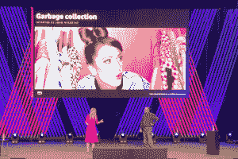

# AWS 开发工具负责人 Ken Exner:一个云 API 统治一切

> 原文：<https://thenewstack.io/aws-dev-tools-head-ken-exner-one-cloud-api-to-rule-them-all/>

从本月早些时候在拉斯维加斯举行的 AWS Re:Invent 会议来看，云巨头亚马逊网络服务公司(Amazon Web Services)的高级工程管理人员显然一直在考虑抽象概念。在其标志性的主题演讲中，亚马逊首席技术官[沃纳·威格尔](https://twitter.com/Werner)与[分享了](https://thenewstack.io/werner-vogels-6-rules-for-good-api-design/) [AWS 云控制 API](https://docs.aws.amazon.com/cloudcontrolapi/latest/userguide/what-is-cloudcontrolapi.html) 的消息，该 API 将公司的一系列服务统一在单一 API 格式下，或者说是“抽象”以方便开发者。

该公司还通过新发布的 [Amplify Studio](https://aws.amazon.com/amplify/studio/) 以及 [SageMaker Canvas](https://aws.amazon.com/blogs/aws/announcing-amazon-sagemaker-canvas-a-visual-no-code-machine-learning-capability-for-business-analysts/) 从杂乱的开发流程中抽象出来，这两个工具分别用于减轻构建 web 应用程序和机器学习模型的认知开销。

当天晚些时候，[在沃格尔斯的主题演讲](https://www.youtube.com/watch?v=8_Xs8Ik0h1w&t=5s)之后，新的堆栈与 [Ken Exner](https://www.linkedin.com/in/ken-exner-b914542/) 坐在一起，他是 AWS 的开发者工具负责人，这个头衔几乎没有传达他权限内的广泛的 AWS 开发项目，包括帮助开发者在 AWS 上构建的软件开发工具包、命令行界面工具、移动和前端服务，如 [Amplify Studio](https://aws.amazon.com/amplify/studio/) 、 [AppSync](https://aws.amazon.com/appsync/) 和 [Device Farm](https://aws.amazon.com/device-farm/) 。

他的领域还包括基础设施即代码工具，如 [CloudFormation](https://aws.amazon.com/cloudformation/) 、[云开发工具包](https://aws.amazon.com/cdk/) (CDK)和云控制 API 像 [CloudNine](https://aws.amazon.com/cloud9/) 这样的 IDE 插件；应用生命周期管理工具，如代码套件、 [CodeDeploy](https://aws.amazon.com/codedeploy/) 和[code build](https://docs.aws.amazon.com/codebuild/latest/userguide/welcome.html)；以及该公司在开源语言和运行时方面的所有投资，比如围绕 Java 和 Rust 的投资。咻！

当天晚些时候，埃克斯纳本人与 AWS DevOps 产品营销负责人[艾米丽·弗里曼](https://www.linkedin.com/in/editingemily/)一起主持了一场关于抽象的有趣的开发者演讲，他在演讲中推出了[下一代开源 Java 垃圾收集器](https://thenewstack.io/generational-shenandoah-offers-java-a-better-way-to-collect-garbage/)。在我们的采访中，我们讨论了抽象、Amplify Studio、“低代码”的含义、CDK 和云控制 API、[新发布的 Rust SDK、](https://aws.amazon.com/about-aws/whats-new/2021/12/aws-sdk-rust-developer-preview/)并进一步讨论了抽象，讨论了泄漏的抽象。

**新的堆栈:从 AWS Re:Invent 2021 中可以学到什么？**

**埃克斯纳**:当然，正如你在沃纳的主题演讲中看到的，有一些事情是更大趋势的一部分。一个是抽象。我们现在投资的事情之一，也是我们将继续投资的事情之一，是在 AWS 之上分层抽象。AWS 构建了所有这些服务的广泛组合。现在，我们关注的一件事是构建抽象概念，使消费这些服务变得更加容易。

像 Amplify 和 Amplify Studio 这样的东西，本质上是 AWS 服务之上的一组抽象。因此，如果你正在建立一个网站，你不必弄清楚如何把 DynamoDB 和 Cognito、s3 和 Lambda 放在一起。我们为你做那件事。

那么 Amplify Studio 是 Amplify 服务的前端？

传统的 Amplify 是一套帮助你构建网络和移动应用后端的工具。它侧重于业务逻辑和后端。因此，如果我的网站或 web 应用程序需要登录和身份池，它可以帮助设置。如果它需要一些数据表，它会帮助你设置。

它没有做的是帮助你建立前端。所以，Amplify Studio 把它连接起来。因此，它允许您构建前端，将其连接到后端，并实际构建后端。

你会称之为“低代码”解决方案吗？

是少码，不是低码。我认为,“低代码”和“无代码”这两个术语的挑战在于，人们通常指的是试图对你隐藏代码，试图让你以可视化或图形化的方式做一些事情。它试图不让你接触代码。

放大不是那个。这是给开发者看的。许多低代码和无代码产品更多的是针对业务分析师或非开发人员。这是一个重要的市场。我们希望开发民主化，向非开发人员公开编程。

Amplify studio 是面向开发者的。这只是让他们更有效率。它专门用于构建 web 和移动应用程序。

**你一定要在 AWS 上运行 Amplify 吗？**

嗯，理论上，你可以在别的地方举办。但是这其中很多都是建立在基础 AWS 服务之上的。下面是核心 AWS 服务，如 Lambda 和 s3、Cognito 和 DynamoDB。我们在此基础上构建库，根据您在构建 web 应用程序时尝试做的事情来提供简化的体验。

在此之上，还有 CLI 或 Amplify Studio 等工具，即 UI 层。所以它允许人们在任何水平上使用一套工具。并且具有可扩展性。所以你实际上可以和 CDK 结合。现在，如果 Amplify 不能为您提供某些东西，您可以使用 CDK 将它扩展到 CDK 支持的任何东西，包括 AWS 中没有的东西。所以，是的，理论上你可以用它来做非 AWS 的事情。

**你能解释一下 CDK** 吗？

我喜欢 CDK。所以云的形成已经有 10 年了。CloudFormation 允许您用 JSON 或 YAML 来声明性地描述您的基础设施。然后提供基础设施。

除此之外，CDK 还做了几件事。一个是它允许你以任何你想要的语言使用基础设施作为代码。因此，您可以使用 Java 或 JavaScript 或 GO 或 C#来强制性地描述您的基础架构，然后编译成 CloudFormation。

> "所有这些表达性的、基于动词的 API 或面向操作的 API 的问题在于，有很多东西需要学习."

通过允许您使用自己选择的语言，我们让开发人员更熟悉它。他们可以使用他们习惯的东西。他们可以有面向对象的设计。它们可以有继承，可以有 for 和 if 语句，所有你通常在语言中做的事情，但它仍然编译成 CloudFormation。

CDK 做的另一件事是，它有一个抽象模型，叫做构造。有不同层次的结构。这些本质上是分层的抽象。

因此，“第 1 层”或 L1 结构，只是一种资源的表示。该资源可以是 AWS 资源，也可以是非 AWS 资源。

有一个 L2 构造，第二层，这是一个 L1 的固执己见的实现。就像如果你正在建立一个虚拟私有云(VPC)，实际上有几十个选项可供选择。这大概就是你想要的。因此，这是一个基于最佳实践的固执己见的简单注释。

然后是第三层，这是一个架构模式。这是一个有 VPC 和其他一切的网站。你称之为第三层结构。或者发布-订阅实现，将 SMS 和 SQS 连接在一起。

因此，我们在这里所做的基本上是创建一个组合模型，说明如何使用这些结构来组装应用程序。你可以使用低级的资源，固执己见的资源，或者这些模式。然后用你选择的语言做所有这些，编译成 CloudFormation。

整个框架是一个非常强大的东西。我们在亚马逊普遍使用它。这是我们做亚马逊的方式。

我认为社区对此非常兴奋。Terraform[社区]刚刚创建了它的一个分支，并为 terra form 开发了一个 CDK。现在库伯内特有了一个 CDK。

它在堆栈中向上移动了一点，确保我们带来了更高级别的接口，更针对特定用例的接口。就 Amplify 而言，它是一个网络应用程序。我们将为您提供专门的 API，这样就可以轻松创建排行榜之类的东西，因为这些东西都在工具中。你不必和低级资源一起工作。

你能多谈谈云控制 API 吗？

所以大多数 AWS APIs 使用远程过程调用(RPC)。这是我们面向操作的界面，非常有表现力。它们是自我描述的:启动“实例”，猜猜它做了什么？它启动一个实例。附加卷？它附加了一个卷。

所以它们很有表现力。所有这些表达性的、基于动词的 API 或面向操作的 API 的问题在于，有很多东西需要学习。

还有另一种面向资源的 API 设计风格。你有一个宾语，然后有一组一致的动词。您可以创建、读取、更新和删除[CRUD]。

事实上，从技术上讲，s3 更像是一个面向资源的 API。但是我们大多数人都有更倾向于面向操作的 API。

云控制 API 是由我的团队开发的，旨在基于资源导向为所有 AWS 创建一致的 API。因此您可以将它用于 AWS 中的任何资源。事实上，CloudFormation 注册表中的任何资源。你可以有一个一致的 API 来创建读取、更新、删除、列表。这是一个基于模型的界面。

这是基于我们在云形成方面所做的工作。我们对云形成所做的事情之一就是创建映射。因此，对于“基础设施即代码”的环境，我们可以拥有这种基于 CRUD 的接口，而不是面向操作的接口。

> "整个软件历史都在构建抽象概念."

我们意识到这是一个为所有 AWS 创建一致控制平面的机会。我们的合作伙伴对此非常兴奋， [HashiCorp](https://www.hashicorp.com/?utm_content=inline-mention) 和 Pulumi，因为他们一直在努力跟上 AWS 的步伐。所以我们给了他们一个一致的 API，他们现在在 Terraform 和 Pulumi 中为他们所有的资源提供者使用。他们可以与我们保持同步，因为这是一个 API。是一致的。

它也适用于非 AWS 资源。因此任何 CloudFormation 注册表上的任何内容都可以通过它暴露出来。对于云来说，这是一个一致的 API，可以描述任何资源。

**我想这对开发者会有所帮助，就像 UNIX 一样，你不必学习每一个 API，你可以猜出来……**

是的，很多开发人员会喜欢这个，因为它是一致的。我要说的是，对于一些开发商来说，这是一种偏好。有些人更喜欢 RPC 风格的风格。但他们不必选择。他们在这里都有。他们获得现有的服务 API。他们现在有了这种一致的、基于质量的界面。

**让我们来谈谈新的 Rust SDK。AWS 看到开发人员被 [Rust](https://www.rust-lang.org/) 编程语言所吸引？**

相当多，对内对外。所以几年前，我们开始在亚马逊内部做更多的 Rust 开发。今天它相当受欢迎。所以 EC2 到 s3 云锋的很多后端都是用 rust 写的。

因此，几年前，我们开始在我的团队中投资 Rust，并雇佣了一些贡献者和参与社区的人。我们帮助将 [Rust 打造成一个基础](https://foundation.rust-lang.org/)，以确保它将为增长和积极的未来做好准备。

因此，我们对那里的增长和正在发生的事情感到兴奋，在外部，我们已经看到客户的使用量也在增加。所以 Rust SDK 的产生是为了支持我们和我们的客户。

随着这些新 SDK 的发布，我们将继续致力于满足开发人员的需求，确保我们始终支持他们，以及他们希望使用的任何工具、任何语言和任何技术。对我们来说很重要的一点是，我们的客户明白，我们将在他们所在的地方与他们见面，我们将帮助他们在他们使用的任何技术和工具上创造出色的 AWS 体验。

我期待着你的谈话。你对泄漏抽象的定义是什么？

乔尔·斯波尔斯基创造了这个术语。漏抽象是指较低层次的实现渗透到较高层次的抽象中。

所以我用的一个例子是 [AWS 弹性豆茎](https://aws.amazon.com/elasticbeanstalk/)。它帮助你在 AWS 上构建 web 应用。为此，它会在您的帐户中创建一些资源，这样它就可以访问 EC2。因此出于安全原因，实现会泄漏到高级帐户。

抽象从根本上做的是简化一些东西。在我们的谈话中，我们把它比作艺术。如果你看现代主义艺术，你可以看到它把一些东西简化成它的基本元素。

如果潜在的细节泄露了，那就是否定了那个承诺。不再简单。细节是你必须接触的东西。

所以你如何确保抽象对它自己是纯的，对它的意图是纯的，也就是说，你不需要知道底层的细节。

抽象实际上是关于我们作为一个行业如何让开发人员越来越多产。我们通过在抽象之上构建抽象来做到这一点。软件的整个历史都在构建抽象概念，因此您不必像过去那样考虑设备上的资源管理。您不必像开发人员过去那样手动管理内存。

你从操作系统开始，操作系统是硬件的抽象。你不必再考虑硬件，因为操作系统将它抽象化了。编程语言是抽象的。管理程序是操作系统的抽象。EC2 是管理程序的抽象。Lambda 是 EC2 的抽象。对象是一种抽象，面向对象的函数是函数编程中的一种抽象。所有这些都是不同的抽象。

所以抽象是关于生产力的，是关于消除过去占用时间的事情。

<svg xmlns:xlink="http://www.w3.org/1999/xlink" viewBox="0 0 68 31" version="1.1"><title>Group</title> <desc>Created with Sketch.</desc></svg>