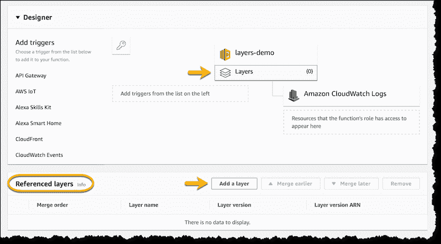

# AWS 通过定制的运行时、分层库来扩展 Lambda 服务

> 原文：<https://thenewstack.io/aws-extends-lambda-service-with-a-custom-runtime-layered-libraries/>

亚马逊网络服务在 2014 年通过推出其 [Lambda 服务](https://aws.amazon.com/lambda/)向世界介绍了无服务器计算的概念，并继续在将 Lambda 扩展到云原生 it 运营的其余部分方面开辟新天地。

周四，该公司在本周于拉斯韦加斯举行的 [AWS Re:Invent](https://reinvent.awsevents.com/) 年度用户大会上推出了 Lambda 的一系列新集成功能。

最值得注意的是，这个云巨头引入了两项新技术，进一步将无服务器整合到其他基于云的 IT 运营中， [Lambda 层和 Lambda 运行时 API](https://aws.amazon.com/blogs/aws/new-for-aws-lambda-use-any-programming-language-and-share-common-components/) 。Lambda Layers 提供了一种集中管理代码和数据的方式，这样就可以在多个函数之间共享代码和数据。Lambda 运行时 API 提供了一个简单的接口，可以在 Lambda 中使用任何编程语言或特定的语言版本。

该公司还引入了对 Websockets、负载平衡和多集成开发环境(ide)的支持

有了 Lambda 运行时 API，用户可以用 Lambda 官方支持的编程语言之外的语言编写无服务器函数(JavaScript、Python、Java、C#、Go，以及本周的 Ruby)。合作伙伴们已经开发了一些包来运行用 Rust、C++、Erlang 甚至 Cobol 编写的代码，以便在 Lambda 上运行。

使用层，开发人员只需将他们的组件或库打包到一个 ZIP 文件中，并将其作为 Lambda 层上传，该层可以在多个环境中共享。每个函数可以有多达五层，包括支持另一种语言的运行时。例如，Python 函数可以包含 Python 的 NumPy 和 SciPy 流行科学库。

通过层，公司[正在提供](https://thenewstack.io/serverless-thundra-adds-observability-to-aws-lambda/)他们的服务，包括来自 Datadog、Epsagon、IOpipe、NodeSource、桑德拉、Protego、PureSec、Twistlock、Serverless 和 Stackery 的服务。

AWS 已经[为 Lambda 扩展了它的工作流服务](https://aws.amazon.com/blogs/aws/new-compute-database-messaging-analytics-and-machine-learning-integration-for-aws-step-functions/)，称为 [AWS 步骤函数](https://aws.amazon.com/step-functions/)，这样开发者可以将其他 AWS 服务合并到他们的函数中。现在支持八种服务:

除了扩展 Step 函数，AWS 还允许您使用 AWS 无服务器应用程序模型，通过 AWS 无服务器应用程序存储库中的多个函数来[组装嵌套应用程序](https://aws.amazon.com/about-aws/whats-new/2018/11/sam-supports-nested-applications-using-serverless-application-repository/)。

在 AWS Re:Invent 的主题演讲中，AWS 首席技术官[沃纳·威格尔](https://twitter.com/Werner)解释说，通过嵌套应用，“你可以将存储库中的多个组件和服务组合成无服务器应用”。

该公司还扩展了其他一些服务，包括与 Lambda 的连接。功能[现在可以通过 AWS 应用程序负载平衡器跨多个实例进行负载平衡](https://aws.amazon.com/about-aws/whats-new/2018/11/alb-can-now-invoke-lambda-functions-to-serve-https-requests/)。并且[API 网关](https://aws.amazon.com/api-gateway/)，作为访问 Lambda 函数的管道，现在支持 [WebSockets](https://developer.mozilla.org/en-US/docs/Web/API/WebSockets_API) ，为从 Lambda 函数构建有状态应用程序提供了一条路径。

“你可以把东西从 Ec2 转移到无服务器，而不必改变你的 API，”Werner 说。

AWS 还为第三方集成开发环境(IDE)扩展了 Lambda 支持。现在开发者可以用 [PyCharm](https://www.jetbrains.com/pycharm/) 、 [IntelliJ](https://www.jetbrains.com/idea/) 和 [Visual Studio 代码](https://code.visualstudio.com/)编写他们的 Lambda 函数。

<svg xmlns:xlink="http://www.w3.org/1999/xlink" viewBox="0 0 68 31" version="1.1"><title>Group</title> <desc>Created with Sketch.</desc></svg>