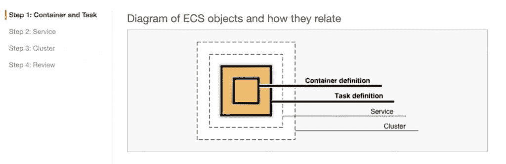
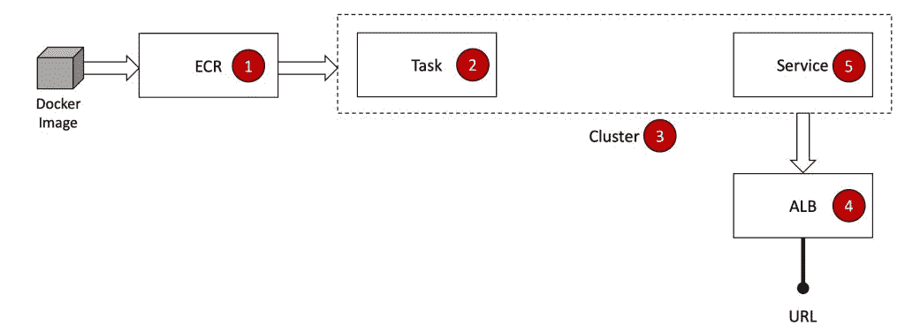
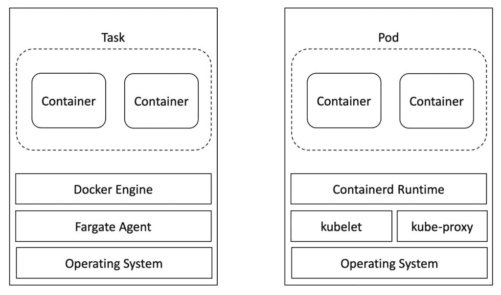
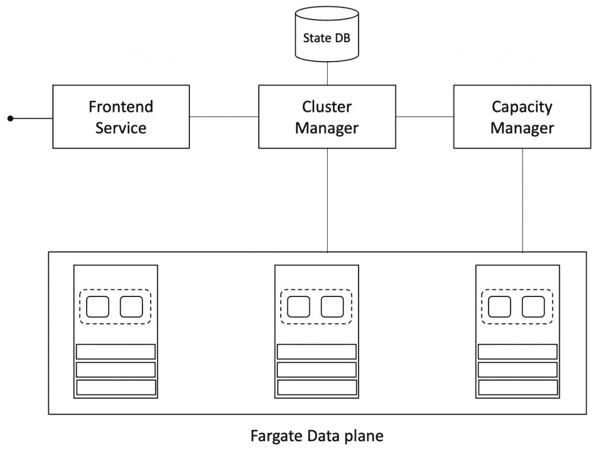
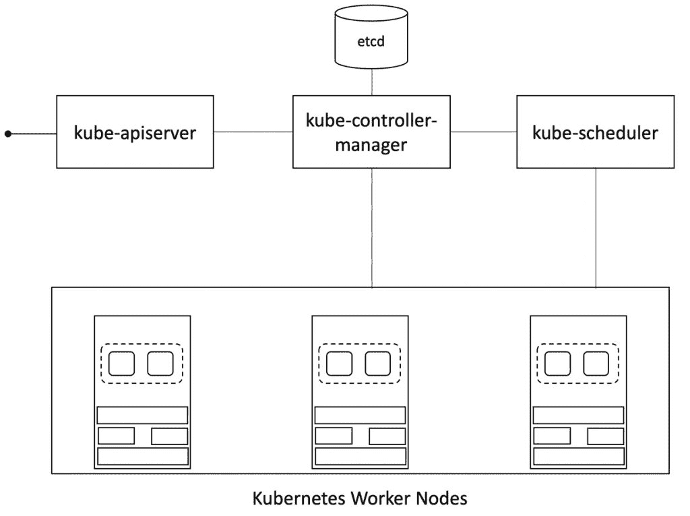
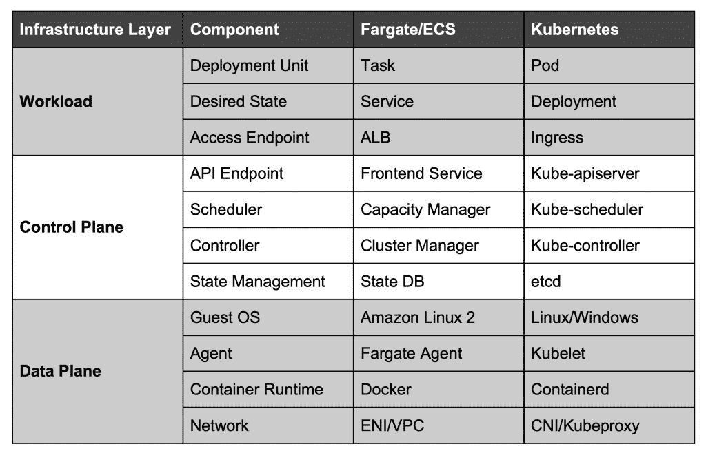

# 透过 Kubernetes 的镜头看 AWS Fargate

> 原文：<https://thenewstack.io/aws-fargate-through-the-lens-of-kubernetes/>

这是第二部分

[Janakiram MSV](https://janakiram.com/webinars/)

这是一个由四部分组成的系列，研究 Amazon Web Services 上自动化容器服务的发展。阅读第一部分

[here](https://thenewstack.io/the-evolution-of-serverless-container-platform-on-aws-fargate/)

；请在本周回来查看未来的文章。

亚马逊网络服务在 2017 年发布了 [Fargate](https://aws.amazon.com/fargate/) ，以简化运行容器化工作负载所涉及的工作流程。Fargate 最初是为[亚马逊弹性容器服务](https://aws.amazon.com/ecs/) (ECS)推出的，现在扩展到了[弹性 Kubernetes 服务](https://aws.amazon.com/eks/) (EKS)，使 Kubernetes 开发者和用户能够在无服务器和无节点的环境中运行容器。

虽然 AWS Fargate 是一个抽象层，但实际的编排是由 ECS 完成的。选择普通 ECS 和 Fargate 的关键区别在于 EC2 容器的公开和管理方式。使用 Fargate，您永远不会看到底层 EC2 实例，而 ECS 将在您帐户内的亚马逊虚拟私有云(VPC)中启动这些实例。

Fargate 的核心是 [RunTask API](https://docs.aws.amazon.com/AmazonECS/latest/APIReference/API_RunTask.html) ，它接受规范并在 EC2 实例中调度任务。该规范包含映像名称、CPU 份额、内存、环境变量、入口点和命令行参数。

一旦任务被调度，就调用 [CreateService API](https://docs.aws.amazon.com/AmazonECS/latest/APIReference/API_CreateService.html) 来运行和维护期望数量的任务。当服务中运行的任务数量低于阈值时，调度程序会在指定的群集中创建任务的另一个副本。

一个[应用负载平衡器](https://docs.aws.amazon.com/elasticloadbalancing/latest/application/introduction.html) (ALB)可以与服务相关联，以将流量路由到所需的端口。

就像 PaaS 在部署后移交 URL 一样，Fargate 配置以用于访问工作负载的可公开访问的 ALB CNAME 结束。

下面是在 Fargate 中部署容器映像所涉及的步骤的概要:

1.  将 Docker 映像推送到亚马逊弹性容器注册中心(ECR)。
2.  根据上面的图像，使用所需的 CPU、内存和端口配置创建一个任务定义。
3.  创建一个与 VPC 和子网相关联的 Fargate 集群。请注意，集群不会运行 EC2 实例，而是用于将流量路由到工作负载。
4.  启动 ALB 并将监听器指向容器端口。
5.  最后，创建一个具有所需任务计数的服务定义，并将其与 ALB 相关联。

此时，很明显 Fargate 任务非常类似于 Kubernetes pod，而服务可能映射到 Kubernetes 中的副本集或部署。与 Kubernetes 部署类似，现有的 Fargate 服务可以通过 [UpdateService API](https://docs.aws.amazon.com/AmazonECS/latest/APIReference/API_UpdateService.html) 进行扩展或收缩。

## ECS 架构上的 Fargate

Kubernetes 和 ECS 都是处理容器化工作负载生命周期的成熟编排引擎。与 Kubernetes 主节点类似，ECS 有一个控制平面来处理编排。Kubernetes 的 worker 节点相当于运行 EC2 实例的 ECS 的数据平面。

让我们仔细看看 Fargate 的主力产品数据层。

对于 Fargate，AWS 在我们无法访问的专用 VPC 内预先提供了一组 EC2 实例。由于及时启动 EC2 实例需要更长时间，所以这支队伍充当热备用。当一个任务定义到达控制平面时，一个匹配规范的 EC2 实例被手动选择来调度容器。Amazon 确保池足够大，可以运行预定的任务。为了克服可以连接到子网的[弹性网络接口](https://docs.aws.amazon.com/AWSEC2/latest/UserGuide/using-eni.html)数量的限制，AWS 可以为数据平面创建额外的 VPC。

Fargate 数据平面中启动的每个 EC2 实例都运行 Amazon Linux 2，它具有 Docker 运行时以及一个管理与控制平面的双向通信的代理。这个代理负责从注册表中提取图像，并调用 Docker APIs 来管理任务中定义的每个容器的生命周期。

到目前为止，很明显，数据平面中的每个 EC2 实例都非常类似于 Kubernetes worker 节点。在一个实例中运行的代理所做的正是 Kubelet 为 worker 节点所做的。

谈到控制平面，它与 Kubernetes 架构没有什么不同。让我们仔细看看。

AWS 控制台、SDK 和 CLI 与 API 端点对话，以调用由前端服务公开的 RunTask API。这个端点显然是负载平衡的，并且高度可用。每个客户端主要与该端点对话，以管理工作负载的生命周期。该组件还负责对客户端进行身份验证和授权。

前端服务相当于 Kubernetes 的 API 服务器组件。Kubectl 主要与这个端点对话，这个端点也负责集群的访问控制。

一旦通过前端服务提交了任务定义，它就会转到负责管理集群和任务的期望状态的集群管理器。集群管理器将检查容量管理器，以确保有一个实例可用于调度任务。一旦预留了所需的容量，并且容量管理器将指针返回到数据平面中的实例，工作流就移动到数据平面。

现在，集群管理器与在数据平面内所选 EC2 实例中运行的 Fargate 代理对话，以调度任务并根据所需的状态配置对其进行扩展。

运行任务、服务和集群的状态在状态数据库中集中维护，该数据库充当控制平面的唯一真实来源。每个 Fargate 代理定期向集群管理器报告任务和服务的状态，集群管理器在状态数据库中得到更新。

集群管理器是围绕 Kubernetes 控制器建模的。对于部署、守护集、状态集和其他控制器，该组件将确保所需的状态由群集维护。Kubernetes 中的状态数据库基于 etcd 键/值对，这是一个轻量级的内存数据库。

让我们将上下文切换到 Fargate/ECS。控制平面的最后一个组件是容量管理器，它负责管理 EC2 实例群。它还决定在匹配任务定义规范的实例上调度任务。当容量较低时，它会启动额外的实例，并在删除任务时回收它们。

Fargate 的容量管理器服务可以与 Kubernetes 的调度器组件相媲美。它负责监视新创建的没有分配节点的 pod，并为它们选择一个运行节点。它还根据硬件/软件/策略约束、相似性和反相似性规范、数据局部性、工作负载间干扰和截止时间做出调度决策。

下面是 Fargate/ECS 术语到 Kubernetes 的完整映射。

在下一部分中，我们将探索 Fargate 与 EKS 的集成。敬请关注。

贾纳基拉姆·MSV 的网络研讨会系列“机器智能和现代基础设施(MI2)”提供了涵盖前沿技术的信息丰富、见解深刻的会议。在 [http://mi2.live](http://mi2.live/) 上注册参加即将举行的 MI2 网络研讨会。

<svg xmlns:xlink="http://www.w3.org/1999/xlink" viewBox="0 0 68 31" version="1.1"><title>Group</title> <desc>Created with Sketch.</desc></svg>