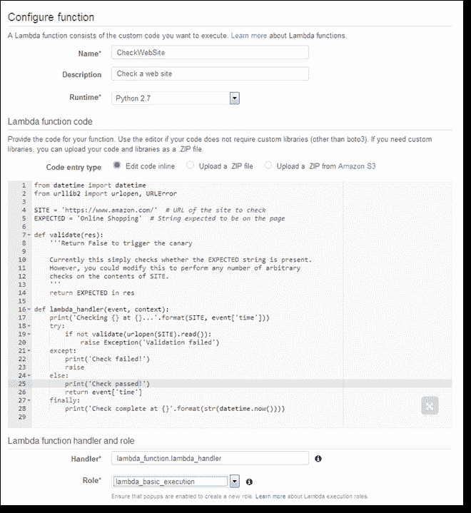
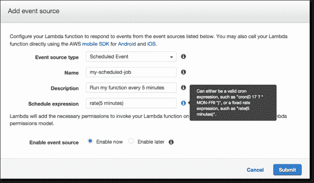

# AWS 认真对待 Lambda，增加 Python，Cron 调度

> 原文：<https://thenewstack.io/aws-gets-serious-lambda-adds-python-cron-scheduling/>

Amazon.com 首席技术官沃纳·威格尔是一个真正的计算机科学极客。你可以从他在今年的 AWS [re:Invent](https://reinvent.awsevents.com/) 用户大会上抨击 Python 的方式看出来。

在[的主题演讲](https://youtu.be/y-0Wf2Zyi5Q)中，沃格尔斯宣布了 AWS Lambda 无状态计算服务的许多新功能，包括运行 Python 脚本的能力。

“我不知道有大量空白的编程语言仍然受欢迎，”沃格尔斯说，他指的是 Python 对控制流使用[缩进，这对一些人来说是一种烦恼。](https://unspecified.wordpress.com/2011/10/18/why-pythons-whitespace-rule-is-right/)

尽管如此，Lambda 服务的用户几乎从该服务的 beta [在去年的 re:Invent](https://www.youtube.com/watch?v=9eHoyUVo-yg) 上首次亮相就开始请求 Python 了。Python 支持是会议上引入的众多 Lambda 新特性之一。总的来说，它们表明 AWS 仍然认真地支持这种有点单一的云服务。

AWS [Lambda](https://aws.amazon.com/lambda/) 被设计成在云中运行用户生成的函数，而不需要用户担心运行所述函数的任何支持栈。与其说是平台即服务，不如说是功能即服务(如果你不使用“FaaS”，我们就不会使用它)。

Lambda 是一种无状态的计算机服务，这意味着它运行一个用户定义的函数，从外部服务收集数据，以某种方式处理数据，并将输出传递给其他服务。

该代码必须由外部事件触发，例如来自移动应用程序、web 服务或另一个 AWS 服务的来电。亚马逊 S3 桶或 DynamoDB 表中的变化可以触发函数调用。

Lambda 的新颖之处在于，它消除了对任何支持基础设施的担忧。不再仅仅为了运行一个功能而维护 EC2 实例。诸如扩展或维护等基础设施问题在抽象中被一笔带过。

“你只需将工作交给 Lambda，它就会代表你进行计算，”AWS Lambda 总经理蒂姆·瓦格纳(Tim Wagner)在会议后期的分组会议上说。"所以不会出现服务器太多或太少的问题."

典型的 Lambda 工作包括图像转换、更改通知和文件压缩——事实上，AWS 有预建的功能来处理这些特定的任务。

在会议上，亚马逊吹捧 Lambda 是协调所谓物联网系统运作的一种伟大方式。Wagner 说:“通过将这些请求和命令发送到终端设备，你可以进行数据接收和命令控制。

例如，Lambda 作业可以用于入站规则处理。垃圾邮件检测可以是一个 Lambda 函数，每收到一封新邮件都会被激活。可以实时监控日志文件。

运行一个函数要花多少钱？用户需要为代码每执行 100 毫秒以及代码被触发的次数付费。他们可以通过各种计算能力来控制任务的执行速度，共有 23 个级别，以使用的内存量来表示。功率越大，完成任务的速度就越快，尽管在 I/O 速度较慢的情况下，更多的功率通常只是浪费，而且过于昂贵。如果你想知道统计数据:Lambda 性能指标是由 Amazon CloudWatch 捕获的。

沃格尔斯说，Lambda 可以“改变你构建和管理应用的方式”。“没有服务器比没有服务器更容易管理。”

自从 Lambda 服务在 4 月份作为一个完整的商业产品推出以来，它似乎为亚马逊做得很好。亚马逊[增加了一系列新功能](https://aws.amazon.com/blogs/aws/aws-lambda-update-python-vpc-increased-function-duration-scheduling-and-more/)，让 Lambda 能够融入生产环境。

尽管沃格尔斯的冷落，Python 的加入是一件大事。无论如何，观众似乎比沃格尔斯更高兴。

以前，Lambda 函数必须用 JavaScript 或 Java 编写。Python 可能比 JavaScript 更适合编写工作流例程，仅仅是因为它可能更为系统管理员所熟知，也更容易被非程序员所掌握(例如，Python 在金融分析师中相当流行)。而且 Python 的开销比 Java 小。

用一些 Python 代码摇摆 Lambda。

Lambda 正在运行标准的 Python 2.7，用户可以从 [AWS Python SDK](https://aws.amazon.com/sdk-for-python/) 获得帮助，调用其他 AWS 服务，如 S3 和 EC2。

Lambda 的另一个新特性是能够一次运行函数长达五分钟，而不是一分钟。有了这个新的上限，繁重的视频转码或大型日志文件分析作业将变得更加可行。开发人员指定了一个函数在五分钟的限制使其停止之前可以花费多少时间，AWS 甚至提供了一个上下文对象来提供函数在其高度致命的线圈中还剩多少时间。

还有一个新特性:Lambda 函数中的连续变化可以被赋予特定的不可变版本号，也可以被特定的不可变版本号调用。有了这个特性，开发人员可以很容易地将一个函数回滚到早期版本，如果新的函数出现故障的话。或者，如果新版本不支持所需的功能，可以将旧客户端指向旧版本。

版本号也可以充当别名，提供指向开发人员希望客户端在那时调用的任何版本的指针。

安排 Lambda 作业在未来运行。

Cron 也在 Lambda 中首次亮相。Unix 之流长期以来一直使用 cron 函数来调度作业在特定的时间运行。为 Lambda 复制了 cron 格式，提供了一种指定作业可以运行的分钟、小时和/或天的方式。

最后，用户将很快能够在他们自己的虚拟私有云(VPC)中运行 Lambda 作业。

这为内部工作和内部资源使用该服务提供了可能性，比如保存营销数据的 DynamoDB 实例。安全组可以被配置为接受来自 Lambda 的入站流量，并允许这些功能访问其他 AWS 服务。该公司计划在今年年底推出这一功能。

有了 Lambda，“你们可以构建非常酷的东西，甚至是用 Python，”沃格尔斯说道。

<svg xmlns:xlink="http://www.w3.org/1999/xlink" viewBox="0 0 68 31" version="1.1"><title>Group</title> <desc>Created with Sketch.</desc></svg>