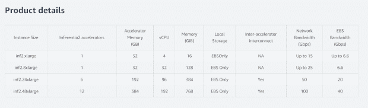

# AWS Inf2:用于大规模 ML 生产的 12 芯片系统

> 原文：<https://thenewstack.io/aws-inf2/>

深度学习(DL)不断发展，推动着人工智能的发展，计算也在不断扩展，以跟上这些模型的复杂性。随着计算的扩展，生产中的部署也随之扩展。这是一个非常复杂的过程。

100 万秒是 12 天，而 10 亿秒需要 31 年。从一百万到十亿的增长是如此之大，以至于完全改变了它所涉及的任何事物的范围。现在考虑具有数百万甚至数十亿个参数的机器学习模型的硬件需求。

“制造芯片实际上很难，”[亚马逊网络服务的亚马逊 EC2 产品管理总监切坦·卡普尔](https://www.linkedin.com/in/chetan-kapoor-03bb762/)告诉新堆栈。

这是一个云计算巨头已经投入的挑战。

[亚马逊网络服务](https://aws.amazon.com/?utm_content=inline-mention)最近推出的 AWS Inf2 实例可以在大规模生产中处理多达 1750 亿个参数的 ML 模型，与之前的产品相比，吞吐量提高了 4 倍，延迟降低了 10 倍。

AWS 于 12 月在 [AWS re:Invent 的预览中首次亮相](https://thenewstack.io/aws-reinvent-left-attendees-with-more-questions/) [Inf2](https://aws.amazon.com/ec2/instance-types/inf2/) 。该芯片是更大的一组 [EC2](https://aws.amazon.com/ec2/) 实例——推理加速器——的一部分，专门为支持深度学习模型的需求而构建。与前代产品相比，Inf2 提供了更高的吞吐量和更低的延迟。

尽管该模型可以处理数千亿个参数，但多台机器可以并发工作以服务于更大的模型。

## 数十亿个参数

以前存在的硬件问题不再能满足新的需求

“这些深度学习模型的规模呈爆炸式增长，从几百万个参数增长到几十亿个参数。你需要大量的计算来训练这些模型。我们的许多客户都说，它已经到了太贵的地步。”卡普尔说。AWS 解决这个问题的最佳方式是为深度学习模型构建超级专业化的硅。这是大约五年前他们旅程的开始。

AWS 的推理加速器就是为了弥合这一差距而构建的。卡普尔说，为了获得更多的洞察力，“它是专门为运行这些疯狂的大型深度学习模型而设计的，因为许多客户的替代方案是使用托管这些模型的培训平台，这对他们来说太昂贵了，无法大规模运行”。

Inf2 利用了一种名为 Inferentia2 的全新硅芯片。这是这种芯片的第二代，可以容纳多达 1750 亿个参数。与第一代芯片 Inf1 相比，它提供了 4 倍的吞吐量和 10 倍的低延迟。它是为在生产中运行 DL 模型而设计的。

Inf2 是为大规模设计的，但不可能是大规模。引起了 AWS 工程师在平台层面的思考。

Kapoor 详细描述了这一过程，“我们不得不退一步说，我们真的不能走上构建大规模芯片来支持这一模式的道路，因为这对我们的客户来说无法很好地扩展，也无法让我们实现客户所期望的成本改善。”

Inf2 实际上是一个由一台服务器中的 12 个芯片组成的系统，这些芯片通过一个专用结构相互连接，同时工作。

因为 Inf2 是一个 12 芯片系统，这个过程需要一些逆向工程和未来预测。该团队必须评估的一个问题是，“我们可以在每个芯片上封装多少功率？另一个是，“预测[客户]的需求看起来会怎样，”卡普尔解释道。

## 客户自己的机器

硬件是有影响力的，即使悄无声息。Kapoor 扩展的用例是推荐引擎。日常生活中无处不在，但即使有想法，也常常是事后想起。他详述了 Pinterest 和 Grammarly，因为它们的影响不同。Pinterest 的例子是一个用户看到一盏灯，点击它，并被带到电子商务商店购买。Grammarly 是一个实时语法编辑器。两者都在 AWS 云上以大规模或大规模实时运行。对于大型 ML 模型的使用和两者的工作，compute 支持这一点。

Inf2 实例是基于每个客户的。如果有人在用那台机器，那就是他们的机器。它可以容纳一个模型或多个模型，因为在许多情况下只有一个模型可以容纳，或者另一方面，一个人工智能系统需要多个更小的模型来运行。以语音助手为例，一个成功的语音助手要提供引人入胜的交互体验，需要训练多个模型(语音识别、推理、自然语言理解等)。但如果有额外的可用计算能力，AWS 不会在一台机器上添加其他客户。

对于未来，Kapoor 说，“这些模型肯定会继续增长”，但他相信 Inf2 完全有能力处理未来的所有直接需求。“如果(一种模式)不适合一台机器……他们有能力扩展到这台机器之外。多台机器可以同时运行这些型号，”他解释道，然后还承认他知道 Inf2 是第二代芯片。

<svg xmlns:xlink="http://www.w3.org/1999/xlink" viewBox="0 0 68 31" version="1.1"><title>Group</title> <desc>Created with Sketch.</desc></svg>