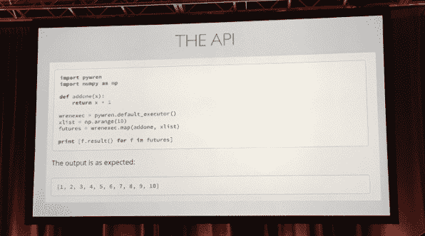
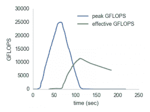

# 通过 PyWren，AWS Lambda 在科学计算领域发现了一个意想不到的市场

> 原文：<https://thenewstack.io/aws-lambda-finds-unexpected-market-scientific-computing/>

加州大学伯克利分校的一名研究人员发现了亚马逊网络服务的 Lambda 无服务器计算服务的一个新的、有点出乎意料的用例:科学计算。

在上周于得克萨斯州奥斯汀举行的[Continuum Analytics’](https://www.continuum.io/)首次用户大会 [AnacondaCON 2017](https://anacondacon17.io/) 上， [Eric Jonas](https://twitter.com/stochastician) ，加州大学伯克利分校 [AMPLab](https://amplab.cs.berkeley.edu/) 的博士后研究生，讲述了一些加州大学伯克利分校的研究人员如何开始在 Jonas 创建的软件包[PyWren](https://github.com/ericmjonas/pywren)的帮助下，使用 [AWS Lambda](https://aws.amazon.com/lambda/) 无服务器服务进行调查

PyWren 提供了跨许多不同 Lambda 服务解析基于 Python 的科学工作负载的能力，实际上创建了一个巨大的计算集群(如果非常临时的话):用 Jonas 的说法，PyWren 可以“让 Lambda 惊人地扩展”，他用一个基准测试来说明这一点，该基准测试是 [PyWren 从一个 AWS Lambdas 车队中拉出 25TFLOPS](http://ericjonas.com/pywren.html) (每秒 25 万亿次浮点运算)。

“这是用 [MatLab](https://www.mathworks.com/products/matlab.html) 框架不可能做到的事情，”乔纳斯断言道，

即使是一名研究生(尽管他精通 Python ),也很容易使用它，他可以简单地将 PyWren 包含在程序的库包含中，并通过 API 进行函数调用:

## 处境困难

AMPlab 支持跨多个不同学科的研究，其中许多涉及跨多个尺度检查数据。一个是太阳上的太阳耀斑，对它的研究将有助于更好地预测会妨碍我们的电力线和卫星运行的太阳风暴。附近的[太阳动力学观测站](https://sdo.gsfc.nasa.gov/)每天产生 1.5TB 的观测数据。

太阳动力学天文台

从每一个大到每一个小，研究人员也在研究大量的神经元如何结合起来创造行为、疾病甚至认知。

Jonas 指出，大多数研究生从未运行过 Spark 或 Hadoop 工作。他们的调查是在笔记本电脑或工作站上进行的，这可悲地限制了他们测试的广度。

显然，扩大规模的一种方式是云服务，比如亚马逊网络服务，它已经为伯克利提供了大量的使用授权。然而，对于普通研究人员来说，让 AWS 做一些有用的事情是一项艰巨的任务。最好让笔记本电脑再运转一会儿。

输入 PyWren。

PyWren 非常适合诸如“参数调整”之类的工作。比方说，这可能是一个运行时间大约为 5 分钟的作业，它需要运行 1000 次。PyWren 的目标是在 5 分钟内运行全部 1000 个实例。

作为一种无状态计算功能即服务，Lambda 为用户提供了单个进程，每个实例可以运行 Python、JavaScript(节点)或 Java 代码长达 300 秒，以及 512mb 的临时空间和 1.5GB 的 RAM。

大规模分布式计算似乎不是 AWS 对 Lambda 的初衷之一，尽管 AWS [已经承认了](https://noise.getoto.net/2016/10/31/aws-week-in-review-october-24-2016/) Jonas 的工作。

标准用例是一个 Lambda 作业，由某人上传某种对象到 [S3](https://aws.amazon.com/s3/) 而触发，Lambda 对该对象执行一个小功能，并将结果发送回数据库。但是 Jonas 指出，没有理由不能将一个 Python 函数映射到 2000 个 Lambda 服务上。

在幕后，PyWren 使用 Python 的 [Pickle](https://docs.python.org/2/library/pickle.html) 序列化函数和从 [PySpark 项目](http://spark.apache.org/docs/0.9.0/python-programming-guide.html)借用的一点技术，用数据序列化函数。PyWren 将序列化的数据和函数放入 S3，然后调用 Lambda，以及一个精简版本的 Anaconda，一个打包版本的 Python 和 Continuum IO 提供的支持工具。结果被发送回 S3，然后被拆包，并返回给用户。

可以肯定的是，有一些缺点，工程上的权衡，如果你愿意的话。AWS 的网络开销和可能的节流会减缓作业的提交，然后作业的完成会错开。此外，20%的大部分工作都被设置占用了，即使大部分工作都没有达到 300 秒的最大值。

“有一些事务开销，”乔纳斯承认，但补充说，“我们的大多数用户不在乎他们的串行作业是否需要两倍的时间，因为现在他们可以同时运行 3000 个。”

Jonas 设想，随着时间的推移，Lambda 可以承担更复杂的“无状态”任务，例如执行完整的 [MapReduce](https://hadoop.apache.org/docs/r1.2.1/mapred_tutorial.html) 作业，将数据分析分散到许多节点上(“映射”部分)，然后重新组合成有意义的结果(“缩减”部分)。因此，他建议说，它可以简化许多“大数据”风格的分析(注意到 2015 年雅虎的一项研究表明，平均 Hadoop 数据集为 15GB，这可以很容易地放在笔记本电脑上)。

今天，PyWren 可以做 MapReduce 工作的映射部分，但是它的参数调整所需的 reducing 功能仍然是实验性的。

然而，Joans 不太确定这种微服务风格的方法是否适用于在今天的[超级计算机](http://www.top500.org)上执行的典型超大规模科学工作负载。高性能计算工作负载，如计算流体力学，往往有更多的线程和更大的数据集，并依赖于[GPU](https://thenewstack.io/new-mapd-database-system-runs-gpus/)，Lambda 尚不支持。

虽然 PyWren 是专门为 lambda 设计的，但这个想法也可以应用于其他无服务器平台，比如刚刚从 Platform9 推出的[裂变。乔纳斯说写 PyWren 只花了他一个周末的时间。](https://thenewstack.io/platform9-offers-developers-flexibility-todays-multi-cloud-world/)

<svg xmlns:xlink="http://www.w3.org/1999/xlink" viewBox="0 0 68 31" version="1.1"><title>Group</title> <desc>Created with Sketch.</desc></svg>