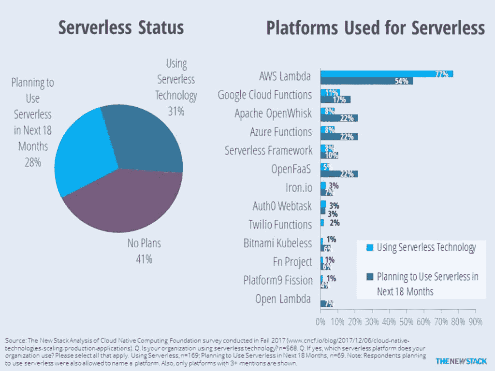

# AWS Lambda 仍然遥遥领先于竞争对手，但这种情况还会持续多久？

> 原文：<https://thenewstack.io/aws-lambda-still-towers-competition-much-longer/>

亚马逊网络服务的λ仍然是无服务器的领导者，但是竞争对手眼中有一线希望。

几个月前，云本地计算基金会(CNCF) [调查了](https://www.cncf.io/blog/2017/12/06/cloud-native-technologies-scaling-production-applications/)550 多人，其中 31%使用[的无服务器技术](/category/serverless/)。调查接着询问了使用的是哪种特定的无服务器平台。在使用无服务器技术的 169 家公司中，77%的公司表示他们使用了 AWS Lambda。这让 AWS 遥遥领先，因为只有 23%的无服务器平台用户在没有采用 AWS Lambda 的组织中工作。考虑到 AWS 在云计算领域的渗透以及在无服务器市场一年多的领先优势，它的领先并不令人惊讶。

单击放大。

正在使用的其他几个平台被视为功能即服务(FaaS)产品。或许由于[谷歌](https://cloud.google.com/kubernetes-engine)在许多 CNCF 项目中的中心地位，[谷歌云功能](https://cloud.google.com/functions/)的使用率为 11%，微软 [Azure 功能](https://azure.microsoft.com/en-us/services/functions/)与 [Apache OpenWhisk](https://openwhisk.apache.org/) 的使用率为 8%。

虽然受访者被要求说出他们使用的平台名称，但调查设计允许那些有近期计划的人说出他们预期使用的平台。虽然只有 69 人回应，但结果给了我们希望。第二名有三方平分秋色，OpenFaaS、Azure 和 OpenWhisk 都有 22%的未来无服务器平台用户考虑他们的平台。

由于调查的规模和样本，以及[市场的普遍不成熟](https://thenewstack.io/week-numbers-serverless-adoption-par-containers/)，新堆栈认为不同平台的采用率在未来的研究中可能会有很大差异。尽管如此，值得注意的是，许多平台被询问过，但由于收到的回复不到两个，因此被排除在上述图表之外。这些平台包括 [PubNub Functions](https://www.pubnub.com/products/functions/) 、[银河之雾](http://www.galacticfog.com/)、OVH Functions、[超频](https://www.ovrclk.com/)、 [Weblab.io](http://weblab.io/) 和 [Nano Lambda](http://nano-lambda.com/) 。

最后一个不要脸的塞。CNCF 的[无服务器工作组](https://github.com/cncf/wg-serverless)正在不知疲倦地完善一份白皮书，并开发一个通用行业定义框架。我们鼓励你去看看。

云本地计算基金会、谷歌和微软都是这个新体系的赞助商。

通过 Pixabay 的特征图像。

<svg xmlns:xlink="http://www.w3.org/1999/xlink" viewBox="0 0 68 31" version="1.1"><title>Group</title> <desc>Created with Sketch.</desc></svg>