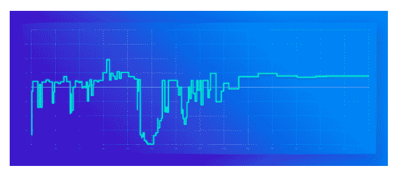

# AWS 通过 Spot 实例更容易省钱

> 原文：<https://thenewstack.io/aws-now-making-easier-save-spot-instances/>

[Amiram Shachar](https://spotinst.com/)

[Amiram Shachar 是 Spotinst 的创始人& CEO，帮助团队利用过剩的容量(例如 Spot 实例)节省高达 85%的云成本。在创建 Spotinst 之前，他是 Ybrant Digital 的 DevOps 总监，并领导了以色列国防军向云的迁移。](https://spotinst.com/)

早在 2009 年，[亚马逊网络服务发布了一项名为“EC2 Spot Instances”的革命性产品](https://aws.amazon.com/about-aws/whats-new/2009/12/14/announcing-amazon-ec2-spot-instances/)这项服务允许 AWS 以低廉的价格(高达 80%的折扣)出售虚拟机的 [EC2 实例](https://aws.amazon.com/ec2/)，从而从其过剩的容量中获得一些价值。这些优惠价格带有一个主要的警告——一旦其他客户要求全价服务器，现场实例可以在两分钟通知后中断。

随着时间的推移，Amazon EC2 Spot 实例变得非常受欢迎，被认为是大幅降低 EC2 成本的最佳方式(参见:Ticketmaster 使用 Spot 实例)。虽然利用 AWS 提供的高达按需价格 90%的备用容量对于大大小小的公司来说都是一个改变游戏规则的因素，但缺乏任何形式的 SLA 或保证您的实例将保持可用使它们对大多数公司来说都太棘手了。

在该公司本周在拉斯维加斯举行的 re:Invent 2017 用户大会上，AWS 推出了新功能和对 Spot 实例的改变。这是 Spot 新时代的曙光，立即为创造性的 DevOps 团队打开了在 Spot 上运行任何工作负载的大门。

“我们推出了一种新的定价模式，并简化了对亚马逊 EC2 Spot 实例的访问，”亚马逊网络服务 EC2 总经理约书亚·布尔金在谈到新的更新时说。有了这些变化，您可以像启动按需实例一样启动现货实例，并且客户可以依靠低的、可预测的价格

但是，仍然缺乏服务级别协议(SLA ),因此，如果您需要工作负载的一致性或高可用性，这个问题仍然没有解决。因此，在 Spotinst，我们很自豪能够帮助 AWS 向他们的客户提供 SLA。正如布尔金在我们的博客中所说，“Spotinst”是 AWS 的高级合作伙伴，多年来一直在帮助 AWS 客户利用 Spot 实例。通过支持这些新功能，Spotinst 的服务使客户能够以更少的工作量和更大的信心将额外的工作负载转移到 Spot 实例。”

## 新的定价系统已经到来

那么 Spot 有什么新鲜事？简而言之，Spot 实例将变得不那么“不稳定”,并且更容易通过标准 EC2 APIs 使用，为那些希望开始使用 AWS 备用容量的人消除了一些障碍。

在我们解释它如何影响作为 AWS 用户的您之前，让我们先来看看具体的变化:

### 1.现货市场变化不太频繁

现货市场价格会根据特定实例类型的需求和您希望运行现货实例的地区而上下浮动。到目前为止，这些变化会很频繁，有时一秒钟内会出现多次峰值。

现在，这些变化一天只会来 3-5 次。

### 2.对现货实例的投标现在是可选的

在处理 Spot 时，不需要想出新的方法来获取实例。竞价现在是可选的(尽管这是为临时应用程序设定现货成本上限的一个好方法)。以前需要设置最高出价，现在只需启动一个即时实例，就像按需实例一样。AWS 会将您的“虚拟出价”标记为按需价格，并在他们需要收回容量时任意终止您的容量。

不用再担心出价了。

### 3.现场中断更难监控和预测

你曾经在现货市场价格超过买入价的时候被打断。那么，如果你不设定出价，你的 Spot 实例什么时候会被中断呢？

这是一个简单的答案，但你将无法跟踪。当 AWS 用完备用容量时，您的 Spot 实例将被中断，即当所有这种类型和区域的备用实例都被请求用于按需或保留目的时。然而，作为用户，我们不知道 AWS 的备用容量是什么样的。没有任何方法可以预测或防止中断，理解您的实例为什么被中断，或者知道 AWS 如何选择首先中断哪个 Spot 实例。

你只会失去实例。

### 4.新功能:现场休眠

这个特性对于不需要高可用性的工作负载来说非常棒。Spot 实例现在可以在终止后保存数据。

如果利用 Spot 休眠，当 Spot 实例终止时，您的数据将保存到 EBS 卷中。一旦备用容量再次可用，您的 Spot 实例将重新启动。Hibernate 将保持 EC2 机器的内存状态，并从它停止的地方继续工作。这个特性现在可用于 Linux EC2 实例。

### 5.通过 RunInstances API 启动 Spot 实例

只需指定“Spot”选项，就可以从用于按需实例和保留实例的同一个 API 中请求 Spot 实例。

## 好吧，这是好事还是坏事？！？

嗯，都有。这完全取决于你想如何利用 Spot 实例，以及你目前的 Spot 策略有多复杂。

对于那些对 Spot 实例感到困惑的用户来说，这让您的生活更加轻松。然而，在没有任何 SLA 的情况下，如果您正在寻找一种可靠的一致性或可用性形式，那么管理 Spot 实例仍然是相当棘手的。

**优点:**

*   **从 Spot 实例开始要容易得多。**通过消除确定投标价格的需要，在进入现货实例的世界之前几乎没有什么需要学习的。它们现在基本上像按需实例一样工作，只是更便宜。
*   价格上涨不多。尽管现货市场仍可能上下波动，但将价格变化限制在一天几次意味着你可以在现货市场上轻松一点。你不会再看到嘈杂的现货价格图，也不会再被另一个现货客户踢出局。只有当 AWS 需要为另一个按需客户提供该容量时，您的 Spot 实例才会被中断。
*   **冬眠！通过使用这个新特性，当您的 Spot 实例关闭时，您不会丢失所有数据。这使得现场批量作业等操作变得更加容易。**

**缺点:**

*   **在现场运行要求高可用性或一致性的工作负载比以往任何时候都更加困难。**你将无法看到价格变化以预测中断，也无法在中断前得到预警。
*   **“我的实例去哪里了？”你可能会说很多次，因为 Spot 实例会被任意中断。如果看不到定价或价格变化，您的实例将会消失，没有明确的原因，并且在丢失之前没有任何警告。**
*   **仍然没有可用性 SLA。**您无法保证这些实例中的任何一个会长期存在。对于要求一致性或可用性的工作负载，这可能是个问题。

简而言之，如果您从未使用过 Spot 实例，那么开始使用从未如此容易。但是，如果您希望运行需要高可用性或一致可用性的工作负载，您将需要在内部构建自己的现场管理策略，或者利用现有平台来为您实现这一点。

通过 Pixabay 的特征图像。

<svg xmlns:xlink="http://www.w3.org/1999/xlink" viewBox="0 0 68 31" version="1.1"><title>Group</title> <desc>Created with Sketch.</desc></svg>