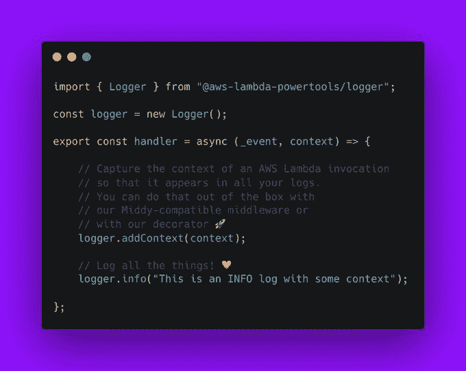
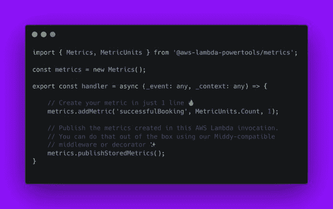
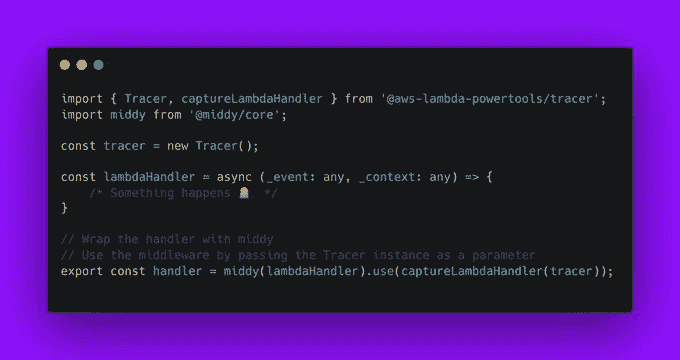

# AWS 为 Lambda 可观察性提供了一个类型脚本接口

> 原文：<https://thenewstack.io/aws-offers-a-typescript-interface-for-lambda-observability/>

在外部志愿者的帮助下，[亚马逊网络服务](https://aws.amazon.com/?utm_content=inline-mention)的软件工程师发布了一个开源库，以帮助打字稿开发者从他们的无服务器 AWS Lambda 工作中提取有意义的[可观测性数据](https://thenewstack.io/monitoring-and-observability-whats-the-difference-and-why-does-it-matter/)。

在测试版中推出的[AWS Lambda power tools TypeScript](https://github.com/awslabs/aws-lambda-powertools-typescript)“为 Node.js Lambda 函数提供了一套实用工具，以简化跟踪、结构化日志记录、自定义指标等最佳实践的采用，”AWS 高级解决方案架构师 [Sara Gerion](https://github.com/saragerion) 在周二的[推特线程](https://twitter.com/Sarutule/status/1478763457625350144)中写道。

[套件](https://awslabs.github.io/aws-lambda-powertools-typescript/latest/)提供了一组类型脚本调用，用于管理运行在 Node.js 运行时上的 AWS Lambda“无服务器”函数。 [TypeScript](https://www.typescriptlang.org/) 是具有强类型的 JavaScript，为诸如此类更精细的调试工具提供了平台。

根据 Gerion 的说法，logger 实用程序可以:

*   *从 Lambda 上下文中捕获关键字段，冷启动并将日志记录输出构造为 JSON。*
*   *收到指示时记录 Lambda 上下文。*
*   *日志采样打印一定百分比的调用的所有日志。*
*   *在任意时间点向结构化日志添加关键字。*

度量工具可以:

*   *使用单个 CloudWatch EMF 对象聚合多达 100 个指标。*
*   *针对常见的指标定义错误进行验证。*
*   *指标由 CloudWatch 异步创建。*
*   *上下文管理器创建不同维度的一次性指标。*

Tracer 实用程序可以:

*   *自动捕捉冷启动、响应、错误。*
*   *不在 AWS Lambda 环境下运行时自动禁用。*
*   通过装饰器、中间件和手动工具支持跟踪功能。
*   *支持通过 AWS X-Ray SDK 跟踪 AWS SDK v2 和 v3。*

该套件还包括一个 [Typescript 云开发工具包](https://github.com/awslabs/aws-lambda-powertools-typescript/tree/main/examples/cdk) (CDK)，用于处理 CloudFormation 和其他 AWS 资源。

每个 TypeScript 实用程序都作为独立的 NPM 包安装，并遵循用于 JavaScript 的 [AWS SDK v3 的格式。](https://github.com/aws/aws-sdk-js-v3)

AWS 已经为 [Java](https://awslabs.github.io/aws-lambda-powertools-java/) 和 [Python](https://awslabs.github.io/aws-lambda-powertools-python/latest/) 发布了类似的 Lambda Powertool 包。

<svg xmlns:xlink="http://www.w3.org/1999/xlink" viewBox="0 0 68 31" version="1.1"><title>Group</title> <desc>Created with Sketch.</desc></svg>