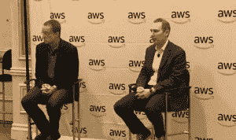

# AWS Re:Invent:新机器学习、数据、基础设施服务

> 原文：<https://thenewstack.io/aws-reinvent-day-1-new-machine-learning-data-infrastructure-services/>

和过去一年一样，[亚马逊网络服务](https://aws.amazon.com/)首席执行官[安迪·杰西](https://twitter.com/ajassy)本周在拉斯韦加斯正式召开了年度 [AWS re:Invent](https://reinvent.awsevents.com/) 用户大会，会上介绍了一系列令人眼花缭乱的新云服务，其中许多直接针对市场上现有的产品和服务。

不过，首先，他忍不住挖苦了竞争对手，指出“我们是唯一一家以清晰的方式公布数据的云提供商，”他说。根据 AWS 自己的估计，AWS 拥有 51%的市场份额，年增长率为 46%，年收入为 270 亿美元。最接近的竞争对手是微软 Azure，市场份额约为 13%，谷歌云平台的市场份额约为 3%。其他竞争者甚至没有足够的市场份额来爆发，杰西尖刻地说，这时一张拉里·埃里森式的脸出现在他身后的图表上。

总的来说，在当天的活动中推出了大约 20 项新服务。对于那些对可伸缩开发和部署感兴趣的人来说，下面是一些最著名的新技术:

## 基础设施

[**前哨**](https://aws.amazon.com/about-aws/whats-new/2018/11/announcing-aws-outposts/) 通过提供 AWS 将交付的一组服务器机架，甚至安装在可以通过 VMware VCloud 或本机运行 AWS 服务的企业内，来应对混合云的持续市场。Jassy 指出，Outposts 是一项托管服务，旨在帮助企业使用那些不能轻易移动的内部应用程序。

“ [**控制塔**](https://aws.amazon.com/controltower/?nc2=type_a) ”服务为组织的 AWS 使用管理身份和访问管理，并提供可自动执行的最佳实践蓝图和“护栏”或预打包的合规性规则。

安迪·杰西和 VMware 首席执行官帕特·基尔辛格在 AWS Re:Invent 2018 上讨论前哨。

新的**文件系统**:用于 Lustre 的 [**亚马逊 FSx 基于 HPC Lustre 文件系统，为计算密集型工作负载提供完全托管的文件系统，具有高吞吐量、低延迟。Lustre 传统上用于高性能计算工作负载，尽管它以难以安装而闻名。Jassy 承诺这种托管服务将易于使用。此外，对于 Windows Server 用户不断下降的市场(Jassy 的描述，AWS 将为 Windows**](https://aws.amazon.com/blogs/aws/new-amazon-fsx-for-lustre/) 提供 [**Amazon FSx，它提供原生 Windows 文件服务器功能。**](https://aws.amazon.com/blogs/aws/new-amazon-fsx-for-windows-file-server-fast-fully-managed-and-secure/)

[**地面站即服务**](https://aws.amazon.com/ground-station/) 实际上是在前一天宣布的，代表着云计算向基于卫星的通信和数据收集服务的一个非常激进的扩展。它由一组遍布全球的地面站天线组成，通常与自动气象站数据中心并置在一起。这项服务将提供按使用付费的上传和下载卫星数据的能力

## 数据

随着 [**Timestream**](https://aws.amazon.com/timestream/) ，AWS 进入了时间序列数据库领域。它是一种无服务器的服务，称为 Timestream，通过单独的处理引擎按时间组织数据，以确保性能。这项服务可能是物联网、边缘计算和系统监控的理想选择。

新的**区块链**服务:在旁观区块链技术公司几年后，观察该技术将解决的商业用途，AWS 已经认识到提供分布式账本的用例，其变化将很容易被所有相关方访问。为此，AWS 提供了 [**QLDB**](https://aws.amazon.com/qldb/) ，一个具有集中权限的完全管理的分类账数据库。该公司实际上建立了这个供内部使用的数据库，以记录控制平面上的变化)。该公司还推出了 [**亚马逊管理的区块链**](https://aws.amazon.com/managed-blockchain/) ，它提供了 Hyperledger 和以太坊框架的完全管理版本。

[**AWS Lake Formation**](https://aws.amazon.com/lake-formation/):根据 Jassy 的说法，现在有超过 10，000 个数据湖在 AWS 的简单存储服务(S3)上运行。湖的形成可以使填充这些数据湖的工作变得更容易。它可以将不同来源的数据迁移到湖中，格式化数据并应用策略规则。

一种新的存储类别[**Glacier Deep Archive**](https://techcrunch.com/2018/11/28/aws-announced-glacier-deep-archive-to-replace-tape-archives/)可以作为磁带的潜在替代品，成本为 1 美元/TB，约为标准 Glacier、AWS 现有冷存储选项成本的四分之一。数据可在几小时内恢复。这项新服务建立在最近宣布的 [**S3 智能分层**](https://aws.amazon.com/about-aws/whats-new/2018/11/s3-intelligent-tiering/) 的基础上，它使用机器学习来建模数据使用情况，以便很少使用的数据可以自动卸载到更经济的存储选项，并将更多参考数据移动到更快的选项。

## 机器学习

[**SageMaker 更新**](https://docs.aws.amazon.com/sagemaker/latest/dg/whatis.html) : SageMaker 是 AWS 的托管服务，用于运行机器学习作业，无需雇佣数据科学家和基础设施专家来将人工智能融入应用和服务。 [**Ground Truth**](https://aws.amazon.com/blogs/aws/amazon-sagemaker-ground-truth-build-highly-accurate-datasets-and-reduce-labeling-costs-by-up-to-70/) 是一个自动标注数据的服务，可以帮助建立模型，否则以前执行起来会太复杂。此外，该公司还为来自第三方供应商的机器学习模型推出了一个市场 。此外，性能改进被吹捧。Jassy 指出，机器学习对 Tensorflow 框架的使用面临着扩展挑战，大多数用户在 GPU 上的平均利用率只有 60%。对于 SageMaker 深度学习服务，AWS 工程师已经能够将这一比例提高到 90%。

[**亚马逊弹性推理**](https://aws.amazon.com/blogs/aws/amazon-elastic-inference-gpu-powered-deep-learning-inference-acceleration/) 将允许用户将 GPU 附加到任何弹性云计算(EC2)实例，按需提供 1-32TFlops。它可以自动检测主要的机器学习框架，如 Tensorflow、Pytorch 等。Jassy 断言，使用这种集中的 GPU 能力，在许多情况下可以削减高达 75%的成本。为了进一步提高性能，该公司开发了一种对延迟敏感的高吞吐量处理器，用于机器学习推理，称为 [**AWS 推理**](https://aws.amazon.com/machine-learning/inferentia/) 。与 Amazon Elastic Inference 一样，Inferentia 可以附加到 EC2 实例中，并支持所有主要的机器学习框架。它也可与 SageMaker 一起使用。

**强化学习**:迄今为止，大多数围绕机器学习的商业化都是在监督学习下进行的，这涉及到逐步完成训练步骤，以创建和完善行为模型。Jassy 解释说，该领域更大的挑战是强化学习。“它完全改变了事情的完成方式，”Jassy 谈到强化学习时说。这些类型的工作可能没有一个正确的答案，而是一种解决复杂场景的方法(例如:玩吃豆人游戏，没有一种方法可以获胜)。 [**SageMaker RL**](https://aws.amazon.com/blogs/aws/amazon-sagemaker-rl-managed-reinforcement-learning-with-amazon-sagemaker/) 提供了一套在这个领域入门的工具。为了帮助开发者理解这一新概念，该公司推出了“世界上第一辆自动驾驶赛车”AWS DeepRacer，这是一辆 1/18 比例的自动驾驶汽车，可以在 SageMaker 进行训练。该公司计划举办锦标赛，从这次会议开始，一直持续到明年的 AWS Re:Invent，不同的团队可以建立和竞争他们的驾驶模型。

随着时间的推移和读者的兴趣，我们将对这些技术的更多信息进行跟进。

<svg xmlns:xlink="http://www.w3.org/1999/xlink" viewBox="0 0 68 31" version="1.1"><title>Group</title> <desc>Created with Sketch.</desc></svg>