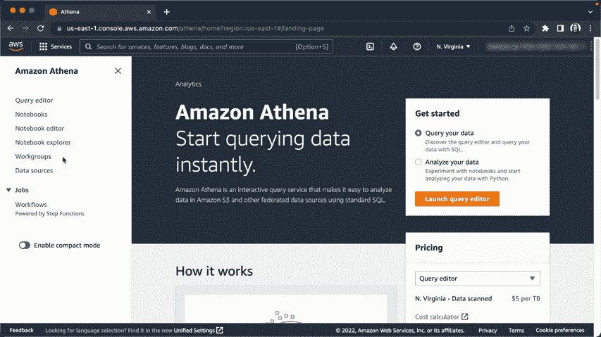
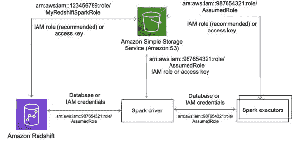

# AWS Re:Invent 更新:Apache Spark、Redshift 和 DocumentDB

> 原文：<https://thenewstack.io/aws-reinvent-updates-apache-spark-redshift-and-documentdb/>

拉斯维加斯——亚马逊网络服务[re:Invent 2022](https://reinvent.awsevents.com/?utm_source=thenewstack&utm_medium=website&utm_content=inline-mention&utm_campaign=platform)用户大会的第三天见证了大量新数据产品的发布，其中许多是由 AWS 数据和机器学习副总裁 [Swami Sivasubramanian](https://www.linkedin.com/in/swaminathansivasubramanian/) 在其主题演讲中发布的。

这次演讲的主题是人类大脑以及数据科学和神经科学之间的共性。简而言之，人们希望数据环境在连接、可视化、理解和可能的想法方面执行与人脑相同的功能。AWS 希望全世界都知道:AWS 的工程师们正在为此努力。

主题演讲的第一部分侧重于发布和展示[新产品和功能](https://thenewstack.io/aws-serves-up-tools-for-data-heads-cloud-native-security/)，作为四个关键概念的一部分:适用于各种工作负载的工具、规模化性能、消除负担以及可靠性和可扩展性。

以下是一些产品:

## **Amazon Athena for Apache Spark**

“我们的 Athena 客户告诉我们，他们希望使用 Apache Spark 执行这种复杂的分析，但他们不想通过保留所有集群进行交互式分析来处理所有的基础设施，”Sivasubramanian 说。AWS 工程师想出的解决这个问题的方案是将亚马逊雅典娜交互式查询服务应用于 Apache Spark。

在一篇附带的[博客文章](https://aws.amazon.com/blogs/aws/new-amazon-athena-for-apache-spark/)中，AWS 指出“通过该功能，我们可以运行 Apache Spark 工作负载，使用 Jupyter Notebook 作为接口在 Athena 上执行数据处理，并使用 Athena APIs 以编程方式与 Spark 应用程序进行交互。我们可以在不到一秒的时间内启动 Apache Spark，而无需手动配置基础架构。”

这篇博客文章还提供了预览和如何立即开始使用该产品的详细说明。

## **针对 Apache Spark 的亚马逊红移集成**

亚马逊的[红移](https://aws.amazon.com/pm/redshift/)数据仓库服务无疑是本周新功能公告中的一个重磅人物，它还与 [Apache Spark](https://spark.apache.org/) 大数据处理软件进行了一些整合。“这种集成使 [EMR 应用](https://docs.aws.amazon.com/emr/latest/ManagementGuide/emr-plan-ha-applications.html)访问红移数据的速度比现有的红移火花收集器快 10 倍，”Sivasubramanian 说。

由 AWS 的主要开发者倡导者 Channy Yun 撰写的博客文章提供了关于该产品的更多细节，这使得在 Amazon Redshift 和 Redshift Serverless 上构建和运行 Spark 应用程序的过程变得“简单”添加此功能可能会向更广泛的 AWS 分析和机器学习(ML)解决方案开放数据仓库。

Apache Spark 的 Amazon Redshift 集成建立在一个开源连接器项目上。

## **亚马逊 DocumentDB 弹性集群**

在宣布关于 Amazon document db Elastic Clusters 的消息时，Sivasubramanian 向观众承诺，“这将为开发人员节省几个月的时间来构建和配置所有这些定制的扩展解决方案。我很自豪地与大家分享您今天拥有的这项新功能。”

Elastic Clusters 现在为 AWS 的 DocumentDB 产品增加了可伸缩性。AWS 的高级开发者代言人韦利斯瓦·博雅写的一篇博客文章指出，用户可以扩展到“几乎任何数量的读写操作，拥有数 Pb 的存储容量。”弹性集群自动管理底层基础设施，无需创建、删除、升级或扩展实例。

弹性集群使用共享来划分数据并与其他 AWS 服务集成，就像今天 Amazon DocumentDB 所做的一样。这篇博文有更多关于如何开始使用弹性集群的细节。

AWS 的博客上还列出了其他几款产品。点击此处观看整个主题演讲:

[https://www.youtube.com/embed/TL2HtX-FmiQ?feature=oembed](https://www.youtube.com/embed/TL2HtX-FmiQ?feature=oembed)

视频

<svg xmlns:xlink="http://www.w3.org/1999/xlink" viewBox="0 0 68 31" version="1.1"><title>Group</title> <desc>Created with Sketch.</desc></svg>