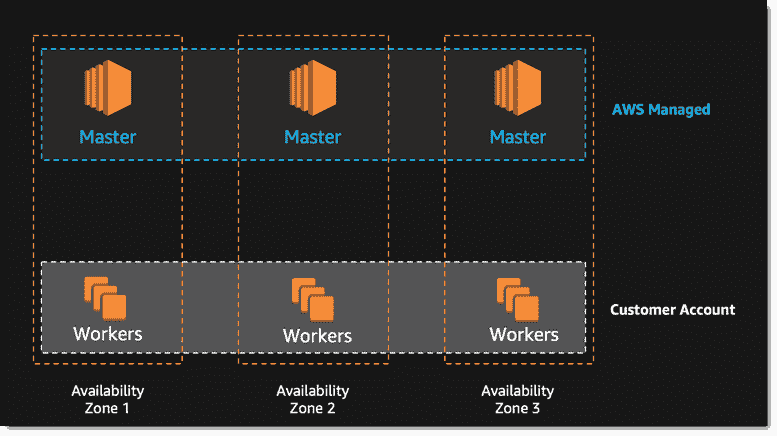
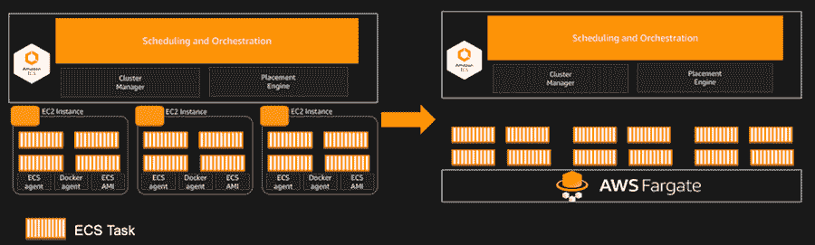

# Amazon Web Services 接手 Kubernetes，提供无服务器数据库服务

> 原文：<https://thenewstack.io/aws-takes-kubernetes-offers-serverless-database-service/>

继微软 Azure 和谷歌云平台之后，亚马逊网络服务今天做了备受期待的投入，支持[云本地计算基金会的](https://www.cncf.io/) Kubernetes 开源容器编排引擎。

该公司还推出了一种新的托管容器服务，一种新的图形数据库和一种“无服务器数据库”，基于该公司的 [Aurora](https://aws.amazon.com/rds/aurora/) (MySQL)数据库架构。AWS 首席执行官 [Andy Jassy](https://twitter.com/ajassy) 在公司年度 [Re:Invent](https://reinvent.awsevents.com/) 用户大会上介绍了这些服务和升级。

以下是概要:

## 集装箱生态系统

[**针对 Kubernetes (EKS)**](https://aws.amazon.com/blogs/aws/amazon-elastic-container-service-for-kubernetes/) 的亚马逊弹性容器服务:该服务将运行 Kubernetes 的上游版本，旨在允许用户使用所有 [Kubernetes 插件和支持工具](/category/kubernetes/)，以及允许用户在 AWS、其他云提供商和他们自己的数据中心之间轻松移动容器化的工作负载。

在 Heptio 的帮助下，该公司还增加了一些弹性支持。该公司将跨三个可用性区域运行 Kubernetes，以消除单点故障。不正常的主机会被自动检测和替换。这个版本的 K8s 还集成了其他 AWS 服务，如弹性负载平衡、IAM(用于身份验证)、AWS CloudTrail 以及用于网络的亚马逊 VPC 和 AWS PrivateLink。

AWS EKS 的三位大师。

[**AWS Fargate**](https://aws.amazon.com/blogs/aws/aws-fargate/) :当行业观察家期待 Kubernetes 的某种支持时，新推出的 [AWS Fargate](https://aws.amazon.com/blogs/compute/aws-fargate-a-product-overview/) 服务有点令人惊讶，从企业的角度来看，这可能是更重要的首次亮相。根据 Jassy 的说法，这项服务提供了一种运行容器的方式，通过 EKS 或者 AWS 自己的内部弹性容器服务[T21，而不需要管理底层的服务器或者集群。](https://aws.amazon.com/ecs/)

“它改变了你运行集装箱的方式。人们希望在任务级运行容器，”Jassy 告诉听众。

根据 AWS 博客的说法，Fargate 提供容器的方式与 [AWS 弹性云计算](https://aws.amazon.com/ec2/)提供虚拟机的方式非常相似，“作为一种基本的计算原语，无需管理底层实例，”[。要构建容器映像，用户只需指定 CPU 和内存需求以及网络和身份验证策略。计费将以每秒的粒度进行。](https://aws.amazon.com/blogs/aws/aws-fargate/)

## 数据数据数据

**Aurora 无服务器** : Aurora 现在具有多主、横向扩展的读写能力，这意味着一个数据库可以在多个可用性区域中拥有多个主数据库。以前，Aurora 只提供多个主数据用于读取，所以增加了写入是在提供真正分布式多区域数据库方面的一个进步。从故障中恢复只需 100 毫秒，这使得任何故障对用户都是透明的。

“它允许你的应用程序透明地容忍任何主机的故障，甚至是在整个可用区域内，”Jassy 说。单区域，多主今天可用；多地区多主将于 2018 年初上市。

AWS 还以另一种方式扩展了 Aurora:允许客户只为他们使用的东西付费。此变体 Aurora Serverless 在预览版中可用。

“它不需要您提供任何数据库实例。当数据库繁忙时，它会自动扩大规模，不繁忙时，它会缩小规模。根本不用的时候就关机了。你只需按秒付费，”杰西说。

[**DynamoDB 更新**](https://aws.amazon.com/blogs/compute/aws-fargate-a-product-overview/) : AWS 的旗舰 NoSQL 数据库服务 [DynamoDB](https://aws.amazon.com/dynamodb/) 已经更新为完全多区域的全局数据库，无论用户进入哪个可用区域，它都可以提供相同的延迟。

它现在具有全局表的功能，即创建跨两个或更多 AWS 区域自动复制的表的能力，以及多主机写入功能。这将消除维护复制过程的所有数据库管理工作。

DynamoDB 现在还提供了通过单击创建表的完整备份的能力，对性能没有任何影响。在 2018 年初，它还将提供时间点恢复，精确到指定的秒。

**[亚马逊海王](https://aws.amazon.com/blogs/aws/amazon-neptune-a-fully-managed-graph-database-service/)** 是 AWS 进入不断增长的图形数据库市场的入口。这是一种可以存储数十亿关系的服务，能够在几毫秒内查询关系。它支持主要的基于标准的图形查询栈:用 [Gremlin](https://tinkerpop.apache.org/gremlin.html) 查询的基于 [Apache TinkerPop](http://tinkerpop.apache.org/) 的属性图，用 [SPARQL](https://www.w3.org/TR/rdf-sparql-query/) 查询的[资源描述框架](https://www.w3.org/RDF/) (RDF)。

此外，在数据方面，AWS 透露了**[Glacier Select](https://aws.amazon.com/blogs/aws/s3-glacier-select/)**，to 支持在其档案存储服务中查询对象， [Glacier](https://aws.amazon.com/glacier/) ，Jassy 吹嘘道，这是主要云提供商中第一个提供此功能的。

该公司还宣布了一个用于桥接内部和云资源的[服务经纪人](https://aws.amazon.com/blogs/apn/aws-service-broker-bridging-the-gulf-between-on-premises-and-aws/)，以及对其[现货实例定价](https://thenewstack.io/aws-now-making-easier-save-spot-instances/)和许多新的[机器学习服务](https://aws.amazon.com/blogs/aws/sagemaker/)的更新，这些将在即将发布的帖子中讨论。

微软、谷歌云和云本地计算基金会是新堆栈的赞助商。

专题图片:在 AWS Re:Invent 的舞台上，AWS 首席执行官安迪·杰西(Andy Jassy)抨击竞争对手的贪婪。

<svg xmlns:xlink="http://www.w3.org/1999/xlink" viewBox="0 0 68 31" version="1.1"><title>Group</title> <desc>Created with Sketch.</desc></svg>