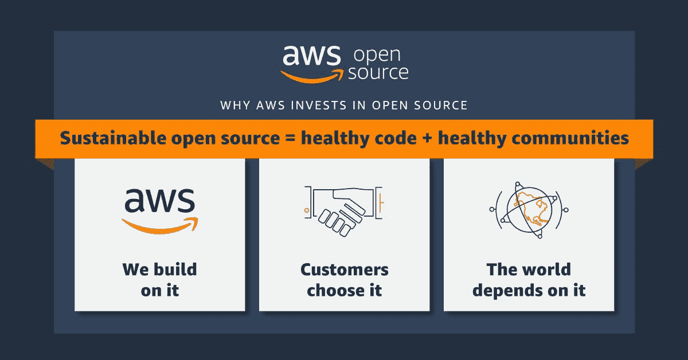

# AWS:为什么我们支持可持续开源

> 原文：<https://thenewstack.io/aws-why-we-support-sustainable-open-source/>

在 AWS，构建者经常问我们如何支持开源项目和我们服务所基于的社区。他们想知道，因为他们的业务应用程序的长期生存能力也依赖于开源项目。

类似地，许多 IT 领导根据其云提供商的开源领先地位做出购买决策。简而言之，开源对任何在云中运行的人都很重要。我们都需要知道，我们构建的项目，以及我们运行的应用程序，从长远来看将是健康和可持续的。

AWS 为大量项目做出了重大贡献。一些著名的例子包括 Apache Airflow、Apache Cassandra、Apache Flink、Apache 胡迪、Apache Kafka、Apache Lucene、Containerd、Java、Kubernetes、OpenTelemetry、PostgreSQL、Project Jupyter、Redis 和 Rust。

理解我们为什么投资和参与开源社区同样重要。“为什么”是推动我们做出贡献的承诺，并解释我们对所贡献的社区和项目的战略和方法。

我们如此大规模投资有三个主要原因:开源对我们、我们的客户和世界都很重要。这些是 AWS 开源的三大支柱，我们将在本帖中更深入地解释。但最重要的是，它始于一个将他们团结在一起的重要原则:可持续的开源。

## **可持续发展是我们的指导原则**

我们将长期支持开源社区并为其做出贡献。我们将继续进行大量投资，并将在未来几年增加我们在开源领域的投资。

可持续的开源项目有必要的资源来维护健康的代码和健康的社区。定期快速地进行错误修复，以保持代码的性能和安全性。一个健康的社区吸引了一群不同的贡献者，他们积极地做出改进，公开地做出决策并交流变化。

最重要的是，这项工作分散在多个维护人员中，因此不会出现单点故障。寻找新的贡献者，他们可以在项目中建立专业知识和地位，以保持社区的活力和创新。

健康、可持续的社区需要在金钱、时间和精力方面的持续投资。我们的开源投资包括雇佣专门的开发人员和维护人员从事上游项目，提供功能和错误修复，以及微调开源项目的性能以在云上运行。我们还向开源基金会提供资金和云积分，并赞助活动和其他社区活动。

例如，去年 5 月，我们宣布在三年内为开源安全基金会(OpenSSF)提供 1000 万美元的资助。11 月，我们还向云原生计算基金会(CNCF)承诺了 300 万美元的云信用和专用工程资源，以资助运行 Kubernetes 项目的基础设施。

去年 12 月，我们将我们的全部专利组合交付给了[开放发明网络](https://aws.amazon.com/blogs/opensource/amazon-joins-the-open-invention-network/)的专利，以降低开源创新公司的专利侵权风险。

通过投资开源，我们正在帮助确保我们所构建的项目、我们的客户所依赖的项目以及全世界所依赖的项目长期保持安全可靠。让我更详细地解释一下为什么这三个支柱对 AWS 都很重要。

## **开源对 AWS 很重要**

首先，开源对于我们的业务和使用我们工具和服务的构建者来说非常重要。如果没有开源，AWS 就不会有今天。我们在开源的基础上为我们的内部工具和服务进行构建和创新，如 EC2(基于 Linux、Xen 和 Apache Tomcat)、Amazon Sagemaker(使用 Apache Spark)和 AWS Lambda(基于开源语言运行时，包括 Java、Go 和 Node.js)。

在这方面，我们不是独一无二的；根据 Linux 基金会的" [2022 企业开源指南](https://www.linuxfoundation.org/research/guide-to-enterprise-open-source) " [报告，各行业的公司报告称，他们的垂直软件栈中有 20%到 85%是开源的。](http://report.in)

我们还提供托管开源服务，如亚马逊关系数据库服务(MariaDB、MySQL 和 PostgreSQL)、亚马逊弹性 Kubernetes 服务(亚马逊 EKS)、亚马逊 OpenSearch 服务和亚马逊 Kafka 托管服务(MSK)。托管开源服务使客户在 AWS 上设置和操作开源项目变得更加容易。

AWS 受益于开源和投资开源的历史由来已久。我们相信开源可以更快地生产出更好的软件，我们很自豪能够参与其中。

例如，我们现在为 Rust 编程语言、Jupyter notebooks 和 Apache Kafka 雇佣了专门的上游团队。我们的工程师每天唯一的关注点就是唤醒和改进开源项目和它周围的生态系统。

更令人兴奋的是，许多团队开始建立专门的开源职责，这样他们就可以在工作日为上游做贡献。

通过与上游紧密合作、提供错误修复和参与技术讨论，我们的工程师对我们所构建的项目非常熟悉。这反过来使我们成为更好的工程师，生产更好的工具和产品，并最终帮助我们的客户。

## **AWS 客户依赖开源软件**

第二，开源对我们的客户很重要。现实情况是，我们的客户不断选择开源来运行他们的工作负载，无论是开源数据库、AI/ML 平台还是许多其他服务。这意味着我们还必须进行投资，以确保这些工作负载为我们的客户出色地运行。

[Bottlerocket](https://aws.amazon.com/bottlerocket/) 就是一个很好的例子。它构建在 Linux 内核之上，是一个精简的容器运行时环境。Bottlerocket 通过防锈工具实现记忆安全控制，有助于最大限度地减少攻击面。我们首先为自己构建它，但它对我们的客户也非常有用，所以我们将其作为开源发布。从那以后，我们的客户以创新的方式使用它，这是我们没有想到的。

创新也不一定来自 AWS。有时候，最好的想法来自我们的客户，我们与他们一起努力改进。我们在公开场合这样做，这样不仅客户会受益，环境中的每个人也会受益。

我们为那些还不是我们客户的人提供开源项目的改进。当我们在上游做出贡献时，我们在 AWS 方面也做得很好，因为我们正在为我们的客户和更广泛的开源社区提供创新。我们希望 AWS 成为客户在云中运行开源工作负载的最佳场所。

## **世界依赖开源**

第三，开源对世界很重要。我们有责任不仅倡导让我们创新的东西，而且倡导技术和互联网持续发展的核心。开源给了我们巨大的机会来参与和利用 AWS 的一些优势和资源来改善我们的整个运营环境。

供应链安全是 AWS 投入资金和工程资源的一个极其重要的领域。在 AWS，安全是零工作。我们已经通过对 OpenSSF 的承诺和 AWS security 内部专注于保护开源软件供应链的团队数量表明了这一级别的重要性。

我们的工程师和研究人员致力于找出我们如何能够更快地识别和修补漏洞，并构建工具，不仅为我们自己，也为我们的客户和互联网的其他部分创造更多价值。

在许多方面，我们已经在云计算和开源技术方面走了很远。然而，我们仍然看到如此多的创新和贡献的机会。加入我们的旅程，无论哪里对你最重要。

我们的开源团队希望听到您的意见，我们鼓励您参与我们的项目或与我们合作，以改善我们赖以生活和发展的技术的长期可持续性。

<svg xmlns:xlink="http://www.w3.org/1999/xlink" viewBox="0 0 68 31" version="1.1"><title>Group</title> <desc>Created with Sketch.</desc></svg>