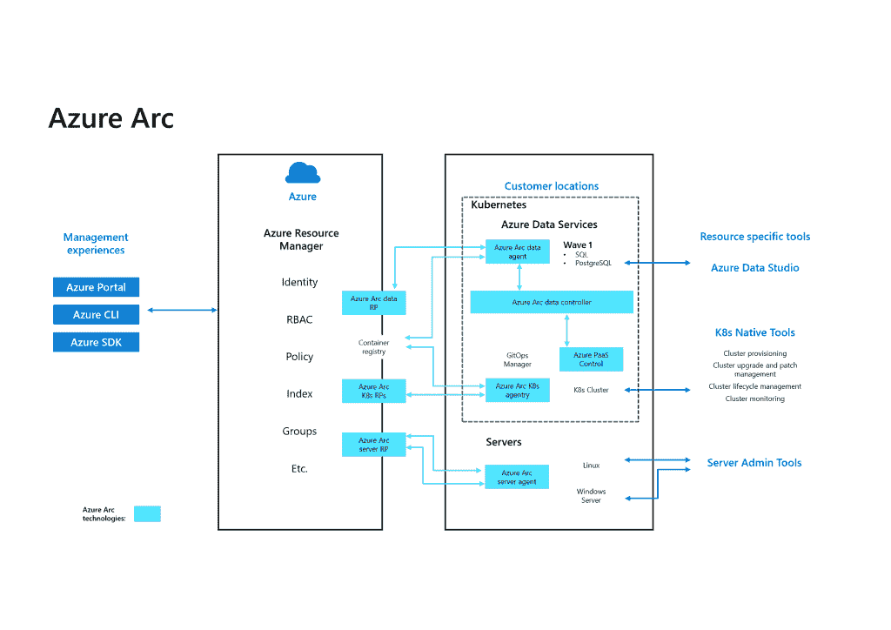
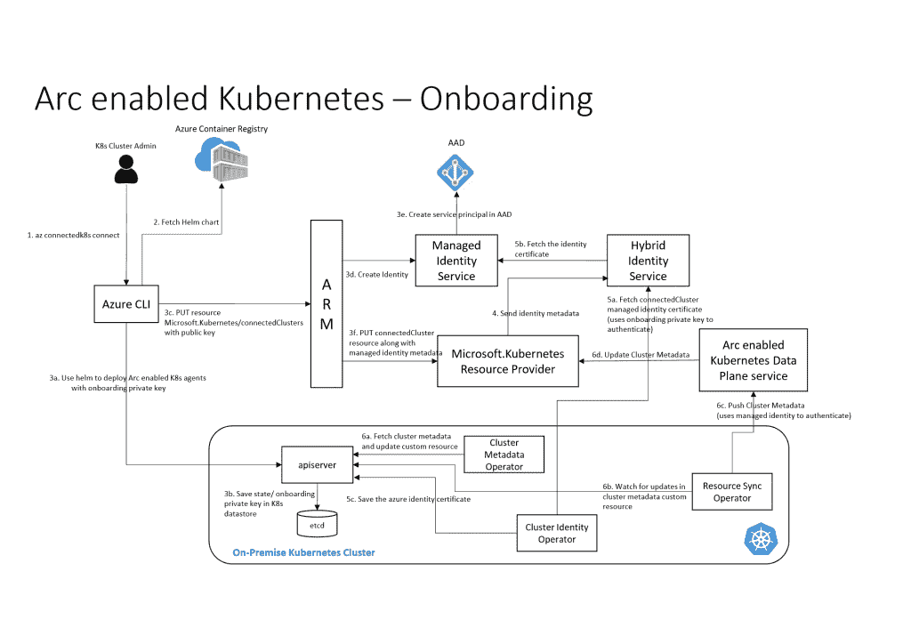
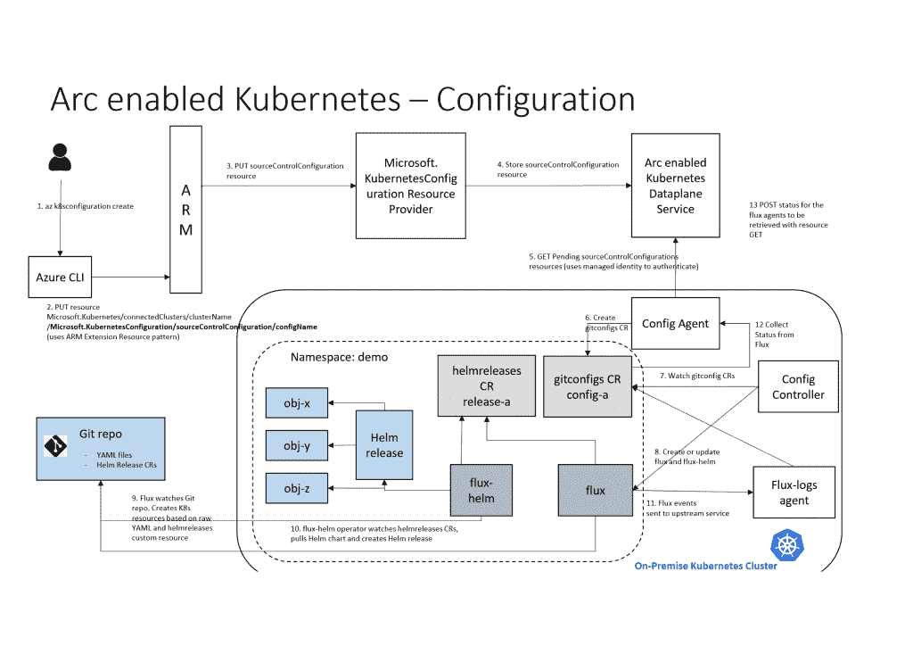
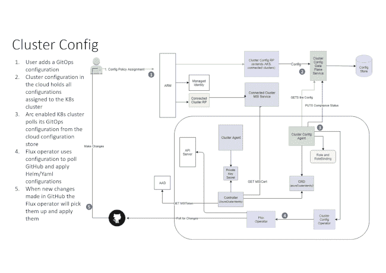

# Azure Arc 正在发展成为一个完全混合的基础设施系统

> 原文：<https://thenewstack.io/azure-arc-is-developing-into-a-full-hybrid-infrastructure-system/>

当微软在 2019 年的 Ignite 大会上宣布 Azure Arc 作为混合和多云的新选项时，愿景比最初的预览版要广泛得多，最初的预览版只涵盖了通过 Azure Resource Manager 管理虚拟机。现在有了更多可用的特性，比如 Kubernetes 支持的公开预览，组织可以尝试更大的范围。

Azure management 的主管杰里米·温特(Jeremy Winter)告诉新的 Stack，这种发展是有意的；从最小的可行产品开始，按照客户反馈(例如去年 Kubernetes 对一些大客户的支持的私人预览)的顺序开发功能，“而不是拆开包装，展示一个全球可用的大东西。”

“整个混合空间，以及 Kubernetes 空间和我们在 Arc 上所走的道路，都是支持服务的，它们都是如此的新，处于变化如此之快的前沿，以至于我们正在采取一种更加迭代的方法。”

混合云不仅仅是基础设施甚至服务；通常情况下，管理是企业最关心的问题。

Arc 是关于扩展 Azure 控制平面以管理 Azure 之外的资源，如虚拟机和 Kubernetes 集群，无论它们在哪里，无论它们是 Windows 或 Linux 还是任何[云本地计算基金会认证的 Kubernetes 发行版](https://www.cncf.io/certification/software-conformance/#logos)，即使它们并不总是连接到互联网；首先应用通用的治理策略——无论是关于合规性、成本管理还是修补流程编排——然后将 PaaS 服务(最初是 Azure 数据服务，但其他服务会继续下去)部署到这些托管资源上。

但这不仅仅是关于操作:这也是一个从现有的内部硬件获得云的一些好处的机会，如敏捷性、可伸缩性和始终保持最新，现有的内部硬件不够统一，无法像 Azure Stack 硬件那样直接运行云服务。 

## **弧线是手臂无处不在**

虽然有许多方法可以管理 Azure 上的基础设施，从门户到第三方工具，如 Terrraform 和 Pulumi，[Azure Resource Manager](https://docs.microsoft.com/en-us/azure/azure-resource-manager/management/overview)(ARM)模板(以声明方式用 JSON 表示资源模式并带有参数，可以用 [Visual Studio 代码](https://azure.microsoft.com/en-us/blog/simplifying-declarative-deployments-in-azure/)创建)是 Azure 的原生基础设施代码解决方案。你可以通过 Azure 门户、Azure 命令行或 Azure SDK(Azure Data Studio 等工具都是用这些工具构建的)来使用 ARM 模板，所以你可以使用其中的任何一个来与 Arc 一起工作。

Arc 使用 ARM、本地代理和资源提供商(由微软或第三方创建)来管理虚拟机(在您自己的服务器上或在云 IaaS 中)、Kubernetes 集群和新的 Azure 堆栈 HCI(Arc 内置于操作系统中)，以及您可以在其上运行的服务(最初是 Azure 数据服务)。

Winter 解释说，在 Kubernetes 上，代理运行在 Kubernetes 名称空间中。“他们负责与 Azure 的连接，他们收集 Arc 日志和指标，他们观察配置请求，他们在 Azure ARM 控制平面和 Kubernetes 之间来回调度调用。”

Arc 绑定到 ARM 特性，如标签、策略和 RBAC，以及 Azure 管理日志和 Azure 策略。您还可以在 Windows 和 Linux 虚拟机中安装 OMS、所需的状态配置和自定义脚本扩展，这使您可以将 Azure 更新管理、清单、更改跟踪和 Azure Monitor 洞察应用于支持 Arc 的服务器。通过这种方式，您可以看到服务器缺少哪些更新并部署它们，跟踪 Windows 和 Linux 服务上的软件清单(下至注册表项和守护程序)或跟踪服务器和集群的健康和性能-无论硬件是在您的办公桌下、数据中心、Azure 还是 AWS 中。

您仍然使用本机工具来调配虚拟机和集群、进行升级和生命周期管理以及进行监控，因此您将使用 kubectl、Helm charts、CRDs、Grafana 和 GitOps 工作流等工具，这些工具在 Kubernetes 或 PowerShell 和 Windows 管理中心中已变得很常见。

如果您使用 System Center 或 SUSE Manager 或 AWS 管理控制台等工具来管理您的虚拟机，您仍将使用这些工具来管理部署和生命周期，但 Arc 将处理策略合规性。“您可以使用 Azure Arc 进行大规模管理，提供一个中央视图，并在一个位置管理所有内容。SUSE Manager 为您提供了一个控制平台来管理使用 SUSE 运行的系统(但不仅限于此)，"[托马斯·迪·吉亚科莫](https://www.linkedin.com/in/thomasdigiacomo/)， [SUSE](https://www.suse.com/company/about/) 工程和创新总裁向我们解释道。

Winter 解释说，GitOps 是 Arc 的核心，因为很多 Kubernetes 的采用都是由开发人员主导的。“我们希望确保您可以使用您现有的 DevOps 管道，使用您现有的 Kubernetes 清单，您可以使用 kubectl 来处理它，然后掌舵图表，如果这是您完成部署的方式，但是因为他们启用了 it-Arc，并且他们已经创建了策略，使用 GitOps 配置和 ARM 策略，现在无论是开发人员或任何人通过 kubectl 命令行进行管理还是通过他们的管道进行部署，该环境都可以确保他们遵守策略或立即将其配置为策略。”

您确实需要连接到 Azure 以向 Arc 注册 Kubernetes 集群进行管理，因为它需要从 Azure 获取配置信息；但是只要代理可以访问本地 git repo，您仍然可以在没有到 Azure 的永久连接的情况下管理集群。

Winter 指出，微软客户已经在使用这种 Kubernetes DevOps 管道，但在财富 500 强客户中，这可能仍处于试点和实验室阶段，而不是部署在他们的主线业务中。“我仍然认为我们在这个行业还有一段路要走，Kubernetes 将成为主线，并围绕它开展业务。”通常，他们会更新现有的应用程序。

事实上，虽然使用 Arc 服务器预览版的客户喜欢“单一管理平台”,但对于 Kubernetes，他们希望 Arc 告诉他们已经拥有的 Kubernetes 基础设施。“他们正在清点 Kubernetes 环境中的内容，并使用 GitOps 配置来简化配置和管理。我认为只是缺少 Kubernetes 管理工具和集群管理工具。”

虽然 Arc 可以管理任何云中的服务器和 Kubernetes 集群，但选择 Azure 的组织通常会尝试 Arc 预览。“他们说的是‘我们是以 Azure 为中心的客户；我们相信您为我们提供的途径:ARM 模板和 ARM 控制面板，以及资源图中的管理组、标记和策略，以实现环境中的库存和实时洞察。“我在服务器世界里很难做到这一点，而我在 Kubernetes 世界里没有，我想把你在 Azure 世界里给我的东西应用到这些环境中，”Winter 解释道。

远程工作的现状增加了这种压力，组织正在使用 Arc GitOps 工作流来管理和保持远程开发的一致性。“您可以确保您需要的公司策略或针对这些开发环境的一般策略得到实施。”

虽然你可以使用 Arc 来管理任何 CNCF 认证的 Kubernetes 发行版，但微软最初关注的主要是 RedHat OpenShift、Canonical 的 Charmed Kubernetes、Rancher Kubernetes Engine (RKE)和 GKS(以及微软自己的 Azure Kubernetes 服务)。微软也做了一些工作，将 Arc 与苏珊·SLES 和雷德哈特·RHEL 整合在一起；例如，[你可以使用 Arc](https://azure.microsoft.com/en-us/blog/azure-red-hat-expanding-hybrid-management-and-data-services-for-easier-innovation-anywhere/) 在 RHEL 上管理 SQL Server，或者在 OpenShift 上管理 Azure SQL 托管实例和 Azure PostgreSQL 超大规模。

“我们开始与 Pacific 就 VMware 开展一些合作，”Winter 指出(这是一个将 Kubernetes 集成到 VMware vSphere 的项目)，但重点更多的是让 Arc 为全面上市做好准备，而不是与合作伙伴进行深度集成。

Arc 的核心能力已经准备好了，温特说。与客户的私人预览已经证明了这个概念，这些客户的反馈导致了对扩展等功能的优先考虑。公开预览将与客户一起验证质量，为 GA 做准备将更多地涉及准备 Azure 区域(包括政府云区域)和安全控制。“我们看到客户已经开始在相当大的规模上推动 Arc，他们已经开始与我们讨论转移到生产环境中。”【T2

## **高端服务**

对扩展的热情为客户如何使用 Arc 提供了一些线索。“他们想让我们已经内置在 Azure 中的所有这些管理服务以比我们预期的快得多的速度下来到 Arc，”Winter 指出。“在过去的五六年里，我们开始在 Azure 中从头开始构建管理服务，现在它们已经足够成熟，我们不仅可以让它们为 Arc 带来 Kubernetes 和服务器控制和治理平台，还可以开始带来更多的管理服务。安全中心是一个客户想要的扩展；您将看到备份、修补、监控和所有其他类似的工作。”

混合云的目标之一是将云服务带到您无法使用云的地方，无论是因为连接、数据重力还是法规，这些更高级别的服务正是许多组织对 Arc 感兴趣的原因。

Arc 上第一个云服务是 Arc 数据服务；仍在私有预览版中，最初用于 Azure SQL 托管实例和 Azure PostgreSQL 超大规模服务，提供与 Azure 相同的弹性扩展、始终最新、安全、云计费的数据库服务，使用单一管理门户管理多个数据库服务，但基于您选择的基础架构(通过使用 CRDs 将这些数据服务部署到 Kubernetes 集群)。

“任何应用程序都需要有自己的数据层，而让 SQL 在任何一个 Kubernetes 环境中运行的能力是关键，”Winter 指出。但 Arc 数据服务也是理解如何将 Azure 云服务引入 Arc 基础设施的一种方式。“我们正在打包我称之为服务集合的东西，它引入了 ARM 控制平面、Kubernetes 环境和数据服务，因此它可以在任何 Kubernetes 环境中运行，我们正在花时间在这方面获得正确的架构。这不仅仅是部署一个代理并获得与 ARM 控制平面的连接；我们正在做更多的工作来创建支持 Arc 的服务，我们可以将其作为非常便携的边缘服务来运行。”

这意味着，尽管 Arc 可能会在今年晚些时候上市，但 Arc 数据服务可能会在晚些时候发布——其他服务也会随之推出。第一个很可能是 Arc App Services，它将 Azure 功能和事件网格结合成一个 PaaS 部署平台，你可以在 Arc 上运行，未来其他 Azure 服务也将以同样的方式打包。

当客户将 Arc 与 Anthos ( [支持 Knative 和 Cloud Run](https://thenewstack.io/the-new-features-in-googles-anthos-are-about-operationalizing-kubernetes/) )进行比较时，拥有一个应用服务将会有所帮助，Winter 表示，尽管 Anthos 已经领先一步，但这种情况已经发生了。“现在有很多对话吸引了我们(与 Anthos 竞争), Anthos 的客户正在联系我们，因为当他们看到 Anthos 时，他们就会转向 Arc。”

“我认为在接下来的 12 个月里，我们将会看到 Arc 和 Anthos 之间的激烈竞争，” [CCS Insight](https://www.ccsinsight.com/) 负责企业研究的副总裁 [Nicholas McQuire](https://www.linkedin.com/in/nicholasmcquire/) 表示同意。

“Arc 最初被定位为更广泛的角色，管理更广泛的资源，包括裸机、虚拟机和 Kubernetes 等。，除了在监控和安全上分层。到目前为止，Anthos 更多的是在 Kubernetes 中跨基础设施环境进行大规模的容器开发，尤其是 AWS。但两者都在快速发展，从添加裸机、虚拟机、容器集群和多云协调和治理到新的安全功能。”

“我们现在也看到下一个前沿服务也进入了画面:例如 ML、edge 和 5G。明年，所有这些都将成为这些环境的核心部分。”

其他云提供商认为混合是一种在本地部署云服务的方式(微软有 Azure Stack Hub)，在超大规模区域之外提供云服务的方式(微软有 [Azure Stack Edge](https://azure.microsoft.com/en-us/products/azure-stack/edge/) 和 [Azure Edge Zones](https://docs.microsoft.com/en-us/azure/networking/edge-zones-overview#:~:text=Azure%20Edge%20Zone%20is%20a,high%20throughput%20requirements%20of%20applications.) 用于这种方式)，或者在其他云上使用。Arc 确实解决了多云管理问题，但它的范围要广得多。Arc 试图将各种不同的基础设施统一到一个可以交付应用和服务的单一平台中，以便组织可以使用 DevOps 等云实践，并对所有这些基础设施进行监控。

你可以使用 Arc 从一个地方管理运行在不同数据中心的多个 Azure Stack Hub 实例上的 Kubernetes 或者您可以使用它来管理运行您自己的 Kubernetes 集群的物理服务器，以及您向外扩展的云 Kubernetes 服务。Arc 的美妙之处在于，您可以在同一个地方完成所有这些工作，然后使用这种基础设施组合来运行云服务。

这不完全是私有云、多云或任何熟悉的混合云版本；但这是一种雄心勃勃的方法，涵盖了许多微软客户拥有的更多大型异构环境。

<svg xmlns:xlink="http://www.w3.org/1999/xlink" viewBox="0 0 68 31" version="1.1"><title>Group</title> <desc>Created with Sketch.</desc></svg>