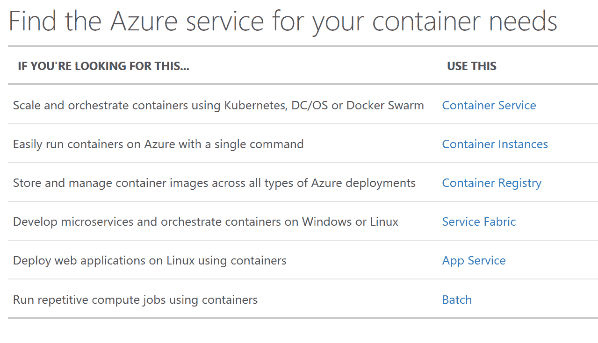

# Azure 容器实例承诺更便宜、更敏捷的容器工具

> 原文：<https://thenewstack.io/azure-container-instances-mean-cheaper-agile-container-tools-way/>

Azure Container Instances 服务的公开预览版让云托管的容器更接近容器的概念。

“容器提供了一种新形式的灵活性，”微软 Azure Compute 产品负责人[科里·桑德斯](https://github.com/coreysa)指出。“您可以显著加快应用的发布速度，加快更新速度，以更简单的方式进行更改并在整个团队中协同工作，让应用和服务更加灵活。它们还提供了大量的可移植性；您可以构建一个应用并跨多个云和多个应用平台进行部署。由于它们启动时间快且尺寸非常小，因此可提供真正简单快速的扩展；您可以几乎瞬间扩展您的应用，以满足客户或最终用户的需求。”

如果您正在使用容器进行试验或开发原型，那么首先需要设置将托管容器的 VM(并记住稍后修补和删除容器),这对于开始来说是一个障碍。使用 ACI，您只需输入一条命令，不到五秒钟就可以获得您所引用的容器映像的运行实例，如果您需要的话，还可以获得一个公共 IP。(如果你在 Azure 上还没有一个资源组，你必须创建它，这第一次在命令行上又增加了几秒钟。)

从命令行界面(CLI)返回的是一个 JSON blob，其中包含容器的统计信息和状态——包括 IP 地址。您可以使用 logs 命令获得更多详细信息，并使用 delete 删除容器。GitHub 和 [Docket Hub](https://hub.docker.com/r/microsoft/aci-helloworld/) 上有一个 Node.js [Hello World 应用程序可以试用。](https://github.com/Azure-Samples/aci-helloworld)

使用 Azure CLI 旋转带有 ACI 的容器并不局限于门户中的 Azure 云外壳；你可以在任何有 CLI 的地方使用它，也就是说在你的 PC 或 Mac 甚至是你的 iPhone 上。新的堆栈看到了一个使用 Azure 云外壳中的 Azure CLI 构建启动容器的演示，微软告诉我们，“新的 ACI 容器命令将在几天内可在可下载的 Azure CLI 中使用。”

你也可以从一个公共的 Docker 存储库、一个私有的注册表或者从 [Azure 容器注册表](https://azure.microsoft.com/en-us/services/container-registry/)进行部署。ACI 并不局限于单个容器；您可以使用模板将多个容器部署为一个容器组，该容器组共享主机、本地网络、存储和生命周期[。你可以直接挂载 Azure 文件共享来持久化和检索容器实例的状态，微软计划集成 Azure 的虚拟网络、负载平衡器和其他网络基础设施。](https://docs.microsoft.com/en-us/azure/container-instances/container-instances-multi-container-group)

## 内置管理

Sanders 说，Azure 管理容器实例的底层基础设施，比如找到合适的主机来运行容器，但对于更复杂的容器基础设施，你仍然需要使用 orchestrator 来处理伸缩和协调升级等事情。“考虑 Azure 容器实例的方式是，它们非常专注于简单的容器管理，并实现快速轻松的部署，”但它们也可以是其他容器工具的构建块。

微软正在开发的开源 ACI Kubernetes 连接器，使用容器组来创建 Kubernetes pods，是一个展示整个容器编排器如何使用其 REST API(将在 Swagger 中发布)与 ACI 集成的示例。如果你想在 ACI 中使用[Microsoft Draft Kubernetes app builder](https://github.com/Azure/draft)工具，ACI Kubernetes 连接器可以实现。该连接器还允许您在同一个 Kubernetes 集群中拥有用于可预测工作负载的传统的基于 VM 的容器和用于爆发和扩展的按需容器实例。

“你可以使用虚拟机非常紧密地打包你的工作负载，或者你可以使用 Azure Container 实例以更加敏捷的方式部署容器，能够在几秒钟内启动和部署它们，并非常非常快地爆发，”桑德斯说，他预测大多数组织将使用两者的组合。

该连接器“仍处于试验阶段，尚未准备好投入生产使用”，但将允许您从自己的 Kubernetes 环境中管理 Azure 上的容器实例(尽管对于许多工作负载，您会希望容器位于同一网络上)。连接器可以在任何 Kubernetes 环境中使用。连接器只是充当 ACI 的代理，使用 Azure 服务主体来创建必要的 Azure 资源。

实例的定价也不同寻常；它结合了每秒和资源定价。实例的默认配置是单个 CPU 和 1.5GB 内存，但是您可以选择最多四个内核，并为每个内核分配 1GB 到 3.5GB 的内存。每秒的创建请求成本为 0.0025 美元，内存和 CPU 成本为 0.0000125 美元(每 GB 或每核心)。“这使客户和开发人员能够确保平台完全适合他们的工作负载，而不是支付多余的费用或多余的 1gb 内存，”微软断言。

越来越多的 Azure 服务支持容器(归功于微软)

不间断地运行一个容器每月要花费大约 50 美元，尽管这不是这项服务的设计目的；想想开发测试、渲染、脚本、实验和扩展。虽然您可以为您的容器实例拥有一个公共 IP 地址，但是拥有一个公共端点是可选的；“你也可以用它来运行任何类型的批处理工作负载，”Sanders 说。

Azure container architect 和 Kubernetes 联合创始人 [Brendan Burns](https://github.com/brendandburns) 谈论“[无牵无挂的牛](https://twitter.com/brendandburns/status/890232243251171328)”用途，在这些用途中，您不需要超大规模，但也不想使用自己的基础架构。运行一个快速执行的脚本可能意味着[节省大量的每秒计费](https://twitter.com/brendandburns/status/890280962512244736)，而且对于某些工作负载来说，它可能比按请求付费的无服务器功能更合适。

因为容器实例是 Azure 中的一级对象，[没有隐藏在 VM](https://thenewstack.io/azure-container-instances-spins-containers-cloud-without-vm-overhead/) 中，所以如果您愿意，您可以使用计费标签跟踪单个容器的使用，并且您可以使用基于角色的访问控制来确定谁可以连接到实例。

ACI 受益于 Azure 的 Windows Server 基础，尤其是 Windows Server 2016。

“使用 Hyper-V 隔离技术的客户之间的部署被安全隔离，”Sanders 说。使用 Azure 容器实例，您的应用程序在容器中就像在虚拟机中一样孤立

## 一流的待遇

让容器成为 Azure 上的一级对象表明了微软对容器的承诺，以及它期望它们对客户有多有用。这意味着 ACI 不仅仅是一种“又快又脏”的组装容器的方式。Azure 容器实例的灵活性和经济性使它们成为一个重要的构件。

桑德斯告诉我们:“我们确实希望一些 Azure 服务建立在 Azure 容器实例的基础上，并支持使用它的解决方案，我们现在正在与其中的几个合作。”他没有说出服务的名称，但容器实例似乎是 Azure 容器服务、Azure 应用服务、服务结构和 Azure 批处理的理想选择。

阿什利·科内德勒通过 Unsplash 拍摄的特写图像。

<svg xmlns:xlink="http://www.w3.org/1999/xlink" viewBox="0 0 68 31" version="1.1"><title>Group</title> <desc>Created with Sketch.</desc></svg>