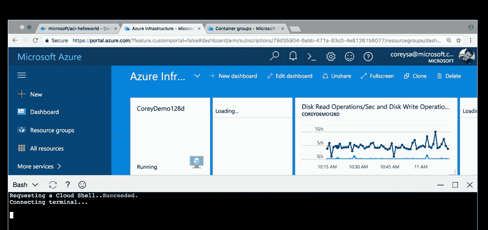

# 新的 Microsoft Azure 服务消除了容器启动带来的虚拟机开销

> 原文：<https://thenewstack.io/azure-container-instances-spins-containers-cloud-without-vm-overhead/>

创建容器既快速又简单，可以从命令行完成，但是创建一个 VM 来托管生成的容器仍然需要时间，并且通常意味着使用不同的接口。

微软已经通过[新推出的 Azure Container Instance](https://azure.microsoft.com/en-us/blog/announcing-azure-container-instances/) 服务解决了这一潜在瓶颈，该服务可用于直接从 Azure Cloud Shell 中的 Bash 提示符或从本地运行的 Azure CLI 创建单独的容器。您也可以使用来自公共 Docker 存储库、私有注册中心或 [Azure 容器服务](https://azure.microsoft.com/en-us/services/container-service/)的模板进行部署。

该公司还为那些希望使用流行的 [Kubernetes](/category/kubernetes/) 开源容器编排引擎快速启动容器的人编写了一个连接器，该引擎由[云本地计算基金会](https://www.cncf.io/)管理。

微软 Azure Compute 产品负责人 Corey Sanders[解释说:“对于今天的任何容器部署，你首先必须有一个用于托管容器的虚拟机。“现在，随着 ACI 的推出，开始部署所需的时间和部署容器所需的工作量都不复存在了。这将基础架构推上了一个层次，使您能够使用容器，不再需要担心虚拟机的创建、删除、修补和扩展。”](https://github.com/coreysa)

ACI 提供每秒[计费](https://twitter.com/ashleymcnamara/status/890233972407418880)，用户还可以指定容器的 CPU 和内存需求。

通过在 Azure Cloud Shell 中键入命令来直接启动容器(归功于微软)。

ACI 服务从今天开始在三个 Azure 数据中心(美国西部、美国东部和西欧)公开预览，尽管随着时间的推移，这一服务将会扩展。最初，它是针对 Linux 容器的，对 Windows 容器的支持将“在接下来的几周内很快”到来。

## Kubernetes 连接器

对于那些希望使用开源 Kubernetes 容器编排引擎来部署带有 ACI 的容器实例的人，微软发布了一个开源连接器 ACI Connector for Kubernetes，可用于构建同时使用虚拟机和容器实例的应用程序。

“这实现了由 Kubernetes 协调的按需和几乎即时的容器计算，无需管理虚拟机基础架构，同时仍利用可移植的 Kubernetes API。这将允许您在同一个 Kubernetes 集群中同时利用虚拟机和容器实例，让您两全其美，”该项目的 GitHub 页面断言道。

微软也加入了[云原生计算基金会](https://www.cloudfoundry.org/)，成为“白金会员”，Azure 上容器的首席项目经理 Gabe Monroy 和 Deis(今年早些时候微软收购了 Deis)的前首席技术官成为理事会成员。

考虑到微软对容器开发的持续参与，这种支持是有意义的，它为 Kubernetes、Helm、containerd 和 gRPC 以及自己的开源工具如 Kubernetes Draft 做出了贡献。桑德斯强调了容器对微软的重要性。“容器正在改变开发人员开发代码的方式，改变应用程序的部署方式和系统管理员管理环境的方式。”

[云本地计算基金会](https://www.cncf.io/)是新堆栈的赞助商。

通过 Pixabay 的特征图像。

<svg xmlns:xlink="http://www.w3.org/1999/xlink" viewBox="0 0 68 31" version="1.1"><title>Group</title> <desc>Created with Sketch.</desc></svg>