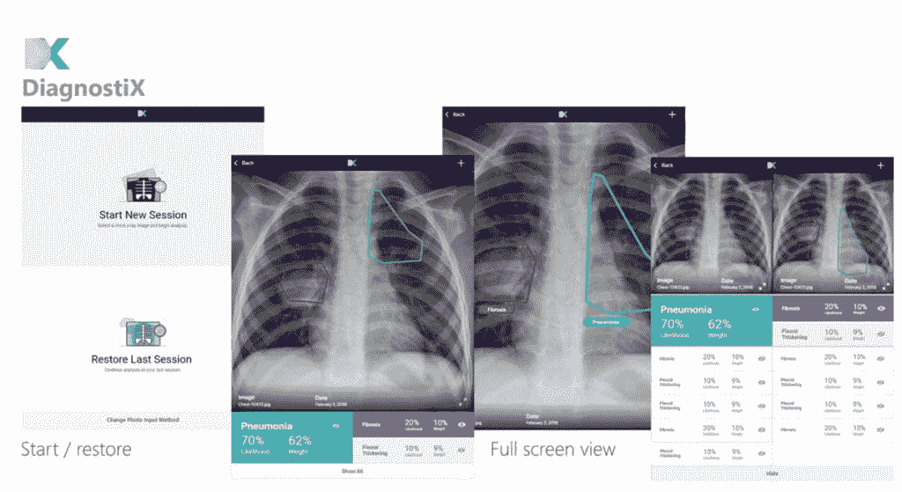

# Azure CTO:开源是云中或边缘机器学习的关键

> 原文：<https://thenewstack.io/azure-cto-open-source-is-key-to-machine-learning-in-the-cloud-or-on-the-edge/>

[Azure CTO:开源是云端机器学习的关键组件，还是在边缘](https://thenewstack.simplecast.com/episodes/azure-cto-open-source-is-key-component-to-machine-learning-in-the-cloud-or-on-the-edge)

在开源领袖峰会上录制的采访中，Azure CTO [Mark Russinovich](https://twitter.com/markrussinovich) 和 New Stack 的创始人 Alex Williams 讨论了微软如何建立和贡献 Azure 的人工智能(AI)和机器学习的开源。Russinovich 刚刚发表了一个主题演讲，暗示人工智能目前的实力归功于开源和云的结合，他解释说，“从根本上说，许多人工智能，机器学习和分析都是建立在开源的基础上的，这是我们利用和使用开源的战略的一个关键部分，也是对开源的贡献和补充。”

这方面的例子包括微软对现有项目如 YARN(用于 [Azure Data Lake Analytics](https://azure.microsoft.com/en-us/blog/creating-big-data-pipelines-using-azure-data-lake-and-azure-data-factory/) )做出自己的增强和修复，支持 R 开源社区，与脸书和 AWS 合作 [ONNX 项目](https://thenewstack.io/facebook-microsoft-bring-interoperable-models-machine-learning-toolkits)，在 Caffe、MXNet 和 CNTK 之间交换模型，这是微软自己的[深度学习框架](https://thenewstack.io/microsoft-adds-python-support-cntk-deep-learning-toolkit/)——也是开源的。

“CNTK 是我们自己的知识产权；这是一个差异化的卷积神经网络框架…是我们为 Bring 内部开发的。Russinovich 解释说:“我们在很多认知 API 中使用它，并将其贡献给开源社区。”。

他说，Azure 将这些开源组件带给客户的方式通常是作为服务的一部分，比如认知服务 API，或者 R 与 SQL Server 和 Azure SQL DB 集成的方式，这样你就可以在数据所在的位置进行机器学习。“要么我们让它在我们的平台上可用，要么为我们的平台提供动力，并(用它)为客户提供服务。”

越来越多的客户将这些碎片放在一起，作为管道的一部分，创建机器学习驱动的应用程序，这非常适合无服务器计算等新的应用程序开发实践。在主题演讲中，Russinovich 展示了一款名为 DiagnostiCX 的新应用，该应用使用机器学习来帮助没有受过训练的放射科医生的医生解读胸部 x 光片，以发现肺炎的迹象，肺炎是全球儿童的最大杀手之一。

“它就像一条管道；一个新的 x 射线进来，启动一个工作流，它将对它进行分析，然后进行评分，这将导致分数触发一些工作流，如生成报告，医生在他们收到的应用程序中采取行动。一切基本上都是数据驱动的，这对应于触发数据产生和处理的事件。”

其他开源技术，如[容器](https://thenewstack.io/azure-iot-edge-machine-learning-containers/)也有助于将机器学习应用程序投入生产。像机器学习工作台这样的 Azure 服务创建的数据模型既可以在 Azure 容器服务上运行，也可以在边缘的物联网设备上运行。“在工厂车间，通过图像识别进行异常物体检测以发现故障零件，您不希望将所有合格零件的图像发送到云端进行额外处理和分类，以找出工厂装配线中的问题原因；你只要把异常的送上去就行了。因此，如果将图像检测放在边缘，就可以节省所有带宽。”

Russinovich 指出，Azure 也有像 IoT Hub 这样的工具，可以将所有这些整合到一个功能性和可管理的物联网应用程序中，该应用程序可以远程提供，并为开发人员和运营团队提供工具。“我们希望创建一个应用程序框架和基础架构，以支持最有效的方式来管理整个应用程序，以便大规模部署运营，而不管其拓扑结构如何。”他坚持认为，正是云和开源的结合为开发者释放了机器学习的力量。

[https://www.youtube.com/embed/oCeAq7I0Ofc?feature=oembed](https://www.youtube.com/embed/oCeAq7I0Ofc?feature=oembed)

视频

微软是这一新技术的赞助商。

<svg xmlns:xlink="http://www.w3.org/1999/xlink" viewBox="0 0 68 31" version="1.1"><title>Group</title> <desc>Created with Sketch.</desc></svg>