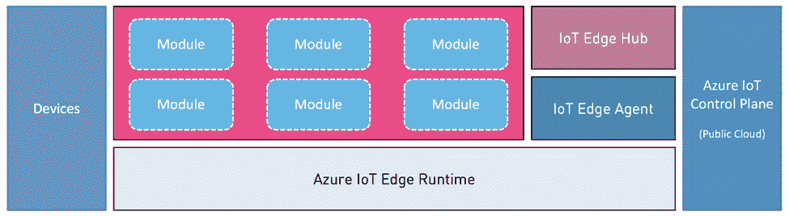

# Azure 物联网边缘:技术入门

> 原文：<https://thenewstack.io/azure-iot-edge-a-technology-primer/>

[边缘计算](https://thenewstack.io/category/edge-iot/)正在逐渐演变成为下一波云计算。这种新方法解决了传统云计算交付模式的一些固有问题。

边缘计算的一些主要优势包括:

*   **低延迟访问**
    *   边缘计算在本地公开计算、存储和网络。
*   **降低带宽消耗**
    *   边缘层通过仅吸收公共云所需的内容来聚合和过滤数据。
*   **离线可用性**
    *   间歇性访问互联网和云的应用程序可以依赖边缘计算层提供的本地资源。
*   **局部最大似然推理**
    *   在公共云中训练的机器学习模型部署在边缘，以实现更快的推理。

可视化边缘计算架构的最佳方式是将其视为一个三层架构。第一层是本地设备和应用程序；第二层是边缘层，最后是公有云作为第三层。

机器学习[的兴起](https://www.forbes.com/sites/janakirammsv/2017/04/16/how-edge-computing-and-serverless-deliver-scalable-machine-learning-services/#3fe5a2582ebd)是边缘计算的关键驱动力之一。公共云用于发展**从历史数据中学习**的模型。Edge 通过应用基于部署的 ML 模型的智能做出**决策**。设备根据边缘做出的决定采取**动作**，这些决定可能包括控制设备或机器。

## 微软 Azure 物联网边缘

微软是首批在公共云中提供端到端物联网平台的公司之一。客户使用一组云服务，这些云服务构成了企业物联网解决方案的构建模块。

Azure IoT Edge 是 Azure IoT 产品组合的最新成员。最初构建的物联网网关已经发展成为成熟的边缘计算平台。它位于设备层和公共云之间。

Azure IoT Edge 是 Github 上提供的一个[开源项目](https://github.com/Azure/iotedge)。该平台可以部署在 Linux (ARM & x64)和微软 Windows 操作系统上。根据需求和运行时环境的不同，Azure IoT Edge 可以运行在资源受限的设备上，如运行在企业数据中心的 Raspberry Pi Zero 或功能强大的 x86 服务器。这种灵活性使其成为业内强大的平台之一。

Azure IoT Edge 公开了 IoT Hub 的部分功能，用于设备认证和本地设备的通信。这对于在离线模式下运行物联网应用而无需直接与公共云对话非常有用。

让我们仔细看看这个架构。

## Azure 物联网边缘架构

Azure IoT Edge 的设计具有极强的模块化和可扩展性。从长远来看，微软已经做出了一些对产品团队和客户都有帮助的决定。它建立在支持 Docker 的开源工具链[莫比](https://mobyproject.org/)之上。该平台占地面积很小，可以通过几个命令轻松安装。

运行 edge 平台的设备通常部署在不易接近的偏远地方。他们只需在初始入职流程中注册，之后便可从公共云进行远程管理。如果边缘设备在应用新配置时处于离线状态，则一旦设备获得连接，就会被推送。

由于边缘设备是能够运行附加服务的美化的物联网设备，Azure IoT 将它们视为任何其他注册设备。Azure IoT 的控制平面用于大规模管理边缘设备。

Azure IoT Edge 无缝管理设备和公共云之间的交互。它完成本地设备之间的认证和通信所涉及的所有必要的管道工作。

下面是 Azure IoT Edge 的示意图。让我们来了解一下这些组件的作用。

### 设备

这些传感器和执行器负责获取数据或控制设备。这些设备不直接连接到云。相反，它们与本地边缘计算层对话。Azure IoT Edge 作为一个透明的网关，可以翻译这些叶级设备使用的协议和数据格式。每个设备都有一个向边缘层注册的相应模块。这些模块被实例化为由运行时代理管理的容器。

### 模块

模块是普通的 Docker 容器，通常映射到一个设备。例如，如果有两个设备连接到边缘，灯泡和温度传感器，它们被建模为两个独立的模块，包含通信机制和与设备通信的逻辑。模块是从标准 Dockerfile 定义构建的，并被推送到公共或私有注册中心。由于依赖于运行时和上下文，它们不能被视为独立的容器。

模块可以通过运行时建立的定义良好的接口相互通信。并非每个模块都需要映射到一个设备。例如，用于执行对象检测的 TensorFlow 模型没有关联的设备。相反，它以菊花链形式连接到一个摄像头模块，该模块抓取帧并传递到下一个模块。

由于模块是设备的直接表示，它们有一个被定义为 JSON 文档的数字孪生兄弟。twin makes 可以读取最后一次正确的配置，也可以在实际设备上设置所需的属性。数字双胞胎携带额外的元数据，这些元数据有助于根据位置、型号、品牌和序列号等属性查询和过滤设备。

Azure IoT Edge 将模块视为松散耦合的独立组件。类似于 UNIX 管道，一个模块的输出被提供给另一个模块。这种设计决策使得定义模块化和可扩展的复杂管道成为可能。

### Azure 物联网边缘运行时

这是 Azure IoT Edge 的基础，它管理公共云中与 Azure IoT 控制平面的交互。向 Azure 注册的每个边缘设备都需要安装该组件。它与 Azure IoT 建立安全连接，并设置安全模块所需的 PKI 基础设施。物联网边缘运行时拥有设备和云两方面的通信。它作为本机二进制文件安装在目标操作系统上，如 Raspbian、Debian、Ubuntu、CentOS 和 Microsoft Windows。物联网边缘运行时作为操作系统内的守护程序运行，与莫比接口，以管理作为模块部署的容器的生命周期。

### Azure 物联网边缘代理

物联网边缘代理是作为容器运行的物联网边缘运行时的第一个组件。每次边缘设备通电时，它都会自行启动。物联网边缘代理负责从云中下载部署清单，并维护边缘设备的所需配置状态。它从注册表中提取所有容器映像，并基于预定义的配置运行它们。它的主要职责是确保容器的状态和配置与边缘设备的原始定义相匹配。如果通过 Azure IoT Portal 向清单中添加了新模块，代理会在发现变化后立即提取映像。类似地，当容器不再是清单的一部分时，它终止容器。在幕后，Azure IoT Edge Agent 管理云和本地运行时之间的交互，以维护所需的状态。

### Azure 物联网边缘中心

Azure IoT Edge runtime 的第二个组件是 Edge Hub，它模仿了公共云中的 IoT Hub。它本质上是通过向叶设备公开身份验证和通信服务来提供物联网中心的离线功能。代表设备的模块具有通过本地集线器认证的逻辑。类似地，它可以将遥测数据发送到集线器，集线器将遥测数据转发到上游组件，上游组件是定义为清单一部分的其他模块。

Edge Hub 公开了与公共云相同的 API。这种设计减少了为边缘重构设备所需的工作量。因为它会在运行时在与云中的 IoT Hub 握手期间获得身份验证后缓存凭据。

边缘集线器充当促进本地设备通信的通信代理。它支持物联网中心的标准协议，包括 AMQP、MQTT 和 HTTP。但是，HTTP 在当前版本的 Edge Hub 中不可用。

总之，模块靠近设备放置，而边缘代理和边缘集线器靠近云的控制平面。运行时管理和编排连接范围两端所涉及的工作流。

如果你仔细观察，你会发现 Edge 运行时非常类似于 Swarm 或 Kubernetes 这样的容器管理平台。利用这种设计，微软为 Azure IoT Hub 构建了一个 Kubernetes 连接器，该连接器基于虚拟 Kubelet。

在即将发表的一篇文章中，我将带您了解通过 Kubernetes 在 Raspberry Pi 上部署和管理边缘模块的步骤。敬请期待！

<svg xmlns:xlink="http://www.w3.org/1999/xlink" viewBox="0 0 68 31" version="1.1"><title>Group</title> <desc>Created with Sketch.</desc></svg>