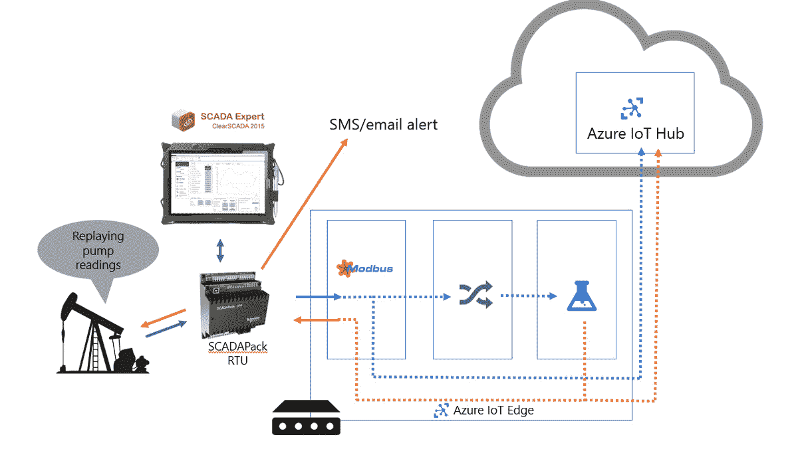

# Azure 物联网边缘、机器学习和容器

> 原文：<https://thenewstack.io/azure-iot-edge-machine-learning-containers/>

云非常适合于[物联网(IoT)](https://thenewstack.io/category/edge-iot/) ，因为它提供了规模和连接性来处理来自不同位置的大量设备的大量传感器读数。云通过平台服务也提供了处理信息的工具。

但是，当被监控和测量的设备位于没有太多连接的远程位置时，云对于[物联网](https://thenewstack.io/azure-iot-edge-a-technology-primer/)来说也非常不方便；如果延迟如此之高，以至于在数据和预测可以来回发送之前，系统试图预测的任何事情都将发生，那么由异常传感器读数触发的云中的预测分析就没有多大用处。

微软的 [Azure 物联网边缘服务](https://azure.microsoft.com/en-us/campaigns/iot-edge/)(目前正在预览中)使用 Docker 容器作为打包 Azure 物联网中心云服务关键部分的方式，以便在任何东西上运行，从本地服务器集群到用作物联网网关的小物联网板，如 Raspberry Pi。这将与 [Azure Functions](https://azure.microsoft.com/en-us/blog/introducing-azure-functions/) 一起工作，在本地使用无服务器计算来触发操作，并从 [Azure 机器学习](https://www.youtube.com/watch?v=kZ04LnSjWek)和[流分析](https://docs.microsoft.com/en-us/azure/stream-analytics/stream-analytics-introduction)中获取功能，在本地使用机器学习来分析传感器数据流并发送警报。

Azure 物联网总监 Sam George 告诉新堆栈，未来还将包括[认知服务](https://azure.microsoft.com/en-us/services/cognitive-services/)，微软预建的可定制深度学习 API，用于视觉、文本和语音识别等任务。“边缘物联网现在已经在使用，但人们必须开发自己的定制解决方案。你想要做的是利用云中可用的智能，并能够直接在物联网设备上运行它，你能够利用云智能，所以你不必为边缘定制开发智能，你可以简单地将其移动到设备上。”

微软一直在为其 Azure 机器学习服务添加数据模型卸载，包括 iOS 11。有了 Azure IoT Edge，Azure monitoring portal 将可以选择从 Azure ML 导出 Docker 容器、函数和流分析，并将它们连接起来以创建复杂的系统。

施耐德电气正在使用 Azure IoT Edge 及其销售的 SCADA 系统来监控无人值守的远程油井井口。“他们中的许多人都在偏远地区，那里只有一个卫星上行链路；乔治解释说:“他们用这个发短信说‘水泵坏了’，然后有人开车出去修理。”通过 Azure IoT Edge，该公司将一个物联网设备连接到 SCADA 系统，该系统正在运行本地机器学习，以监控 SCADA 系统发出的遥测数据。当数据表明泵将来会坏，维护团队可以在它坏之前找人来修理它。

施耐德电气的人工提升泵系统使用 Azure 机器学习和 Azure 物联网边缘将预测分析带到边缘。

“容器是一种自然的方式，不仅允许可移植性，还允许可重用性，这样你就可以组装合适的应用程序，”George 解释道。“Azure 物联网边缘应用由一个或多个容器组装而成，容器使用物联网边缘中的本地消息代理进行容器间通信。”

当一个容器运行适配器与 SCADA 系统对话时，另一个容器清理数据并将其转换为机器学习模型期望的东西。该公司目前没有使用 [Azure 服务架构](https://azure.microsoft.com/en-us/services/service-fabric/)编排系统，“但在未来，我们将为多节点提供服务架构选项，”乔治告诉我们。

## 选择运行的位置

容器的兼容性为 Windows/Azure 环境中的部署提供了很大的灵活性。乔治指出，在 Azure 上运行并可以部署到物联网边缘设备的相同机器学习模型也将在 Azure Stack 上运行；他们还将在内置于 SQL Server 2017 的机器学习服务器上工作(这也可以作为过去被称为[微软 R 服务器](https://blogs.technet.microsoft.com/machinelearning/2017/09/25/introducing-microsoft-machine-learning-server-9-2-release/)的最新版本单独提供)。

乔治解释说，使用容器还可以提高物联网设备更新的效率。IoT Edge 为每个设备保留了一个“设备双胞胎”，以便即使设备当前离线，也可以随时获得设备的最新信息(开发人员可以在没有始终连接的设备上进行编码和测试)。它还有一个模块双胞胎，控制通过服务部署的每个容器的配置，无论是机器学习模型还是 Azure 功能。

“当你采用一个输入变量可以调整的机器学习模型时，通常在机器学习中，你会不断调整这些变量。有了 Azure IoT Edge，你不仅可以将机器学习模型放在边缘上，还可以用模块 twin 远程控制它；如果你想改变其中一个输入变量，你可以在模块 twin 上的云中设置，我们将复制这种改变，container 中的机器学习模型将得到通知，并可以调整其输入变量，它可以返回并写回模块 twin，这样我们可以看到 container 已经确认，它现在正在该状态下运行，”George 说。

“不仅仅是放置工作负载；这是关于当他们在那里的时候管理和监视他们。你不会想仅仅为了调整一个输入参数而发送另一个半千兆字节的模型。”

Azure IoT Edge 并不是 Azure IoT 服务使用容器的唯一方式；Azure IoT Hub 中的远程监控工具包括一些预配置的解决方案。乔治告诉我们，客户喜欢这些易于上手的服务，但发现定制它们很难，所以它们被重新编写为微服务。NET 和 Java。“微服务在 Kubernetes 集群中运行，您可以简单地部署更新，因此它有助于提高敏捷性。如果您想更换部分解决方案，只需更换微服务即可。”

微软是新堆栈的赞助商。

图片通过微软[。](https://customers.microsoft.com/en-us/story/schneider-electric-process-mfg-resources-azure-machine-learning)

<svg xmlns:xlink="http://www.w3.org/1999/xlink" viewBox="0 0 68 31" version="1.1"><title>Group</title> <desc>Created with Sketch.</desc></svg>